A Call from the Depths is a Side Adventure in The Legend of Zelda: Tears of the Kingdom. It is the only adventure found in the Great Plateau area, and will lead you into the depths below the Temple of Time to assist a mysterious statue. Completing it rewards you with Tap to Reveal. This guide has been tested by IGN and confirmed to work for all versions of TOTK, including the Tears of the Kingdom Switch 2 Edition released in 2025. 

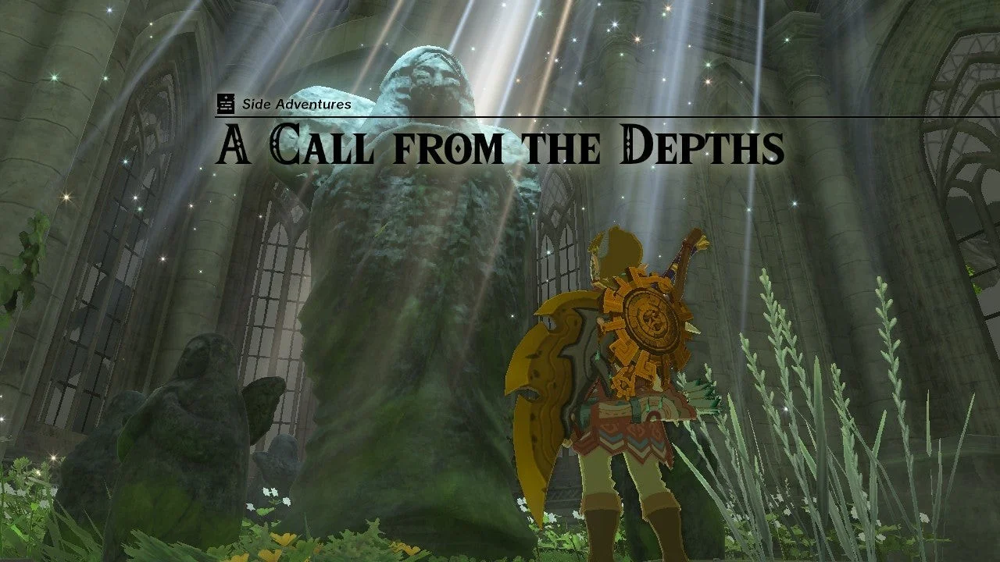

  * **The North Chasm Eye**
  * **The East Chasm Eye**
  * **The South Chasm Eye**
  * **The West Chasm Eye**

##  How to Begin A Call from the Depths

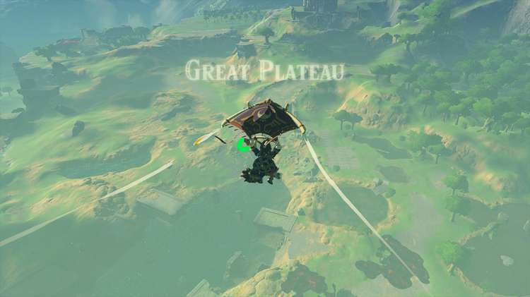

This side quest is a bit open-ended in how you can start and finish it, as you'll have multiple places where you can become alerted to this quest (though they will all lead to the same point). 

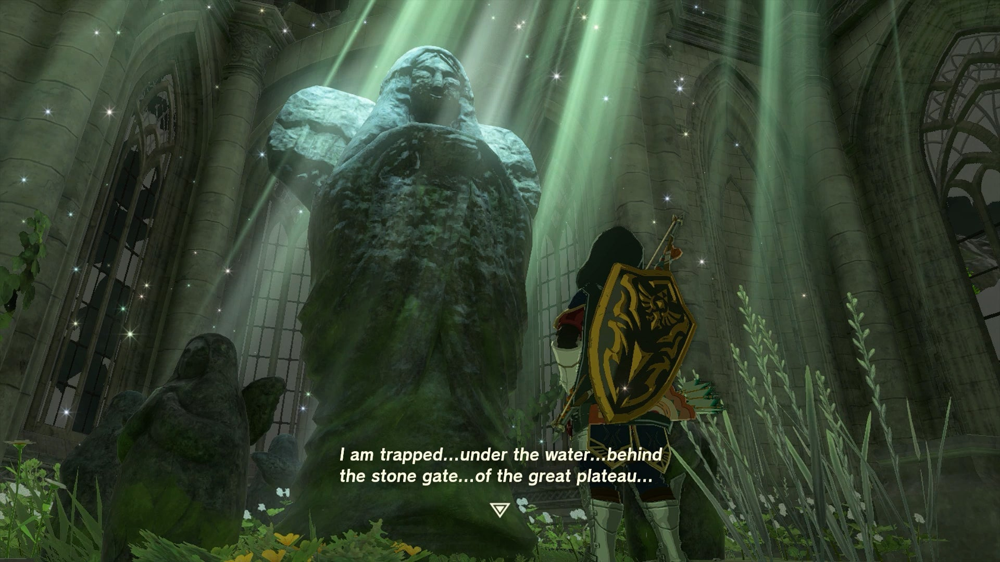

One way to discover this quest is simply by exploring the Great Plateau, which is a bit harder to reach than in Breath of the Wild, and is full of higher level enemies. However, if you reach the Temple of Time Ruins, you can investigate the Goddess Statue for a mysterious message: 

"I am trapped... under the water... behind the stone gate... of the great plateau..." 

If you've been advancing the Main Story and have undertaken the quest, A Mystery in the Depths that leads to the Great Abandoned Central Mine in the Depths below the Great Plateau (or stumbled upon the mine by chance), you can also find an ominous statue underneath the mine that will repeat these same words. 

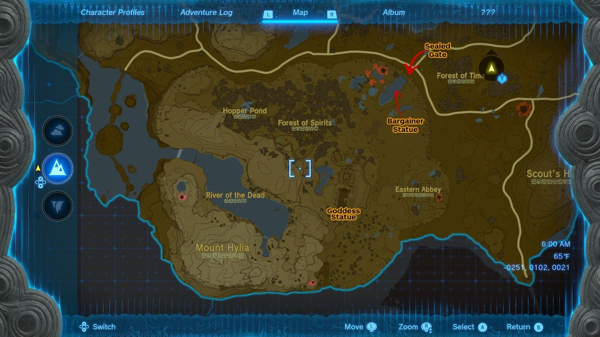

The water behind the stone gate that the Mysterious Voice speaks of is located along the northeastern walled cliffs of the Great Plateau, where a large pond can be found near the gloom-filled entrance to a chasm. 

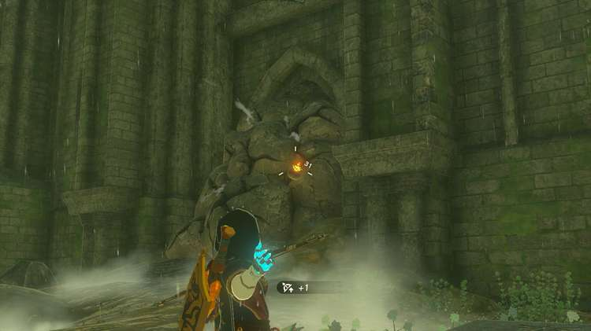

If you jump down to the road between the Forest of Time and the Gatepost Town Ruins, you can find a large entrance gate by a memorial plaque created by Zelda. The gate has been stuffed with rocks, but you can spot a trickle of water coming out. 

Destroy the gate with an explosive or hammer weapon, and the water will flood out, leaving behind several Hyrule Bass and an easy sloping up to the Great Plateau. 

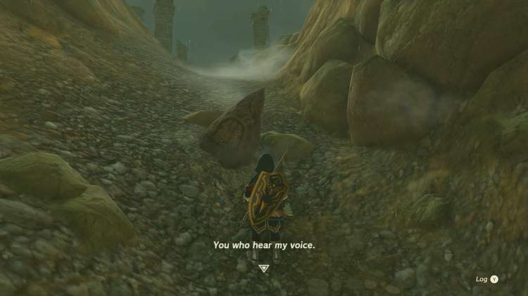

As you head up the slope, you can find the half-buried form of one of the small Bargainer Statues, like the one Josha has displayed in Lookout Landing. Speak to it, and it will direct you to the Temple of Time Ruins just up the road leading south. 

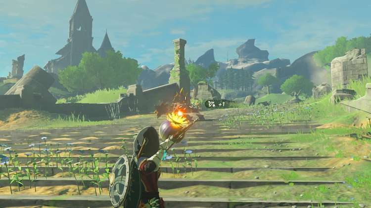

Depending on when you want to undertake this quest, you may find the enemies in the Great Plateau to be very dangerous, as they will always be Black variants - and many Bokoblins are armored, so you may want to come back later when you have more power. Luckily, there aren't too many enemies to worry about for most of this quest. 

The road to the Temple of Time has a few armored Black Bokoblins patrolling, and some Aerocuda further up, so use Bomb Flowers or hammer weapons to break off their armor before defeating them. 

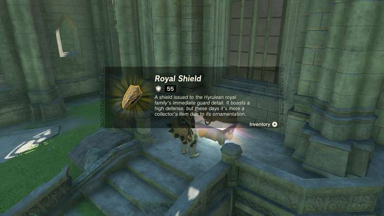

Most of the ruins don't have much to loot of note, but you can find a chest in the ruined building in front of the temple that has a Royal Shield. 

## A Call from the Depths Walkthrough

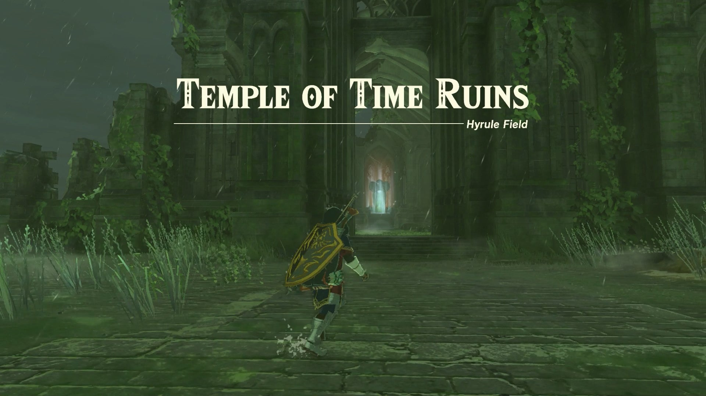

Upon entering the Temple of Time Ruins, head across the building and speak with the Goddess Statue. Another force appears to be speaking through the statue from the Depths below, and requests your aid: Its eyes have been stolen, and needs someone to find them and return them to the statue below the Great Abandoned Central Mine right below the Temple of Time. 

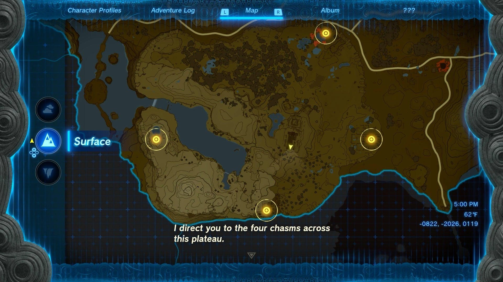

The Mysterious Voice will direct you to four chasms that have opened up along the Great Plateau -- suspiciously right where the four tutorial Shrines were located in Breath of the Wild! One of the statue's eyes is located by each chasm, and it will be your job to toss them in and bring them back to the statue in the Depths. 

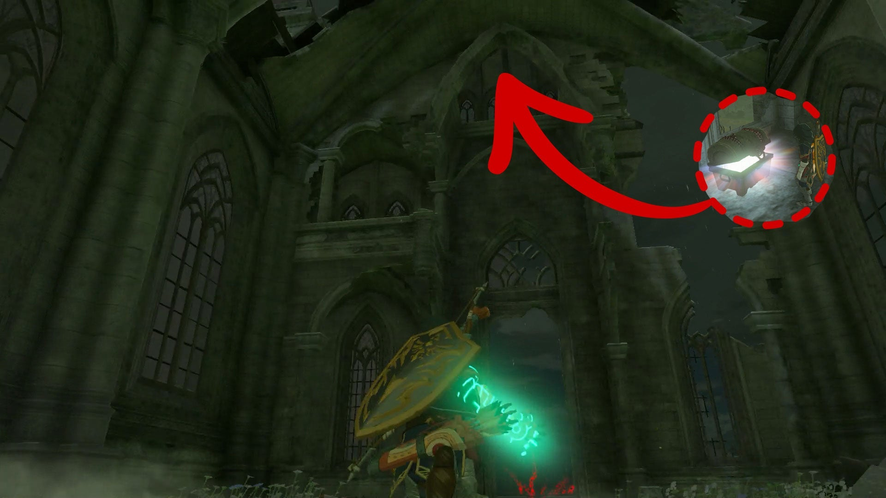

Before you leave, be sure to use Ascend to get to the tower of the temple above where the Old Man gave you your very first Paragilder in Breath of the Wild, and you'll find a chest holding the original design, the Nostalgic Fabric! 

If you have completed one of the Regional Phenomena and A Mystery in the Depths, it's highly recommended you get the Travel Medallion to create a fast travel spot on the surface of the Great Plateau to quickly return to get the other eyes. If not, consider ascending to the Sky Archipelago above the Great Plateau and unlock the Jinodok Shrine's fast travel point, and use the nearby catapult platform to quickly launch back down to the plateau for each trip.

### The Great Plateau North Chasm

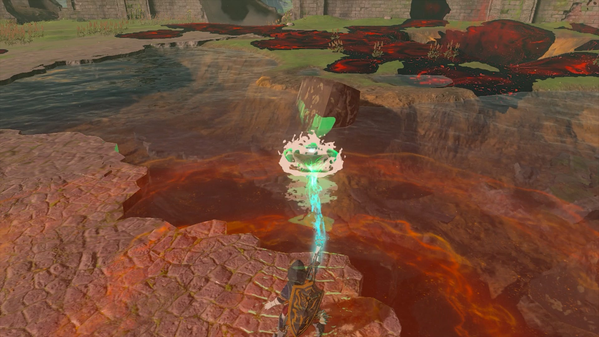

While you can attempt to get these eyes in any order, we'll start with the North Chasm since it's one of the closer ones and easy to find. You need only retrace your steps back to the pond you drained, and search along the smaller pools of water near the chasm to spot an glowing blue stone eye you can pull up with Ultrahand. 

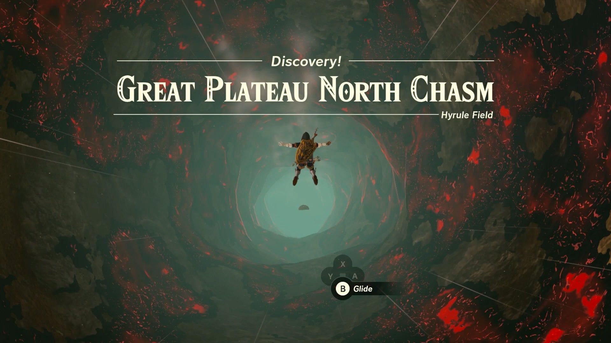

Once you toss the eye into the chasm, your quest log should update, which will mean that the eye will now automatically appear at the bottom of the chasm, even if you don't jump in after it right away. 

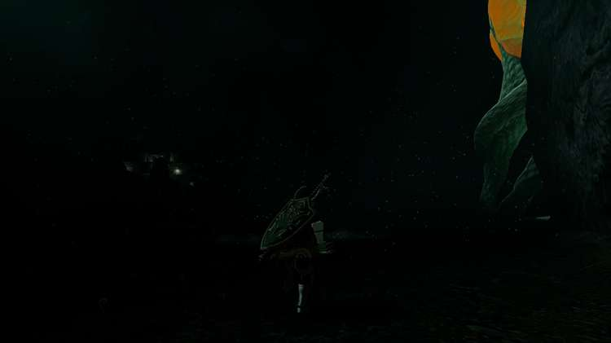

At the bottom of the North Chasm, the path to the mine will be partially obscured by nearby rock walls, and it's highly recommended that you explore around them to find and activate the Nogukoyk Lightroot to help brighten the path to the mine, if you haven't found it earlier. 

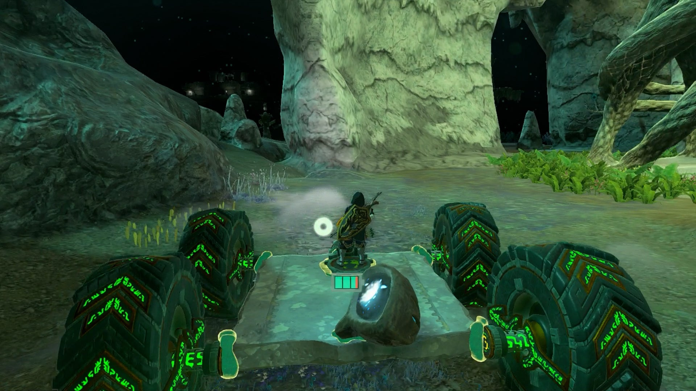

Near where the eye dropped, you should be able to find a Zonai Device storeroom, and you can craft an easy 4-wheel vehicle using one of the smaller stone slabs and a Steering Stick, and stick the eye onto it before driving off to the south. 

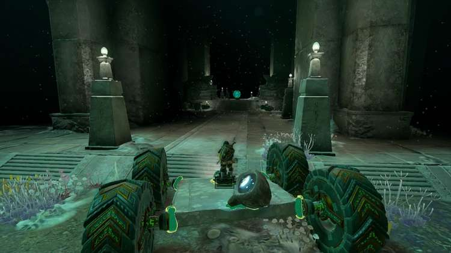

If you haven't already discovered the Great Abandoned Central Mine, you'll likely run into a pair of Zonai Research Society people studying a pedestal that will grant you the Autobuild Ability (and jumpstart the A Mystery in the Depths Main Quest and a surprise fight), so be ready! 

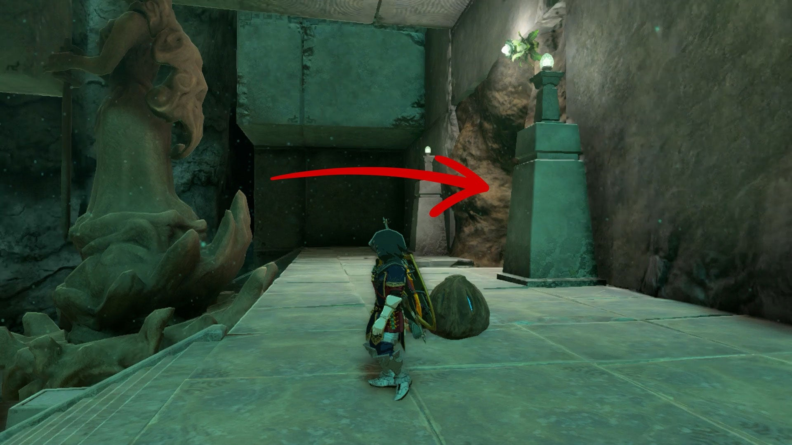

On the other side of the mine, look for a forge area, and to the side you'll find some crumbling stairs that you can drop down to a lower platform, and where a small entrance can be found behind a Gerudo Statue. 

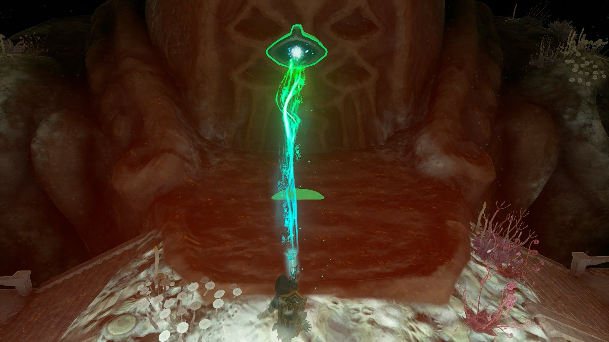

Down the stairs here leads to an extremely large chamber with an enormous and ominous Bargainer Statue spanning several levels. Use Ultrahand to drag the eye along and place it into a slot on the statue's face. 

### The Great Plateau East Chasm

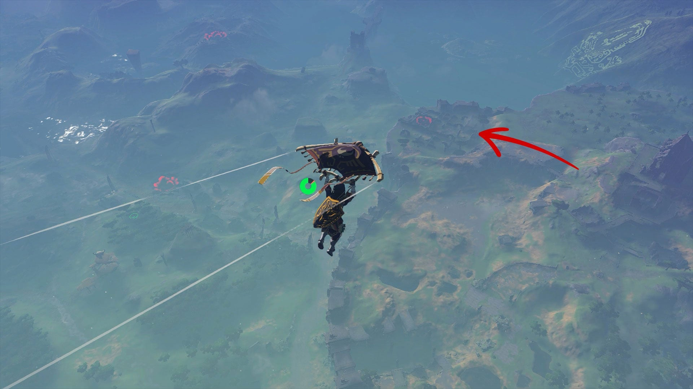

From the Temple of Time Ruins, you can head east down the slope to a ravine with a bridge leading to the Eastern Abbey Ruins - but beware of a Black Boss Bokoblin leading a troupe through the valley as you cross. 

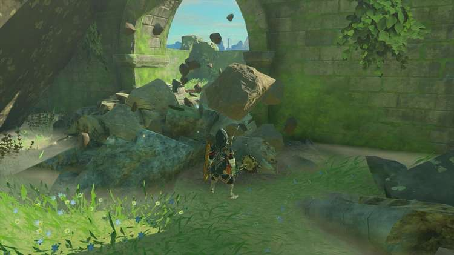

Breath of the Wild players may remember this site as having a Decayed Guardian blocking the shrine - but it has thankfully been removed, and now a rubble pile blocks the walls to where the chasm now sits. 

Bomb the rubble or break it apart, and you'll find the glowing blue eye within, and then drop it into the chasm and dive down with it. 

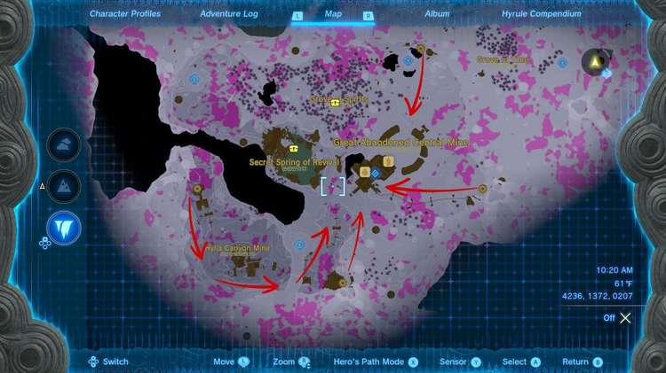

If you haven't activated the Koradat Lightroot up on the high platform in this area, it's likely to be pretty dark, but tossing some Brightbloom Seeds around should reveal a nearby Zonai Device armory that's stocked up with various gadgets - plus a minecart and track system leadings towards the glowing central mine in the distance. 

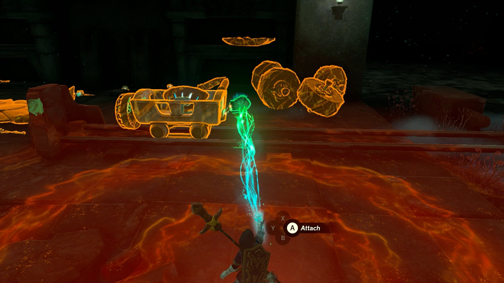

Pair up a minecart with a single Fan and Spotlight, then attach the eye to it before setting off along the cart ride - just mind the gap! 

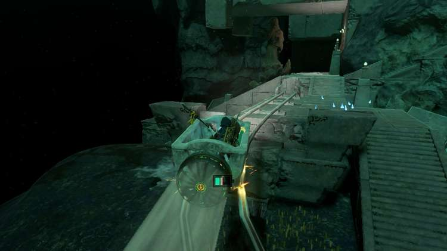

The track should deposit you right at the foot of the Gerudo Statue that marks the entrance to where the giant Bargainer Statue is waiting for its eye, so grab it off the cart before it rolls back, and place the next eye in the statue. 

### The Great Plateau South Chasm

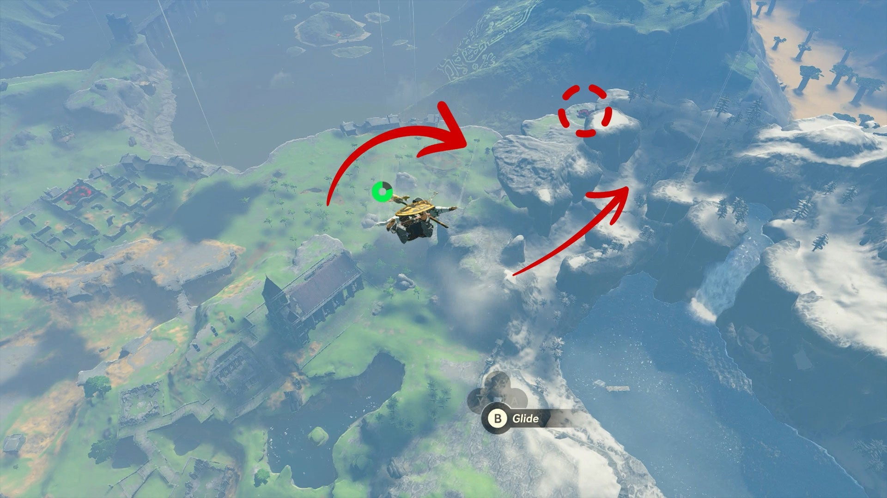

If you attempt to reach the South Chasm from the Sky Archipelago above, you should see two distinct routes to take: One leads west of the Temple of Time into the colder region and up a large series of slopes to the south, and the other can be found by taking the large southeast field to climb up the cliffs right to the chasm. 

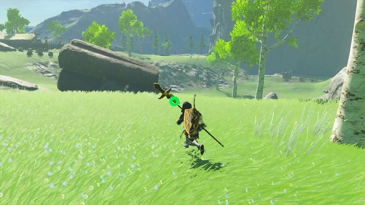

Taking the route south of the Temple of Time, you'll again want to steer clear of another Black Boss Bokoblin and his minions in the lower part of the field, and skirt around what used to be the Old Man's House from Breath of the Wild. 

This spot is now in Yiga Hands, and investigating it will put you towards the getting the Yiga Mask, and a path of a different Side Adventure - Infiltrate the Yiga Clan!

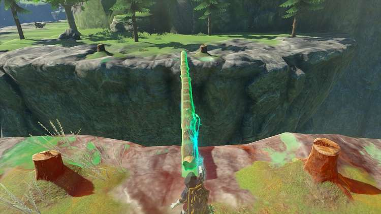

Moving around the fortified house, look for a narrow but deep canyon to the west that you can either try to jump, or cut down some trees and Ultrahand into a makeshift bridge. 

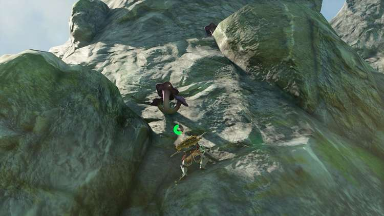

There's another Black Bokoblin patrolling here, but you can avoid it by climbing straight up the cliff wall towards the small ledges that will let you regain your stamina between climbs. A speed-increasing potion or the Climbing Gear will make it a faster trek, but it's a pretty easy and harmless climb. 

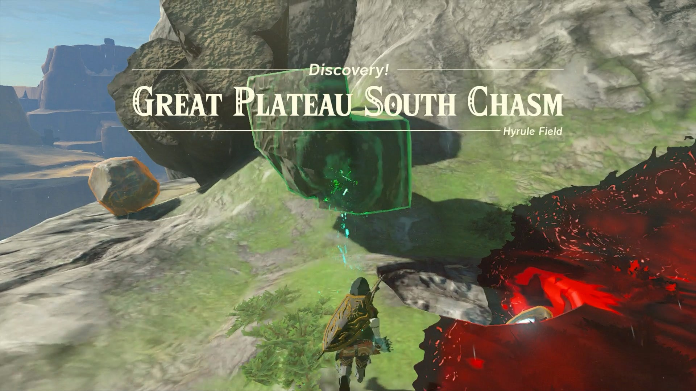

When you reach the chasm, look for a fallen piece of the sky islands that has landed in a small crater, and remove it with Ultrahand to find the glowing blue eye under it, and toss it down the chasm. 

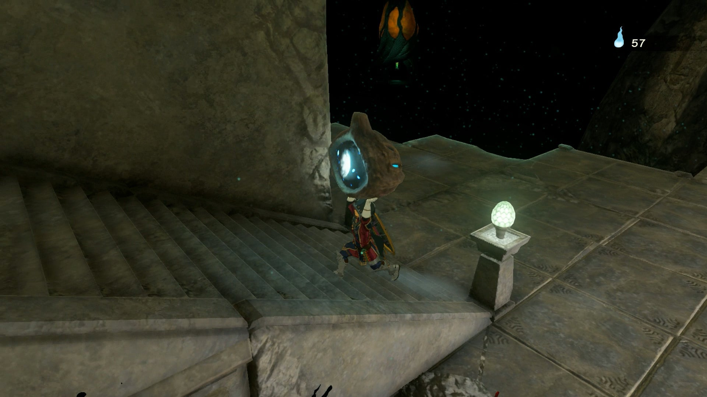

You'll end up at the bottom of a stairway with the eye, a good distance from the central mine with the Koradat Lightroot in the distance. 

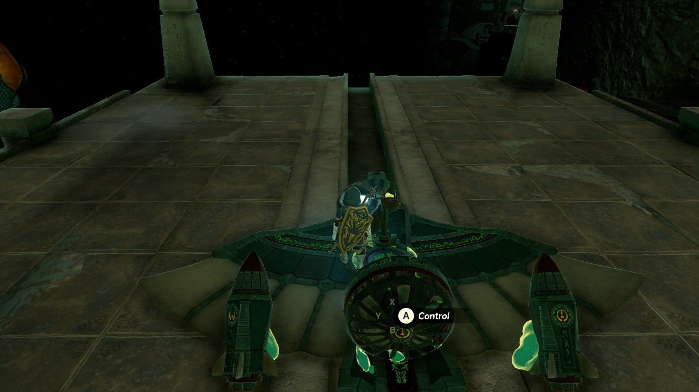

If you grab the eye and climb the stairs, you'll find another Zonai Device storeroom that is complete with a Wing device, several gadgets, and a launching platform for the Wing. 

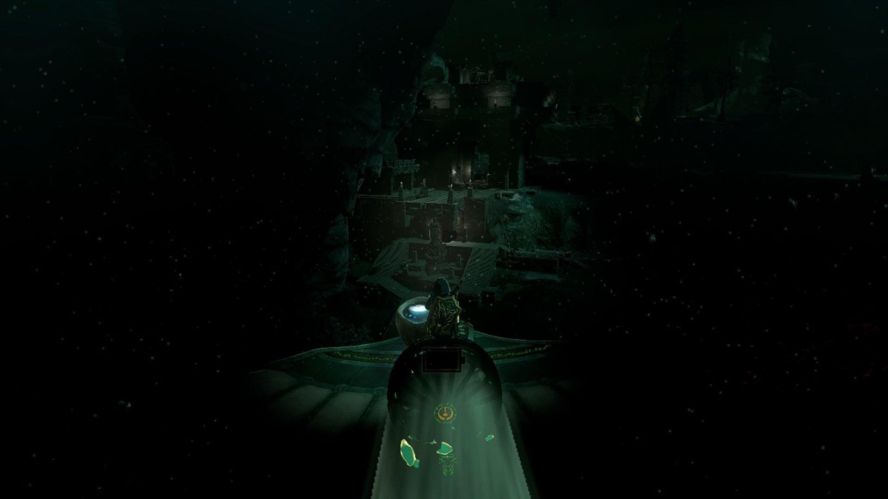

Bulk up your Wing device with a Fan, Spotlight, Steering Stick, and two angled Rockets, and be sure to glue the eye on somewhere safe near the front before you hop on and blast off from the launching platform. This will put you in a straight shot towards the central mine in the distance, and even running on basic battery will give you plenty of room to slowly glide down towards the Gerudo statue and land safely by the entrance to the statue waiting for its next eye. 

### The Great Plateau West Chasm

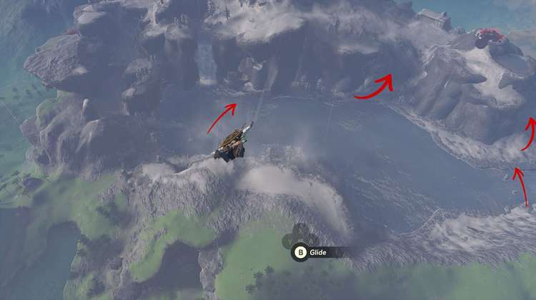

Another chasm location that will be made slightly easier if you launch yourself from the sky archipelago from above, you can also take the path west from the Temple of Time Ruins into the frigid cold region. 

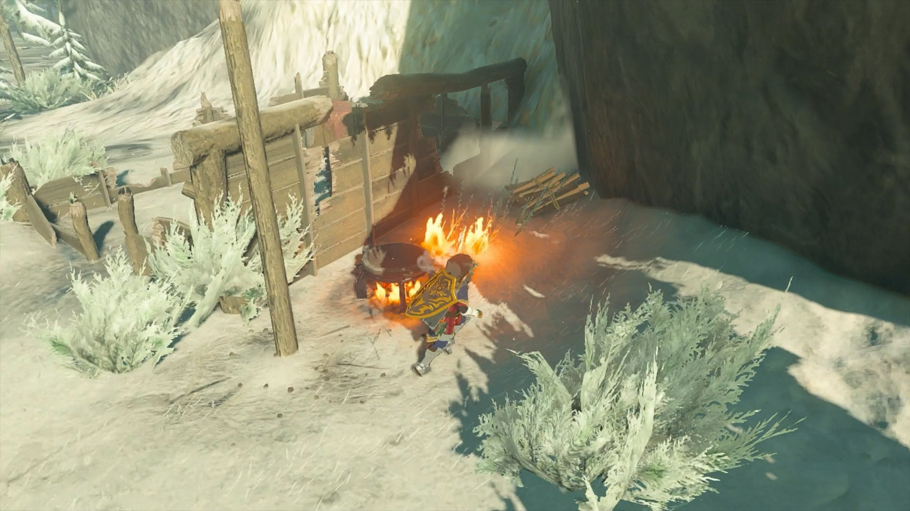

If you somehow left your Warm Archaic Legwear at home, there's still plenty of Spicy Peppers right by the path, and a cooking station in a broken cabin near the water to cook up some cold-resistant food. 

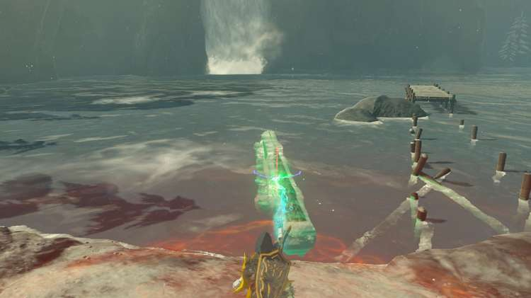

There's a couple routes to consider to reach the chasm at the top of the peak in the southwest corner of the plateau, depending on the tools you have. With the right Zonai Devices like a couple Fans, you can build your own raft from the trees and scoot across the water to the slope at the other side. 

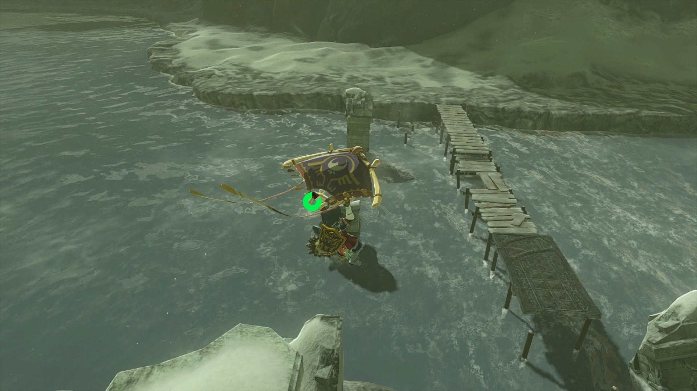

However, if you lack those tools, you can also head along the icy riverbank towards the falls where a broken bridge is just partially built enough for you to paraglide across from the high ruined walls nearby. 

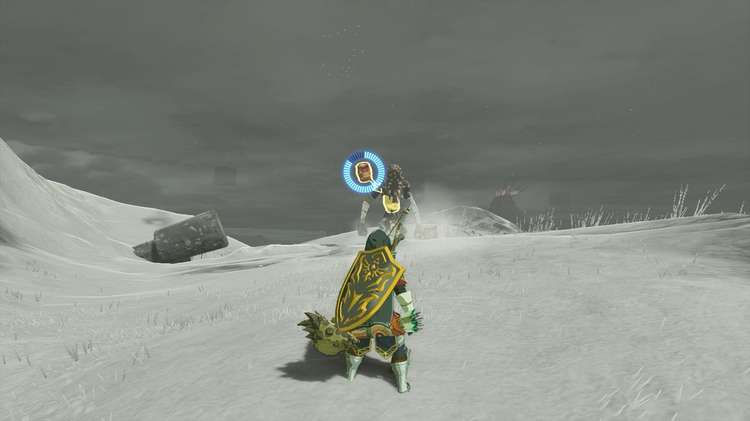

Watch for Ice Chuchus as you head up around to the peak, and you'll have to deal with a single Black Moblin guarding the path to the chasm. He can hit hard, and toss explosive barrels your way, but Recall can send them right back to his face and make quick work of the enemy. 

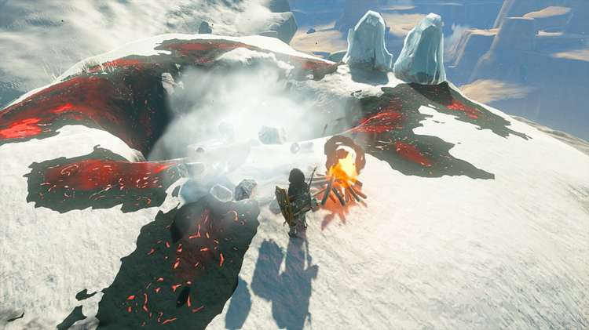

At the top of the chasm, there are several large ice shards around the edge, and you'll have to thaw the closest one out to get the glowing eye inside. Any fire source will work - and an easy way to speed the process up is to toss Wood and Flint at the base of the ice and ignite a campfire by striking them. 

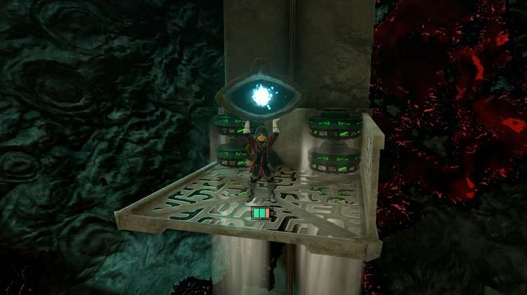

Once you reach the bottom of the chasm, you'll be pretty far from the Central Mine, and in a deep canyon to boot. Illuminate the area with a Brightbloom Seed if you need to, and place the eye on a nearby platform before striking the Fans to create an elevator up to a higher platform. 

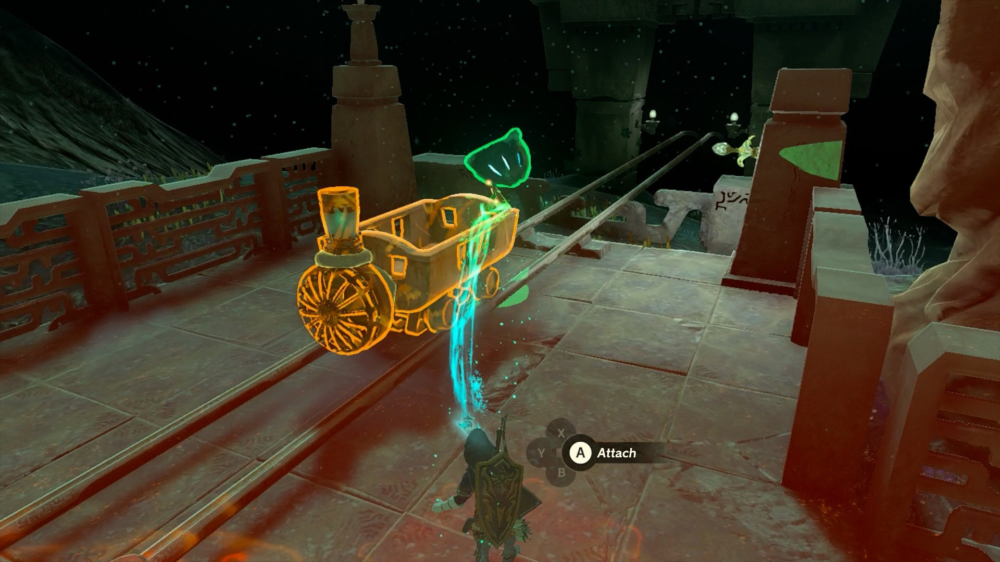

Luckily, there's a series of minecart tracks that will take you to where you need to go, even this far away. The right track is broken, so grab the already premade minecart with the Battery and Fan and glue the eye onto it before taking the left track for a ride. 

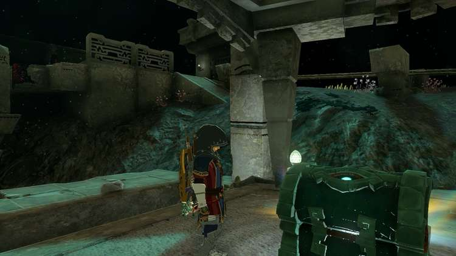  
  
Note that after a quick pass through a tunnel, you'll make a brief pass through the Hylia Canyon Mine. You don't have to stop here, but if you do, check out the mining platform just down the stairs to find a chest that holds the Miner's Trousers, which can help illuminate the rest of your ride! 

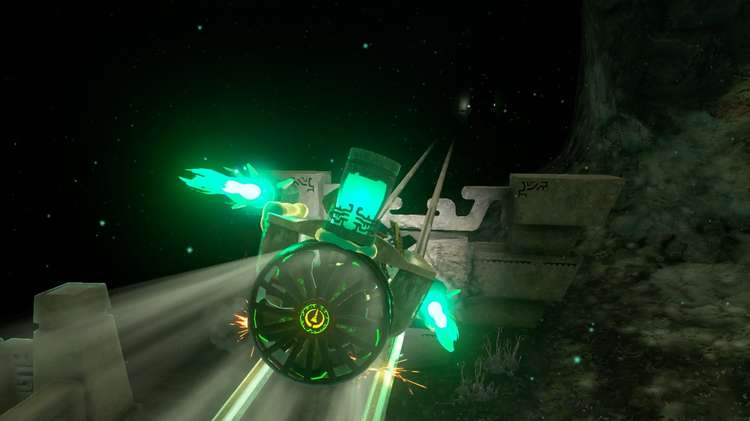

Once the minecart hits a dead end, you can either Ultrahand it up the stairs to the next set of tracks, or re-build a cart with the supplies nearby. Just be sure not to go overboard on Rockets, as they can send the minecart flying off in random direction and force you to walk the rest of the way. 

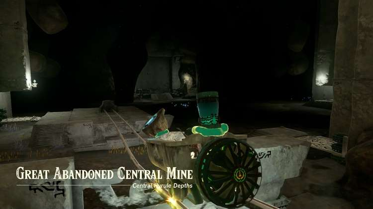

Take it slow and steady with a single rocket or just use Fans, and wait for the track to enter a deep tunnel. It will end up at the foot of the giant Bargainer Statue room that's starting to look more like a mech than anything else. Be sure to look around for a chest at the base of the statue to get a Large Zonaite, then use any of the elevator Fan lifts to bring the final eye up to the statue. 

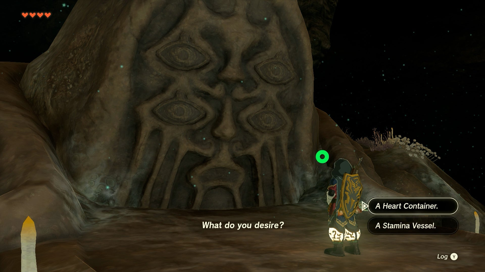

To reward you for your deeds, the Bargainer Statue will grant you one full Heart Container, or one Stamina Essence - the choice will be yours entirely. 

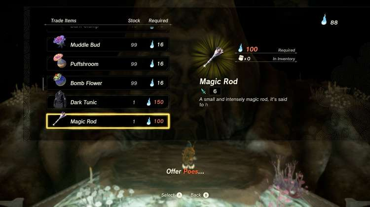

You can also speak to the Bargainer Statue again to begin trading in Poes for items, and it may add a new item depending on how many statues you've found so far. 

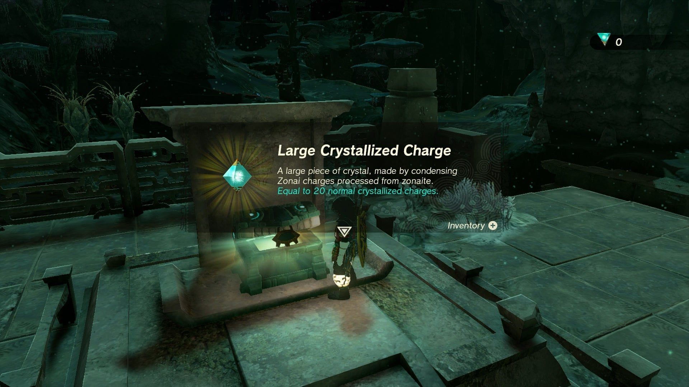

You may also want to take a brief pit stop southwest of the statue outside to a place called the Secret Spring of Revival. It's a large ruin with a pool of water that will heal you over time like a Hot Spring, and features many Greater Poes around it, plus a chest at the top of the ruins with a Large Crystallized Charge! 

A Call from the Depths

See the complete List of Side Quests and Side Adventures

### Up Next: Infiltrating the Yiga Clan

Previous

Who Goes There?

Next

Infiltrating the Yiga Clan

### Top Guide Sections

  * Walkthrough
  * Zelda: Tears of The Kingdom Switch 2 Edition Guide
  * Zelda Notes Voice Memories
  * List of Side Quests and Side Adventures

### Was this guide helpful?

Leave feedback

### In This Guide

The Legend of Zelda: Tears of the KingdomNintendo EPD

Initial Release: May 12, 2023

Learn more

Go to comments