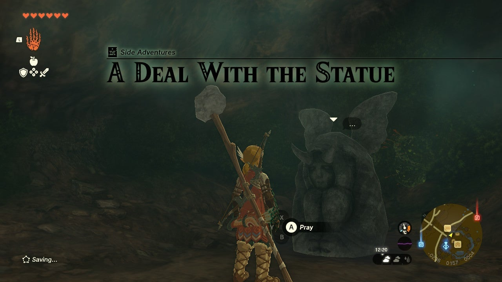
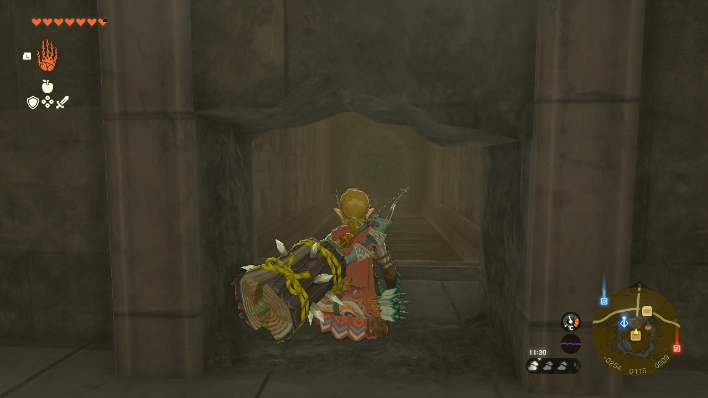
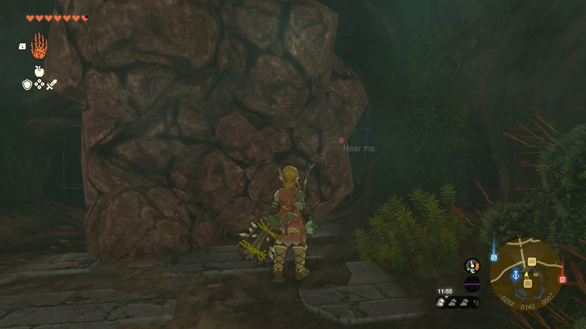
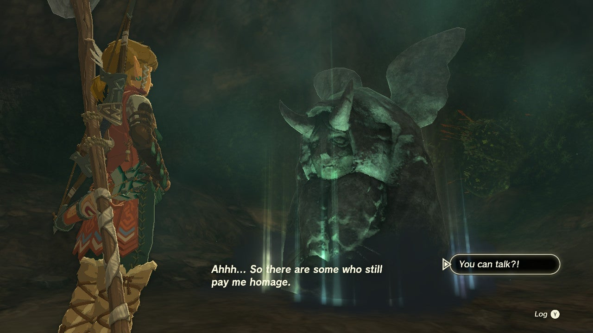

**A Deal With the Statue** is a Side Adventure you can embark on in The Legend of Zelda: Tears of the Kingdom. In this guide, we will walk you through the Side Adventure from start to finish so you can find the **Forbidden Horned Statue** and customize your Stamina and Heart gauges. 

To begin A Deal With the Statue, you must first complete the Hebra leg of the Regional Phenomena Main Quest, as well as begin the Who Goes There? Side Adventure.

Once you have successfully saved Rito Village and spoken to **Jerrin** about her concerns regarding a demonic voice calling from within a hole in the wall, you are free to head in there to discover who exactly the voice belongs to. 

You will find yourself in the **Royal Hidden Passage** , a labyrinth of tunnels that lie beneath Hyrule Castle. There is plenty to explore and uncover down there, so make sure you stock up on Bomb Fruit and Hammers to uncover all its secrets. 

For now, though, you are just going to destroy the breakable wall to your right. It will reveal the **Forbidden Horned Statue** , a possessed demonic statue that was banished to the Passage by Hylia. 

Speak to the Statue to trigger the **A Deal With the Statue Side** Adventure. Upon speaking to it for the first time, the Statue will steal one of your Heart Containers. 

Speak to it again and ask for it back. The Statue will comply, and proceed to tell you about its deal. The deal is that you can sell the Statue a Heart Container or Stamina Guage in exchange for **100** Rupees. You can then buy either a Heart Container or Stamina Guage back for **120** Rupees. 

Once the Statue has told you about the deal and given you back your Heart Container, the Side Adventure is completed. 

Essentially, this Statue allows you to swap a Heart Container for a Stamina Guage and vice versa for 20 Rupees. This can be handy if you ever regret your choice at a Goddess Statue, or if you need a huge amount of Stamina or Hearts for a certain mission. 

A Deal With the Statue

See the complete List of Side Quests and Side Adventures

### Up Next: Who Goes There?

Previous

Messages From An Ancient Era

Next

Who Goes There?

### Top Guide Sections

  * Walkthrough
  * Zelda: Tears of The Kingdom Switch 2 Edition Guide
  * Zelda Notes Voice Memories
  * List of Side Quests and Side Adventures

### Was this guide helpful?

Leave feedback

Go to comments