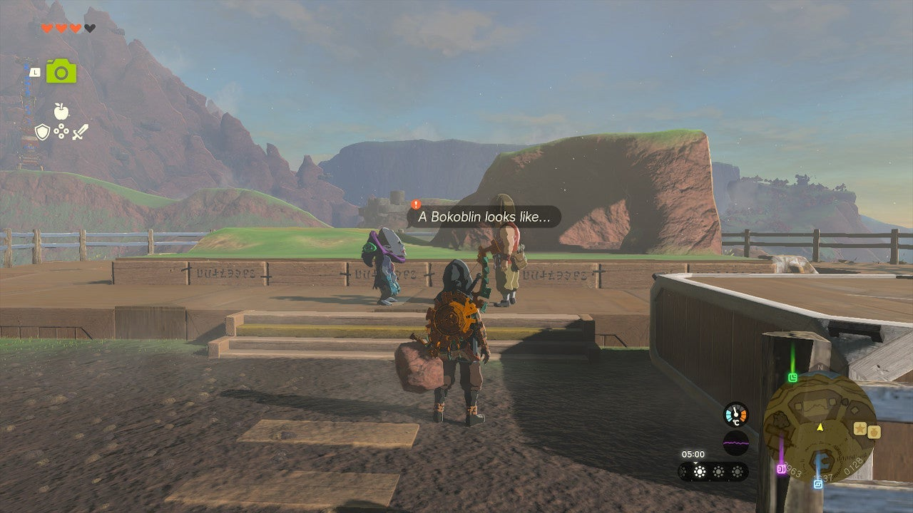
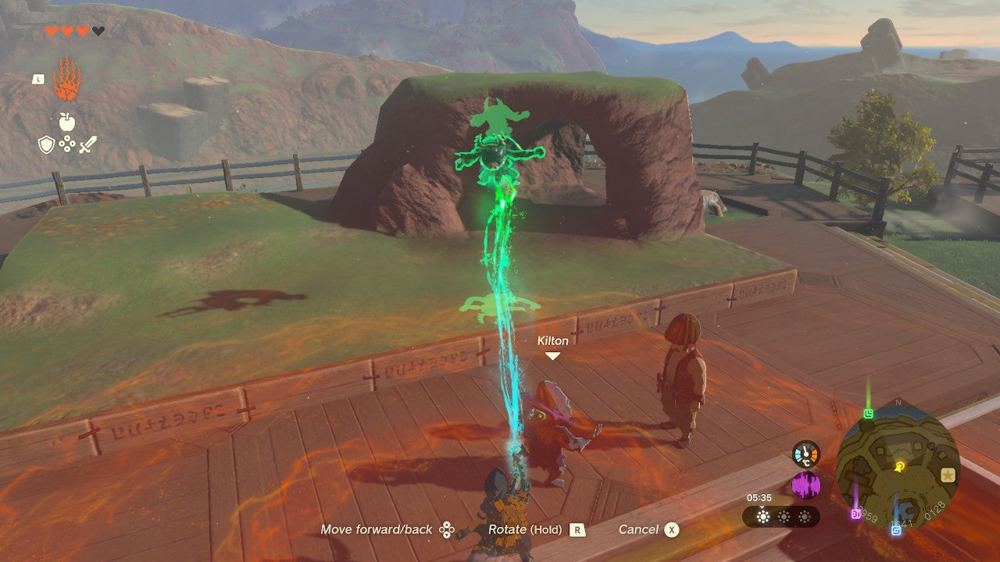

The Legend of Zelda: Tears of the Kingdom side adventure called **A Monstrous Collection I** takes place in Tarrey Town, in the Akkala region. After you've completed the previous side adventures, Mattison's Independence as well as The Search for Koltin, return to **Tarrey Town** and speak to Kilton to start this monstrous new questline. 

## A Monstrous Collection I Walkthrough

Kilton and Hudson want to create sculptures of monsters and put them on display for the Tarrey Town residents. For their first sculpture, they need a picture of a Bokoblin. 

If you already have a **picture of a Bokoblin** on your Purah Pad, you can show them right away and they will make the sculpture. If not, you have to venture out and take one. While Bokoblins are very common enemies in Hyrule, you can fast-travel to the nearby Ulri Mountain Skyview Tower to find one right in front of the entrance. 

To make a picture, you need to use the **camera** function on your Purah Pad (use L on your Switch controller). The camera feature is unlocked during the Camera Work in the Depths quest. After taking a good picture of a monster (the creature has to be clearly visible), you'll have the option to save it to your Purah Pad's **Compendium**. Be sure to do that, or you can't show it to Kilton and Hudson! 

Once you've photographed a Bokoblin and shown it to Kilton, you need to Ultrahand to place the sculpture on the stage behind him. Anywhere in that area will suffice. Speak to Kilton again, and he'll reward you with **monster extract**. 

If you want, you can immediately continue with A Monstrous Collection II. 

A Monstrous Collection I

See the complete List of Side Quests and Side Adventures

### Up Next: A Monstrous Collection II

Previous

The Search for Koltin

Next

A Monstrous Collection II

### Top Guide Sections

  * Walkthrough
  * Zelda: Tears of The Kingdom Switch 2 Edition Guide
  * Zelda Notes Voice Memories
  * List of Side Quests and Side Adventures

### Was this guide helpful?

Leave feedback

Go to comments