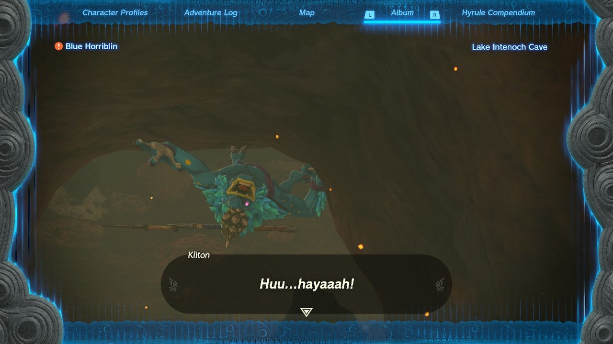

A Monstrous Collection II is part of the Monstrous Collection side adventure questline in **Tarrey Town** , Akkala. Complete the previous Tears of the Kingdom side adventure, A Monstrous Collection I, to get started. 

Here's how to get the correct monster picture and complete **A Monstrous Collection II**. 

## A Monstrous Collection II Walkthrough

For the second Monstrous Collection quest, you need a picture of a Horriblin. They're quite common inside Eldin's cave systems, such as Lake Intenoch cave. Horriblins like to crawl on the ceiling, so mind your head! 

Return to Kilton and show him the picture in your compendium (as shown above, the correct picture has a little red exclamation mark), then place the sculpture on the stage as you've done before. Kilton will reward you with **monster extract** and **sneaky monster soup**. You can start A Monstrous Collection III directly afterwards if you want. 

A Monstrous Collection II

See the complete List of Side Quests and Side Adventures

### Up Next: A Monstrous Collection III

Previous

A Monstrous Collection I

Next

A Monstrous Collection III

### Top Guide Sections

  * Walkthrough
  * Zelda: Tears of The Kingdom Switch 2 Edition Guide
  * Zelda Notes Voice Memories
  * List of Side Quests and Side Adventures

### Was this guide helpful?

Leave feedback

Go to comments