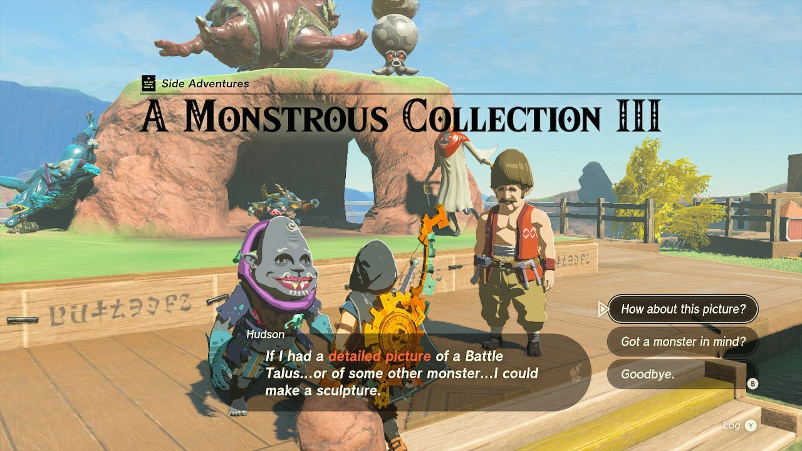
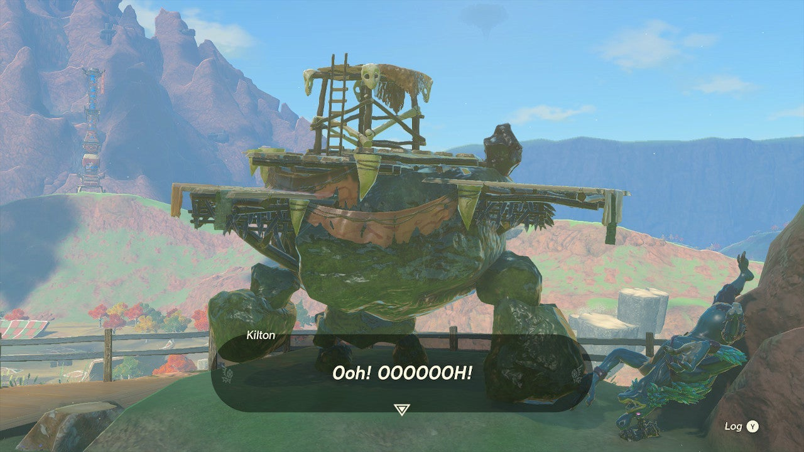

After completing A Monstrous Collection II in Tarrey Town, Akkala, it's time to snap another monster picture for A Monstrous Collection part three. This time, you'll need to get a boss enemy in from of your camera. Here's how to complete **A Monstrous Collection III** in The Legend of Zelda. 

## A Monstrous Collection III Walkthrough

During the previous two Monstrous Collection quests, Kilton made clear requests for monster pictures. During part three of the quest series, however, you may show him any monster picture you like, and Hudson will make a sculpture to place on the stage. Feel free to have fun with it, but beware that **only a specific type of monster** will move this quest forward! 

If you want to know which monster he's really after, choose the "Got a monster in mind?" dialogue option. In this case, he will ask for a Battle Talus \- the enormous stone creatures. You can find a Battle Talus in the **Akkala Highlands** south of Tarrey Town. 

As before, show Kilton the picture and place the sculpture on the stage. Kilton will reward you with **monster extract** and a **monster bridle** for your horse. You can move on to A Monstrous Collection IV for the next picture-snapping adventure. 

A Monstrous Collection III

See the complete List of Side Quests and Side Adventures

### Up Next: A Monstrous Collection IV

Previous

A Monstrous Collection II

Next

A Monstrous Collection IV

### Top Guide Sections

  * Walkthrough
  * Zelda: Tears of The Kingdom Switch 2 Edition Guide
  * Zelda Notes Voice Memories
  * List of Side Quests and Side Adventures

### Was this guide helpful?

Leave feedback

Go to comments