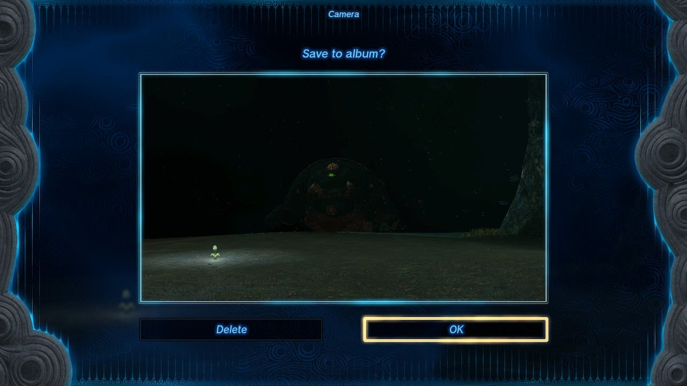
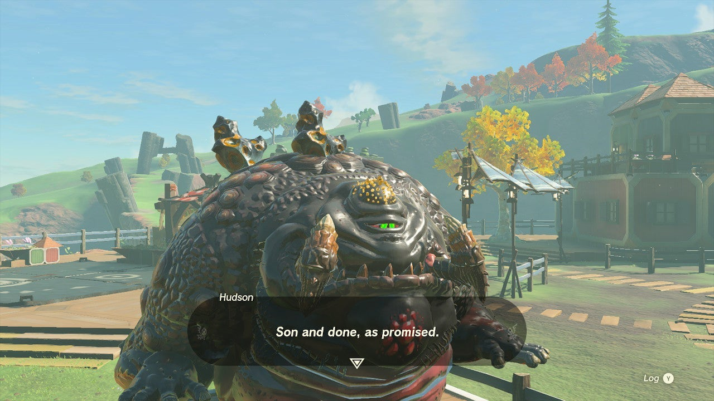

The Akkala side adventure A Monstrous Collection IV requires yet another monster picture to expand Kilton's impressive collection of monster statues in Tarrey Town. After you've completed the previous side adventure, A Monstrous Collection III, here's how to complete **A Monstrous Collection IV**. 

## A Monstrous Collection IV Walkthrough

Kilton wants a monster sculpture of a Frox this time, which is quite tricky, as they only live in the **Depths**. Luckily, there's a relatively easy Frox location beneath the **Drenan Highlands Chasm**. Travel to the Great Hyrule Forest and jump through the chasm at coordinates -0060, 3006, 0214. 

The Obsidian Frox is located at coordinates -0052, 3000, -0619. Look for a massive creature with a single bright green eye as shown in the picture below. 

Beware that the monster needed for A Monstrous Collection V is located very close to this spot! If you want to save time, travel to the northeast and snap a picture of a King Gleeok before you head back to Kilton.

If you're looking for alternative Frox locations, you can use our interactive Tears of the Kingdom map. Be sure to select the Depths map instead of the surface! 

With the Frox picture in your pocket, speak to Kilton and place the sculpture on the monster stage. Kilton will reward you with another flask of **monster extract** and a **monster saddle** for your horse. You may now continue with the fifth and final part of this questline; A Monstrous Collection V. 

A Monstrous Collection IV

See the complete List of Side Quests and Side Adventures

### Up Next: A Monstrous Collection V

Previous

A Monstrous Collection III

Next

A Monstrous Collection V

### Top Guide Sections

  * Walkthrough
  * Zelda: Tears of The Kingdom Switch 2 Edition Guide
  * Zelda Notes Voice Memories
  * List of Side Quests and Side Adventures

### Was this guide helpful?

Leave feedback

Go to comments