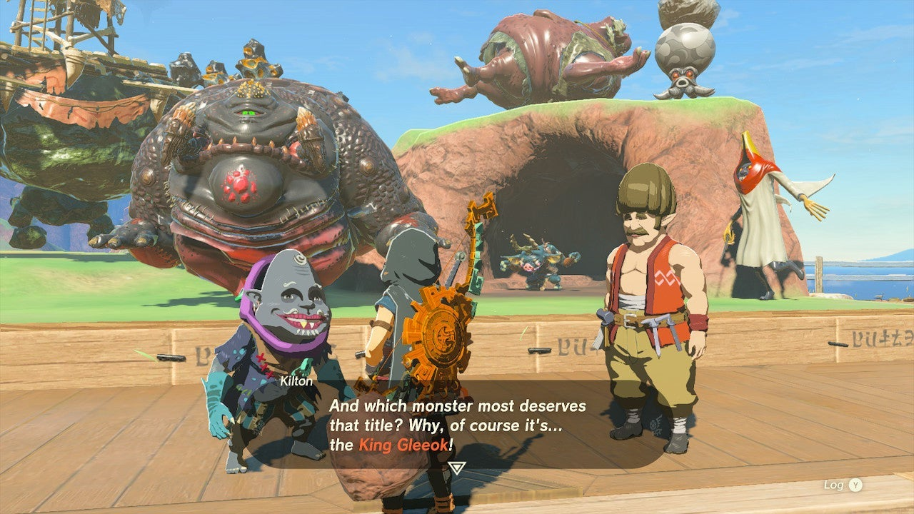
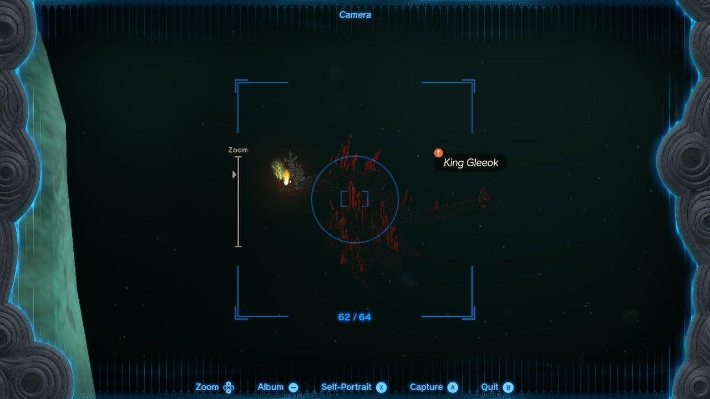

The Akkala side adventure **A Monstrous Collection V** is the final part of the Monstrous Collection series in Tarrey Town. Of course, make sure you've completed A Monstrous Collection IV to continue with this quest. Let's give Kilton his best monster statue yet! 

## A Monstrous Collection V Walkthrough

The final monster statue Kilton needs is a **King Gleeok**. This is by far the most difficult request, as there are only four King Gleeok's in The Legend of Zelda: Tears of the Kingdom; one in The Depths and three in Sky Hyrule - the Hebra Sky, the Necluda Sky, and Gerudo Sky regions to be exact. 

The King Gleeok in The Depths is arguably the easiest one to find: travel to the northern part of the Great Hyrule Forest, glide down through the **Drenan Highlands Chasm** (entrance is at coordinates -0060, 3006, 0214), and keep gliding northeast to find the King Gleeok around coordinates 0150, 3130, -0623. Look out for a flying creature with a flaming head, as shown in the picture below. 

With a King Gleeok picture in your pocket, head back to Kilton and Hudson. Place the final monster statue to complete **A Monstrous Collection V** and receive **monster extract** and a **diamond** as a reward. 

Although the Monstrous Collection quests are now finished, you can still submit additional monster pictures in return for monster statues. Your efforts aren't rewarded, but it's a lot of fun! 

A Monstrous Collection V

See the complete List of Side Quests and Side Adventures

### Up Next: Investigate the Thyphlo Ruins

Previous

A Monstrous Collection IV

Next

Investigate the Thyphlo Ruins

### Top Guide Sections

  * Walkthrough
  * Zelda: Tears of The Kingdom Switch 2 Edition Guide
  * Zelda Notes Voice Memories
  * List of Side Quests and Side Adventures

### Was this guide helpful?

Leave feedback

Go to comments