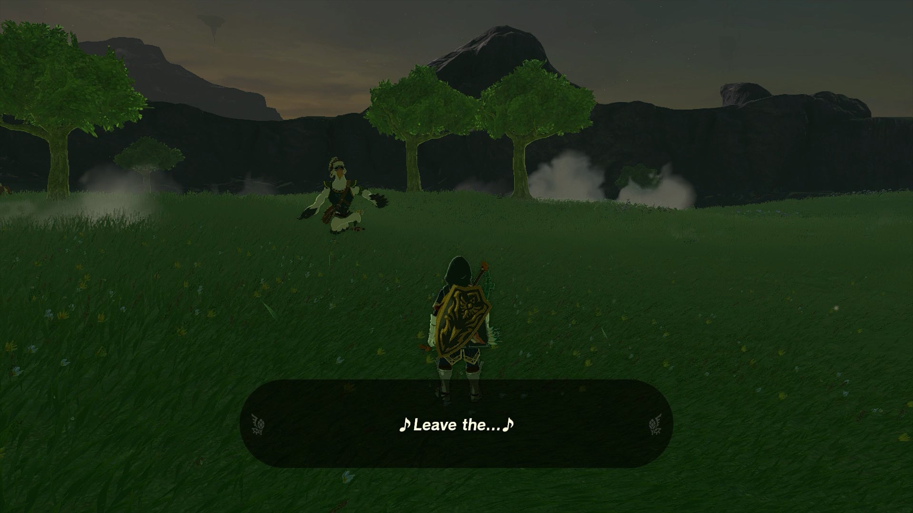
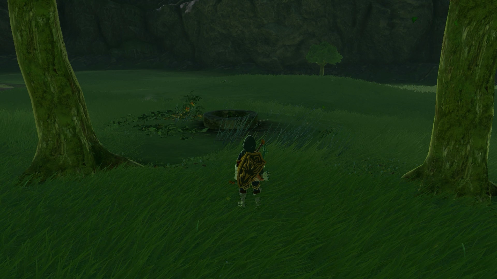
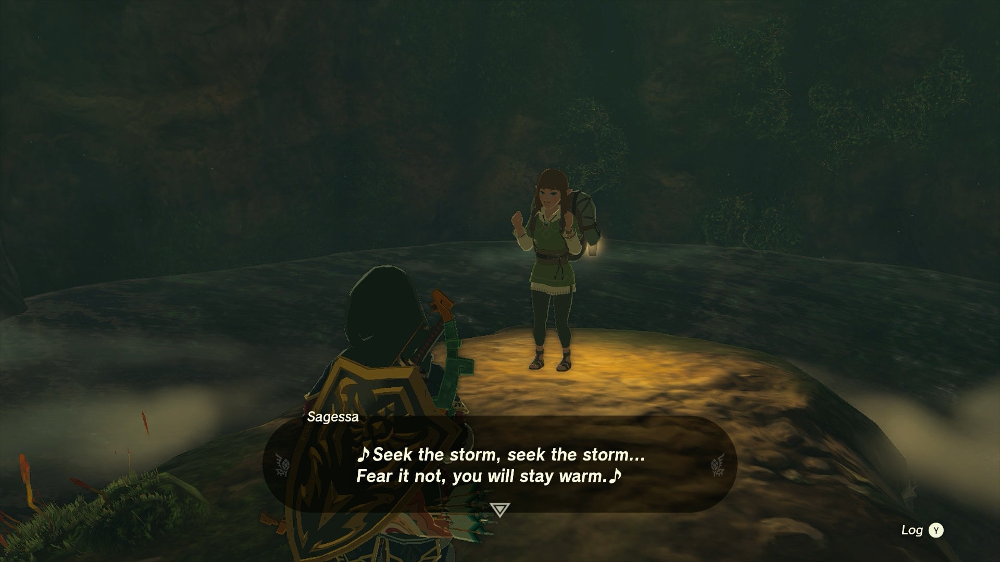
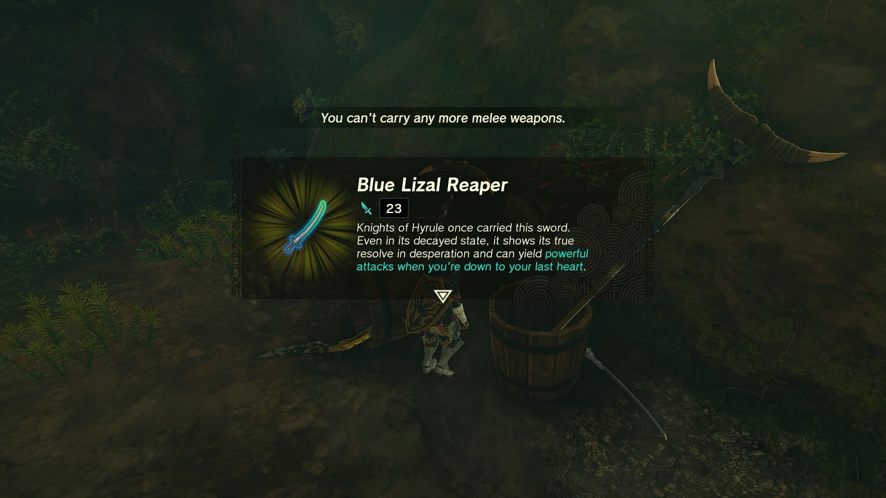

**An Eerie Voice** is a Potential Princess Sightings! side adventure in TotK found at the Highland Stable, available after you have become a journalist for the Lucky Clover Gazette at Rito Stable. Penn needs Link's help to investigate a spooky voice in the night that might be coming from Princess Zelda herself! Below is the walkthrough for another part of the Lucky Clover Gazette questline. 

  * **Quest Giver:** Penn
  * **Prerequisites** : Begin the Potential Princess Sighting! questline at the Lucky Clover Gazette
  * **Reward:** Rupees, various weapons

You can start with quest at the Highland Stable, located far in the south central part of Hyrule, along the road past Lake Hylia (though you may want to avoid the Gleeok guarding the bridge). 

Meet with **Penn** outside Highland Stable to learn of an eerily threatening song that villagers have been hearing at night. Penn believes that the voice may be coming from Princess Zelda herself, and it is imperative that you explore the stable grounds to find the location of the voice. 

First, you'll need to wait until nighttime to begin searching for the voice, so use a nearby Cooking Station to speed up time until nightfall, then tell Penn you're ready to investigate together (you won't be able to finish the quest solo). 

Penn will fly out a bit to the northwest in the middle of the large Fural Plain field, and as you start approaching, a creepy voice will carry on through the wind. Penn will freeze in fright, and it will be up to you to figure out the source. 

The voice is emanating from the **Haran Lakefront Well** , which you can find behind the two trees in the field right outside Highland Stable. 

Drop down into the well to speak with an NPC named **Sagessa**. It turns out that she is not the Princess, and she was merely taking advantage of the wells acoustics and practicing her singing down there. Apparently people have been throwing their weapons into the well out of fear! 

Penn will summon you back to the surface to find out the truth, and after letting him know, you'll get a reward based on the number of cases you've investigated together. 

_This reward depends on how far along you are in the Potential Princess Sightings! Side Adventure._

An Eerie Voice

Be sure to hop back into the well to investigate the pile of weapons, as they are fused with Blue Moblin and Blue Lizalfos Horns and do a good bit of damage, so they can make a good place to stockpile weapons quick if you ever run low! 

## List of Potential Princess Sighting Side Adventures

Looking for other Potential Princess Sightings to undertake? You can take on the following adventures in any order you choose, which are located at nearly every main Stable in Hyrule. Click on a link below to learn more about it, and how to solve the quest. 

Side Adventure Name  
Starting Settlement / Region

Serenade to a Great Fairy  
Woodland Stable, Eldin Canyon

The Beckoning Woman  
Outskirt Stable, Central Hyrule

Gourmets Gone Missing  
Riverside Stable, Central Hyrule

The Beast and the Princess  
New Serenne Stable, Hyrule Ridge

Zelda's Golden Horse  
Snowfield Stable, Tabantha Tundra

White Goats Gone Missing  
Tabantha Bridge Stable, Hyrule Ridge

For Our Princess!  
Foothill Stable, Eldin

The All-Clucking Cucco  
South Akkala Stable, Akkala

The Missing Farm Tools  
Wetlands Stable, West Necluda

Princess Zelda Kidnapped?!  
Dueling Peaks Stable, West Necluda

An Eerie Voice  
Highland Stable, Faron

The Blocked Well  
Gerudo Canyon Stable, Gerudo

See the complete List of Side Quests and Side Adventures

### Up Next: The Blocked Well

Previous

Princess Zelda Kidnapped?!

Next

The Blocked Well

### Top Guide Sections

  * Walkthrough
  * Zelda: Tears of The Kingdom Switch 2 Edition Guide
  * Zelda Notes Voice Memories
  * List of Side Quests and Side Adventures

### Was this guide helpful?

Leave feedback

Go to comments