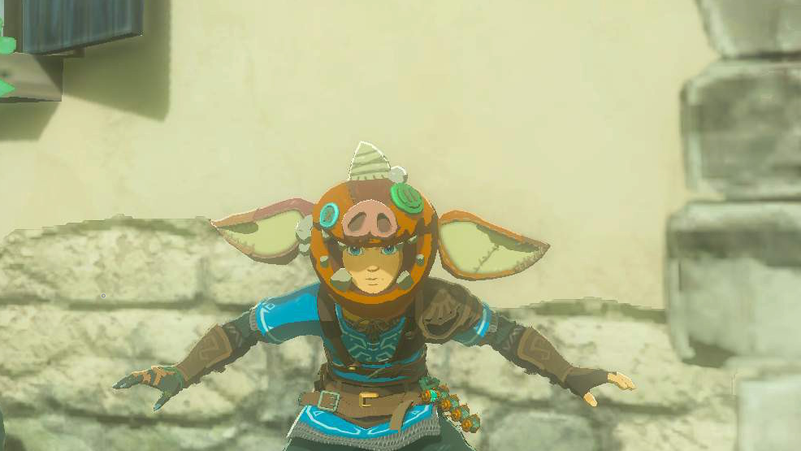
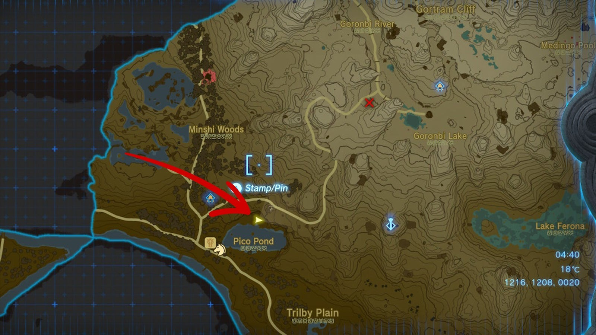

The **Bokoblin Mask** in Zelda: Tears of the Kingdom is a piece of armor that can only be acquired by collecting Bubbul Gems and giving them to Koltin. By wearing the Bokoblin Mask, **Link can blend in with the common monster enemy**. When idle, Link will lower his stance and bob like the monsters. 

**Armor Secret** : If you walk or run with the Bokoblin Mask equipped, you'll hear a light Bokoblin noise that sounds a little like a pig oink every other step Link takes! 

  * **Description** : "_Kilton's handmade Bokoblin headgear. It's almost charming in a cute, monstrous kind of way... Equip it to blend in with Bokoblins._ "

Bokoblin Mask

Defense  
Effect Bonus

3  
Blend in with Bokoblins

Bokoblin Mask

### How to Get the Bokoblin Mask

As mentioned, the Bokoblin Mask can only be acquired from Koltin. Specifically, this is the first reward Koltin gives Link after Koltin is given **one Bubbul Gem** , an item dropped by Bubbulfrogs. This is part of the Side Adventure called The Hunt for Bubbul Gems! that starts near Woodland Stable in Eldin. You'll find Kilton in need of your assistance north of Pico Pond. 

**Finding Bubbul Gems and Bubbulfrogs**  
There is one Bubbulfrog **in every cave**. You'll know if you've found the cave's Bubbulfrog by checking your map. If the cave entrance icon has a small checkmark, that means you've successfully found and slain the cave's Bubbulfrog. 

After you **give Koltin one Bubbul Gem,** you're rewarded with the Bokoblin Mask. 

**There are no upgrades for the Bokoblin Mask** and **it cannot be dyed.**

Click or tap here to return to the full armor list.

### Up Next: Cece Hat

Previous

Archaic Warm Greaves

Next

Cece Hat

### Top Guide Sections

  * Walkthrough
  * Zelda: Tears of The Kingdom Switch 2 Edition Guide
  * Zelda Notes Voice Memories
  * List of Side Quests and Side Adventures

### Was this guide helpful?

Leave feedback

Go to comments