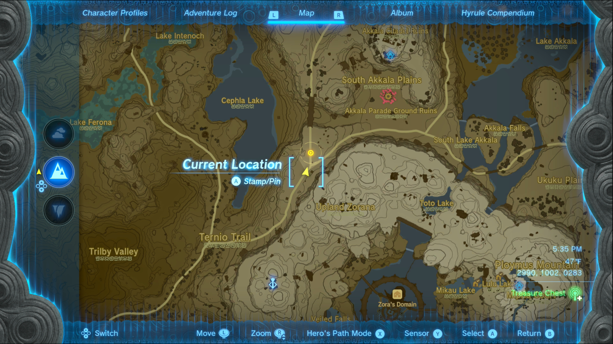
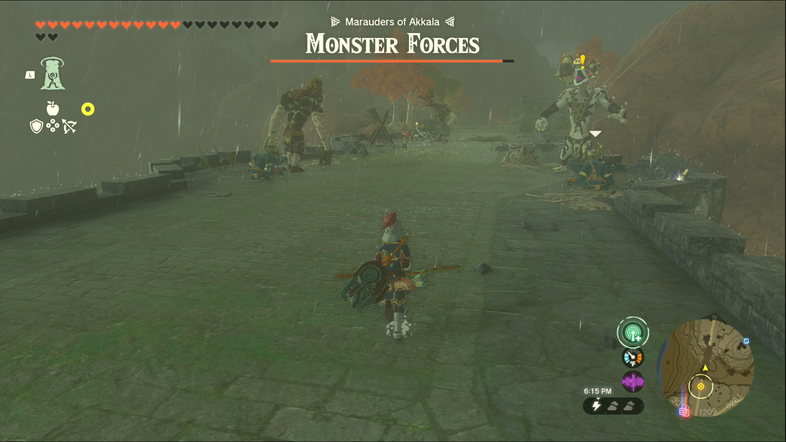

Bring Peace Akkala! is one of the Side Adventures you can complete in Lanayru Great Spring region. Side Adventures are quests in The Legend of Zelda: Tears of the Kingdom that require multiple steps and typically tell a larger story. 

## Bring Peace to Akkala!

To start the Side Adventure “Bring Peace to Akkala!” you first need to complete “Bring Peace to Eldin!” Once you have, Toren will give you a new quest, instructing you to meet him and his squad just north of the Upland Zorana Skyview Tower; the quest marker will direct you to the group. 

Once you’ve met with them you can speak with Toren to get things moving along, so move in to attack the monsters on the bridge. 

This fight is a good opportunity to knock monsters off of the bridge with bombs or arrow critical hits. Otherwise, allow Toren’s squad to engage with the monsters to distract them. 

Once all the monsters are defeated, Toren will reward you with 100 Rupees for your help. That wraps up the patrols for this squad, but there are other Monster-Control Crews to help, like in the quest “Bring Peace to Hyrule Field!” If you have already helped the other crews, you'll also receive the Monster-Control-Crew Fabric to customize your glider! 

Bring Peace to Akkala!

See the complete List of Side Quests and Side Adventures

### Up Next: Bring Peace to Faron!

Previous

Bring Peace to Eldin!

Next

Bring Peace to Faron!

### Top Guide Sections

  * Walkthrough
  * Zelda: Tears of The Kingdom Switch 2 Edition Guide
  * Zelda Notes Voice Memories
  * List of Side Quests and Side Adventures

### Was this guide helpful?

Leave feedback

Go to comments