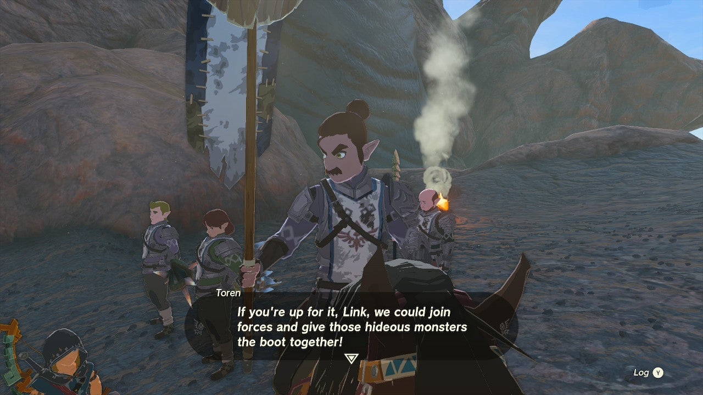
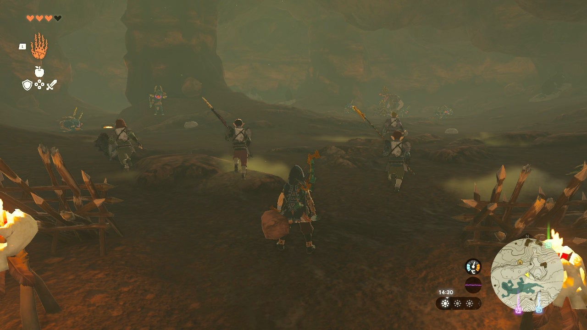

Time to put your combat prowess to the test with the **Bring Peace to Eldin!** side adventure. While exploring the northern part of Eldin, you may stumble upon a brave group of warriors from Hyrule castle. They're on their way to clear out a local monster den, and of course, they could really use your help. 

Here's **how to complete Bring Peace to Eldin!** in The Legend of Zelda: Tears of the Kingdom. 

## Bring Peace to Eldin Walkthrough

To start this side adventure, travel to the northern part of Eldin. Head to the area between the two lizard-shaped lakes, just **northwest of the Lake Darman Monster Den**. You'll see a group of warriors patrolling the area. To start the side adventure, speak to their leader, **Toren**. 

The quest objective is simple: follow Toren and his band inside Lake Darman Monster Den, and help them **defeat the monsters** inside. Be sure to bring enough food for the necessary health and attack boosts! It's best to target the monsters one at a time, and get rid of the smaller Blue Bokoblins and Black Bokoblin before taking on the Black Moblin. 

Once you've won the fight, Toren gives you a **silver rupee** (worth 100 green rupees) as a quest reward, which completes the **Bring Peace to Eldin!** side adventure and unlocks a follow-up quest called Bring Peace to Akkala!

Bring Peace to Eldin!

See the complete List of Side Quests and Side Adventures

### Up Next: Bring Peace to Akkala!

Previous

Bring Peace to Necluda!

Next

Bring Peace to Akkala!

### Top Guide Sections

  * Walkthrough
  * Zelda: Tears of The Kingdom Switch 2 Edition Guide
  * Zelda Notes Voice Memories
  * List of Side Quests and Side Adventures

### Was this guide helpful?

Leave feedback

### In This Guide

The Legend of Zelda: Tears of the KingdomNintendo EPD

Initial Release: May 12, 2023

Learn more

Go to comments