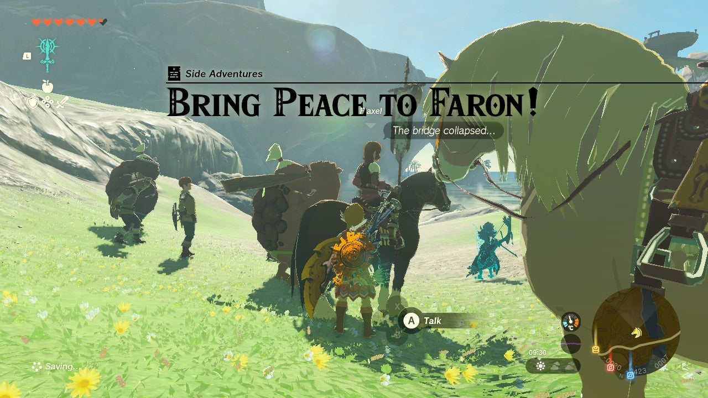
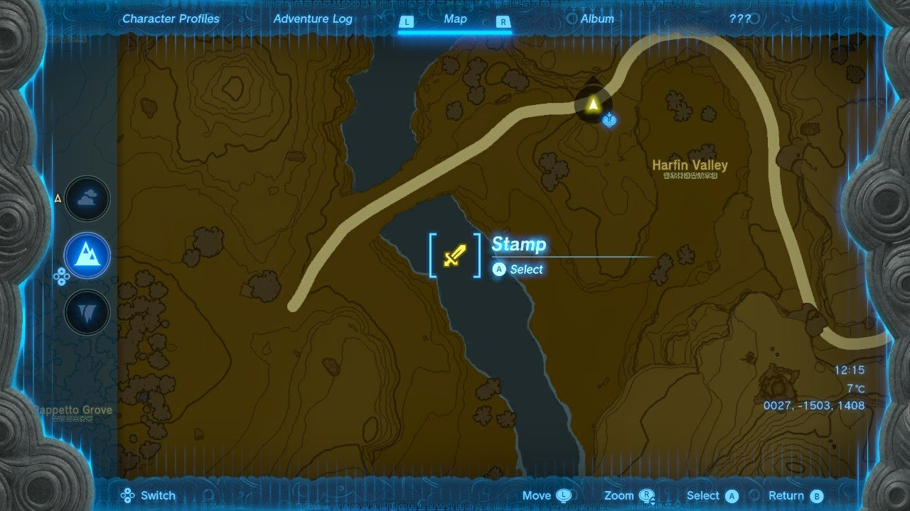
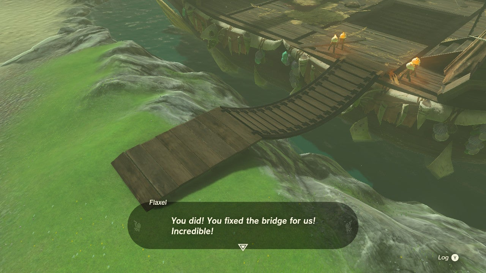

**Bring Peace to Faron!** Is one part of a larger journey to bring peace to Hyrule as a whole. The Bring Peace Side Adventures involve you joining an armed force to clear out monsters from certain areas around the map. In this guide, we will give you all the information you need to complete the battle of Faron and bring peace to another part of Hyrule. 

To trigger the Bring Peace to Faron! Side Adventure, you must first have completed the Bring Peace to Hyrule Field! Side Adventure in South Hyrule Field. 

Once you have successfully cleared the enemy camp in South Hyrule Field, you will be ready to move on to saving Faron. To trigger the Side Adventure, head to the large Pirate Ship West of Highland Stable. 

Speak to **Flaxel** , the Hylian sitting atop a horse on the left side of the ship. Flaxel and her crew planned to invade the ship but were thwarted by the bridge leading to the ship being broken. 

Use **Ultrahand** to repair the bridge. There is a plank of wood on the bank, which the bridge used to be attached to. Make sure you connect the bridge to the bottom of this piece. Otherwise, it will break and fall back down. 

Once the bridge is fixed, follow Flaxel and her army onto the ship and eliminate all the monsters on board. Flaxel will reward you with **100 Rupees** and inform you that they are heading to Hebra for the next battle. 

Bring Peace to Faron!

See the complete List of Side Quests and Side Adventures

### Up Next: Bring Peace to Hebra!

Previous

Bring Peace to Akkala!

Next

Bring Peace to Hebra!

### Top Guide Sections

  * Walkthrough
  * Zelda: Tears of The Kingdom Switch 2 Edition Guide
  * Zelda Notes Voice Memories
  * List of Side Quests and Side Adventures

### Was this guide helpful?

Leave feedback

### In This Guide

The Legend of Zelda: Tears of the KingdomNintendo EPD

Initial Release: May 12, 2023

Learn more

Go to comments