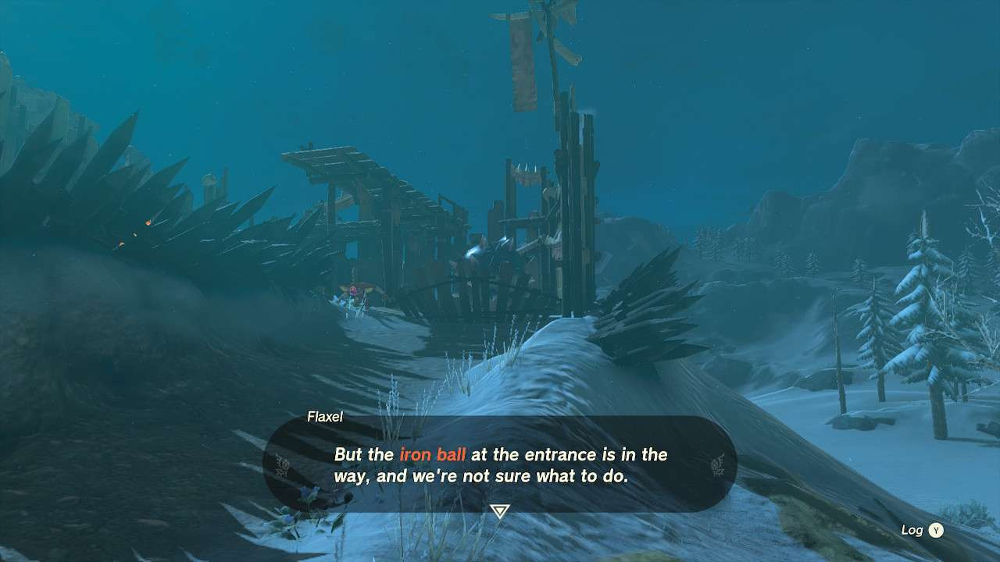

**Bring Peace to Hebra!** is one of the many Side Adventures to complete in The Legend of Zelda: Tears of the Kingdom. In this guide, we will teach you everything you need to know to complete Bring Peace to Hebra!, including where to find it and what you will get as a reward. 

  * **Side Quest Location** : Tabantha Tundra, South Tabantha Snowfield
  * **Prerequisites** : Must first complete Bring Peace to Faron!
  * **Rewards** : 100 Rupees

You automatically get this quest after helping **Flaxel** and her unit clear out the moored pirate ship in Faron. Head to the cold north near the Snowfield Stable, where it should be a way to the southwest. 

In order to start the battle, you have to find a way to eliminate the spiked ball preventing Flaxel’s squad from getting in. This can be done in a variety of ways, namely Ultrahanding it once it’s unleashed, Rewinding it into the Bokoblins, or Fusing it with a weapon. It’s perhaps easiest to deal with, though, if you have received the Bokoblin Mask from Koltin 

As soon as it’s out of the way, the battle will commence. Be aware that there’s a **Boss Bokoblin** in the fray who might be out of view depending on when you start. Fight your way through the hordes, though remember you can use the spiked ball as an offensive weapon. **Also be aware that there are explosives stockpiled in several places in this camp, so use those to your advantage**. 

Once the meter hits 0, you’ll win the day and the **100 Rupees**. Once everyone’s moved out, though, be sure to stick around to pick up not only all the monster parts that are probably laying around, but the loot the monsters had. They’ve hoarded several toasted fruits and veggies, amber, opal, and a Hinox hammer among others. 

Bring Peace to Hebra!

See the complete List of Side Quests and Side Adventures

### Up Next: Hestu's Concerns

Previous

Bring Peace to Faron!

Next

Hestu's Concerns

### Top Guide Sections

  * Walkthrough
  * Zelda: Tears of The Kingdom Switch 2 Edition Guide
  * Zelda Notes Voice Memories
  * List of Side Quests and Side Adventures

### Was this guide helpful?

Leave feedback

### In This Guide

The Legend of Zelda: Tears of the KingdomNintendo EPD

Initial Release: May 12, 2023

Learn more

Go to comments