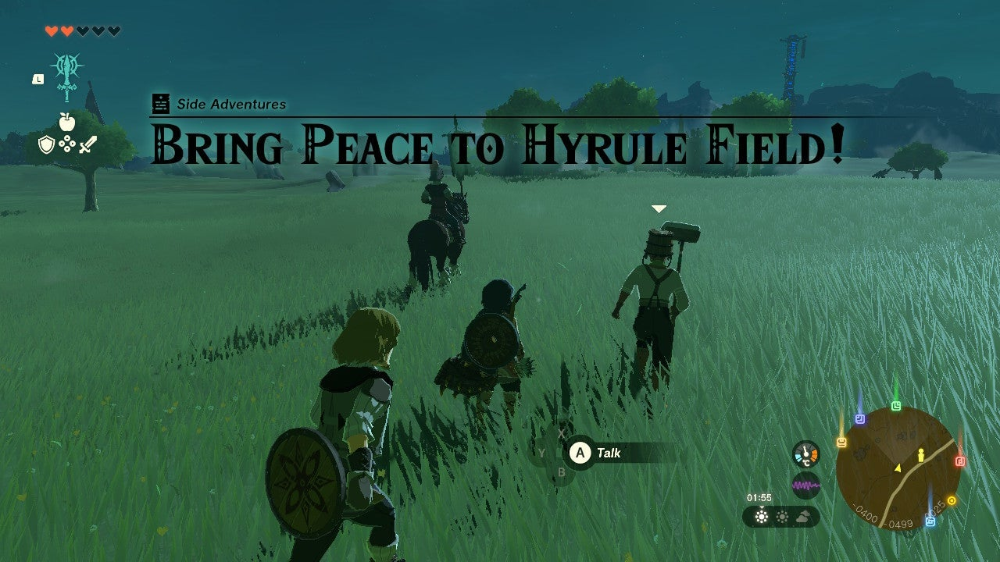
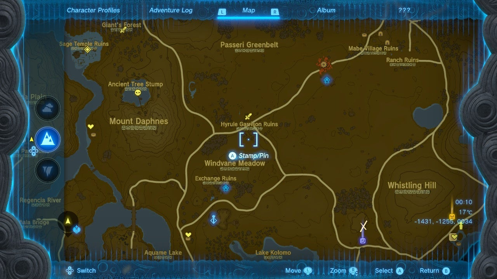

**Bring Peace to Hyrule Field!** Is the beginning of an adventure to bring peace to Hyrule as a whole. In this guide for Zelda: Tears of the Kingdom, we will give you all of the information you need to complete the Bring Peace to Hyrule Field! Side Adventure, and tell you exactly where you can find the next battle. 

The Bring Peace Side Adventures are a series of great battles you embark on with **Hoz** and his dedicated army of Hylian soldiers. The first leg of the adventure begins just East of the **Hyrule Garrison Ruins** in South Hyrule Field. 

Hoz and his crew are patrolling the area around Hyrule Garrison Ruins, gearing up to eliminate a settlement of monsters that have taken residence in the area. 

To trigger the Side Adventure, simply run up to Hoz and speak to him. He will tell you they are about to head into battle and invite you to join. Follow along with the group as they approach the Ruins, and wait for Hoz’s call before running in to defeat all the monsters in the area. 

There are about six or so Bokoblins to wipe out, as well as a larger Moblin. Once you have taken down all the monsters, Hoz will thank you for your valiant efforts and reward you with a Silver Rupee. 

Before Hoz and his crew set off, he lets you know that they are heading to **Fort Hateno** in the **Necluda** region. Find and battle with him there to complete the **Bring Peace to Necluda!** leg of the adventure. 

Bring Peace to Hyrule Field!

See the complete List of Side Quests and Side Adventures

### Up Next: Walkthrough

Previous

About IGN's Zelda TotK Guide Writers

Next

Walkthrough

### Top Guide Sections

  * Walkthrough
  * Zelda: Tears of The Kingdom Switch 2 Edition Guide
  * Zelda Notes Voice Memories
  * List of Side Quests and Side Adventures

### Was this guide helpful?

Leave feedback

### In This Guide

The Legend of Zelda: Tears of the KingdomNintendo EPD

Initial Release: May 12, 2023

Learn more

Go to comments