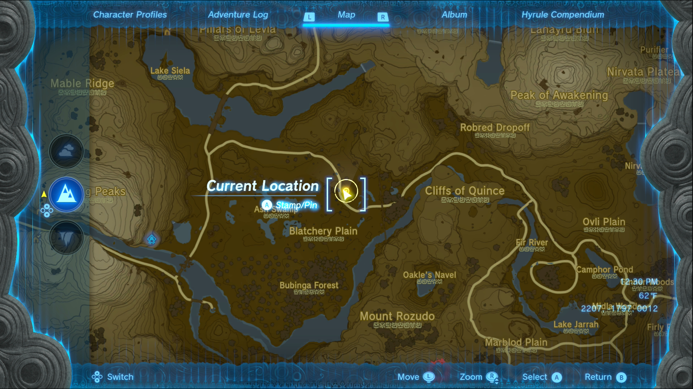
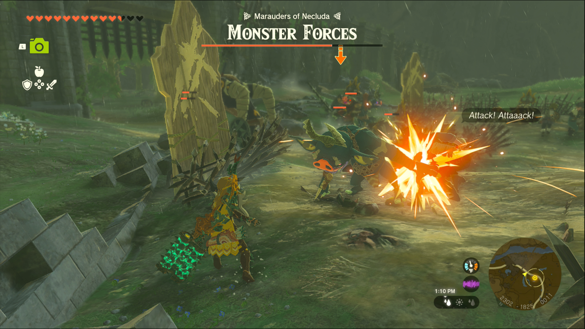

Bring Peace to Necluda is one of the Side Adventures you can complete in West Necluda and Lanayru Wetlands region. Side Adventures are quests in The Legend of Zelda: Tears of the Kingdom that require multiple steps and typically tell a larger story. 

## Bring Peace to Necluda!

To start the Side Adventure “Bring Peace to Necluda!” you first need to complete “Bring Peace to Hyrule Field!” Once you have, Hoz will give you a new quest, instructing you to meet him and his squad near the Fort Hateno wall; the quest marker will direct you to the group. 

Once you’ve met with them you can speak with Hoz to get things moving along, so move in and defeat the monsters with help from the Monster-Control Crew. 

If you want, you can sit back and let them deal with the fighting on their own, but this fight is definitely easier with the crew to distract most of the monsters. 

Once all the monsters are defeated, Hoz will have some words with you and a 100 Rupee reward for your help. That wraps up the patrols for this squad, but there are other Monster-Control Crews to help, like in the quest “Bring Peace to Faron!” 

Bring Peace to Necluda!

See the complete List of Side Quests and Side Adventures

### Up Next: Bring Peace to Eldin!

Previous

Bring Peace to Hyrule Field!

Next

Bring Peace to Eldin!

### Top Guide Sections

  * Walkthrough
  * Zelda: Tears of The Kingdom Switch 2 Edition Guide
  * Zelda Notes Voice Memories
  * List of Side Quests and Side Adventures

### Was this guide helpful?

Leave feedback

Go to comments