**Bubbul Gems** are mysterious new Key Items in The Legend of Zelda: Tears of the Kingdom. They appear to be strange, snowflake-like light-blue crystals that drop after defeating an equally mysterious Bubbulfrog. There are over 100 Bubbulfrogs to find throughout the caves of Hyrule. You'll need to defeat roughly half of them to earn all the rewards that Bubbul Gems will net you. Learn more about what to do with Bubbul Gems in Tears of the Kingdom and how to get more of them with this guide. 

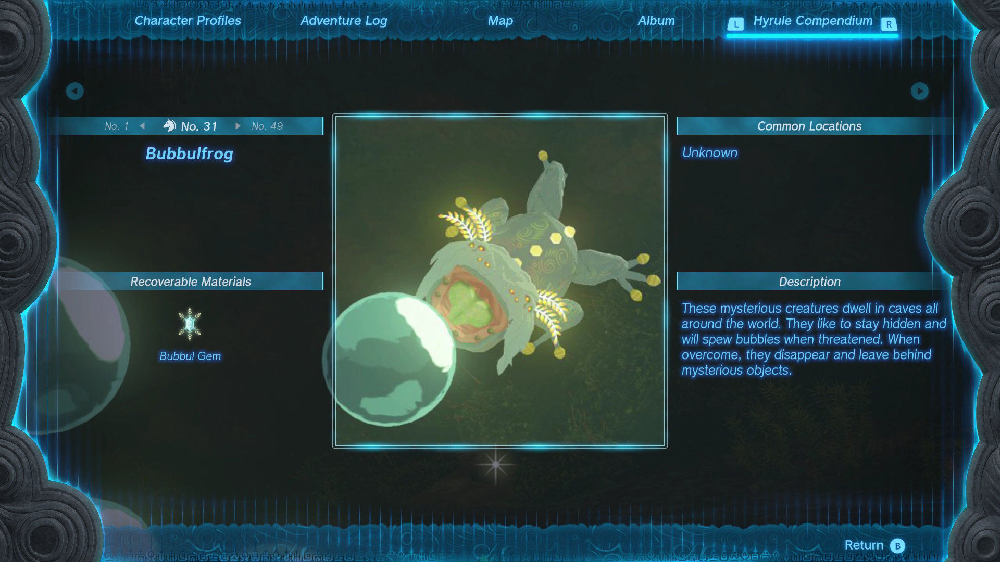

**Official Description:**_A strange crystal left by defeated Bubbulfrogs in caves. Its eerie blue glow may entice you to…collect even more._

Jump to: 

  * What to Do With Bubbul Gems 
    * How to Complete The Hunt for Bubbul Gems 
    * How to Complete the Search for Koltin 
  * Bubbul Gem Reward List 
  * How to Get Bubbul Gems 

## What to Do With Bubbul Gems

You’ll likely encounter your first Bubbulfrog, and your first Bubbul Gem, in the Pondside Cave on Great Sky Island, but with no instruction on what to do with them. You won’t learn more about them for quite a while, either, unless you specifically seek it out. 

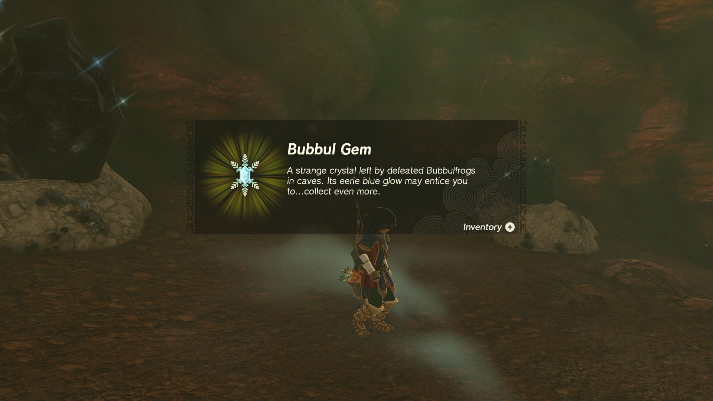

In short, you can turn Bubbul Gems in for unique equipment that makes you blend in with monsters, monster parts, and a special armor set. Here's a quick summary: 

  1. Go to Pico Pond near Woodland Stable and start the Side Adventure - The Hunt for Bubbul Gems!
  2. Complete the next Side Adventure - The Search for Koltin - by going just east of the Uri Mountain Skyview Tower in Akkala at night.

### How to Complete The Hunt for Bubbul Gems

But you’ll need to first find and complete the Side Adventure The Hunt for Bubbul Gems!

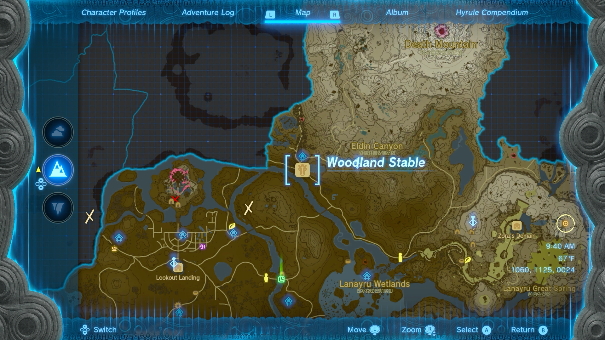

**First, head to Woodland Stable in****Eldin****.** It’s along the main road northeast of Lookout Landing. From there, you should see a colorful hot-air balloon across Pico Pond, at the mouth of Pico Pond Cave. 

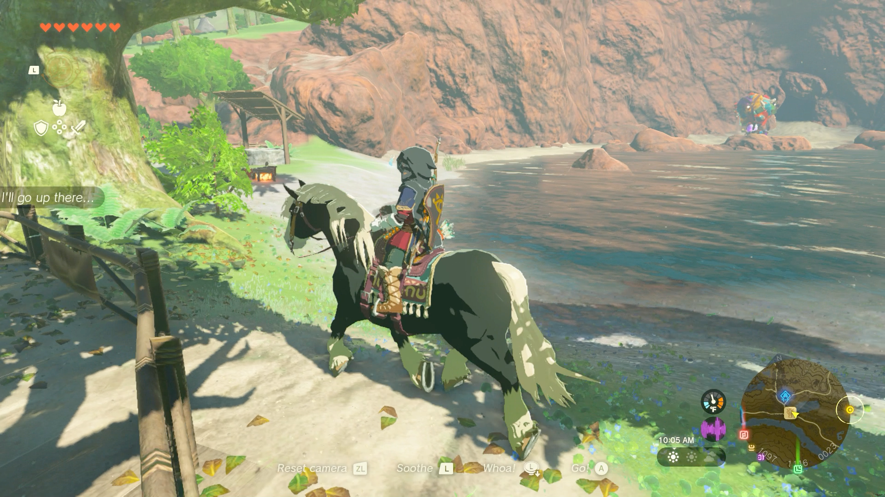

It’s Kilton the Monster Parts Merchant from Breath of the Wild, but this time, he’s with his brother, Koltin. Koltin will explain he wishes to transform into a Satori, also known as The Lord of the Mountain in Breath of the Wild. He believes if he consumes Bubbul Gems, he can achieve his dream. In exchange for one Bubbul Gem, **Koltin will give you a Bokoblin mask**. 

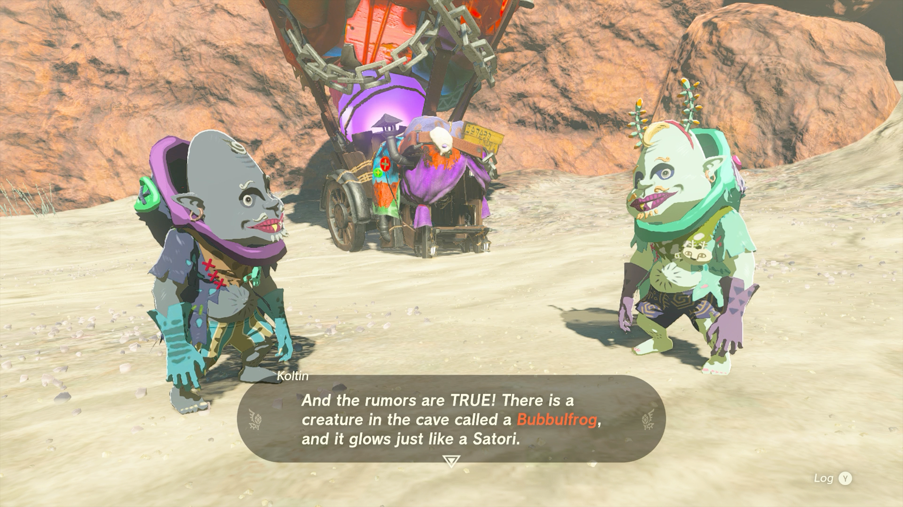

That however fails to transform him into a Satori, so he goes off to search for more in an unknown location, starting another Side Adventure - The Search for Koltin. 

### How to Complete the Search for Koltin

Kilton also leaves, but to Tarrey Town in Akkala. Kilton will tell you where Koltin is if you visit him in Tarrey Town, but you can go straight to Kilton if you’d like instead–just east of the **Uri Mountain Skyview Tower** , but only at night. 

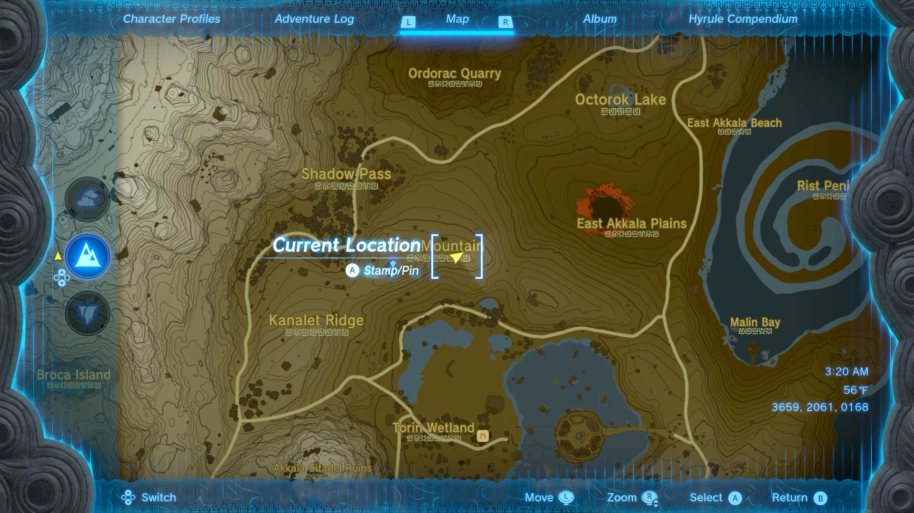

Then, you can trade in as many Bubbul Gems as you have, but Kolton may leave to travel around once again, like Kilton did in Breath of the Wild - and he'll only appear at night. 

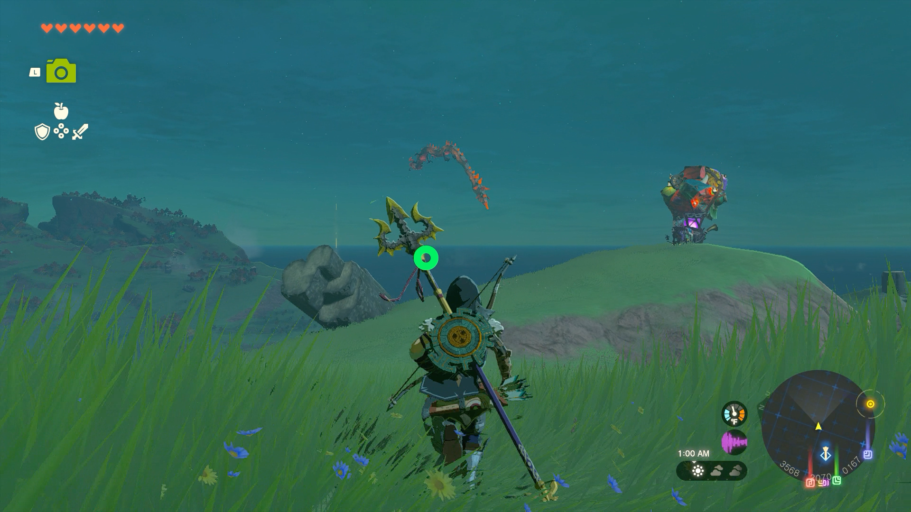

**Koltin Locations:**

  * Ulri Mountain Skyview Tower
  * South of Lookout Landing
  * By the Snowfield Stable in Tabantha
  * Isle of Rabac on Death Mountain, northwest of YunoboCo HQ

We’ll update this with a list of Koltin Locations when we know them! 

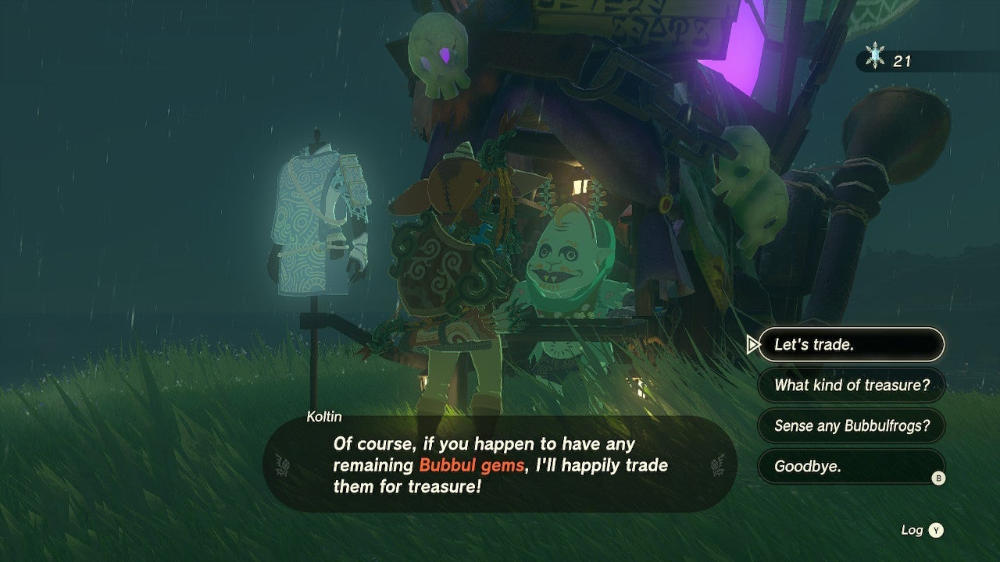

### Bubbul Gem Reward List

See the chart below to see a list of rewards you’ll get for Bubbul Gems from Koltin in Tears of the Kingdom. Note that you can’t choose the order you get these rewards - this is the set order. 

Bubbul Gems  
Total Gems Needed  
Reward

1 Bubbul Gem  
1  
Bokoblin Mask

2 Bubbul Gems  
3  
Moblin Mask

2 Bubbul Gems  
5  
x3Hinox Toenail

3 Bubbul Gems  
8  
Mystic Robe

3 Bubbul Gems  
11  
x8Fire Keese Eyeball

3 Bubbul Gems  
14  
Lizalfos Mask

3 Bubbul Gems  
17  
x5 Ice-Breath Lizalfos tails

4 Bubbul Gems  
21  
Mystic Trousers

4 Bubbul Gems  
25  
White-Maned Lynel Mace Horn

4 Bubbul Gems  
29  
Horriblin Mask

4 Bubbul Gems  
33  
x2 Gleeok Wing

4 Bubbul Gems  
37  
Lynel Mask

4 Bubbul Gems  
41  
x3 Gleeok Thunder Horn

5 Bubbul Gems  
46  
Mystic Headpiece

You'll need a total of **46 Bubbul Gems** to get all the rewards Koltin offers. Shoutout to **Nomercyman10** for their contributions to the list! 

After you give Koltin 46 Bubbul Gems Tap to Reveal

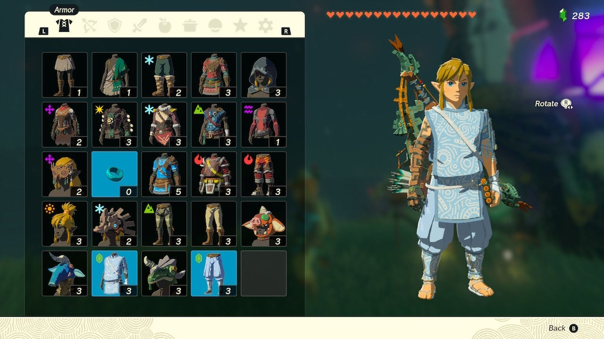

## How to Get Bubbul Gems

So now that you know what you’ll get from Bubbul Gems, how can you easily get more? The simple answer is to find more Bubbulfrogs inside Caves and defeat them. They can usually be taken down with an arrow to the head, which is a critical hit. 

**You can find cave locations on our****interactive Tears of the Kingdom Map****, or use the tips below.**

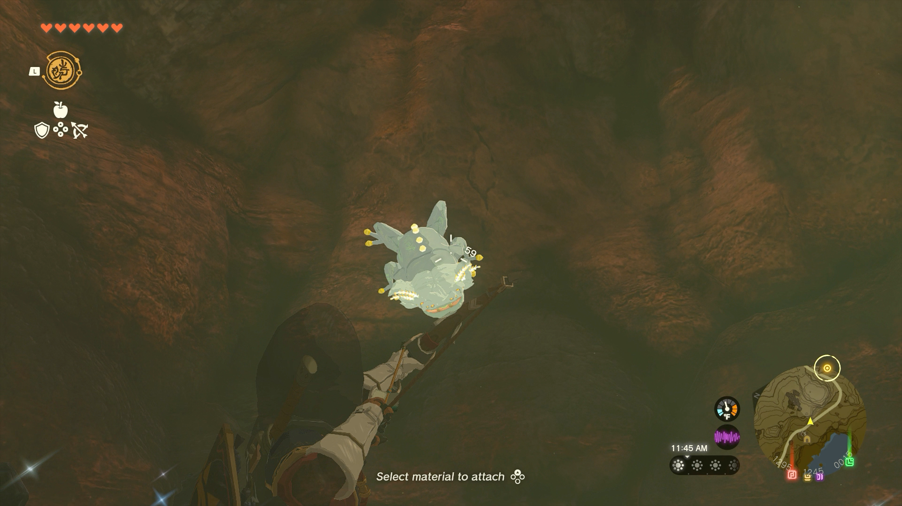

You should know there are easier ways to find the caves that Bubbulfrogs dwell in, though. 

  * Koltin can **sense Bubbulfrogs nearby** , but this is pretty limited.
  * A little more helpful are Blupees, whose presence marks a nearby cave.

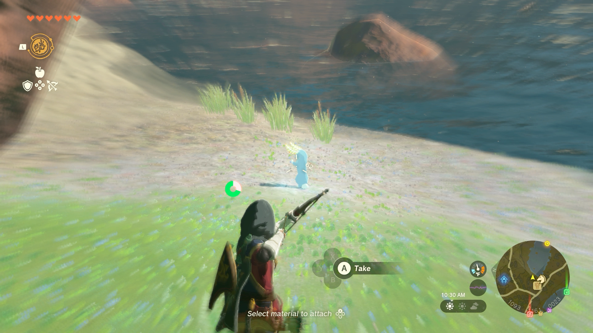

Leave a Blupee be and follow it instead of harassing it for Rupees to have it lead you to the cave entrance. 

  * You can also look for circling birds, which occasionally congregate above cave entrances.
  * Finally, you can bypass the clues and get caves - and other points of interest - marked for you automatically. Locate the Cherry Blossom Tree in the region you’re in and leave a fruit–any fruit–in the bowl at its base to get the assistance.

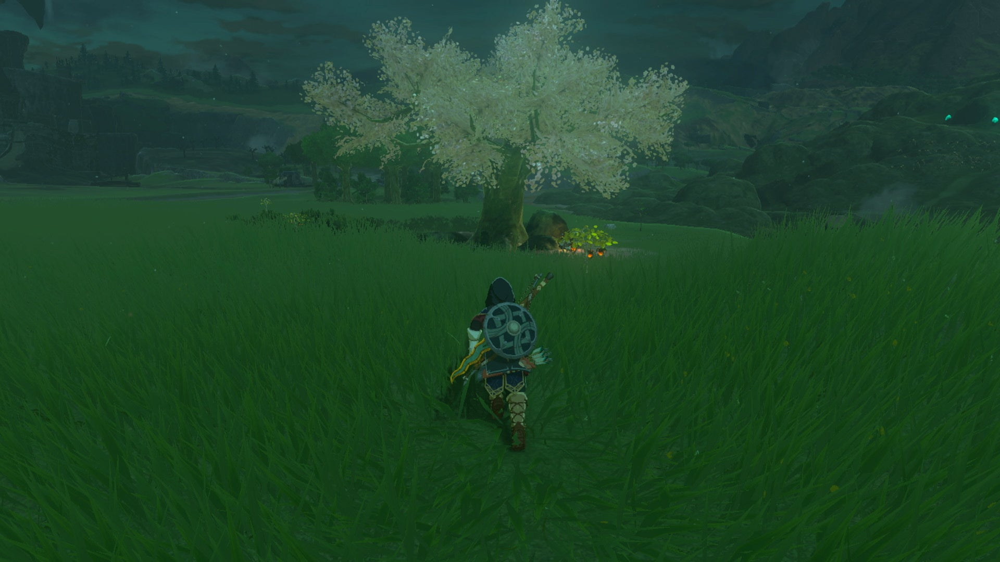

The pillars of light indicating the cave entrances won’t be marked on your actual map, but they’re very easily spotted after ascending a Skyview Tower. 

Once you’ve entered a cave and collected the Bubbul Gem, **that cave will get a Check Mark on your map** , so you know you don’t have to revisit it. 

Check out these other helpful guides next! 

  * Shrine Locations and Guide
  * List of Side Quests and Side Adventures
  * Amiibo Unlockables, Rewards, and Functionality
  * Korok Seed Locations
  * Minibosses
  * How to Increase Your Battery (Energy Cell Upgrades)
  * Bargainer Statue Locations and Unlockable Rewards
  * Old Map and Treasure Locations

### Up Next: Poes

Previous

Yiga Schematics

Next

Poes

### Top Guide Sections

  * Walkthrough
  * Zelda: Tears of The Kingdom Switch 2 Edition Guide
  * Zelda Notes Voice Memories
  * List of Side Quests and Side Adventures

### Was this guide helpful?

Leave feedback

### In This Guide

The Legend of Zelda: Tears of the KingdomNintendo EPD

Initial Release: May 12, 2023

Learn more

Go to comments