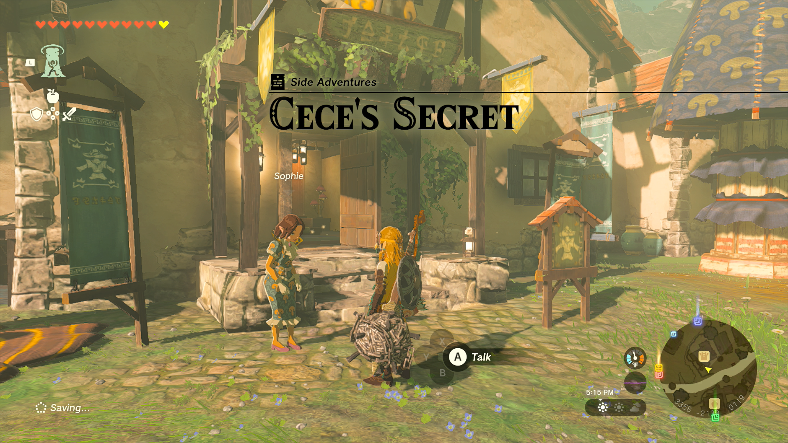
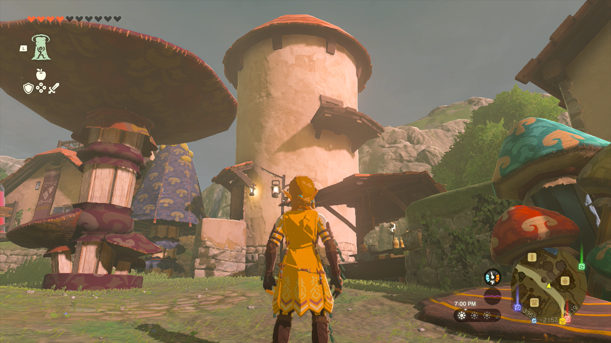
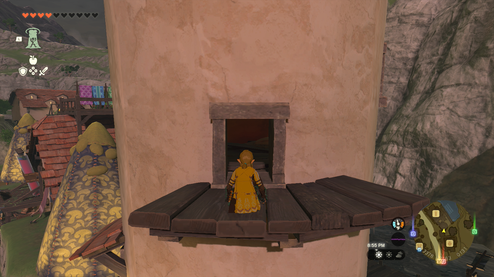
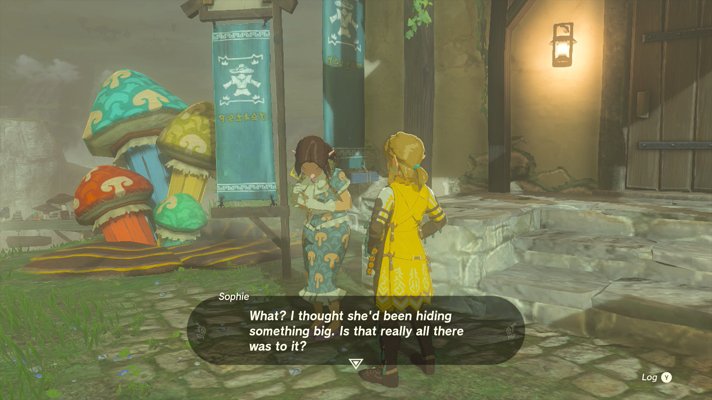

**Cece’s Secret** is a Side Adventure in The Legend of Zelda: Tears of the Kingdom in which you help Sophie discover what Cece is up to when she wanders off at night. Side Adventures are mini-quests that tell a story. 

## Cece’s Secret

To start the Side Adventure Cece’s Secret you first need to accept the quest, "Team Cece or Team Reede?" Once you've done that, you need to speak to Cece's sister, Sophie. She should be standing right outside of Ventest Clothing Boutique. Sophie is worried that whatever Cece is up to at night could be harmful to her chances of winning the upcoming election. She’d like you to tail Cece to learn what she’s up to, then report back to Sophie after. 

Wait until night, then follow Cece when she leaves her shop. She won’t go too far, so pick a good vantage point that allows you to watch over the entire market area. She leaves her home at 10 pm and slowly makes her way to the silo across from her store. 

You can’t follow her too closely or she’ll notice you and just head home for the night. When she walks into the silo, don’t follow her directly in or she’ll kick you out, so instead you’ll need to ascend to the silo window facing the general store and sneak inside. 

If you want to be sure not to miss the opportunity to follow Cece, you can head up to your hiding spot and just wait for her to enter. Whichever you decide, once you’re both inside the silo a short dialogue will start, revealing her secret. Then return to Sophie to fill her in on the details, she should still be outside the shop, but if she isn’t you can select “Cece’s Secret” as your main quest to highlight her on the map. 

Once you reveal the information, and gain a little more insight about Cece, you’re rewarded with 10 Ironshrooms. This is one of the quests required to unlock the final quest of the Hateno questline, The Mayoral Election. 

Cece's Secret

See the complete List of Side Quests and Side Adventures

### Up Next: Team Cece or Team Reede?

Previous

Reede's Secret

Next

Team Cece or Team Reede?

### Top Guide Sections

  * Walkthrough
  * Zelda: Tears of The Kingdom Switch 2 Edition Guide
  * Zelda Notes Voice Memories
  * List of Side Quests and Side Adventures

### Was this guide helpful?

Leave feedback

### In This Guide

The Legend of Zelda: Tears of the KingdomNintendo EPD

Initial Release: May 12, 2023

Learn more

Go to comments