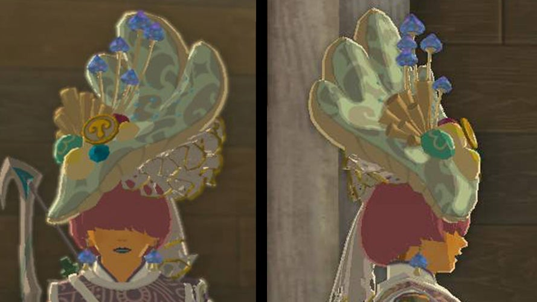
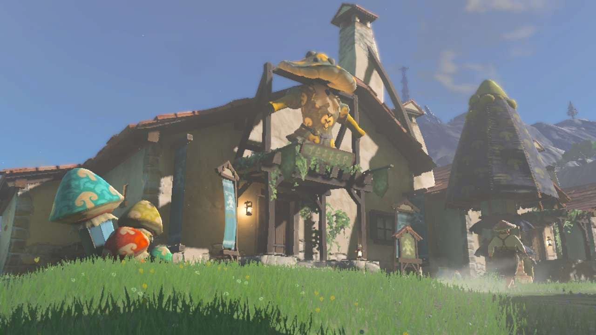
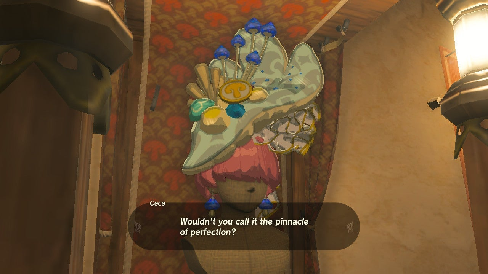

The Cece Hat is not only a new piece of armor, but also one of the most luxurious pieces of armor in The Legend of Zelda: Tears of the Kingdom. Cece's Hat cannot be purchased but instead must be earned by completing a long string of Hateno Village side adventures. This fashionable headpiece will raise Link's standings in the fashion world, but **it cannot be dyed nor can it be upgraded**. 

This TotK guide includes details on how to get the Cece Hat and encyclopedic information about the item. 

### Cece Hat

  * **Description:** "An avant-garde masterpiece designed by Cece. Guaranteed to make the fashionistas' heads turn.

Cece Hat Base Stats

Defense  
Effect Bonus  
Cost  
Sale Value

2  
None  
N/A  
600

Cece Hat

## How to Get Cece's Hat

Upon discovering Hateno Village, you'll find it's covered in a mushroom pattern that you may have already seen during your travels. Residents wear the mushroom hats and mushroom lights illuminate the town at night. 

Enter the clothing shop a short walk up the hill from the town's entrance and on the left. If you haven't tried to enter Ventest Clothing Boutique before, you'll learn that fashion fans from all over have come to see Cece's latest creations, but only one person can enter. When you enter and talk to Cece you'll kick off the questline to get her hat. 

You'll need to complete the following quests below: 

  * Team Cece or Team Reede?
  * A New Signature Food
  * A Letter to Koyin
  * Reede's Secret
  * Cece's Secret
  * The Mayoral Election

After the end of The Mayoral Election Side Adventure, you can visit Cece in her shop to get her hat. 

### Up Next: Champion's Leathers

Previous

Bokoblin Mask

Next

Champion's Leathers

### Top Guide Sections

  * Walkthrough
  * Zelda: Tears of The Kingdom Switch 2 Edition Guide
  * Zelda Notes Voice Memories
  * List of Side Quests and Side Adventures

### Was this guide helpful?

Leave feedback

Go to comments