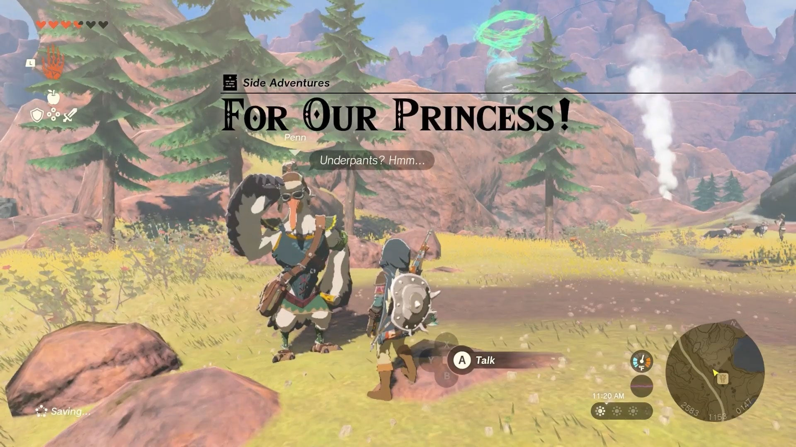
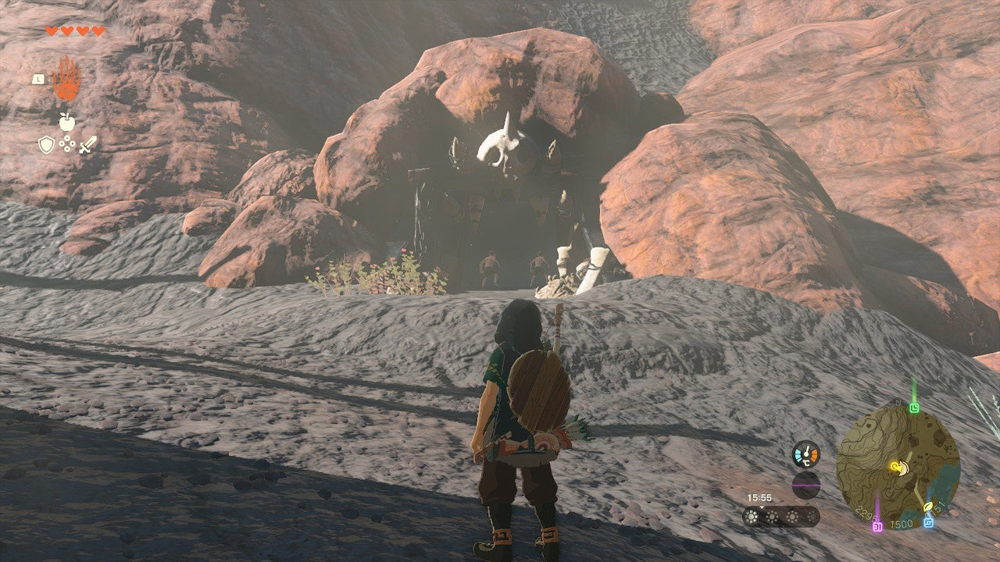
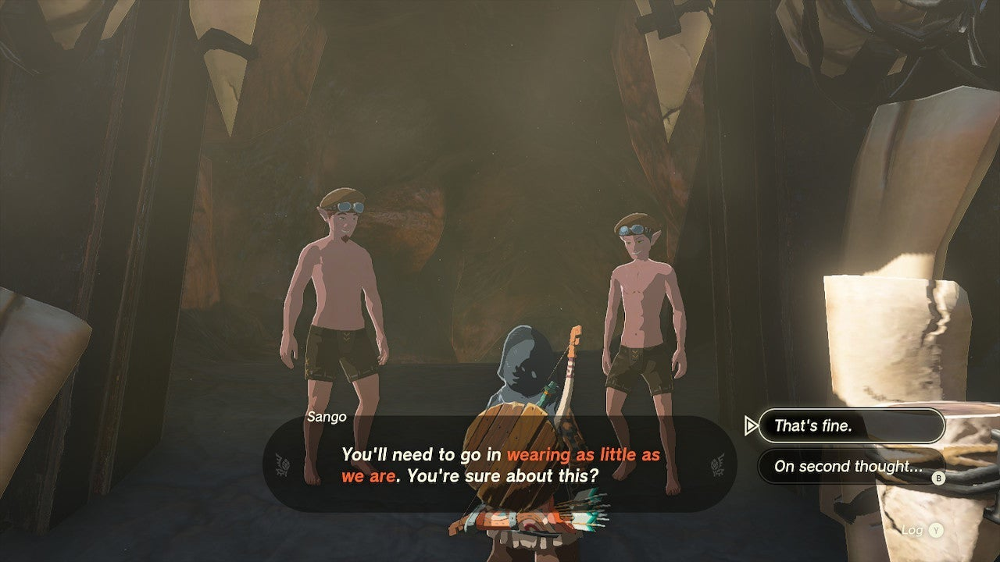
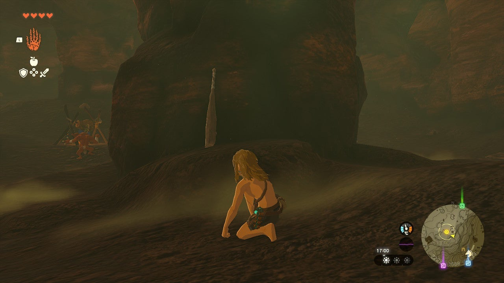

This side adventure is unlocked after starting the **Potential Princess Sightings** questline in the Hebra Mountains, as you need to be employed by the Lucky Clover Gazette. Penn will need your help solving the riddle of why so many nearly naked men are marching around on orders from Princess Zelda! 

  * **Quest Giver:** Penn
  * **Prerequisites:** Begin the Potential Princess Sighting! questline at the Lucky Clover Gazette
  * **Reward:** Rupees

To start the For Our Princess! side adventure, visit the Foothill Stable near Cephla Lake, in the Eldin region, far to the east of the Woodland Stable where the old path to Goron City used to be. Just outside the stable (and the assorted group of shirtless guys), you can find and speak to **Penn**. 

Penn wants you to track down the Zonai Survey Team, who headed north towards the Foothill Monster Den. Since you're at a stable, you might want to get a horse before you go after them. Follow the path north through the Maw of Death Mountain and approach the two **Zonai Survey Team members** standing in the cave entrance. 

As it turns out, the Zonai Survey Team members have to complete a difficult challenge: enter the Foothill Monster Den **without any equipment or items** , and defeat the monsters. The quest objective is to complete this challenge in their place. 

Your opponents consist of a Blue Moblin and a bunch of Bokoblins, one of whom is heavily armored. Note that there are several weapons ready to be picked up inside this cave, so it's best to sneak around and **gear up** for a bit before engaging the monsters. Fuse the weapons with nearby rocks to make them stronger, especially against the armored Bokoblin. 

If you're having trouble, you can try eating some food with a stat boost before accepting the challenge, and you may also want to consider getting more Light of Blessings from Shrines to increase your max hearts. Take out the archer on the left first, and break boxes to find arrows or food you can eat if needed. 

Once you've defeated the monsters, head back to the cave entrance and speak to the Zonai Survey Team Members again. Head back to Foothill Stable to meet with them once more, and the **For Our Princess!** side adventure is completed. Penn will give you a reward for your performance. 

_This reward depends on how far along you are in the Potential Princess Sightings! Side Adventure._

For Our Princess!

Looking for the Bubbulfrog location in this cave? Check out our Foothill Monster Den guide!

## List of Potential Princess Sighting Side Adventures

Looking for other Potential Princess Sightings to undertake? You can take on the following adventures in any order you choose, which are located at nearly every main Stable in Hyrule. Click on a link below to learn more about it, and how to solve the quest. 

Side Adventure Name  
Starting Settlement / Region

Serenade to a Great Fairy  
Woodland Stable, Eldin Canyon

The Beckoning Woman  
Outskirt Stable, Central Hyrule

Gourmets Gone Missing  
Riverside Stable, Central Hyrule

The Beast and the Princess  
New Serenne Stable, Hyrule Ridge

Zelda's Golden Horse  
Snowfield Stable, Tabantha Tundra

White Goats Gone Missing  
Tabantha Bridge Stable, Hyrule Ridge

For Our Princess!  
Foothill Stable, Eldin

The All-Clucking Cucco  
South Akkala Stable, Akkala

The Missing Farm Tools  
Wetlands Stable, West Necluda

Princess Zelda Kidnapped?!  
Dueling Peaks Stable, West Necluda

An Eerie Voice  
Highland Stable, Faron

The Blocked Well  
Gerudo Canyon Stable, Gerudo

See the complete List of Side Quests and Side Adventures

### Up Next: The All-Clucking Cucco

Previous

White Goats Gone Missing

Next

The All-Clucking Cucco

### Top Guide Sections

  * Walkthrough
  * Zelda: Tears of The Kingdom Switch 2 Edition Guide
  * Zelda Notes Voice Memories
  * List of Side Quests and Side Adventures

### Was this guide helpful?

Leave feedback

Go to comments