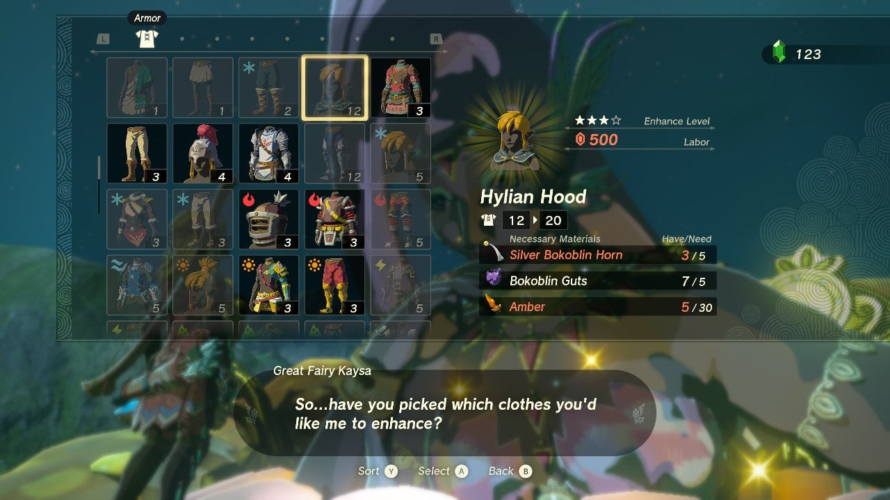

The Froggy Set is a new set of Armor in The Legend of Zelda: Tears of the Kingdom. It features a skin-tight and water-resistant suit meant for scaling surfaces that are slick from rain or ice and are otherwise difficult to climb, thanks to its anti-slip dimples on the hands on feet. For each piece you obtain, you'll be able to climb on slippery surfaces for a longer amount before sliding down. This armor is rewarded from completing a major Side Adventure questline for the Lucky Clover Gazette. 

Froggy Set

Piece Effect  
Set / Upgrade Effect

Slip Resistance  
Slip Proof

Froggy Hood

The Froggy Set is comprised of three armor pieces: 

  * Froggy Hood \- Head Gear (Base Defense 3, Slip Resistance Up, Sell Value - 600)
  * Froggy Sleeve \- Body Gear (Base Defense 3, Slip Resistance Up, Sell Value - 600)
  * Froggy Leggings \- Leg Gear (Base Defense 3, Slip Resistance Up, Sell Value - 600)

The Froggy Set can be dyed at the Hateno Dye Shop, and it can also be upgraded at the Great Fairy Fountains. 

## How to Obtain the Froggy Armor Set in TotK

The only way to get the Froggy Set in Tears of the Kingdom is through a series of Side Adventure Quests that begin by discovering the Lucky Clover Gazette (formerly the Rito Stable) just outside of Rito Village in the Hebra region. 

By talking to Traysi, Link can become employed as a journalist to track down rumors and sightings of Princess Zelda, with the help of a Rito named Penn. This unlocks the Potential Princess Sightings quest, and you will be able to find Penn at most of the Stables across Hyrule to undertake related quests. 

For each quest you undertake, you'll earn rewards from Penn and Traysi, as well as getting parts of the Froggy Armor the more quests you complete for the Gazette: 

  * Complete **4 Quests** to get the **Froggy Sleeve**
  * Complete **9 Quests** to get the **Froggy Leggings**
  * Complete all **12 Quests** and return to Traysi to get the **Froggy Hood**

You can see the full list of Quests you'll need to complete to get each armor piece below: 

Side Adventure Name  
Starting Settlement / Region

Serenade to a Great Fairy  
Woodland Stable, Eldin Canyon

The Beckoning Woman  
Outskirt Stable, Central Hyrule

Gourmets Gone Missing  
Riverside Stable, Central Hyrule

The Beast and the Princess  
New Serenne Stable, Hyrule Ridge

Zelda's Golden Horse  
Snowfield Stable, Tabantha Tundra

White Goats Gone Missing  
Tabantha Bridge Stable, Hyrule Ridge

For Our Princess!  
Foothill Stable, Eldin

The All-Clucking Cucco  
South Akkala Stable, Akkala

The Missing Farm Tools  
Wetlands Stable, West Necluda

Princess Zelda Kidnapped?!  
Dueling Peaks Stable, West Necluda

An Eerie Voice  
Highland Stable, Faron

The Blocked Well  
Gerudo Canyon Stable, Gerudo

## Froggy Set Armor Upgrades

After you find and unlock the Great Fairy Fountains in Hyrule, you can bring them ingredients and a donation of rupees to increase the armor value of each piece of armor. All pieces of the Froggy Set will require the same materials to upgrade each. See the table below for the ingredients needed and defense bonus you can gain for each piece of armor. 

Level  
Materials  
Defense Level (Total)

Base  
N/A  
3

★  
10 Rupees(3) Sticky Lizard  
5

★★  
50 Rupees(5) Horriblin Horn(5) Sticky Lizard  
8

★★★  
200 Rupees(5) Blue Horriblin Horn(5) Sticky Frog  
12

★★★★  
500 RupeesTBA  
TBA

### Up Next: Frostbite Armor Set

Previous

Flamebreaker Armor Set

Next

Frostbite Armor Set

### Top Guide Sections

  * Walkthrough
  * Zelda: Tears of The Kingdom Switch 2 Edition Guide
  * Zelda Notes Voice Memories
  * List of Side Quests and Side Adventures

### Was this guide helpful?

Leave feedback

### In This Guide

The Legend of Zelda: Tears of the KingdomNintendo EPD

Initial Release: May 12, 2023

Learn more

Go to comments