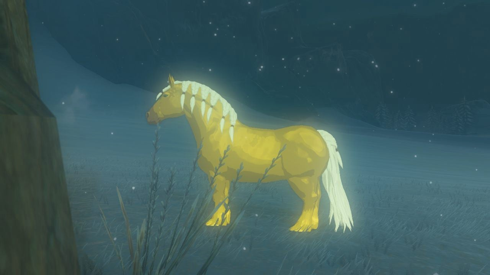
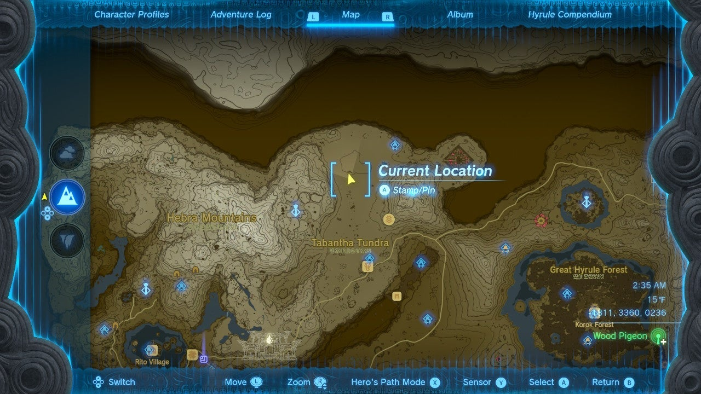

The **Golden Horse** is a one-of-a-kind horse in The Legend of Zelda: Tears of the Kingdom. It belongs to Princess Zelda but was entrusted to someone for safekeeping. It has a magnificent, golden coat and a white mane with honeycomb plaites. The majestic steed is the focus of the Zelda's Golden Horse Side Quest, one of the many parts of Potential Princess Sightings! It can be found near some ruins in the Tabantha Tundra north of the Snowfield Stable. Learn where to find the Golden Horse and tips for taming it in TotK with this creature guide. 

Check out our full guide on Taming a Horse for more information about Horse traits, types, and more.

If you need help keeping track of the chain of quests related to the Golden Horse or information on the area you'll find it, take a look at these guides! 

  * Potential Princess Sightings!
  * Frost Gleeok
  * Tabantha Tundra
  * White Goats Gone Missing

**Official Description** : "An extremely rare horse with a golden coat, said to appear only once every hundred years. The horse's exquisite appearance belies a rugged constitution that makes it adaptable to harsh environments. Highly alert, and picky about who may ride it. Few riders could ever hope to tame this horse." 

**Compendium Number:** 5 

005 Golden Horse

## Where to Find the Golden Horse

The Hyrule Compendium lists the Common Locations of the Golden Horse as "Unkown," but it can be found far in the northern part of the map in the Tabantha Tundra. The fastest way there is by paragliding down from the Pikida Stonegrove Skyview Tower on the east side of the Hebra Mountains. 

There's a quest you can pick up at the Snowfield Stables that will point you in the direction of the Golden Horse. The quest is called Zelda's Golden Horse, and it's offered by an NPC named **Harlow**. As mentioned, it is part of the extensive Potential Princess Sightings! Side Adventure. 

## Tips for Taming the Golden Horse

The Golden Horse spooks just as easily as a regular horse, and it can be tamed in the usual ways. However, the Golden Horse requires quite a bit more soothing than a regular horse. You'll need to mash the L button many times to get it calmed down. Bringing along an Energizing Elixir isn't a bad idea. 

To register the Golden Horse after you've captured it, you'll need to ride it down to Snowfield Stables, where Harlow will be only too pleased to see it. It's a short ride and the Golden Horse is fairly easy to ride. Just avoid the giant, three-headed Frost Gleeok terrorizing the area and it'll be a smooth ride. 

## Golden Horse Stats

The Golden Horse has the following stats: 

  * **Strength:** 4
  * **Speed:** 4
  * **Stamina:** 3
  * **Pull:** 2
  * **Temperament:** Gentle

### Up Next: Stalhorse

Previous

Giant White Stallion Location and Guide

Next

Stalhorse

### Top Guide Sections

  * Walkthrough
  * Zelda: Tears of The Kingdom Switch 2 Edition Guide
  * Zelda Notes Voice Memories
  * List of Side Quests and Side Adventures

### Was this guide helpful?

Leave feedback

### In This Guide

The Legend of Zelda: Tears of the KingdomNintendo EPD

Initial Release: May 12, 2023

Learn more

Go to comments