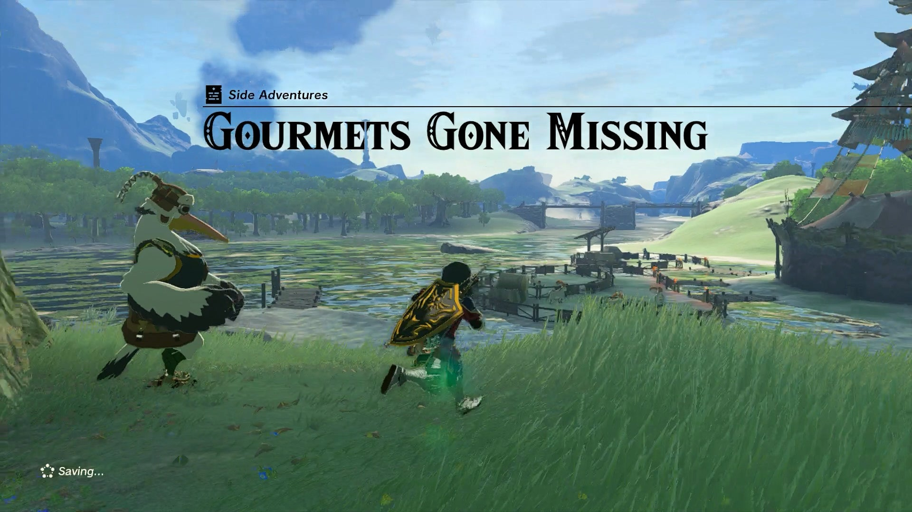
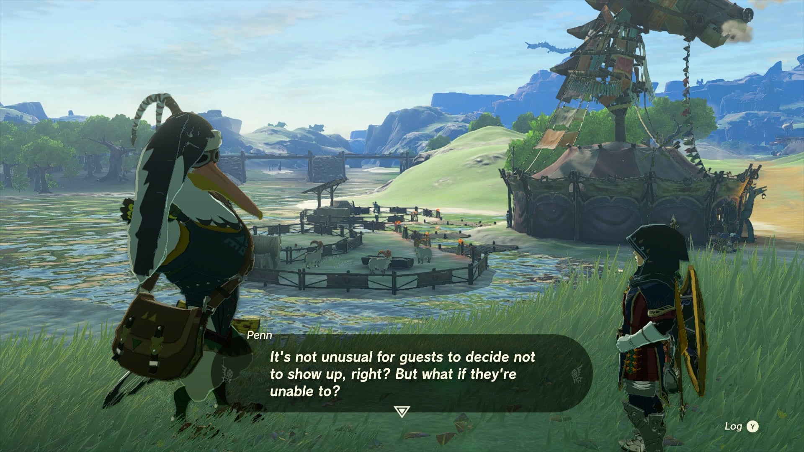
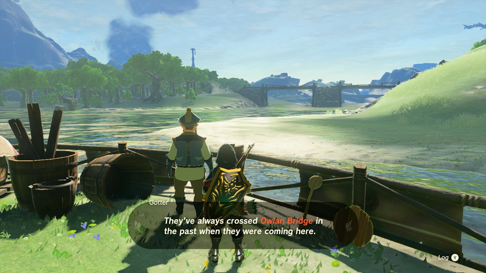
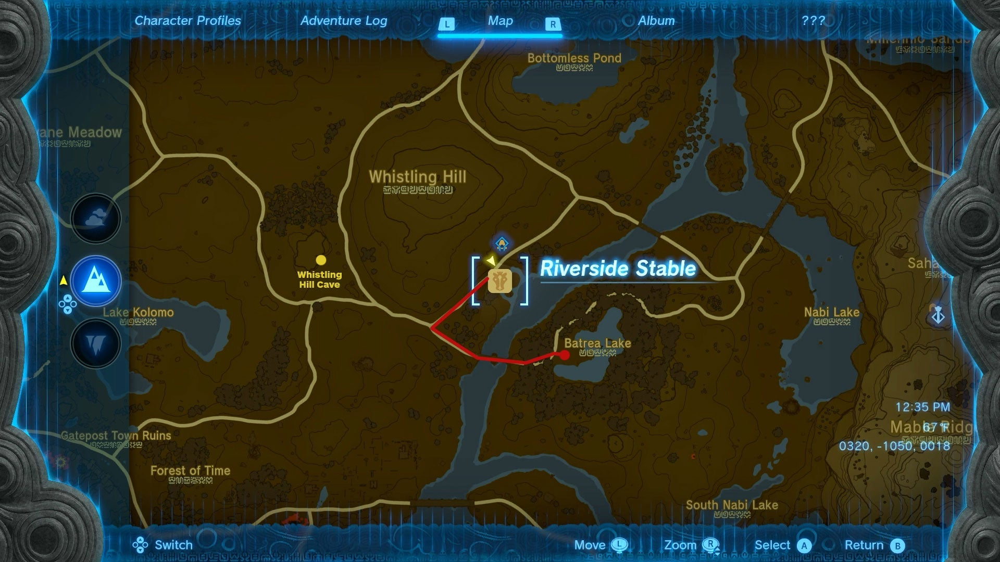
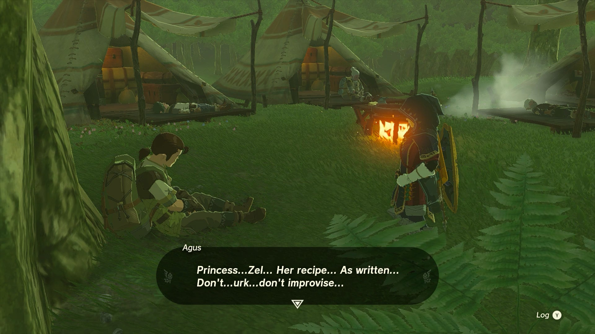
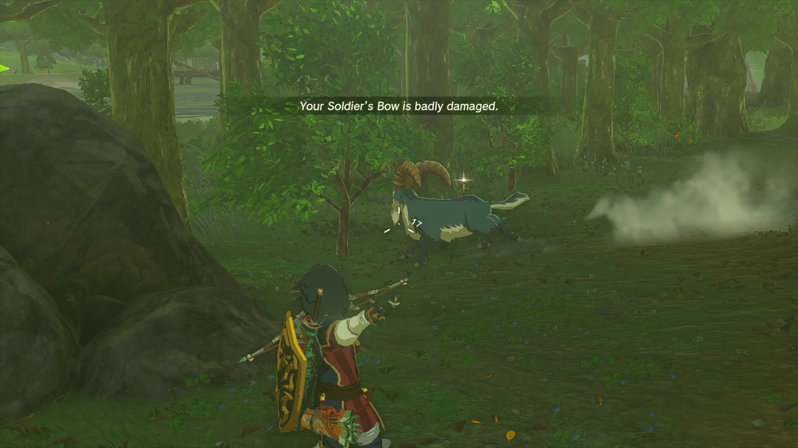
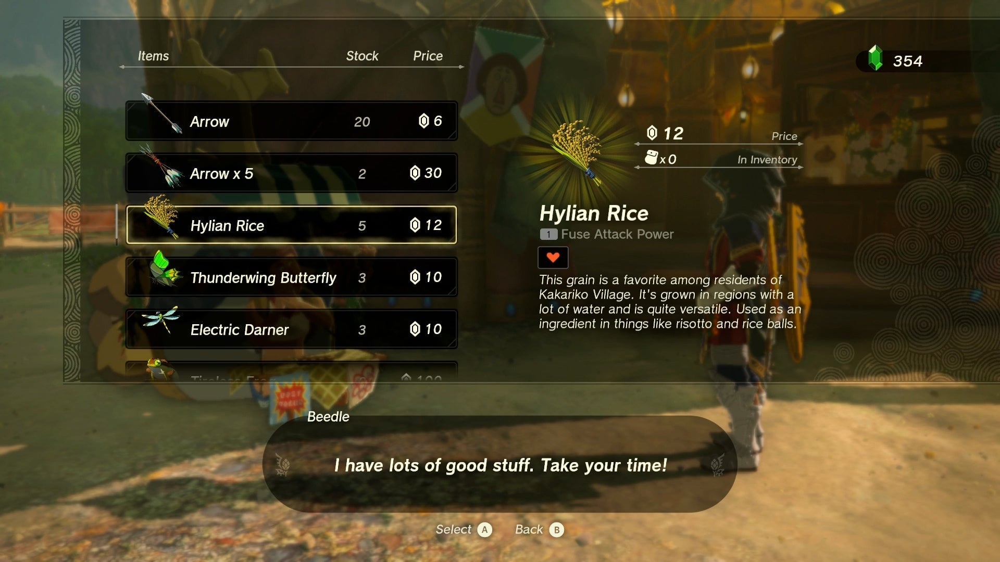
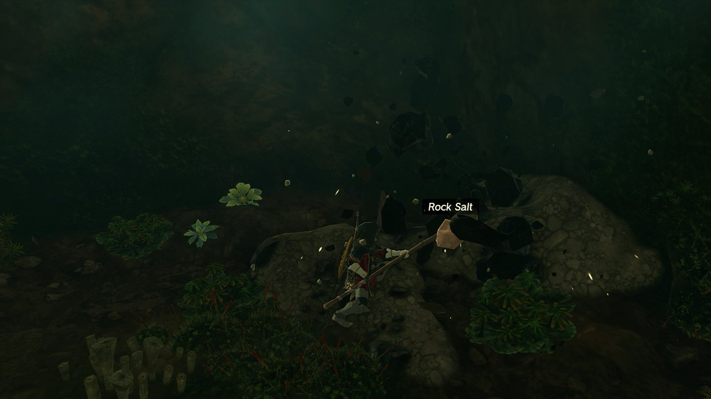
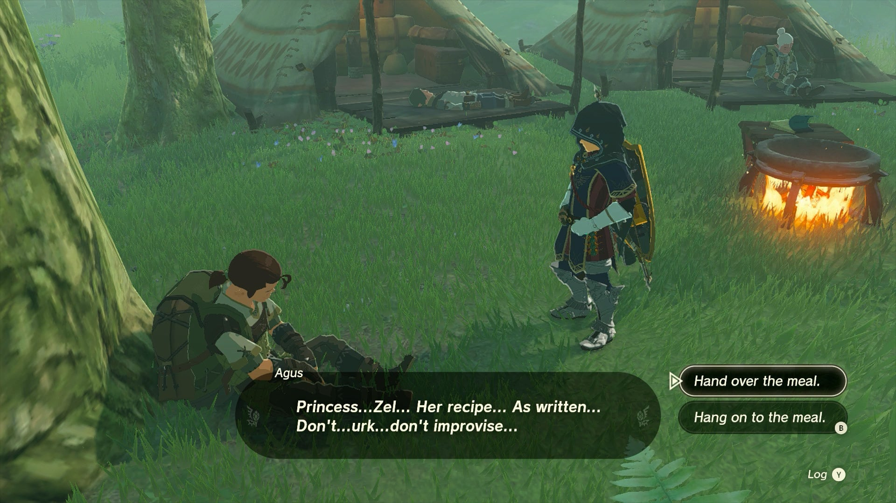
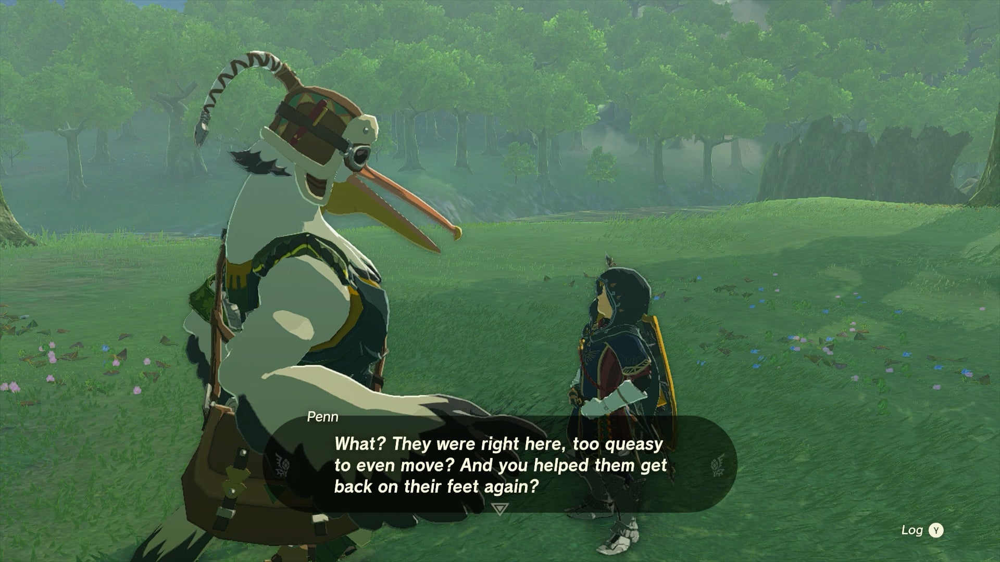

Gourmets Gone Missing is a Potential Princess Sightings! side adventure in TotK found at the Riverside Stable, available after you have become a journalist for the Lucky Clover Gazette at Rito Stable. Penn needs Link's help to investigate the disappearance of a group of traveling cooks who knew a special food recipe from Princess Zelda herself! Below is the walkthrough for another part of the Lucky Clover Gazette questline. 

  * **Quest Giver:** Penn
  * **Prerequisites:** Begin the Potential Princess Sighting! questline at the Lucky Clover Gazette
  * **Reward:** Rupees, Rock Salt, Hylian Rice, Raw Gourmet Meat

You can find this quest at the Riverside Stable, located on the southeast side of Hyrule Field along the Hylia River, just below the Whistling Hill. Penn can be found a bit north of the stable by a large tree overlooking the place. 

Penn will tell you that he's heard rumors of a group of cooks that were supposed to be visiting the stable, but have yet to appear, causing their friend Gotter to worry. 

Head around the back of the stable by the well to find Gotter staring out at the nearby bridge, and he'll tell you that they should have crossed the bridge on their way to the stable, but something must have held them up. He'll also mention they set up camping tents frequently, which will be an important tip to help in searching for the missing gourmets. 

Take off on foot or horseback south and then east across the Owlan Bridge, and follow the trail through the woods until you spot tents in the distance. Here you'll find all the cooks incapacitated by what seems to be a case of food poisoning! 

After several barely conscious cooks mention the recipe may have been altered, look for a notebook right by the Cooking Station to find a note from Princess Zelda about her recipe, which clearly states the following ingredients: Rock Salt, Meat, and Hylian Rice. 

The only cure for these poor guys is to cook up the recipe yourself, and depending on what you have on hand, this can be a short quest, or a more involved one. Assuming you might be missing some ingredients, here's some tips: 

  * Meat can be found on any wild animal found around Hyrule, and if you look around the nearby woods, you're likely to spot a boar or goat that you can snipe with an arrow to get their meat. The quality of the meat doesn't matter - just don't substitute it with monster parts!

  * Hylian Rice is harder to find in these parts, though if you have a way to fast travel to Hateno Village, you can simply cut the grass around the farms to harvest your own. If not, simply return to Riverside Stable and seek out Beedle, who should be selling a few for some rupees!

  * Rock Salt has a chance to drop from any ore deposit you break open, and is thankfully fairly common. Since ore is mostly found in caves these days, you can try checking the Whistling Hill Cave, which is located straight west of Riverside Stable, and just to the north of Teniten Shrine through a rubble-filled cave opening.

Once you have all the parts, cook them at the camp and feed it to Agus, the cook leaning against the tree, and he'll share it with the rest, who will awaken from their terrible food coma. As a personal reward from the cooks, they'll give you a helping of the ingredients including rice, meat, and rock salt (begging the question of why they didn't just make the correct meal themselves and save you the trouble). 

After they pack up and head off to Riverside Stable, Penn will arrive at the clearing to get the scoop from you, and you'll get your reward. 

_This reward depends on how far along you are in the Potential Princess Sightings! Side Adventure._

Gourmets Gone Missing

## List of Potential Princess Sighting Side Adventures

Looking for other Potential Princess Sightings to undertake? You can take on the following adventures in any order you choose, which are located at nearly every main Stable in Hyrule. Click on a link below to learn more about it, and how to solve the quest. 

Side Adventure Name  
Starting Settlement / Region

Serenade to a Great Fairy  
Woodland Stable, Eldin Canyon

The Beckoning Woman  
Outskirt Stable, Central Hyrule

Gourmets Gone Missing  
Riverside Stable, Central Hyrule

The Beast and the Princess  
New Serenne Stable, Hyrule Ridge

Zelda's Golden Horse  
Snowfield Stable, Tabantha Tundra

White Goats Gone Missing  
Tabantha Bridge Stable, Hyrule Ridge

For Our Princess!  
Foothill Stable, Eldin

The All-Clucking Cucco  
South Akkala Stable, Akkala

The Missing Farm Tools  
Wetlands Stable, West Necluda

Princess Zelda Kidnapped?!  
Dueling Peaks Stable, West Necluda

An Eerie Voice  
Highland Stable, Faron

The Blocked Well  
Gerudo Canyon Stable, Gerudo

See the complete List of Side Quests and Side Adventures

### Up Next: The Beast and the Princess

Previous

The Beckoning Woman

Next

The Beast and the Princess

### Top Guide Sections

  * Walkthrough
  * Zelda: Tears of The Kingdom Switch 2 Edition Guide
  * Zelda Notes Voice Memories
  * List of Side Quests and Side Adventures

### Was this guide helpful?

Leave feedback

Go to comments