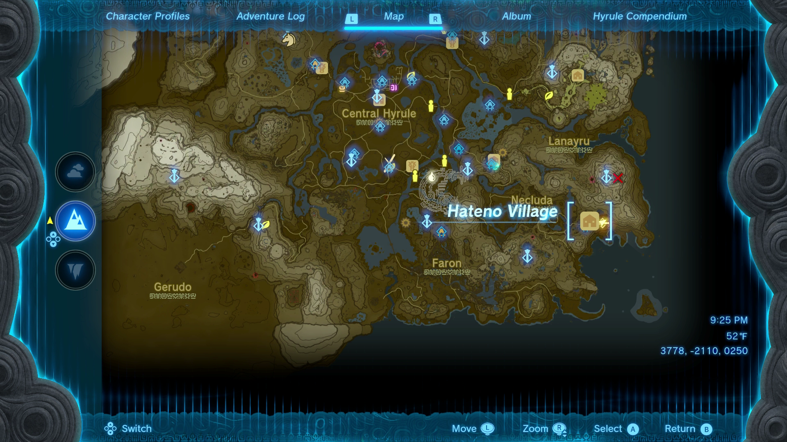
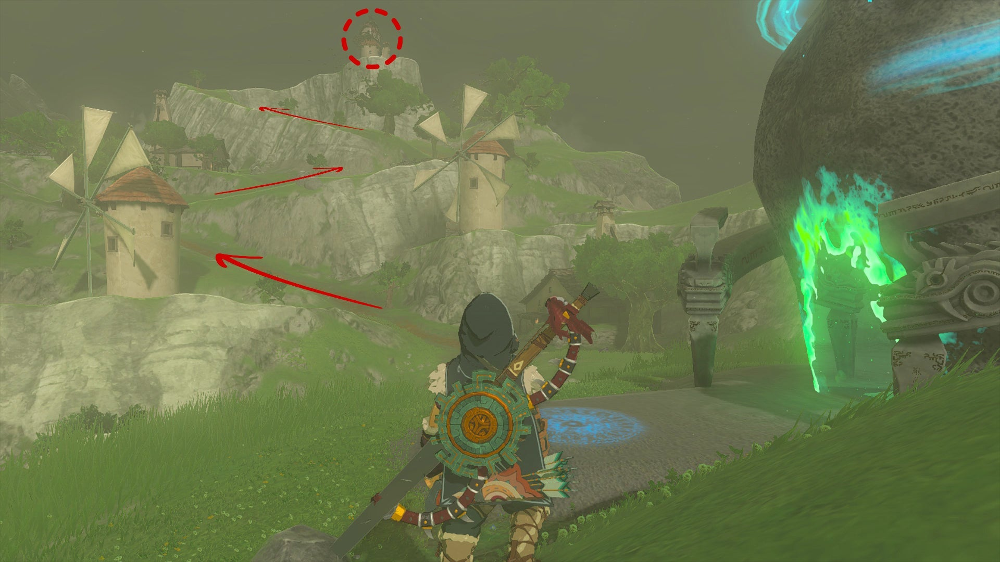
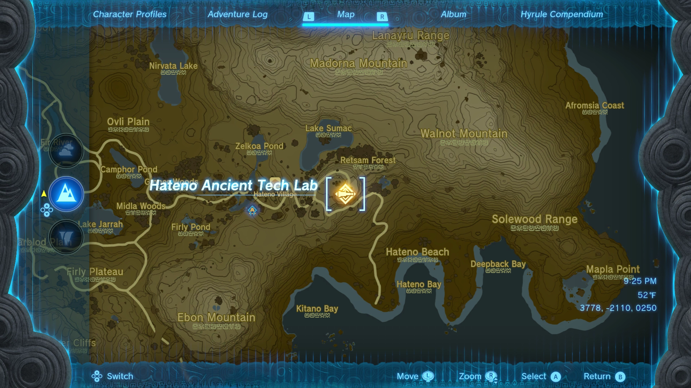
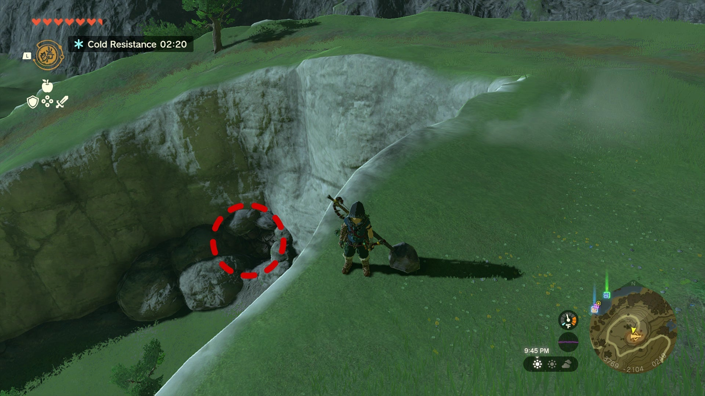

The Hateno Village Research Lab is a Side Adventure quest in The Legend of Zelda: Tears of the Kingdom. It is only available after completing certain depths-related main quest, and requires you to find the **Hateno Village location** in TotK. There, you'll find Robbie, who will continue to upgrade the Purah Pad to install the Shrine Sensor. 

**Prerequisite Quests** : Camera Work in the Depths and A Mystery in the Depths

## How to Unlock the Hateno Village Research Lab

When speaking to Robbie after starting the main story, he will tell you that as the main architect of the Purah Pad, there are many new upgrades that he can install for you, but will need to return to his lab. However, he will not leave until he finishes assisting Josha. 

To free him up, you will need to undertake Josha's Quest, Camera Work in the Depths (which requires the Paraglider), and take a picture of a strange statue in the Depths. 

After this, you will not be able to continue this questline until you have completed one of the main Regional Phenomena Quests to help out the Rito, Goron, Zora, or Gerudo settlements. Once you have completed at least one, return to speak to Josha to undertake A Mystery in the Depths, which will end with you fixing Robbie's hot air balloon. 

Speak to him after completing the quest to gain this new series of quests back at Hateno Village. 

## Hateno Village Location

Find Hateno Village in the southeast area of Hyrule in Necluda. It's south of the Mount Lanayru Skyview Tower. From Lookout Landing, follow the road that runs to the southeast until you encounter a bridge over the Hylia River. Then continue following the road east. Make sure to activate the Zanmik Shrine to enable fast travel to Hateno Village (at least until Robbie enables fast travel to the lab). 

From the Shrine, you can see the path to the Hateno Village Research Lab (the Hateno Ancient Tech Lab) if you look to the east. 

### Find the Shrine

After speaking to Robbie inside the lab as part of the Hateno Village Research Lab Side Adventure, he'll install the Shrine Sensor to your Purah Pad. 

It activated immediately. To finish the quest, head outside by following the signal and look down to your left. You'll see a pile of rocks, but it's actually breakable. 

Break the rocks and enter to find the Retsam Forest Cave. Inside, activate the Mayahisik Shrine and collect the Light of Blessing (or just head back after activating the shrine). Return to the Hateno Ancient Tech Lab and speak to Robbie to finish the quest. 

Hateno Village Research Lab

There are more Side Adventures to do after this quest. See the Purah Pad page for more details about the quests that add even more upgrades: 

  * Filling Out the Compendium
  * Presenting: The Travel Medallion
  * Presenting: Hero's Path Mode
  * Presenting: Sensor +!

See the complete List of Side Quests and Side Adventures

### Up Next: Filling Out the Compendium

Previous

List of Side Quests and Side Adventures

Next

Filling Out the Compendium

### Top Guide Sections

  * Walkthrough
  * Zelda: Tears of The Kingdom Switch 2 Edition Guide
  * Zelda Notes Voice Memories
  * List of Side Quests and Side Adventures

### Was this guide helpful?

Leave feedback

Go to comments