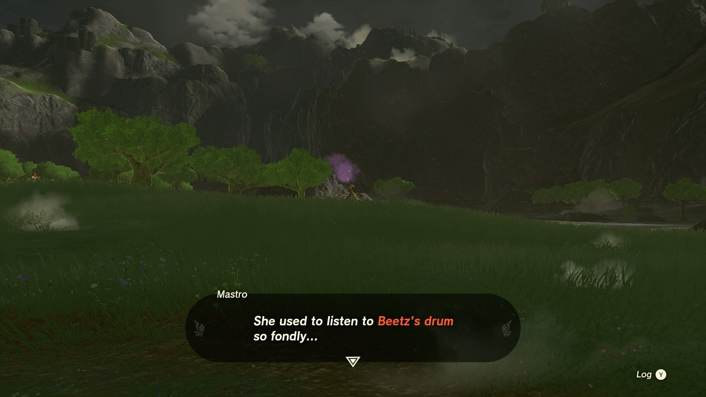
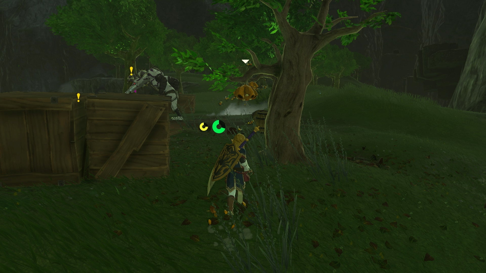

Honey, Bee Mine is one of the many Side Adventures Quests in The Legend of Zelda: Tears of the Kingdom. This adventure can only be undertaken at any time, but is required to complete one of the Great Fairy Quests - Serenade to Cotera over at the Dueling Peaks Stable. 

This quest involves finding a missing horn drummer Beetz, who really wants some honey to make some crepes, and is hiding near Kakariko Village in West Necluda. 

  * **Side Adventure Location:** West Necluda
  * **Prerequisites:** None
  * **Rewards:** 100 Rupees

## How to Find and Help Beetz

This quest can be found by accident when exploring, but is most easily found when undertaking the quest to coax the Great Fairy Cotera from her fountain, located in the southeast at Dueling Peaks Stable. 

However, when speaking to Mastro at the stable, you'll learn that the troupe's drummer, Beetz, is nowhere to be found, though some have reported the sound of drums near Kakariko Village to the north. Note that undertaking this quest from Mastro will prevent him from appearing at any other stable until you finish this one. 

Sure enough, if you head up the winding path to Kakariko Village, you can spot a Gerudo traveler who will mention hearing drums. Close by, there is a somewhat hidden alcove off to the right as the road curves into a canyon towards Kakariko Village (Where Hestu’s Maracas were in Breath of the Wild). 

Beetz can be found in a tent on the other side of the rock alcove, but he won't leave just yet. He requires 3 Courser Bee Honey before he’ll return to the stable — which you hopefully still have for rescuing the horn player). If you don't have them, there are a few places to check close by: 

  * Search the woods behind the Great Fairy Cotera by a Moblin Camp
  * Check the valley behind Kakariko Village near a large chasm entrance.

When you give him the honey, he'll reward you with 100 Rupees for your effort, and head back to join the troupe to help awaken the great fairy. 

Honey, Bee Mine

See the complete List of Side Quests and Side Adventures

### Up Next: The Hornist's Dramatic Escape

Previous

The Flute Player's Plan

Next

The Hornist's Dramatic Escape

### Top Guide Sections

  * Walkthrough
  * Zelda: Tears of The Kingdom Switch 2 Edition Guide
  * Zelda Notes Voice Memories
  * List of Side Quests and Side Adventures

### Was this guide helpful?

Leave feedback

Go to comments