**Infiltrating the Yiga Clan** is one of the many Side Adventures in The Legend of Zelda: Tears of the Kingdom. This side quest is a long and expansive one that will have you traveling to every corner of Hyrule to claim the Yiga Armor Set in order to get into the Yiga Clan Hideout, which offers multiple perks and rewards while disguised as a member of the Yiga Clan, including how to get the Earthwake Technique and **Thunder Helm**. This guide has been tested by IGN and confirmed to work for all versions of TOTK, including the Tears of the Kingdom Switch 2 Edition released in 2025. 

## How to Find the Yiga Clan Hideout

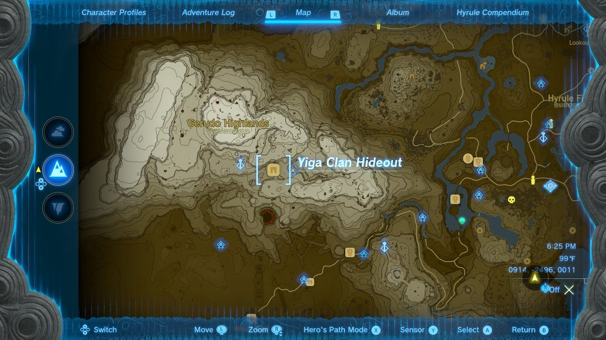

While it's not required to begin collecting the Yiga Armor Set, you can officially start the quest by trying to access the Yiga Clan Hideout. Their base of operations is actually in the same place it was in Breath of the Wild - far north of Gerudo Town in a large canyon leading to the Gerudo Highlands. 

Though it can be reached earlier, you'll have a much easier time doing this quest after completing the Regional Phenomena in the Gerudo region, as giant never-ending sandshroud storms make it extremely hard to navigate the desert. 

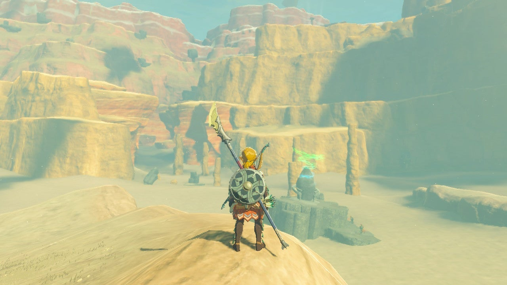

You'll know you're on the right track when you reach the Kudanisar Shrine at the mouth of the canyon, surrounded by moving quicksand and Construct Soldiers. 

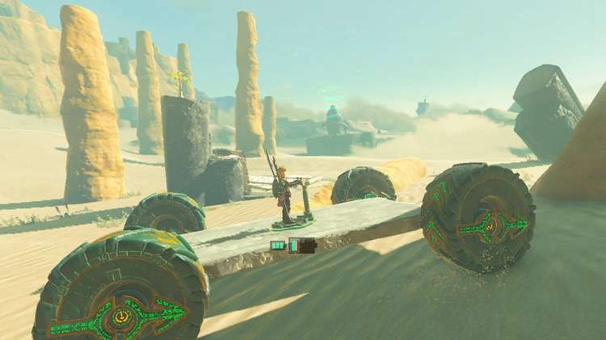

The base is high up in the canyon pass, but luckily there are Zonaite Devices near the shrine you can use to build a 4-wheeler to drive up and avoid any boulders that roll down the sloping canyon. 

Be sure to also watch out for a lone mushroom-clad traveler who is an assassin in disguise, as talking to them will trigger an ambush. 

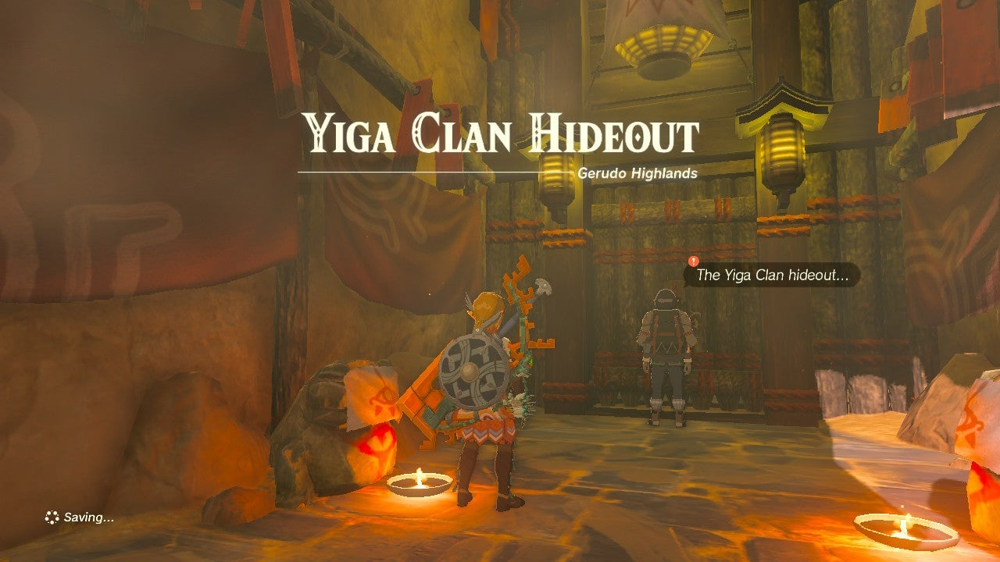

When you reach the very top of the sloping canyon in the Gerudo Highlands, you'll find a man named Mimos trying to gain entry -- unsuccessfully. He'll be told at the door that only a true Yiga can enter, and to prove yourself, you'll need to assemble all three pieces of the Yiga Armor Set at their branch hideouts. 

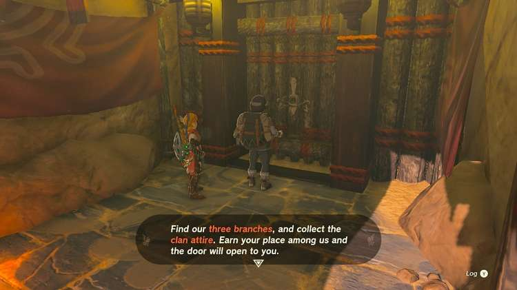

Luckily, Mimos will mumble about one such location, giving you somewhere to start your search if you haven't found one already. 

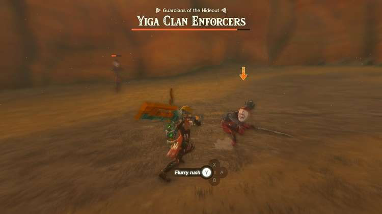  
Be warned - try to talk your way through the front door without a disguise will trigger a fight against three Yiga! 

## Where to Find the Yiga Chest Piece

The first clue Mimos mentions is that one of the branches may be in Akkala at the old tech lab, located far in the northeast corner of Hyrule. It's a long trek from the desert, so you'll want to take the roads north of Hyrule Castle to Woodland Stable in Eldin Canyon, then head east and up past the Great Lanayru Spring and up the ridge into Akkala, taking a right when you reach a bridge guarded by monsters to travel along the coast up past the East Akkala Stable, and finally to the Ancient Akkala Tech Lab. 

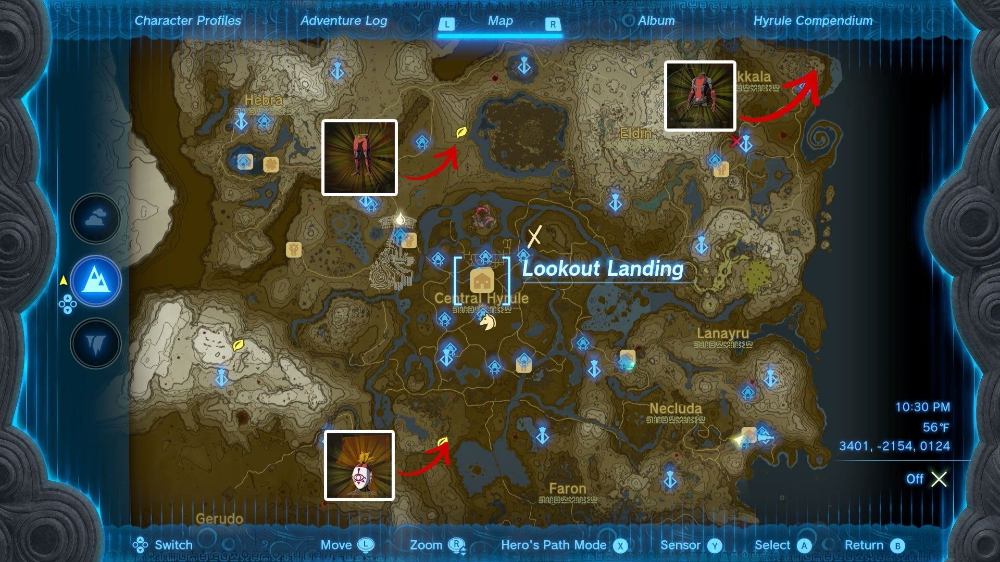

You'll know you're in the right spot when you spot the Yiga iconography, vandalized frog statues, and the giant telescope on top of the hill. 

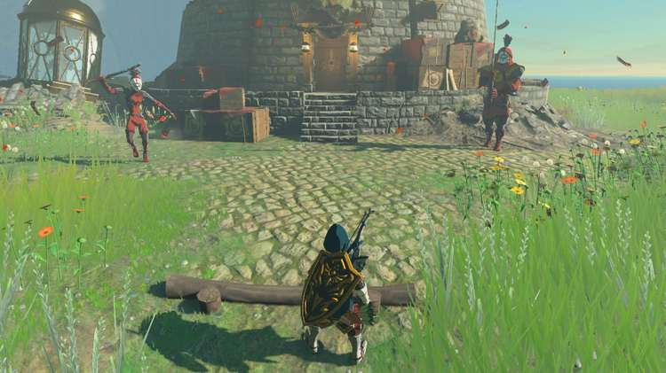

Attempt to enter the place, and the Yiga will head outside to fight you - which will play out the same in each location: A Yiga Footsoldier, and a Yiga Blademaster. 

They can be a pain to deal with, and hit very hard if you're still early in the game, so be sure to constantly be moving to avoid getting hit. When you spot one of them disappear, look for a red glow to see where they will emerge, and dash over to strike them as they do. 

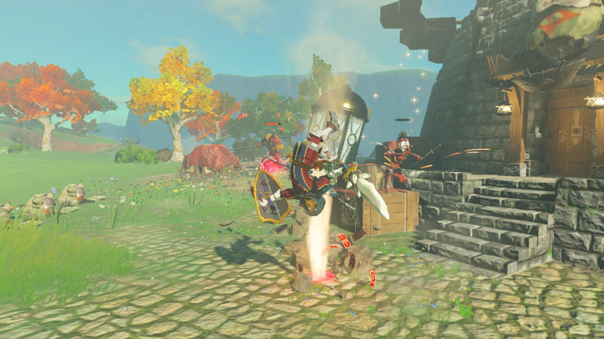

Be sure to also keep one eye on the Blademaster -- if you see him slam his fist into the ground to create a fissure, it will move towards you and cause a gust of air to appear, and you can use it to escape the rock explosion that follows, and get some free headshots while pulling out your bow. 

Once both enemies are defeated, enter to talk to the kidnapped clothier who will present you with the Yiga Chest Piece as thanks. 

Be sure to also look around and grab the Travel Medallion Prototype if you haven't done Robbie's quest yet, and check the map nearby that marks the location of the other two branch hideouts. 

## Where to Find the Yiga Tights

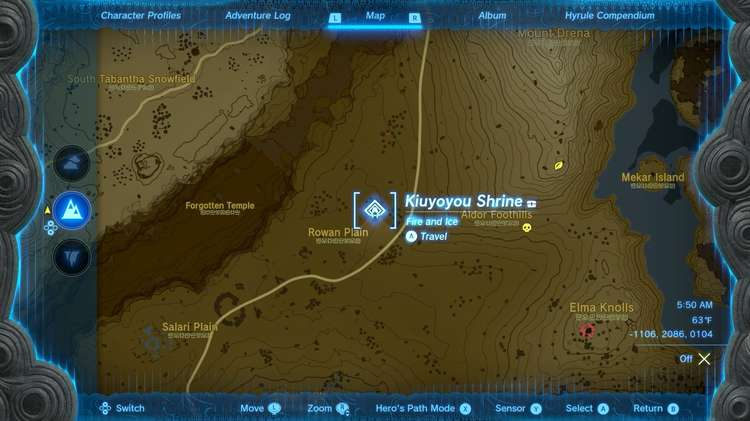

Your next location to track down will be to get the Yiga Tights legwear. It will be in a cave just west of the Great Hyrule Forest, at the southern base of Mount Drena. You can find it not far east of where the Serenne Stable used to be, and close to the Kiuyoyou Shrine that leads up towards Snowfield Stable. 

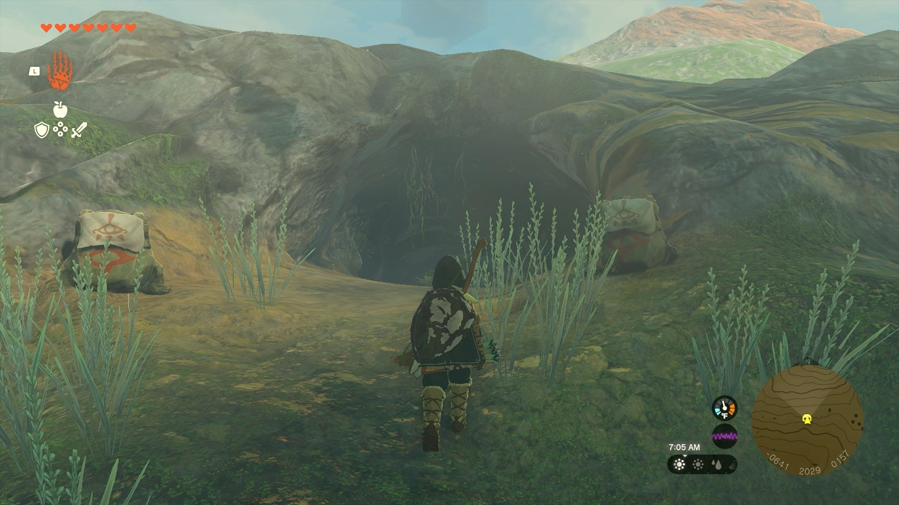

Search the sloping hills below the mountain for more signs of frog statues, and you should be able to spot an outcropping of rocks along the hills that hides a cave. 

Like the other location, you'll happen upon two Yiga fighters that need to be defeated. Use the same tactics to rush them when they teleport, and keep above them when fissures appear to get headshots in. 

Unlike the Ancient Akkala Tech Lab, the prisoner is nowhere to be seen in the cave, but if you look around, you can find a note left behind that mentions “Remember – follow the eyes of the frogs”. 

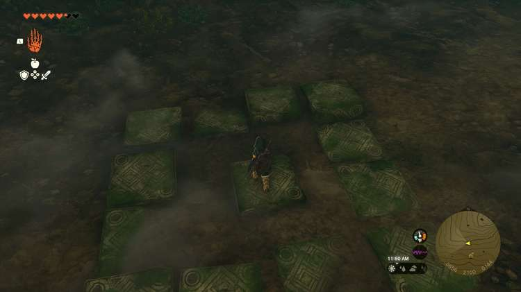

Return to the starting chamber where you fought the Yiga clan members and look for a set of square rock tablets on the ground just behind the main altar. The tablets will be in a big square formation and you’ll notice they have the frog eyes we’re looking for. From here, turn on your Ascend ability and use it to climb up through the hole in the roof. The Yiga Tights and the kidnapped clothier will be in that room. 

## Where to Find the Yiga Mask

The final Yiga armor location might be the most dangerous, as its surrounded by high level Black Bokoblins and Black Boss Bokoblins. The Yiga are actually squatting in the Old Man's House back on the Great Plateau that you may remember from Breath of the Wild, located below the old Temple of Time in the south part of Central Hyrule. 

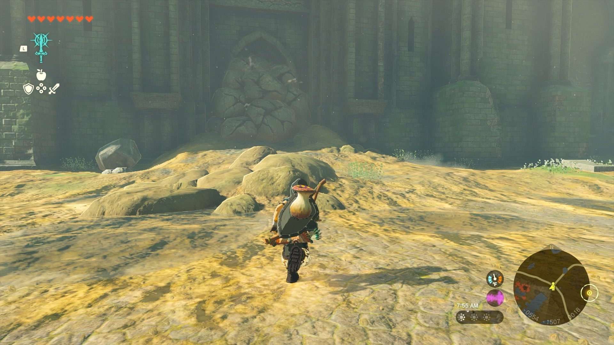

To get back up to the plateau, you can either skydive over from the Hyrule Field Skyview Tower, or look along the northern base of the Great Plateau for a pile of rubble with water bursting at the seams. Exploding it will cause a lake to drain, creating a sloping path up into the plateau. 

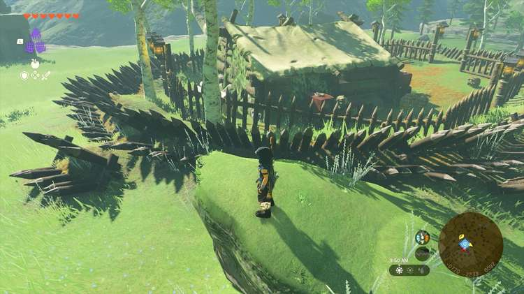

When you reach the southeastern side of the plateau, you can spot the Old Man's House is now covered in spiky fencing on all sides. To reach, either find a nearby high boulder to jump from, or cut down some trees, or use other Zonai Devices to build a makeshift path over the spikes. 

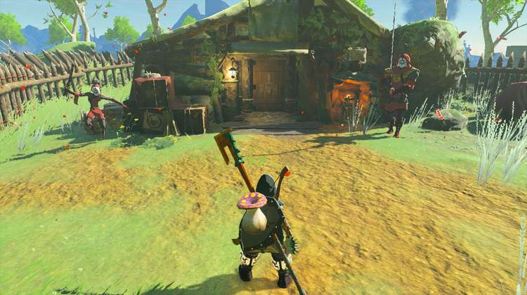

Alerting the Yiga here, you won't have much room to manuever, so be careful and avoid getting too close to the sides or you'll take even more damage. 

Once defeated, check inside the house to find the final Clothier and the Yiga Mask, which will complete the set. 

# The Yiga Hideout - Features and Rewards

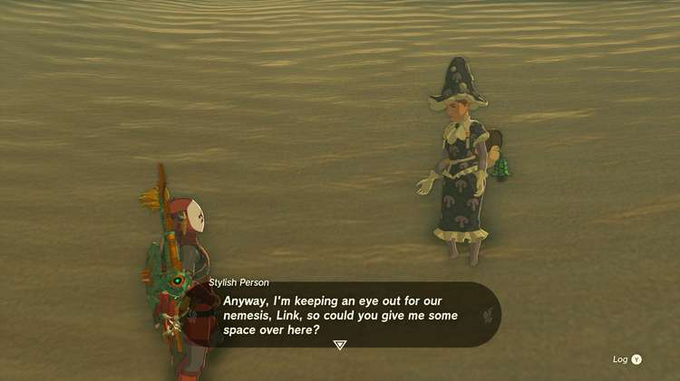

With the full Yiga Armor Set at your disposal, equip it and you'll be able to blend in among other Yiga assassins. This means any strangers or travelers you happen upon in your travels won't try to kill you -- if you have the full costume equipped beforehand. 

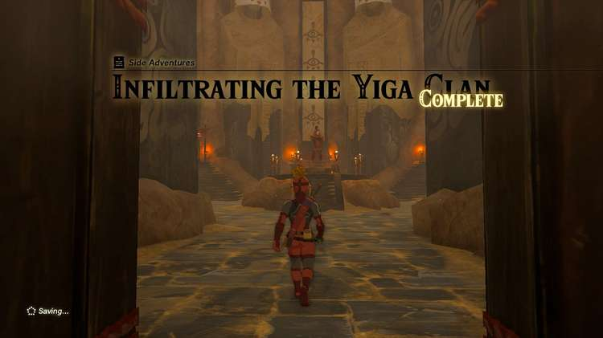

You can now return to the Yiga Hideout in the Gerudo Highlands, and when speaking at the door, they'll let you enter. While the quest is technically complete, there's a lot to do inside while you have the costume on - including shops, secrets, Zonai vehicles, and challenges with special rewards: 

  * Main Hall Shops
  * Vehicle Development
  * Training Room
  * Hideout Chasm

## Main Hall Shops

Entering the Yiga Clan Hideout Main Hall, you'll find a Blademaster who welcomes you, but won't say much more. Each of the alcoves around you offers different services, inlcuding buying rare items you may not find anywhere else: 

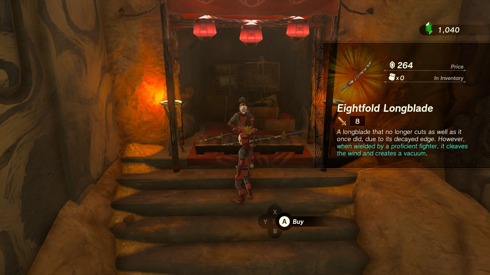

  * The first alcove on the left has a merchant who sells Yiga weapons, namely the Eightfold Blade (for 110 Rupees), and the Eightfold Longblade (for 264). Though rather pricey, it's one of the few places you can actually buy a weapon, and their effects aren't bad.

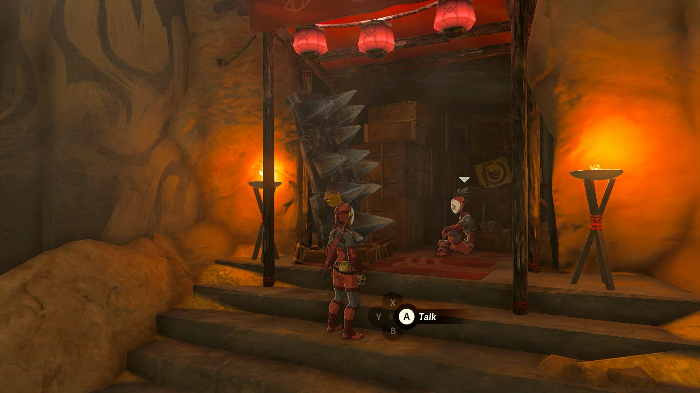

  * The next alcove has a guy selling a Spike Wall. It can't be carried in your inventory, and exists only for fusing (or Ultrahanding to a vehicle). He won't let you grab it until you pay 100 Rupees, and it can be pretty useful to give your shield some offensive capabilities. You can also sell things to him to build up your rupee reserves.

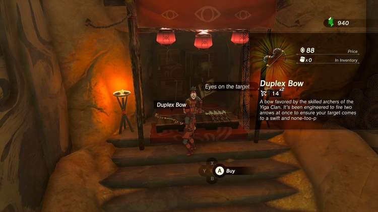

  * The alcove beyond has another merchant, a bowyer dealing in the Yiga-exclusive Duplex Bow (for 88 Rupees), as well as bundles of 10 Arrows at 35 Rupees each.

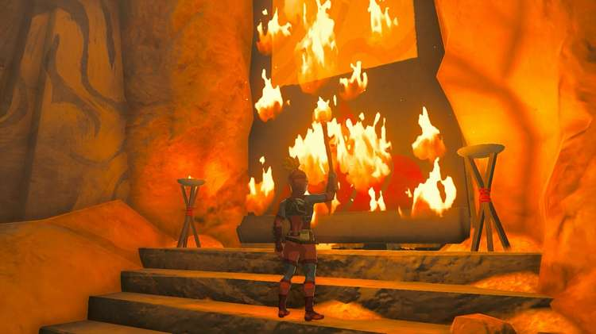

  * The alcove beyond has a large curtain over it with a fire symbol, so obviously they won't mind if you burn it down -- and there's a spare torch over by the Blademaster in the center. Do so, and you'll find a few barrels with materials, and a chest containing an buffed Eightfold Blade with increased durability.

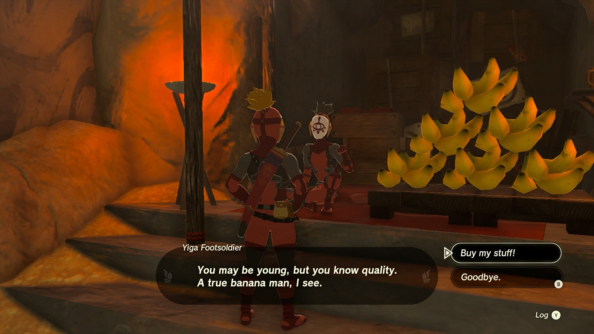

  * Beyond the corridor and empty alcove, the only other alcove has another Yiga selling Mighty Bananas at 20 Rupees per, and you can also sell him your goods as well.

## Vehicle Development Room

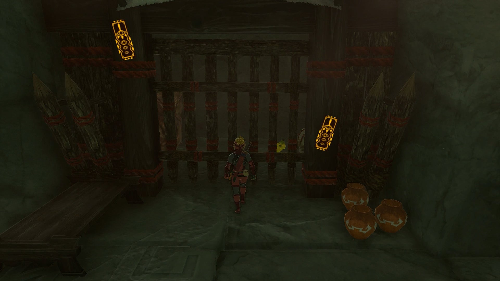

The large room beyond the main hall is home to two vehicle development projects on opposite sides of the room. You can also spot a sealed gate with a chest and Mighty Banana on the other side. 

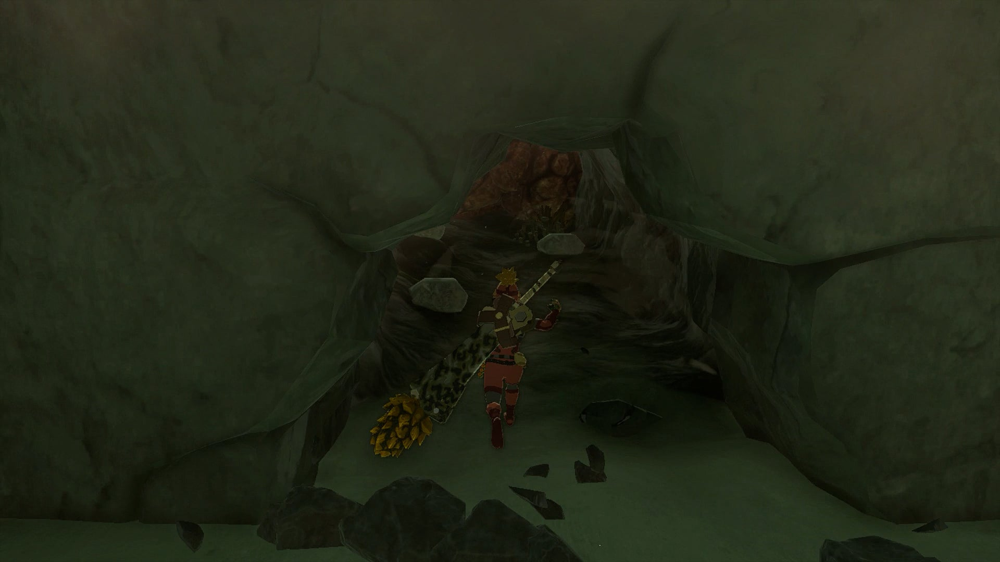

To reach it, head to the back of the room and look for a small crevice in the wall you can break to find a hole. There's a lot of rubble you'll need to break through, requiring a few hammer weapons to break through it all. 

Once you reach the chamber at the far side, you can open the chest to get a Sneaky Elixir. 

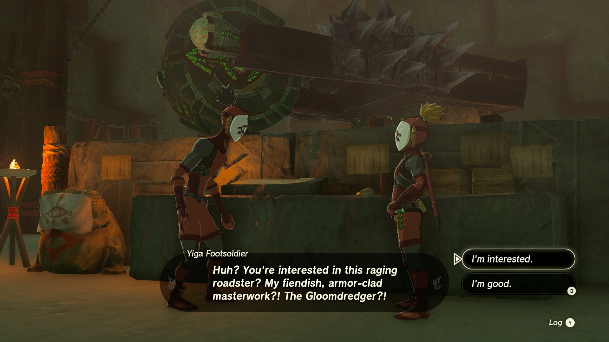

As for the two vehicles in development, the first one under construction is called the Gloomdredger, a three-wheel cart covered in spikes that promises great stability on most terrains, and can clear away anyone who gest close. However, you'll have to pay up to the tune of 999 Rupees if you want to take it for a ride. If you agree, he'll move it outside for you to play with -- but there is an alternative. 

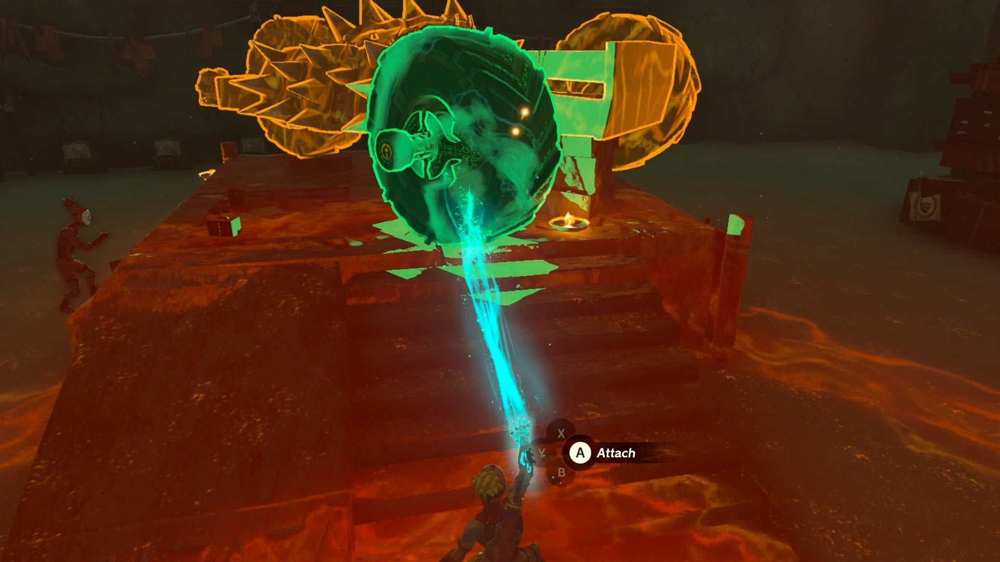

Since the vehicle is missing one of the wheels on the construction platform, you can attach it yourself (and get scolded for doing so). However, if you have the Autobuild Ability claimed by completing A Mystery in the Depths, attaching the vehicle will register it in your history, allowing you to build it on your own if you have the Zonaite. 

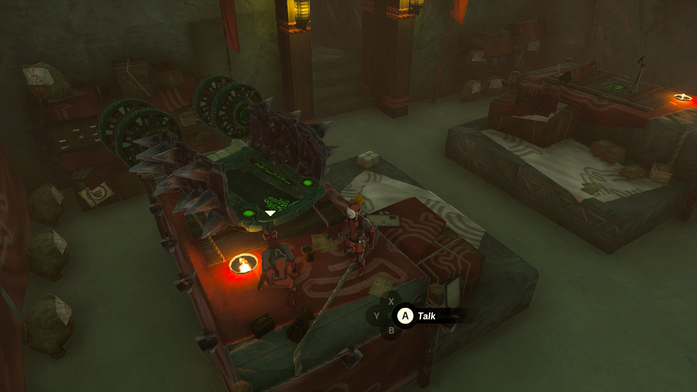

The second vehicle is called the Hoverdoom MK3, and is a sled that is boosted by multiple fans (as well as spikes), and is best used on sandy terrain. It'll cost 99 Rupees to get the real deal delivered outside, or you can once again use Ultrahand on the steering stick nearby to add it to your recent autobuilds. 

## Training Room - How to Get the Earthwake Technique and Thunder Helm

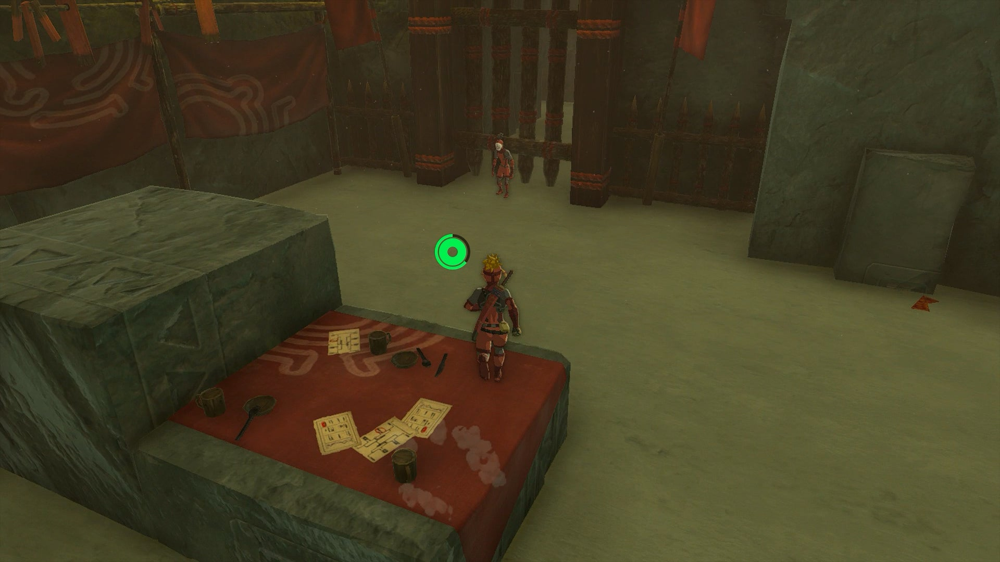

After passing through the Vehicle Bay, you'll find a large open training room with plenty of block obstacles and tight passageways. Over on the right, another Yiga Footsoldier won't let you pass to the back until you pass some training yourself. 

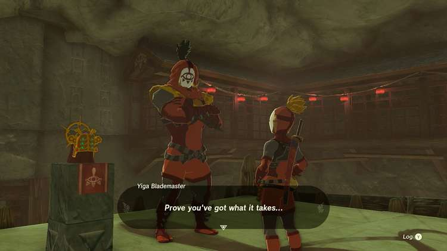

Climb up a ladder on the far left side of the room to reach the rafters where a Yiga Blademaster waits by a special prize - The Thunder Helm. It appears they've managed to reverse-engineer their own version, and it's one of several prizes you can in for a training challenge. 

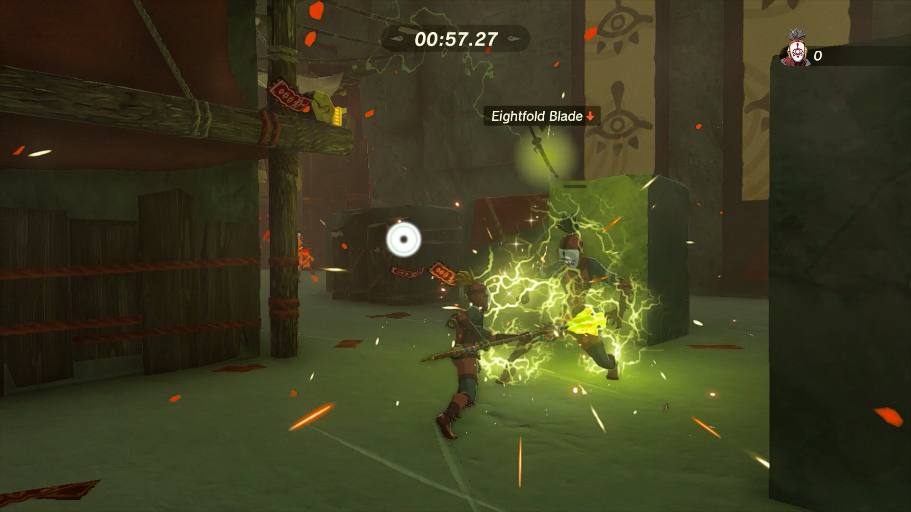

The challenge involves taking down Yiga Footsoldiers in under a minute. They will begin appearing all around the arena, and if you defeat the required number, you'll earn a reward. The key to the fight is being fast and aggressive, as well as finding a good powerful weapons to take them down with. Look for the glowing embers that note where the Yiga will appear, and rush them as soon as they teleport to take them out quick. 

It will cost 100 rupees for each attempt, but the first one will be free. There are three main challenges, and each will have its own reward: 

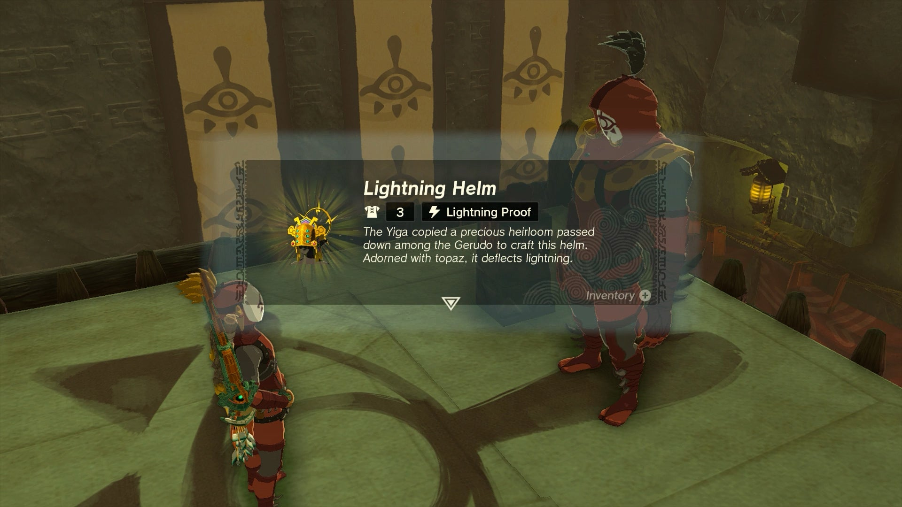

  * Defeating just 3 Yiga Footsoldiers will award you with the Yiga Paraglider Fabric.
  * Defeat 6 Yiga Footsoldiers, and you can learn the Yiga Earthwake Technique.
  * Defeat a total of 9 Yiga Footsoldiers, and the **Thunder Helm** is yours to own!

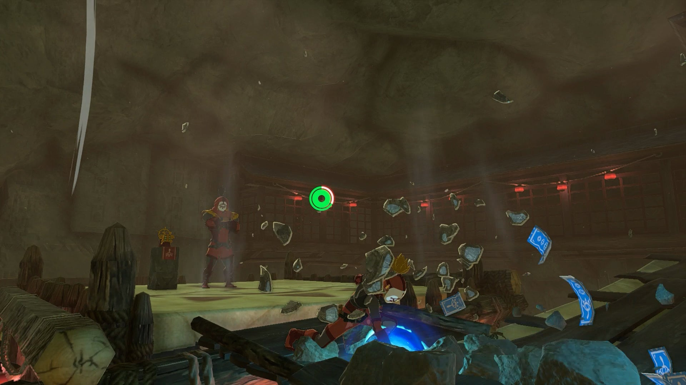

The Earthwake technique is a special unarmed attack you have probably seen the Yiga Blademasters use on you. If you have no weapons equipped, you can hold the attack button to charge the power up, sending a fissure out in front of you in a quick line. By releasing the attack button, you can cause a giant rock explosion when it reaches the target. While it doesn't do a huge amount of damage, it is the one surefire way to deal damage when you need a way to fight unarmed or wish to conserve weapon durability! 

## Hideout Chasm

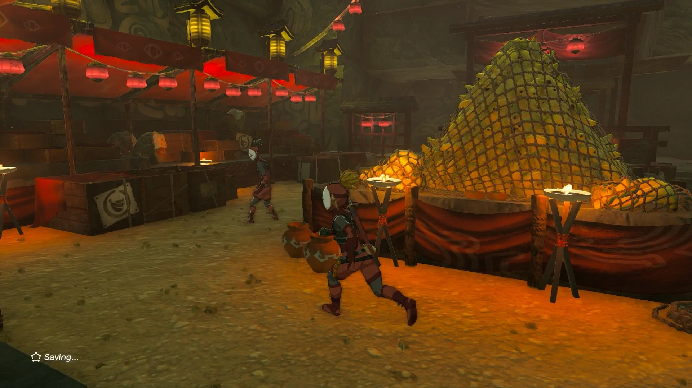

By proving your worth in the Training Room, the Yiga Footsoldier by the exit will open the gate for you. There's one last room at the back where Yiga area gathering supplies to move to their base in the Depths. 

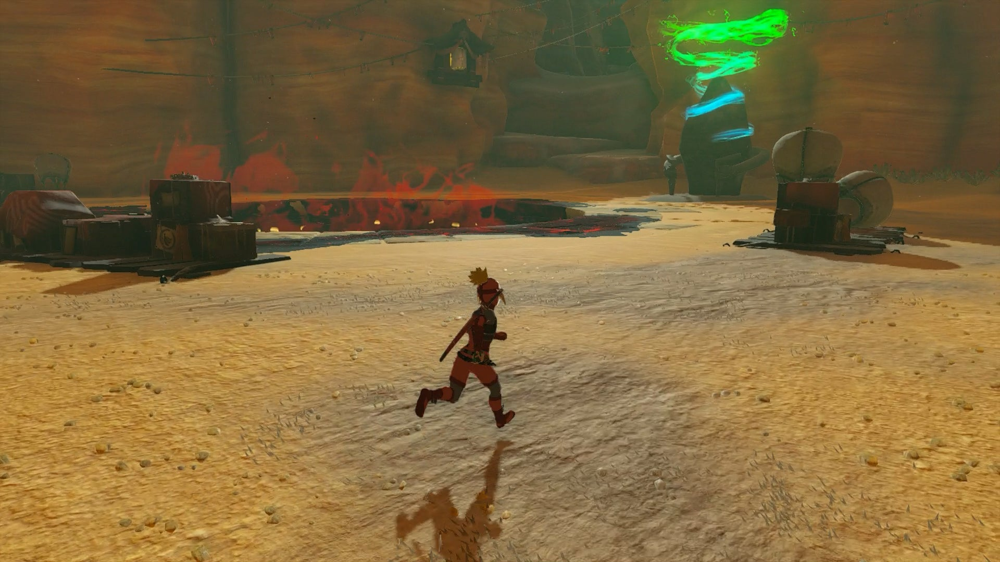

Outside, you can find the same arena where you fought Khoga in Breath of the Wild. The pit you sent him into is now a Chasm straight to the depths. On the other side of the chasm, you can also find the Rotsumamu Shrine. 

Be sure to dive down once you activate the fast travel spot to explore the Depths around their chasm, as there is a Yiga Base over to the east that has a Yiga Schematic you can steal. 

Infiltrating the Yiga Clan

Check out these pages for other adventures with the Yiga Clan! 

  * List of Side Quests and Side Adventures
  * All Yiga Schematic Locations
  * All Shrine Locations and Solutions
  * The Yiga Clan Exam
  * The Depths Guide and Overview

### Up Next: The Yiga Clan Exam

Previous

A Call from the Depths

Next

The Yiga Clan Exam

### Top Guide Sections

  * Walkthrough
  * Zelda: Tears of The Kingdom Switch 2 Edition Guide
  * Zelda Notes Voice Memories
  * List of Side Quests and Side Adventures

### Was this guide helpful?

Leave feedback

Go to comments