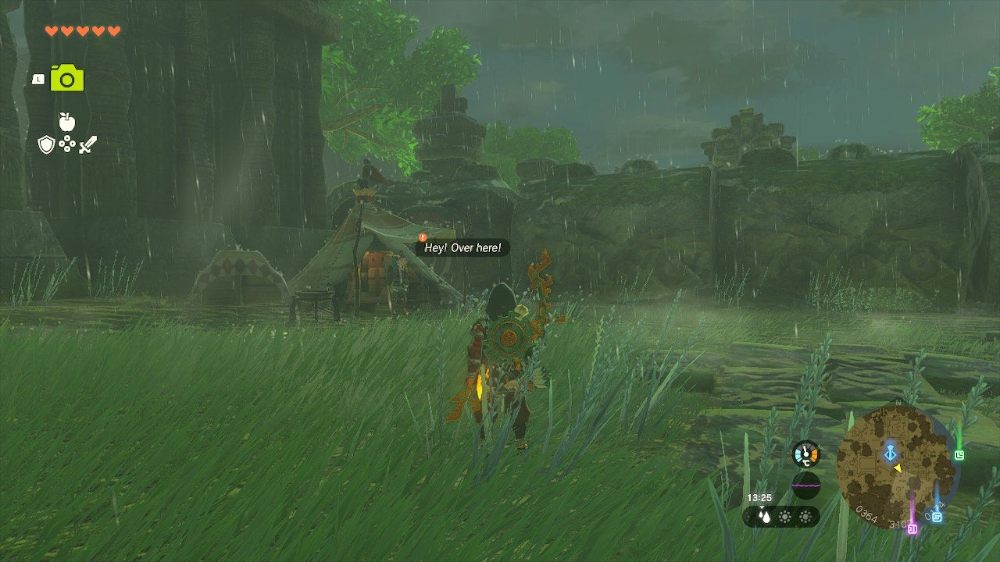
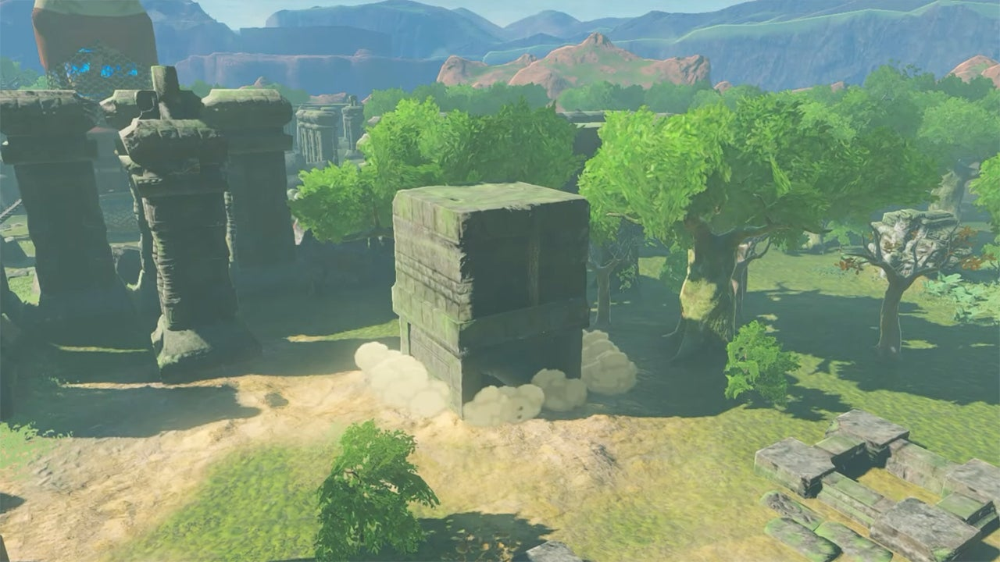

If you want to learn more about Hyrule's mysterious Thyphlo Ruins and earn some valuable rewards while you're at it, don't miss the **Investigate the Thyphlo Ruins** side adventure in the northern part of the Great Hyrule Forest. 

Beware that you need all four **special powers** (Tulin's power, Yunobo's power, etc.) from the Regional Phenomena main quests to complete this side adventure. 

## Investigate the Thyphlo Ruins Walkthrough

To start this side adventure, speak to the researcher named **Kazul**. You'll find him in a small tent just south of the Thyphlo Ruins Skyview Tower. Next to Kazul's tent, you'll see four **monoliths** (only if you've completed the Regional Phenomena quests!), each with its own riddle. 

Read the riddles to start an individual side adventure, one per monolith. Once you've completed these side adventures, you'll be able to complete the Investigate the Thyphlo Ruins quest. Here's a walkthrough for each Thyphlo Ruins sub-quest: 

  * The Owl Protected by Dragons
  * The Corridor between Two Dragons
  * The Six Dragons
  * The Long Dragon

Finished all four quests? East of the Thyphlo Ruins Skyview Tower, a new building will automatically spawn upon completing the final sub-quest. Enter this building and open the treasure chest inside to receive a **Dusk Claymore**. You will also find another monolith; read it to complete the Investigate the Thyphlo Ruins side adventure and receive the following rewards: 

  * Large Zonai Charge
  * Big Battery
  * Diamond

Investigate the Thyphlo Ruins

See the complete List of Side Quests and Side Adventures

### Up Next: The Owl Protected by Dragons

Previous

A Monstrous Collection V

Next

The Owl Protected by Dragons

### Top Guide Sections

  * Walkthrough
  * Zelda: Tears of The Kingdom Switch 2 Edition Guide
  * Zelda Notes Voice Memories
  * List of Side Quests and Side Adventures

### Was this guide helpful?

Leave feedback

Go to comments