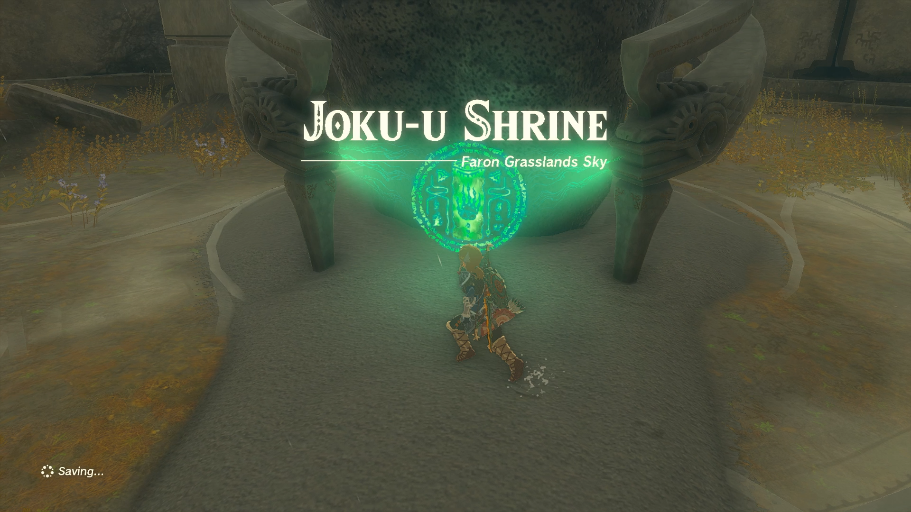

Related to Side Quests, there are also Shrine Quests required to unlock shrines. Some are short, some are required to even see a shrine! You can see all shrine locations and walkthroughs in our shrine guide, or keep track of the 31 Shrine Quests you'll need to complete here. 

## List of TOTK Shrine Quests

This list of Tears of the Kingdom Shrine Quests is ordered by the way in which they appear in the Adventure Log in the pause menu. Click on a section below to go to the full guide and walkthrough for each Shrine Quest. 

Shrine Quest Name  
Shrine Name  
Starting Settlement / Region  
Quest Giver

The Satori Mountain Crystal  
Usazum Shrine  
Hyrule Ridge  
Mysterious Voice

The White Bird's Guidance  
Wao-os Shrine  
Rito Village  
Laissa

The Gisa Crater Crystal  
Ikatak Shrine  
Tabantha Frontier  
Mysterious Voice

The North Hebra Mountains Crystal  
Sisuran Shrine  
Hebra  
Mysterious Voice

The Northwest Hebra Cave Crystal  
Rutafu-um Shrine  
Hebra  
Mysterious Voice

A Pretty Stone and Five Golden Apples  
Pupunke Shrine  
Great Hyrule Forest  
Damia

None Shall Pass  
Sakunbomar Shrine  
Great Hyrule Forest  
Zooki

Maca's Special Place  
Ninjis Shrine  
Great Hyrule Forest  
Maca

The Death Caldera Crystal  
Momosik Shrine  
Death Mountain  
Mysterious Voice

The Lake Intenoch Cave Crystal  
Moshapin Shrine  
Eldin Canyon  
Mysterious Voice

Rock for Sale  
Jochi-ihiga Shrine  
Akkala - Tarrey Town  
Hagie

Dyeing to Find It  
Kurakat Shrine  
Lanayru Great Spring  
Steward Construct

The High Spring and the Light Rings  
Zakusu Shrine  
Mount Lanayru  
Nazbi

The Lanayru Road Crystal  
O-ogim Shrine  
East Necluda - Lanayru Promenade  
Mysterious Voice

The Ralis Channel Crystal  
Joniu Shrine  
Lanayru Great Spring  
Mysterious Voice

Keys Born of Water  
Jochisiu Shrine  
West Necluda  
Steward Construct

The Oakle's Navel Cave Crystal  
Tokiy Shrine  
East Necluda  
Mysterious Voice

Ride the Giant Horse  
Ishokin Shrine  
Faron  
Baddek

The Lake Hylia Crystal  
En-oma Shrine  
Lake Hylia  
Mysterious Voice

Legend of the Soaring Spear  
Utojis Shrine  
East Necluda  
Tattered Notebook

The Gerudo Canyon Crystal  
Rakakudaj Shrine  
Gerudo Canyon  
Mysterious Voice

The North Hyrule Sky Crystal  
Mayam Shrine  
North Hyrule Sky Archipelago  
Mysterious Voice

The South Hyrule Sky Crystal  
Jinodok Shrine  
South Hyrule Sky Archipelago  
Mysterious Voice

The Tabantha Sky Crystal  
Ganos Shrine  
Tabantha Sky Archipelago  
Mysterious Voice

The East Hebra Sky Crystal  
Tauninoud Shrine  
East Hebra Sky Archipelago  
Mysterious Voice

The Sky Mine Crystal  
Gikaku Shrine  
Akkala Sky  
Mysterious Voice

The Sokkala Sky Crystal  
Natak Shrine  
Sokkala Sky Archipelago  
Mysterious Voice

The South Lanayru Sky Crystal  
Mayanas Shrine  
South Lanayru Sky Archipelago  
Mysterious Voice

The North Necluda Sky Crystal  
Josiu Shrine  
North Necluda Sky Archipelago  
Mysterious Voice

The West Necluda Sky Crystal  
Ukoojisi Shrine  
West Necluda Sky Archipelago  
Mysterious Voice

The Necluda Sky Crystal  
Kumamayn Shrine  
Necluda Sky Archipelago  
Mysterious Voice

## Shrine Quests Checklist

Your in-game Tears of the Kingdom Adventure Log lists the Shrine Quests in the following order. You can use the in-game list and the checklist tool to compare lists and see what Shrine Quests in TOTK you are missing. 

The Satori Mountain Crystal

See: The Satori Mountain Crystal and Usazum Shrine Shrine Location and Guide

The White Bird's Guidance

See: The White Bird's Guidance and Wao-os Shrine Shrine Location and Guide

The Gisa Crater Crystal

See: The Gisa Crater Crystal and Ikatak Shrine Shrine Location and Guide

The North Hebra Mountains Crystal

See: The North Hebra Mountains Crystal and Sisuran Shrine Shrine Location and Guide

The Northwest Hebra Cave Crystal

See: The Northwest Hebra Cave Crystal and Rutafu-um Shrine Shrine Location and Guide

A Pretty Stone and Five Golden Apples

See: A Pretty Stone and Five Golden Apples and Pupunke Shrine Location and Guide|

None Shall Pass

See: None Shall Pass and Sakunbomar Shrine Location and Guide

Maca's Special Place

See: Maca's Special Place and Ninjis Shrine Location and Guide|

The Death Caldera Crystal

See: The Death Caldera Crystal and Momosik Shrine Shrine Location and Guide

The Lake Intenoch Cave Crystal

See: The Lake Intenoch Cave Crystal and Moshapin Shrine Shrine Location and Guide

Rock for Sale

See: Rock for Sale and Jochi-ihiga Shrine Shrine Location and Guide

Dyeing to Find It

See: Dyeing to Find It and Kurakat Shrine Shrine Location and Guide

The High Spring and the Light Rings

See: The High Spring and the Light Rings and Zakusu Shrine Shrine Location and Guide

The Lanayru Road Crystal

See: The Lanayru Road Crystal and O-ogim Shrine Shrine Location and Guide

The Ralis Channel Crystal

See: The Ralis Channel Crystal and Joniu Shrine Shrine Location and Guide

Keys Born of Water

See: Keys Born of Water and Jochisiu Shrine Shrine Location and Guide

The Oakle's Navel Cave Crystal

See: The Oakle's Navel Cave Crystal and Tokiy Shrine Shrine Location and Guide

Ride the Giant Horse

See: Ride the Giant Horse and Ishokin Shrine Shrine Location and Guide

The Lake Hylia Crystal

See: The Lake Hylia Crystal and En-oma Shrine Shrine Location and Guide

Legend of the Soaring Spear

See: Legend of the Soaring Spear and Utojis Shrine Shrine Location and Guide

The Gerudo Canyon Crystal

See: **The Gerudo Canyon Crystal and Rakakudaj Shrine Shrine Location and Guide**

The North Hyrule Sky Crystal

See: The North Hyrule Sky Crystal and Mayam Shrine Shrine Location and Guide

The South Hyrule Sky Crystal

See: The South Hyrule Sky Crystal and Jinodok Shrine Shrine Location and Guide

The Tabantha Sky Crystal

See: The Tabantha Sky Crystal and Ganos Shrine Shrine Location and Guide

The East Hebra Sky Crystal

See: The East Hebra Sky Crystal and Tauninoud Shrine Shrine Location and Guide

The Sky Mine Crystal

See: The Sky Mine Crystal and Gikaku Shrine Shrine Location and Guide

The Sokkala Sky Crystal

See: The Sokkala Sky Crystal and Natak Shrine Shrine Location and Guide

The South Lanayru Sky Crystal

See: The South Lanayru Sky Crystal and Mayanas Shrine Shrine Location and Guide

The North Necluda Sky Crystal

See: The North Necluda Sky Crystal and Josiu Shrine Shrine Location and Guide

The West Necluda Sky Crystal

See: The West Necluda Sky Crystal and Ukoojisi Shrine Shrine Location and Guide

The Necluda Sky Crystal

See: The Necluda Sky Crystal and Kumamayn Shrine Shrine Location and Guide

### Up Next: The Satori Mountain Crystal

Previous

All Shrine Locations and Solutions

Next

The Satori Mountain Crystal

### Top Guide Sections

  * Walkthrough
  * Zelda: Tears of The Kingdom Switch 2 Edition Guide
  * Zelda Notes Voice Memories
  * List of Side Quests and Side Adventures

### Was this guide helpful?

Leave feedback

### In This Guide

The Legend of Zelda: Tears of the KingdomNintendo EPD

Initial Release: May 12, 2023

Learn more

Go to comments