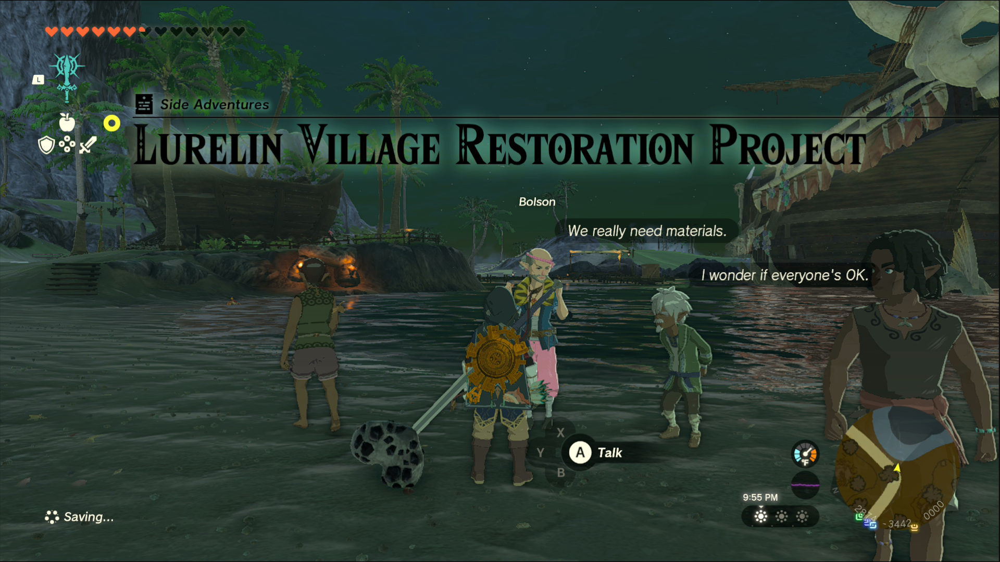
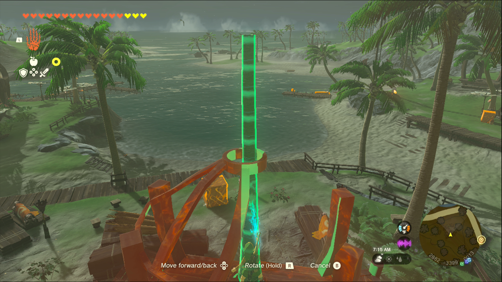
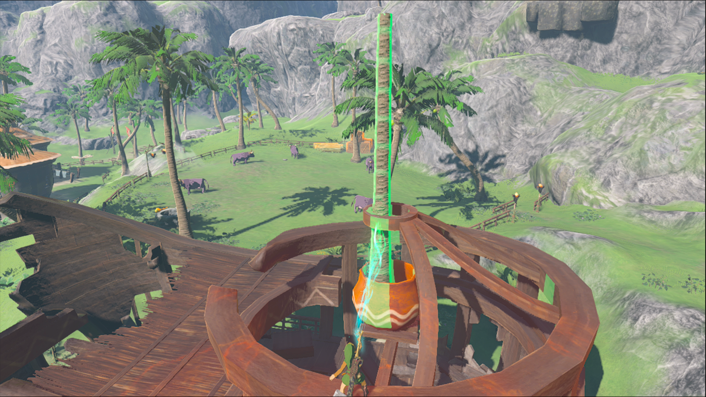
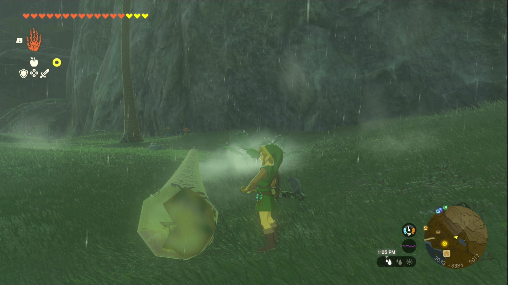
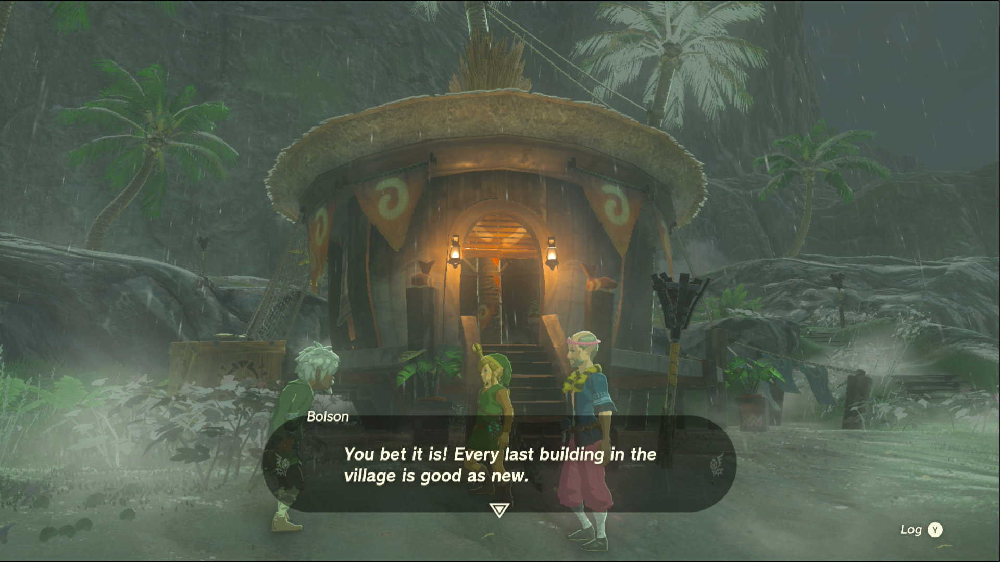

Lurelin Village Restoration Project is a Side Adventure in The Legend of Zelda: Tears of the Kingdom in which you rebuild Lurelin Village to make it suitable for the villagers to live in. Side Adventures are usually longer side quests that often tell a story. 

## Lurelin Village Restoration Project

To start the Side Adventure “Lurelin Village Restoration Project” you first need to complete the Side Adventure “Ruffian-Infested Village.” Then speak to Bolson, who has offered to work on rebuilding the village. He needs you to **gather 15 logs and 20 Hylian Rice**. 

The logs can’t be palm logs, since he needs those for a later part of the quest. Luckily, the nearby shrine has two bunches of trees growing nearby that can be used for this quest. Even if you don’t get all 15 logs at once, any logs you bring near Bolson can be added to your total by leaving them near him. 

The Hylian Rice can be bought at various places like**East Winds General Goods** in Hateno Village, the produce vendors in **Gerudo Town or Zora’s Domain** , or from **Beedle at the Riverside Stable**. You can also gather your own Hylian Rice by farming it in East Necluda (more instructions here). All you need is a sharp blade and time to cut the grass around Hateno Village. Unlike the logs, you do need to provide all 20 bundles of Hylian Rice at the same time by speaking to Bolson. 

Once you’ve provided all the materials, Bolson will immediately get to work on restoring the village buildings’ foundations. From this point you can pick whether to work on repairing a home or one of the village’s establishments: the inn, the restaurant, or the Lucky Treasure Shop. None of the buildings require additional materials, but each building has a different task that needs doing, so we’ll list the buildings below in no particular order. 

**The Inn** : This building is full of debris, and Bolson suggests that someone will need to pull the trash out from the top of the building. Luckily your Ultrahand works perfectly in this situation, so climb onto the edge of the inn and pull out the various items inside. If you fuse them together first, you can pull them all out at once, which is especially helpful for pulling out the pair of rods at the bottom of the flooded building. Once the last piece is removed, Bolson will get to work restoring the Inn to its former glory. The owner, Chessica, will return to run the Inn and give you 5 Voltfruit in return, as well as allowing you to use the inn. 

**The Restaurant** : The restaurant simply needs a strong, straight palm log to serve as the central support of the building. There’s a building just next door that serves as an example of what yours should look like. First you need to move the crates in the building so you can slot the palm log into the floor and ceiling. You can’t raise the log high enough from the ground, so you’ll need to climb one of the supports to lift the log into the right spot. 

Bolson will get to work as soon as you lower the log into place, restoring the restaurant. The family running the restaurant will return to town and give you a serving of Tough Seafood Fried Rice, which heals you and increases your defense temporarily. You will also be able to return every couple of days for a random meal. 

**The Lucky Treasure Shop** : This building requires a straight palm tree log just like the restaurant. The difference here is that you’ll need to lift the log up to the second floor and place it in the pot just under the ceiling. If you’re having trouble lifting the log high enough, simply hold it up in the air with Ultrahand, allowing it to drop after about five seconds. 

Then climb up to the second floor and use Recall to bring the log back into the air, using Ultrahand to grab it from your higher vantage point and maneuver it into the large pot. With that, Bolson will get to work and completely repair the building, prompting Cloyne to return to man his shop. He’ll give you some bomb flowers as a reward, in addition to reopening the Lucky Treasure Shop, where you can earn monster parts for fusing or elixirs. 

**The Village Head’s House** : This is one of the two homes you’ll need to help Bolson rebuild. Much like the Restaurant or the Lucky Treasure shop, you need to drop a straight palm log through the roof and the hole in the base of the floor. Bolson will take care of the rest at this point. You’ll receive 3 Armored Porgy for your efforts, which increases your defense when cooked. 

**Armes’ House** : Once again, you need a straight palm log to support the rest of the building. Chop one down and drop it in the holes in the ceiling and the floor. When you’ve placed it correctly, Bolson will rebuild the rest on his own. Armes will return and give you a purple Rupee (worth 50 rupees) as a reward. Armes will also place any extra fish he catches in the chest near his home for Link to take periodically. 

When every last building is restored, Razul will throw a feast for you and Bolson, and the rest of the villagers will express their gratitude. **You can rest and eat for free at the inn and restaurant** , and Cloyne will let you play his Lucky Treasure Shop game from time to time. After a fun feast, the quest is complete, congratulations on saving Lurelin Village. 

Finishing this quest unlocks 4 more: Dad's Blue Shirt, Rattled Ralera, Lurelin Resort Project and A Way to Trade, Washed Away. 

Lurelin Village Restoration Project

See the complete List of Side Quests and Side Adventures

### Up Next: Potential Princess Sightings!

Previous

Ruffian-Infested Village

Next

Potential Princess Sightings!

### Top Guide Sections

  * Walkthrough
  * Zelda: Tears of The Kingdom Switch 2 Edition Guide
  * Zelda Notes Voice Memories
  * List of Side Quests and Side Adventures

### Was this guide helpful?

Leave feedback

### In This Guide

The Legend of Zelda: Tears of the KingdomNintendo EPD

Initial Release: May 12, 2023

Learn more

Go to comments