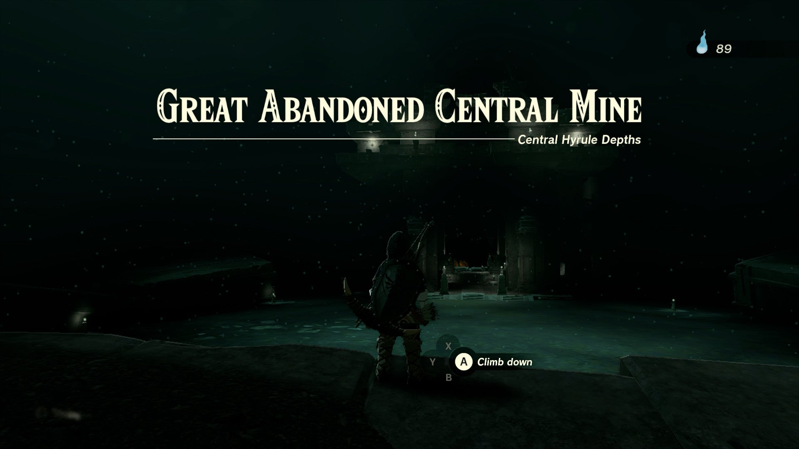
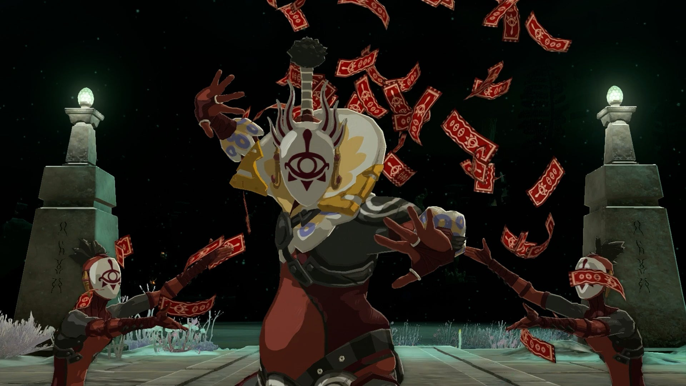
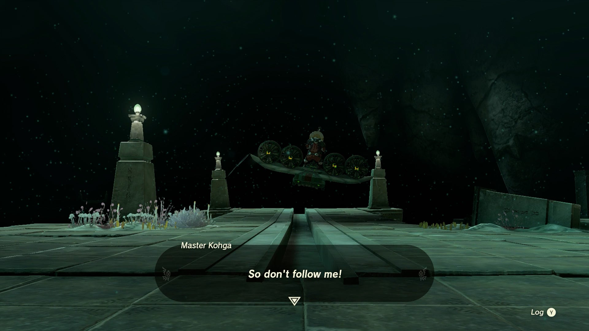

Master Kohga of the Yiga Clan is a Side Adventure Quest that begins in the Depths, and is comprised of multiple events in each corner of the underground region. This page is a hub of the different segments of this questline, and includes where to find Kohga and how to defeat him in each encounter. 

### How to Find Master Kohga

To initiate this quest, you can either follow the Main Questline after completing one of the Regional Phenomena, and speaking to Josha to start the quest A Mystery in the Depths \-- or you can bypass the quest and head directly to the quest's location at the Abandoned Central Mine underneath the Great Plateau in lower Hyrule Field. 

However you complete this quest, you'll find a pedestal in the Central Mine that grants you the Autobuild Power, after which Master Kohga of the Yiga Clan will make his triumphant return and battle with you. 

Following his defeat, he'll flee, and the Side Adventure Questline will begin. Even though it is one Side Adventure, it is comprised of multiple Abandoned Mines under many of the major towns in Hyrule. 

Master Kohga of the Yiga Clan

For details on where to find each of the Abandoned Mines and how to defeat Kohga in these locations, see the links below: 

  * Master Kohga of the Yiga Clan - Abandoned Gerudo Mine

  * Master Kohga of the Yiga Clan - Abandoned Lanayru Mine

  * Master Kohga of the Yiga Clan - Abandoned Hebra Mine

See the complete List of Side Quests and Side Adventures

### Up Next: All Shrine Locations and Solutions

Previous

The Yiga Clan Exam

Next

All Shrine Locations and Solutions

### Top Guide Sections

  * Walkthrough
  * Zelda: Tears of The Kingdom Switch 2 Edition Guide
  * Zelda Notes Voice Memories
  * List of Side Quests and Side Adventures

### Was this guide helpful?

Leave feedback

Go to comments