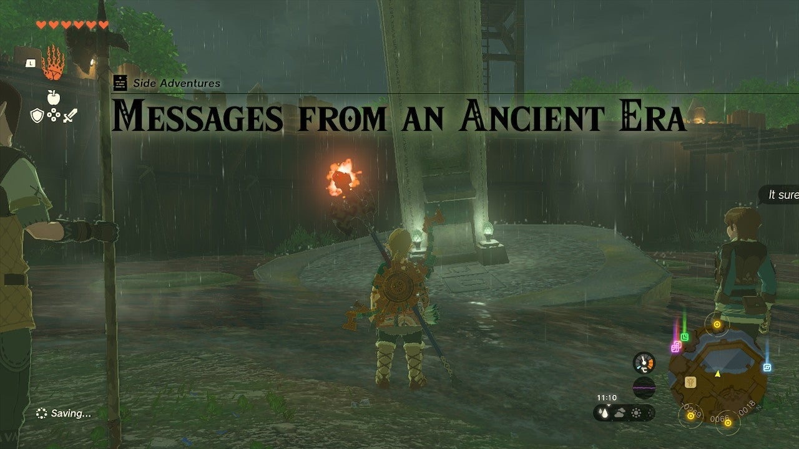

**Messages from an Ancient Era** is a Side Adventure you will embark on in The Legend of Zelda: Tears of the Kingdom. Its main purpose is to decode and translate the ancient Hyrulean texts that have fallen from the Sky Islands after the Upheaval. 

You can only embark upon this quest after completing your first Regional Phenomena Main Quest.

After completing at least one Regional Phenomena Main Quest, make your way back to **Lookout Landing** , where you will find a couple of things have changed. Since you’ve last visited the area, a massive plaque has fallen from the Sky Islands and landed in the pond on the **Southwest** side of the fort town. 

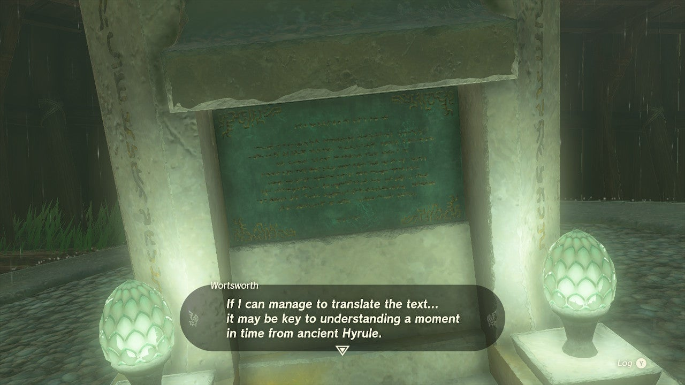

Head over there and part the crowd of people to speak to a researcher named **Wortsworth** , whose mission in life is to decode these ancient texts. 

Wortsworth’s next stop on his quest for knowledge is **Kakariko Village** , so make your way there to start the next leg of the adventure. 

### Wortsworth in Kakariko Village

Once you've made it to Kakariko Village, you'll find Wortsworth examining an illustration in the broken building to the right of the ring ruin. This is where Paya is usually studying. 

Talk to Wortsworth. He explains that he managed to translate _some_ of the message on the tablet from Lookout Landing. It reads: 

_"Ones held y honore als hochmayde to kyng Raru ond quen Sonia, thaerafter to his suster ond to princesse Zelda. Her on thaes grete stan ond twelf mo withalle make y endite min time with the roial familie. So michte heore remembraunce preserven for the sake of hem on whom oure hope raeste."_

This is an incredible discovery. But you can’t stop there! Once Wortsworth gets a taste of deciphering these ancient tablets, he tasks you with taking a picture of every single one in Hyrule. 

## Where to Find the 12 Stone Tablets

There are 12 more tablets to find in total. There is one Stone Tablet at every major Sky Island Archipelago. 

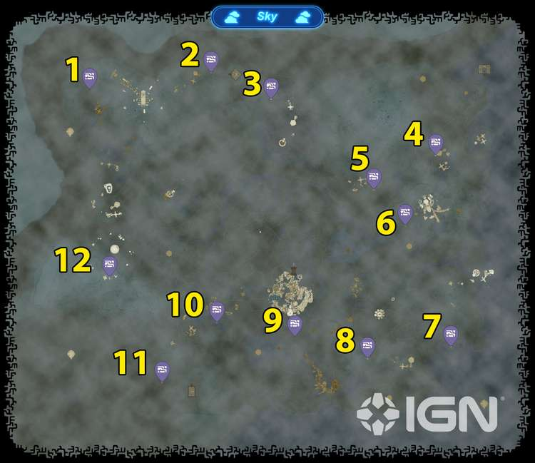

West Hebra Sky Archipelago Tablet 

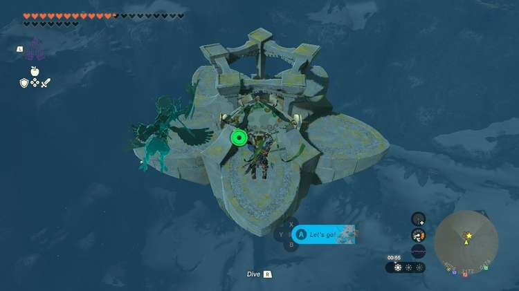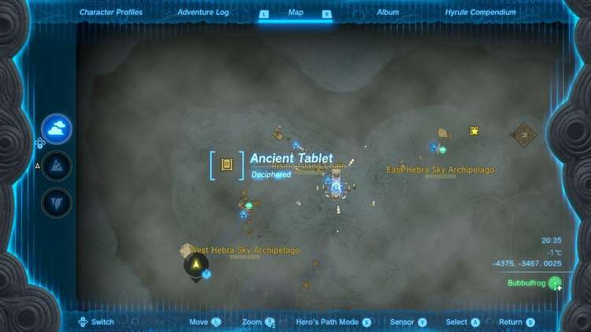

**West Hebra Sky Archipelago Tablet coordinates** : -4045, 3205, 0444. 

Begin your search for this tablet by launching yourself up the Rospro Pass Skyview Tower and aim for the cluster of islands to the north. There is a launcher on the largest Sky Island. Point it toward the star-shaped island, launch yourself skyward, and glide over to the first stone tablet. Don’t forget to take a picture for Wortsworth! 

East Hebra Sky Archipelago Tablet 

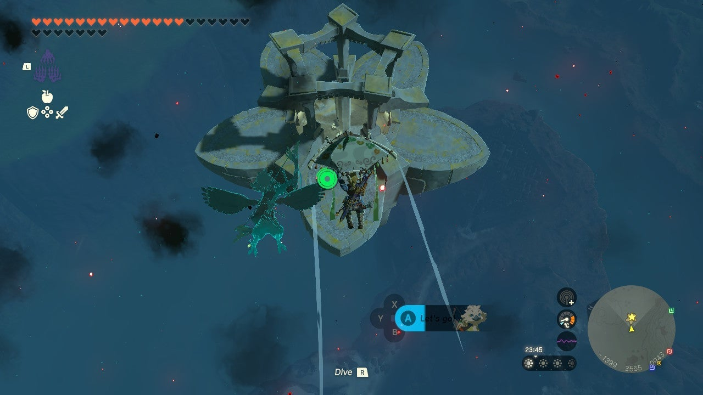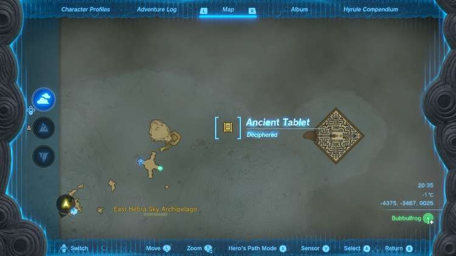

**East Hebra Sky Archipelago Tablet coordinates** : -1369, 3576, 0904. 

Launch yourself up to the East Hebra Sky Archipelago from the Pikida Stonegrove Skyview Tower and use the launcher to send yourself flying straight to the tablet. 

North Hyrule Sky Archipelago Tablet 

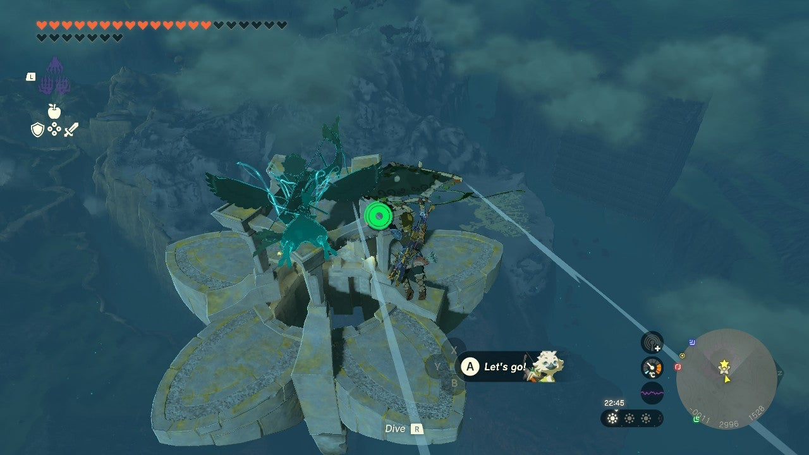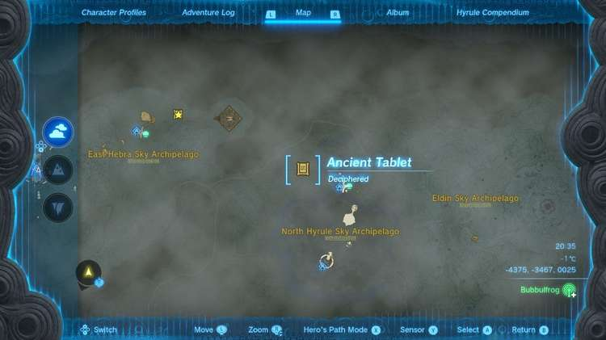

**North Hyrule Sky Archipelago Tablet coordinates** : -0048, 2951, 1330. 

You can reach the North Hyrule Sky Archipelago Tablet by gliding there straight from the **Typhlo Ruins Skyview Tower**. 

Sokkala Sky Archipelago Tablet 

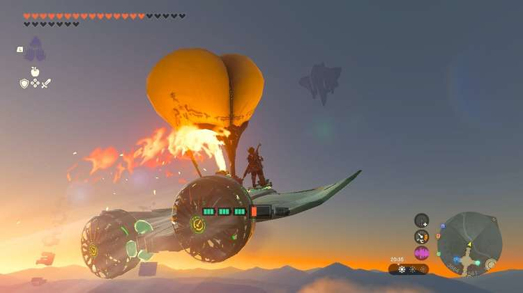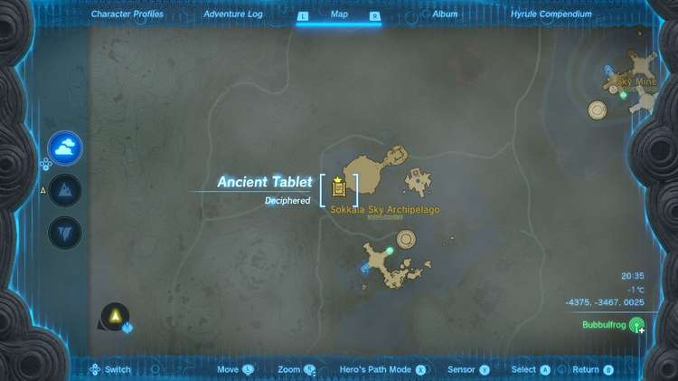

**Sokkala Sky Archipelago Tablet coordinates** : 3555, 1776, 0884. 

The Sokkala Sky Archipelago Tablet is one of the hardest to reach since it sits so high in the sky. Start by launching up to the closest Sky Island to the **Uri Mountain Skyview Tower** and make your way over to the cross-shaped island. 

There is a launcher here, but it won’t get you anywhere near the tablet. You are going to need to craft some kind of Zonai Device to gain some height so you can glide over there, or drive right there if your device is advanced enough. 

South Eldin Sky Archipelago Tablet 

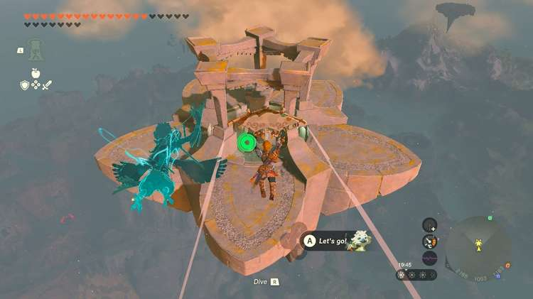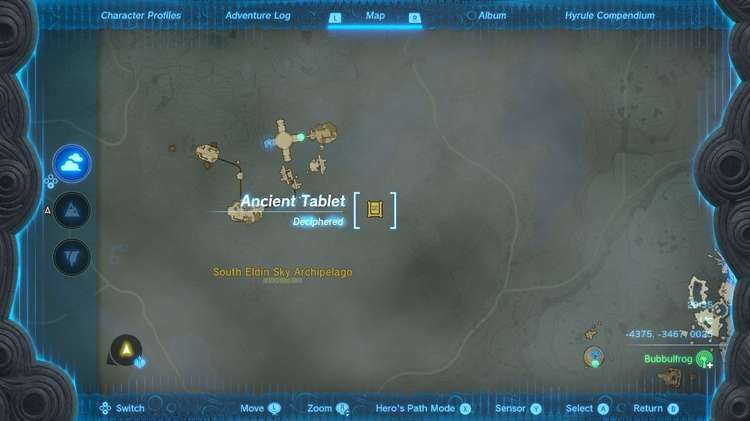

**South Eldin Sky Archipelago Tablet coordinates** : 2214, 0990, 1142. 

Launch yourself up the Eldin Canyon Skyview Tower and glide to the South Eldin Sky Archipelago. Use the launcher on the cross-shaped island to send yourself flying in the direction of the tablet. 

Lanayru Sky Archipelago Tablet 

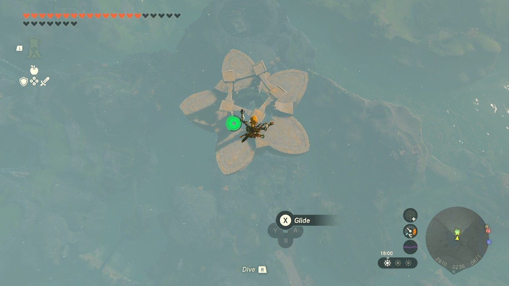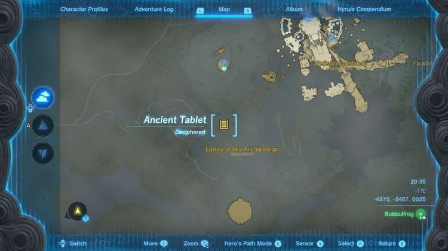

**Lanayru Sky Archipelago Tablet coordinates** : 2918, 0220, 0797. 

Launch skyward from the Upland Zorana Skyview Towerand glide south, straight toward the star-shaped island to reach the tablet. 

South Lanayru Sky Archipelago Tablet 

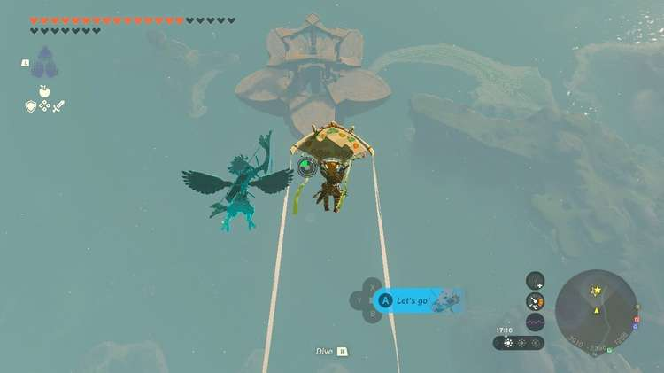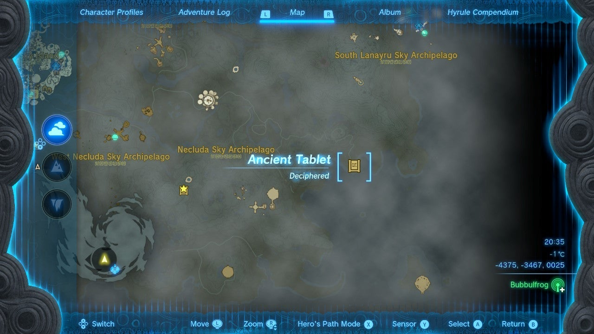

**South Lanayru Sky Archipelago Tablet coordinates** : 3917, -2468, 0009. 

You can reach the South Lanayru Sky Archipelago Tablet by gliding there from the Mount Lanayru Skyview Tower, but you do need a lot of stamina to make it there. Try to bring some stamina boosting elixirs or meals to help you make the long glide! 

Necluda Sky Archipelago Tablet 

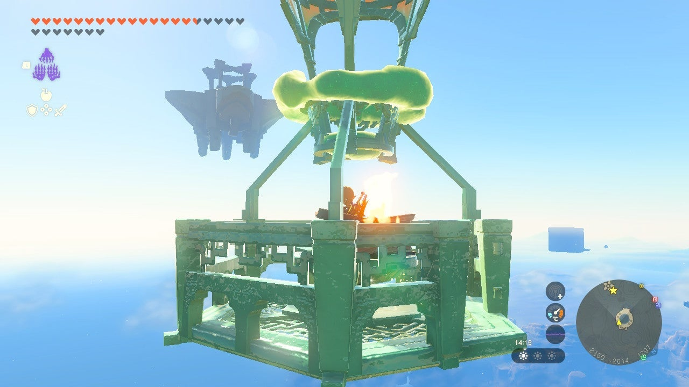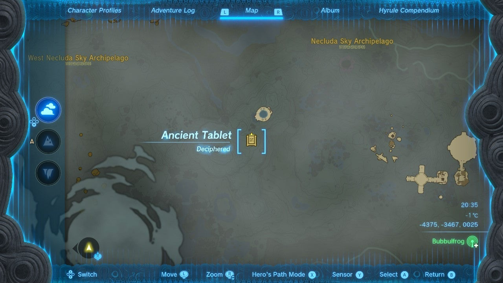

**Necluda Sky Archipelago Tablet coordinates** : 2084, -2730, 0317. 

Start your journey to the Necluda Sky Tablet by launching yourself up the Rabella Wetlands Skyview Tower. Glide toward the large circular island to the northwest, equipping your Zora Armor as you go. 

Use the Zora Armor to swim up the waterfall and land on the circular Sky Island. The tablet is still far higher than your current location, so whip out some Zonai Devices and make some sort of flying device or balloon to get the altitude you need to glide over to the tablet. 

Don’t forget to open the treasure chest on the circular island to find an Old Map!

West Necluda Sky Archipelago Tablet 

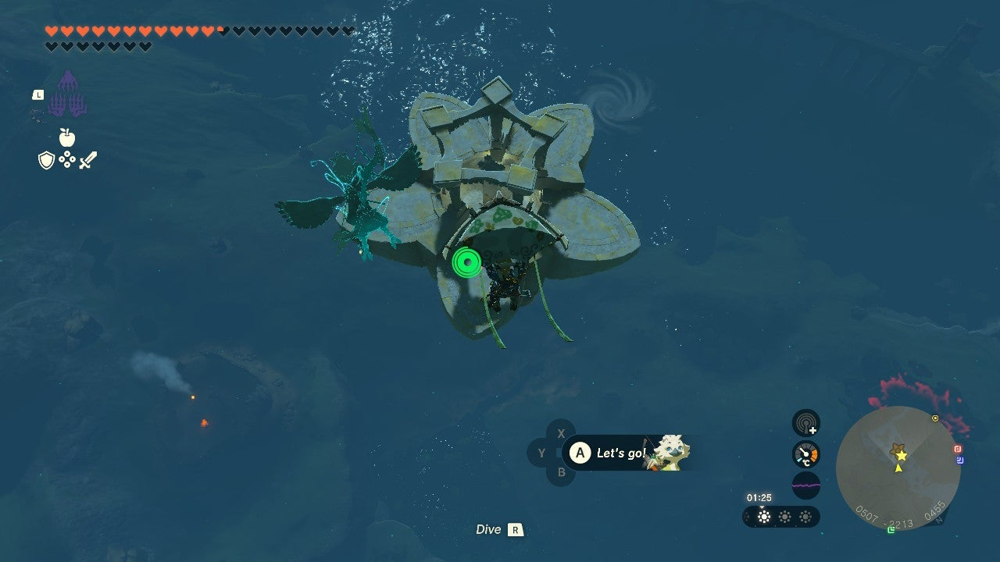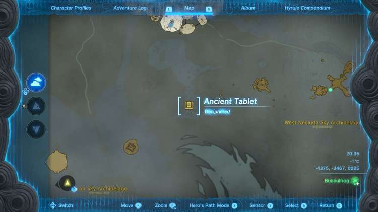

**West Necluda Sky Archipelago Tablet coordinates** : 0476, -2249, 0394. 

You can reach the West Necluda Sky Archipelago Tablet by launching into the air at the Popla Foothills Skyview Tower and gliding in the direction of Lake Hylia. 

South Hyrule Sky Archipelago Tablet 

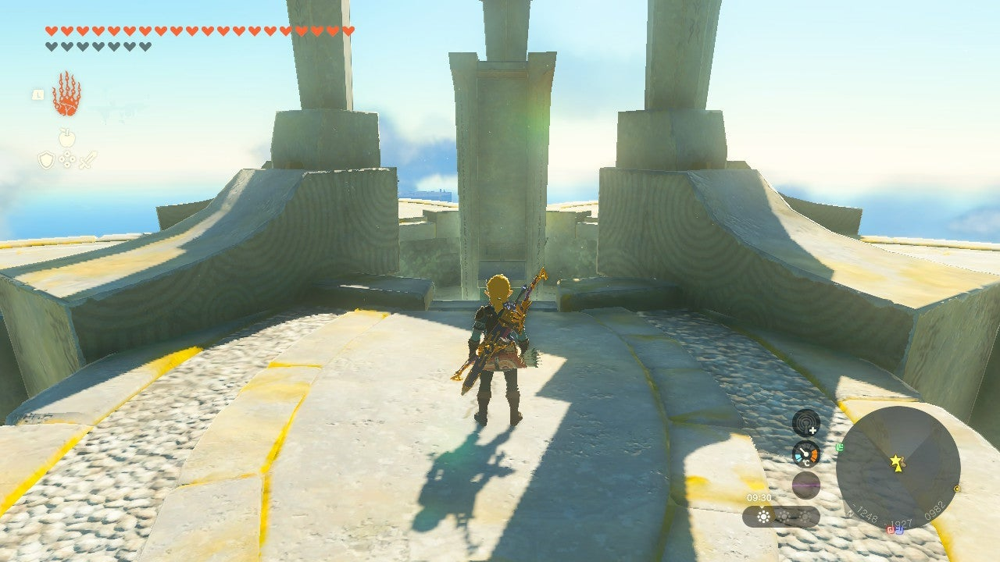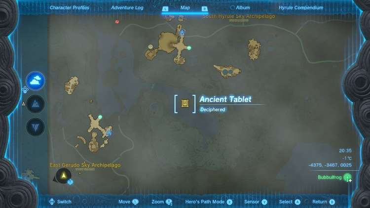

**South Hyrule Sky Archipelago Tablet coordinates** : -1241, -1934, 0979. 

The South Hyrule Sky Archipelago Tablet is actually best accessed from the East Gerudo Sky Archipelago. Start by launching yourself up the Gerudo Canyon Skyview Tower and glide to the northeast to reach the nearby islands. 

Head to the launcher on the cross-shaped island in the East Gerudo Sky Archipelago and point it towards the direction of the South Hyrule Tablet. Hop on and hitch a ride to your destination. 

East Gerudo Sky Archipelago Tablet 

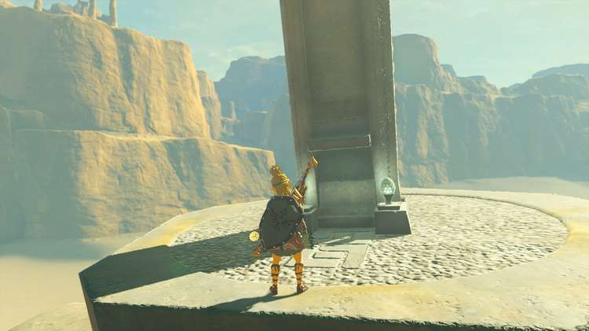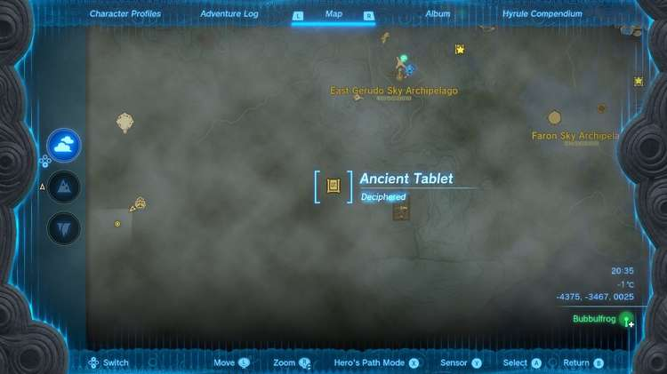

**East Gerudo Sky Archipelago Tablet coordinates** : -2449, -3264, 0047. 

It is definitely possible to reach the East Gerudo Sky Archipelago Tablet by gliding from the Gerudo Canyon Skyview Tower, but it requires about two and a half wheels of stamina to get there. Bring some stamina boosting elixirs or meals to help you make the long journey through the sky. 

This tablet will fall to the ground as soon as you land on it, so don’t be alarmed. The tablet lands right beside the Siwakama Shrine, so it is worth doing that while you’re there. There is also a Korok Seed you can pick up at the tablet’s landing site! 

North Gerudo Sky Archipelago Tablet 

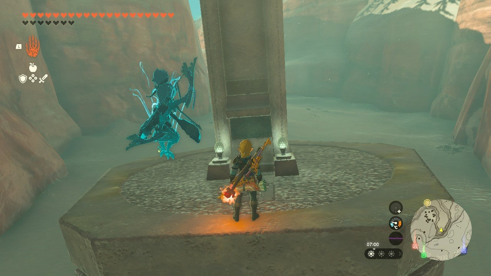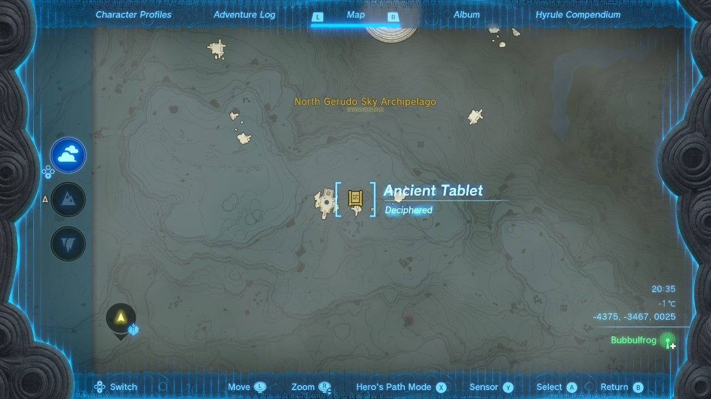

**North Gerudo Sky Archipelago Tablet coordinates** : -3604, -0934, 0495. 

Launch yourself skyward with the Gerudo Highlands Skyview Tower and glide to the northeast to reach the tablet. This tablet will also plummet towards the earth when you land on it, so follow it down to the valley below to take a picture for Wortsworth. 

## Head Back to Kakariko Village

After you take a picture of all 12 tablets, you are free to head back to Kakariko Village and report back to Wortsworth. There, he will decipher all of the ancient tablets and give you a run down of what they say. 

These tablets give you a unique insight into the happenings of ancient Hyrule. But if that wasn’t valuable enough, Wortsworth also gives you 100 Rupees per picture. That is 1200 Rupees for the whole set! 

Once you give Wortsworth all 12 pictures, he will also gift you the Zonai Survey Team Paraglider Fabric. 

Head over to the dye shop in Hateno Village to upgrade your paraglider with your fancy new fabric!

Messages from an Ancient Era

See the complete List of Side Quests and Side Adventures

### Up Next: A Deal With The Statue

Previous

Legend of the Great Sky Island

Next

A Deal With The Statue

### Top Guide Sections

  * Walkthrough
  * Zelda: Tears of The Kingdom Switch 2 Edition Guide
  * Zelda Notes Voice Memories
  * List of Side Quests and Side Adventures

### Was this guide helpful?

Leave feedback

Go to comments