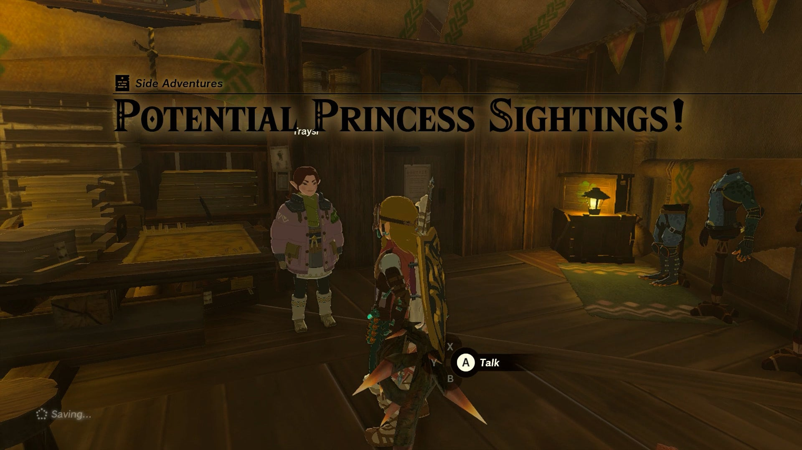
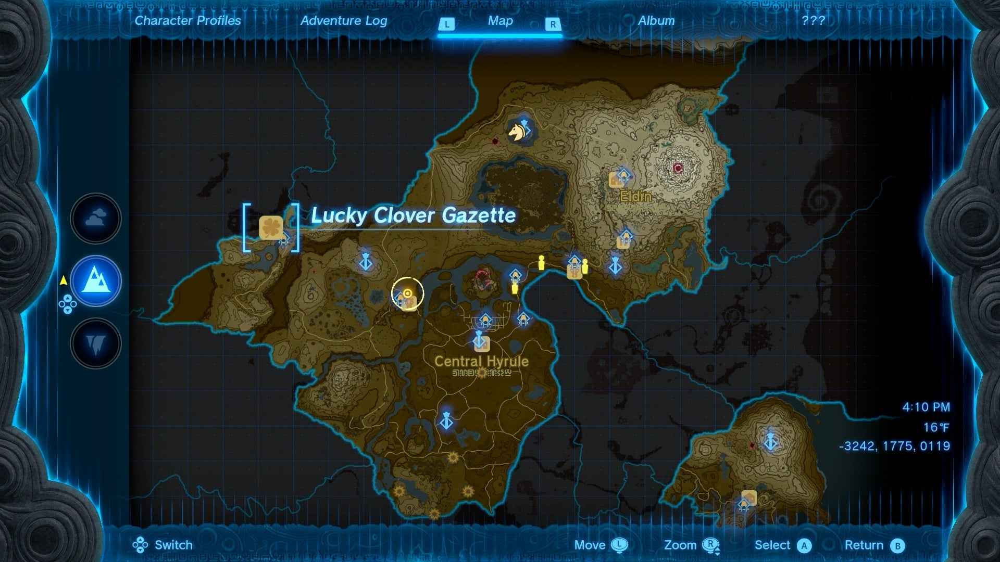
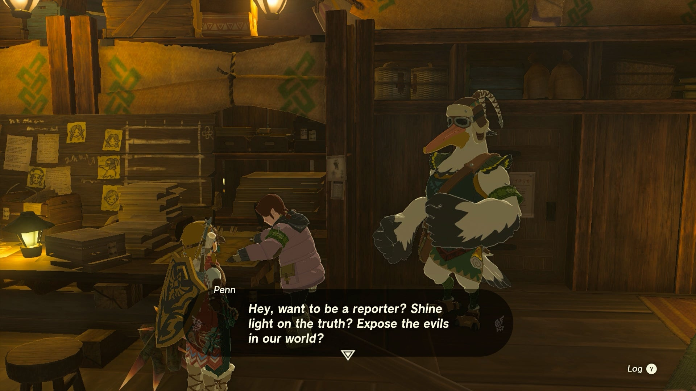
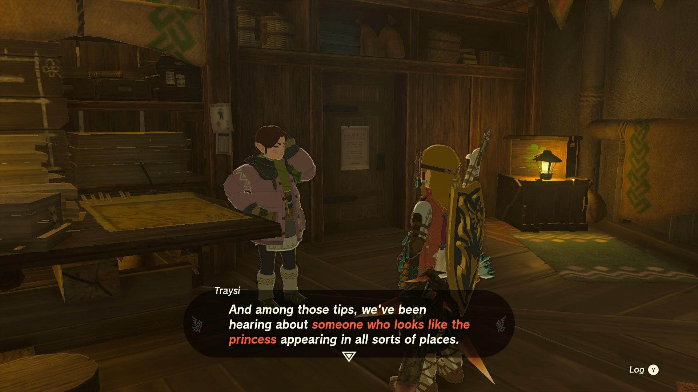
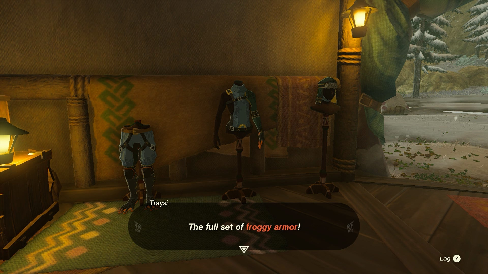
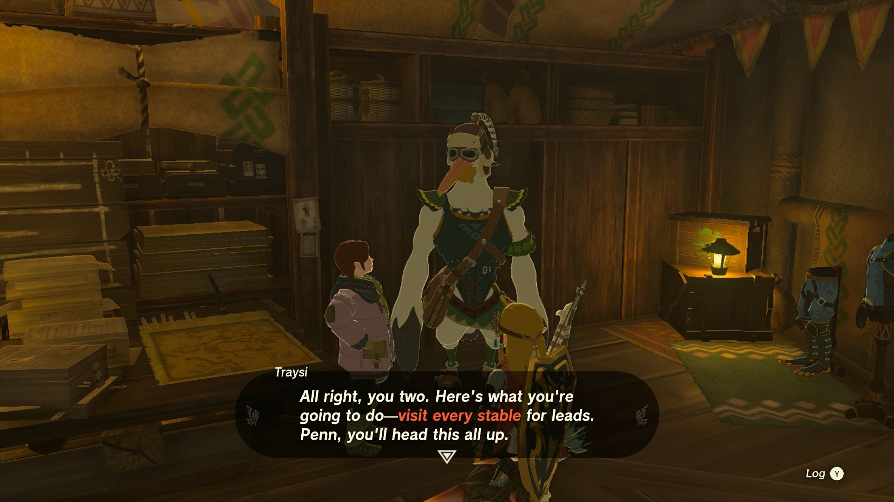
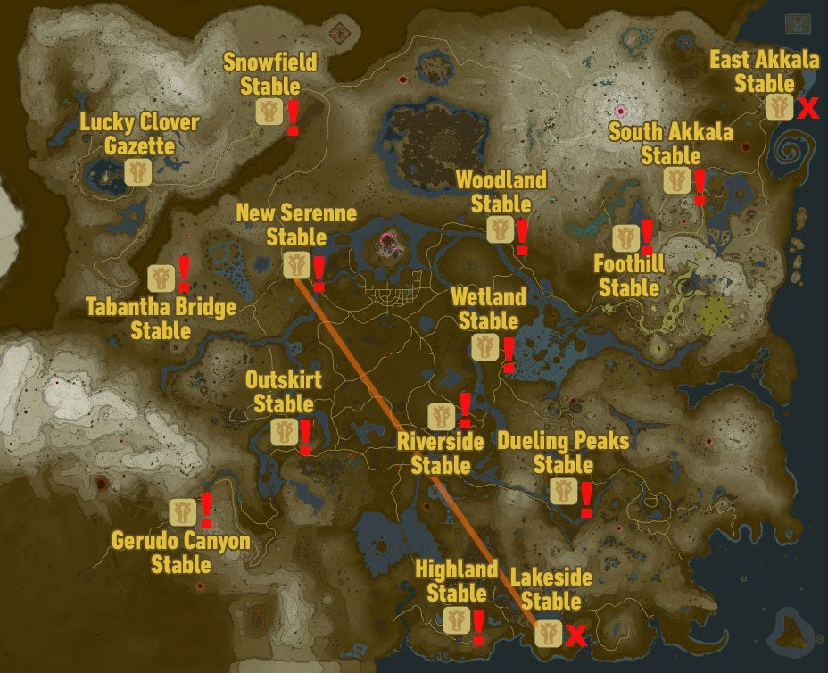

The Potential Princess Sightings! side adventure is a fairly lengthy, multi-part quest that sees Link traveling across the various stables around Hyrule to work as a journalist for the in-game news outlet: Lucky Clover Gazette. Potential Princess Sightings! contains a number of smaller side adventures contained within it. 

  * Quest Giver: Traysi
  * Prerequisites: None
  * Reward: Rupees (Amount increases for each sighting you complete), Lucky Clover Gazette Fabric, Froggy Armor Set

## How to Start the Potential Princess Sightings

It's possible you may run into a strange Rito Pelican named Penn as you undertake the first few story quests to activate Lookout Landing's Skyview Tower, who will suggest you head to the Lucky Clover Gazette outside Rito Village to the north. 

Even if you don't meet Penn earlier, you can find the Lucky Clover Gazette (formerly Rito Stable) just outside the Rito Village in the far northwest Hebra Region. The area will be bitterly cold, so be sure to bring your Archaic Warm Greaves or spicy food to keep warm! 

By talking to Traysi, Link can become employed as a journalist to track down rumors and sightings of Princess Zelda, with the help of Penn. 

These rumors have cropped up at almost all the Stables across Hyrule, and you'll find quests to take on at each one, where Penn can now be found. 

Note that of all the stables, the East Akkala Stable has no leads to track down (though you can still talk to Penn), and the Lakeside Stable is the end of a quest that starts at a different stable altogether.

For each quest you undertake, you'll earn rewards from Penn and Traysi, as well as getting parts of the Froggy Armor the more quests you complete for the Gazette. You can take on these Princess Sighting adventures in any order you like, and will earn rewards that increase based on how many sightings you have documented: 

Stories Completed  
Reward Earned

First Story  
50 Rupees

Second Story  
50 Rupees + Lucky Clover Gazette Paraglider Fabric

Third Story  
50 Rupees + 20 Rupees

Fourth Story  
50 Rupees +Froggy Sleeve

Fifth Story  
100 Rupees

Sixth Story  
100 Rupees

Seventh Story  
100 Rupees + 20 Rupees

Eighth Story  
100 Rupees + 20 Rupees

Ninth Story  
100 Rupees +Froggy Leggings

Tenth Story  
100 Rupees + 50 Rupees

Eleventh Story  
100 Rupees + 100 Rupees

Twelfth Story  
300 Rupees +Froggy Hood

## List of Potential Princess Sighting Side Adventures

As mentioned above, you can take on the following adventures in any order you choose, which are located at nearly every main Stable in Hyrule. Click on a link below to learn more about it, and how to solve the quest. 

Side Adventure Name  
Starting Settlement / Region

Serenade to a Great Fairy  
Woodland Stable, Eldin Canyon

The Beckoning Woman  
Outskirt Stable, Central Hyrule

Gourmets Gone Missing  
Riverside Stable, Central Hyrule

The Beast and the Princess  
New Serenne Stable, Hyrule Ridge

Zelda's Golden Horse  
Snowfield Stable, Tabantha Tundra

White Goats Gone Missing  
Tabantha Bridge Stable, Hyrule Ridge

For Our Princess!  
Foothill Stable, Eldin

The All-Clucking Cucco  
South Akkala Stable, Akkala

The Missing Farm Tools  
Wetlands Stable, West Necluda

Princess Zelda Kidnapped?!  
Dueling Peaks Stable, West Necluda

An Eerie Voice  
Highland Stable, Faron

The Blocked Well  
Gerudo Canyon Stable, Gerudo

Once you've completed all twelve Potential Princess Sightings, be sure to return to Traysi back at the Lucky Clover Gazette to get your final reward, the **Froggy Cap** , and conclude the questline! 

If you speak to Traysi after concluding the Side Adventure, she'll mention that she gave Penn time off, who traveled south to Washa's Bluff in Hyrule Ride, where the Rito bard known as Kass used to play his music on top of a large mushroom. 

Potential Princess Sightings!

See the complete List of Side Quests and Side Adventures

### Up Next: The Beckoning Woman

Previous

Lurelin Village Restoration Project

Next

The Beckoning Woman

### Top Guide Sections

  * Walkthrough
  * Zelda: Tears of The Kingdom Switch 2 Edition Guide
  * Zelda Notes Voice Memories
  * List of Side Quests and Side Adventures

### Was this guide helpful?

Leave feedback

Go to comments