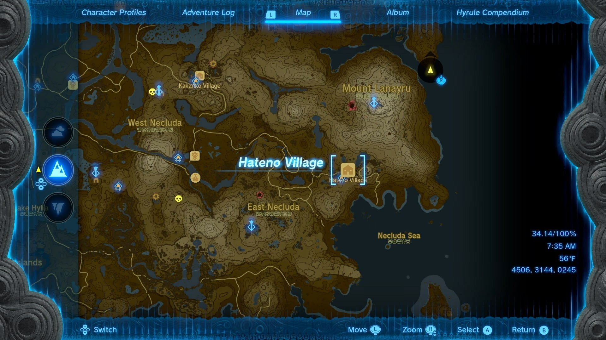
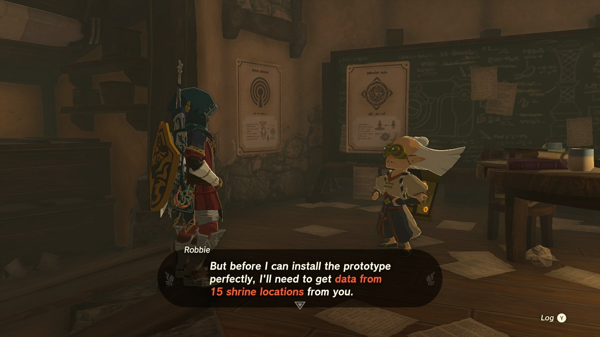
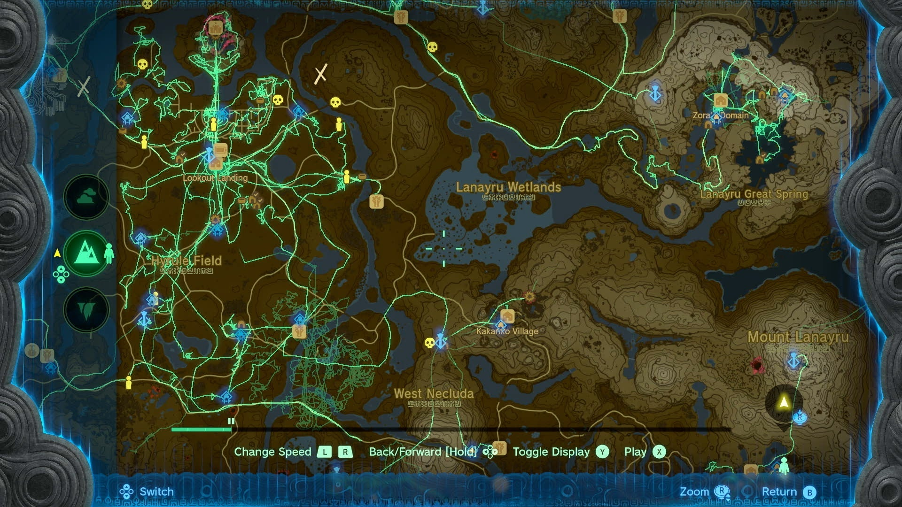

Presenting: Hero's Path Mode! is a Side Adventure quest in The Legend of Zelda: Tears of the Kingdom. While Hero's Path mode was originally a DLC item in Breath of the Wild, you'll be able to access it free of charge in TotK, but only after completing certain quests. 

  * **Prerequisite Quests:**
  * Camera Work in the Depths
  * A Mystery in the Depths
  * Hateno Village Research Lab

## How to Start the Hero's Path Mode Quest

When speaking to Robbie at Lookout Landing, you'll learn that he was the main architect of the Purah Pad (though he did not get to put his name on it), and has a host of other features he'd like to upgrade the pad with, when he has the time. 

You won't be able to officially upgrade the Purah Pad until you've done some other legwork. This includes taking on the first Depths main quest after you complete Crisis at Hyrule Castle - Find Captain Hoz. The next Depths main quest, A Mystery in the Depths, can only be undertaken after you have completed at least one of the Regional Phenomena main quests in one of the four major regions of Hyrule. 

Until that time, Robbie will remain in Lookout Landing, telling you he cannot return to his lab in Hateno until he's helped Josha with research in the Depths. However, after you gain the Autobuild ability from the second quest in the Depths and fix his broken hot air balloon, you can speak to him to initiate the Hateno Village Research Lab quest, and go find his lab in Hateno, far to the southeast. 

Hateno is located in eastern Necluda, just below the Lanayru Mountain, and has a nearby shrine above the town called the Zanmik Shrine that you can fast travel to once activated. 

The lab itself is located high on the hill to the east of town, requiring a good bit of walking. 

Once you reach the top, speak to Robbie and he'll start the upgrades for the Purah Pad by installing a Shrine Sensor (you can't skip ahead to the Hero's Path Mode), which will involve you finding a shrine in a cave back down the hill. 

## How to Install the Hero's Path Mode

After the sensor is installed, speak to Robbie again and inquire about the Hero's Path Mode. He will explain that he should be able to install the prototype to track all the places you've been, but he will need at data on at least 15 shrine locations for it to work. 

Since shrines are located everywhere, you may have already hit that mark, but if not, be sure to look near each major town and stable to get easy ones, and check our list of Shrines for even more locations. 

Once installed, you can open up the map at any time to press Y to toggle your Shrine Sensor, and then X to toggle Hero's Path Mode. Doing so will allow you to see a green line tracing through everywhere you've been for hundred of in-game hours. You can even toggle displays, and toggle it to only show the lines on the surface, sky, or depths you're currently viewing. 

Presenting: Hero's Path Mode!

See the complete List of Side Quests and Side Adventures

### Up Next: Presenting: Sensor +!

Previous

Presenting: The Travel Medallion!

Next

Presenting: Sensor +!

### Top Guide Sections

  * Walkthrough
  * Zelda: Tears of The Kingdom Switch 2 Edition Guide
  * Zelda Notes Voice Memories
  * List of Side Quests and Side Adventures

### Was this guide helpful?

Leave feedback

### In This Guide

The Legend of Zelda: Tears of the KingdomNintendo EPD

Initial Release: May 12, 2023

Learn more

Go to comments