Presenting: The Travel Medallion! is a Side Adventure quest in The Legend of Zelda: Tears of the Kingdom. While the Fast Travel Medallion as originally a DLC item in Breath of the Wild, you'll be able to access it free of charge in TotK, but only after completing certain quests. 

  * **Prerequisite Quests:**
  * Camera Work in the Depths
  * A Mystery in the Depths
  * Hateno Village Research Lab

## How to Start the Travel Medallion Quests

When speaking to Robbie at Lookout Landing, you'll learn that he was the main architect of the Purah Pad (though he did not get to put his name on it), and has a host of other features he'd like to upgrade the pad with, when he has the time. 

While you can find the necessary component to complete with quest early, you won't be able to officially hand in the prototype item to get fixed until you've done some other legwork. This includes taking on the first Depths main quest after you complete Crisis at Hyrule Castle - Find Captain Hoz. The next Depths main quest, A Mystery in the Depths, can only be undertaken after you have completed at least one of the Regional Phenomena main quests in one of the four major regions of Hyrule. 

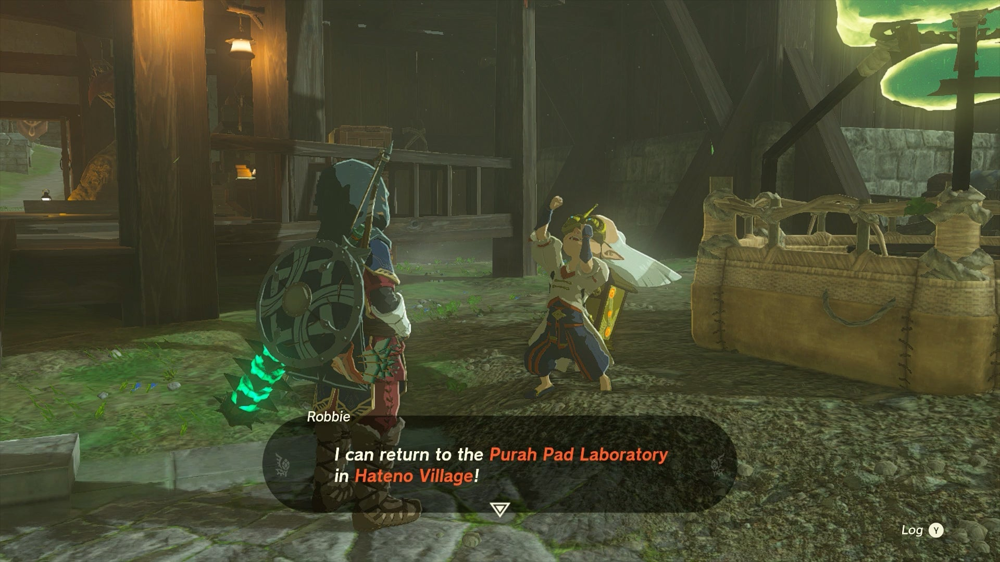

Until that time, Robbie will remain in Lookout Landing, telling you he cannot return to his lab in Hateno until he's helped Josha with research in the Depths. However, after you gain the Autobuild ability from the second quest in the Depths and fix his broken hot air balloon, you can speak to him to initiate the Hateno Village Research Lab quest, and go find his lab in Hateno, far to the southeast. 

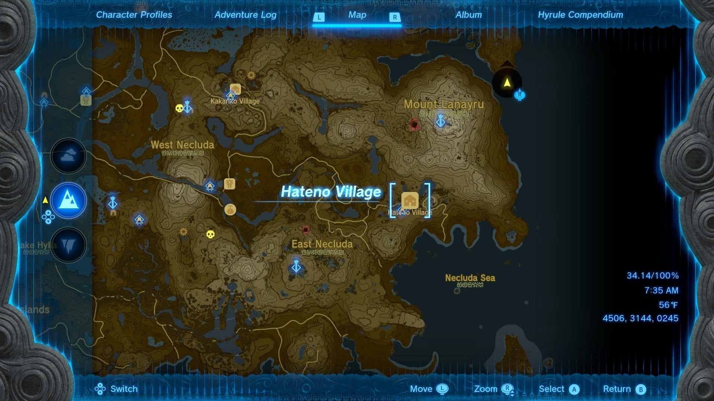

Hateno is located in eastern Necluda, just below the Lanayru Mountain, and has a nearby shrine above the town called the Zanmik Shrine that you can fast travel to once activated. 

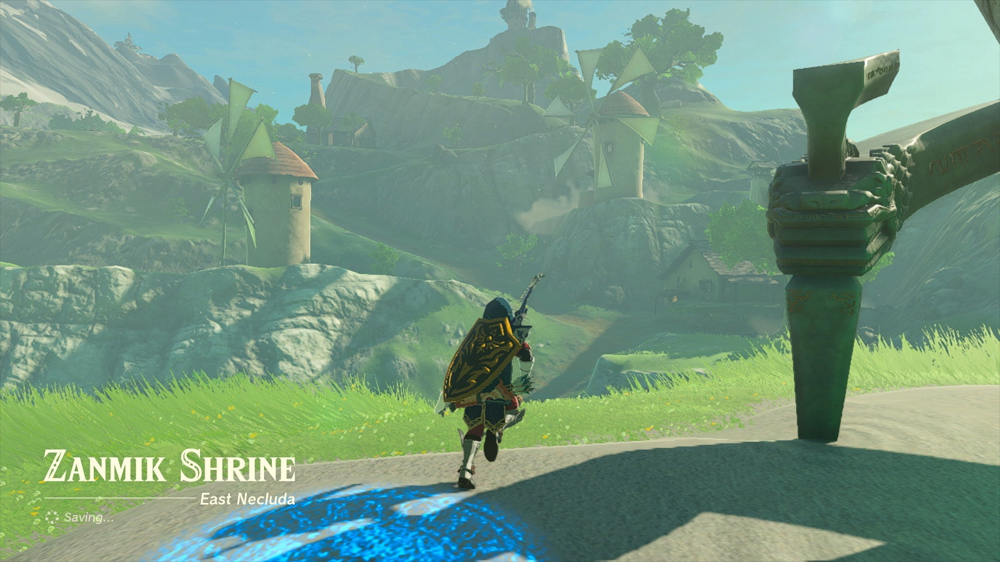

The lab itself is located high on the hill to the east of town, requiring a good bit of walking. 

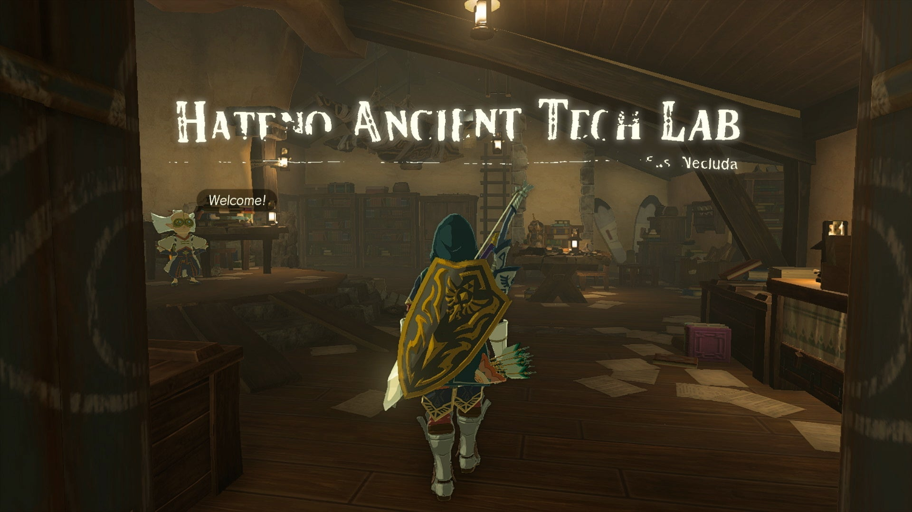

Once you reach the top, speak to Robbie and he'll start the upgrades for the Purah Pad by installing a Shrine Sensor (you can't skip ahead to the Travel Medallion), which will involve you finding a shrine in a cave back down the hill. 

## Finding the Travel Medallion Prototype

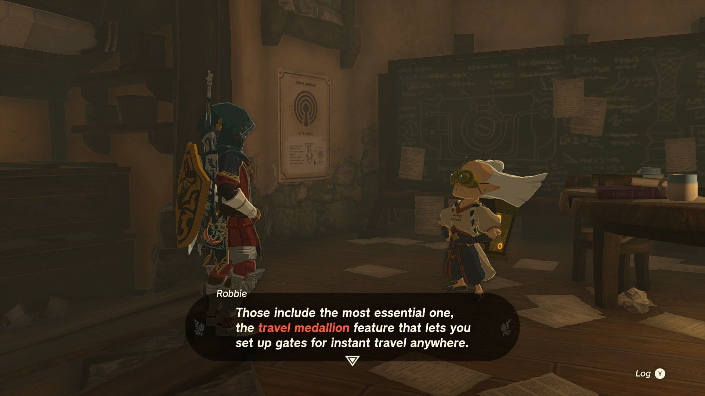

Once you complete the testing on the Shrine Sensor, Robbie will give you a choice of upgrading the Sensor, or working to install two other features: the Hero's Path Mode and the Travel Medallion. 

For the Travel Medallion, he won't be able to install it until he has the Travel Medallion Prototype, but it was left behind at his other research lab up in Akkala to the far northeast tip of the region. 

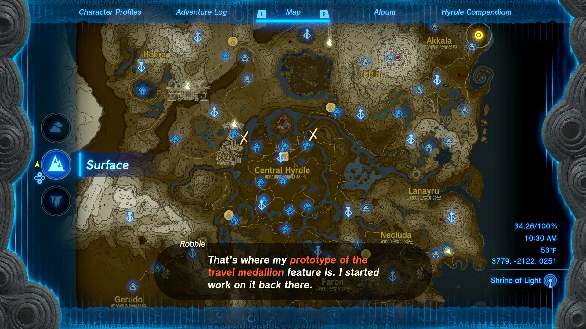

If you haven't been there before, you'll need to take the road east from Woodland Stable and north past Lanayru Great Spring and Zora's Domain up the cliffs to Akkala, then take the right path down below the bridge and to Tarrey Town and towards East Akkala Stable, where this a fast travel spot nearby at Jochi-iu Shrine. 

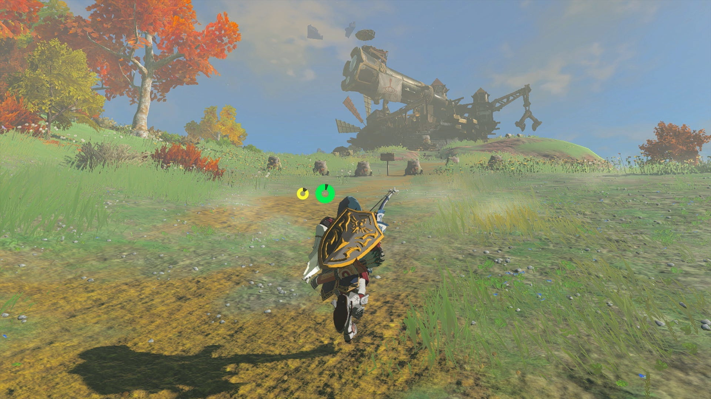

As you head up the long path past the stable to the lab, you'll find the place has been trashed and covered in Yiga signs, which isn't a great look. Try to interact with the door to the lab, and you'll be ambushed by two Yiga Assassins. 

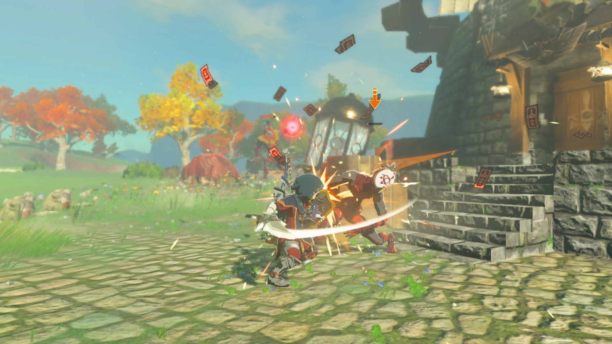

Fight carefully, as they can deal a lot of damage if you're still early in your adventure and don't have a lot of hearts. Try to rushdown the smaller one first by watching where he will teleport to next and ambush him. If he casts a spell, he'll drop down from above. For the bigger assassin, watch for his Earthwake technique to cause a gust of air you can paraglide up from then snipe him on the way down. 

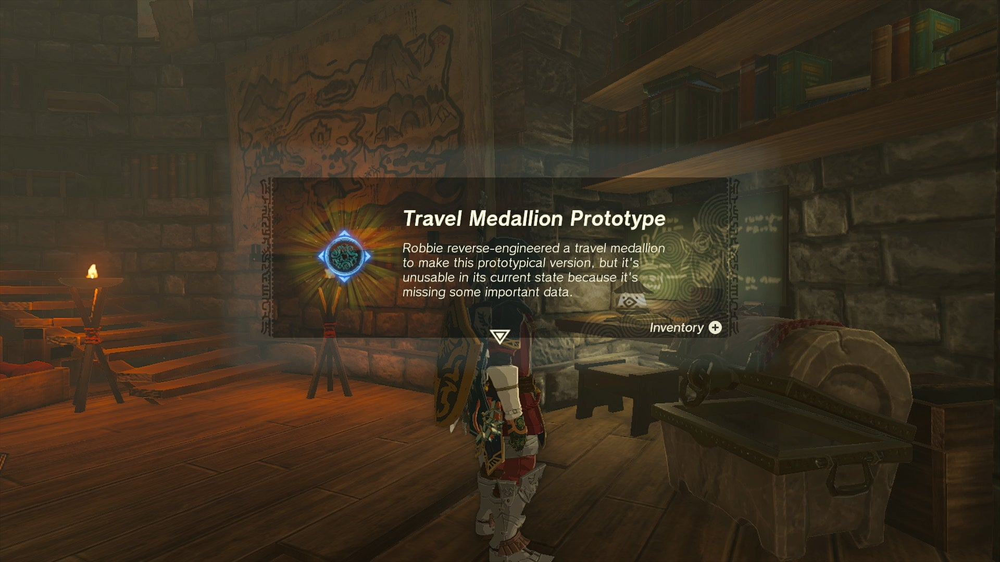

Once they've been defeated, head inside and you can rescue a clothing worker to get a piece of Yiga Armor. The real prize is located on a chest on the right side of the room - the Travel Medallion Prototype. 

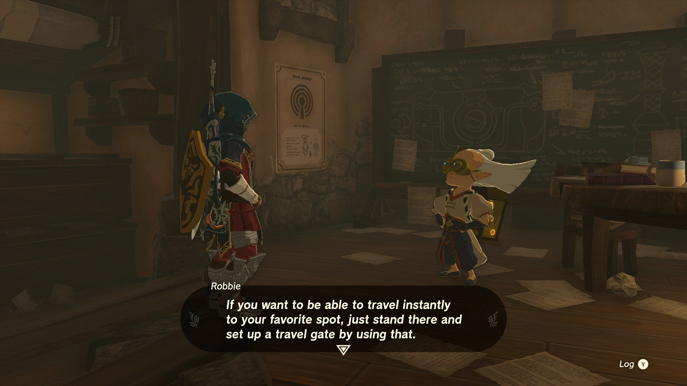

Bring this back to Robbie (who has helpfully activated a fast travel spot at his lab), and he will install the Travel Medallion to the Purah Pad, which allows you to select the medallion in your Key Items to drop a fast travel point wherever you like (with few exceptions if terrain is unstable). 

## How to Upgrade the Travel Medallion

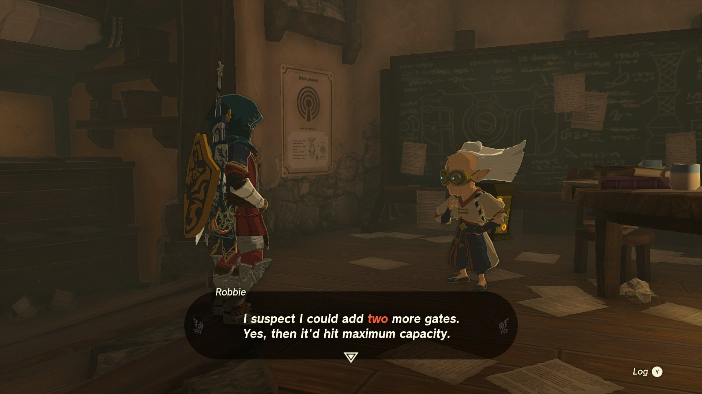

Once installed, Robbie will remark that he can continue to upgrade the Travel Medallion, increase the number of gates - or spots you can drop at one time. However, in order to do so, you'll need to uncover the map-data locations by unlocking more Skyview Towers across Hyrule. 

To get more charges for the Travel Medallion, you'll need the following amount of locations mapped: 

10 Regions Mapped  
2 Travel Medallion Gates

15 Regions Mapped  
3 Travel Medallion Gates

Presenting: The Travel Medallion!

See the complete List of Side Quests and Side Adventures

### Up Next: Walkthrough

Previous

About IGN's Zelda TotK Guide Writers

Next

Walkthrough

### Top Guide Sections

  * Walkthrough
  * Zelda: Tears of The Kingdom Switch 2 Edition Guide
  * Zelda Notes Voice Memories
  * List of Side Quests and Side Adventures

### Was this guide helpful?

Leave feedback

### In This Guide

The Legend of Zelda: Tears of the KingdomNintendo EPD

Initial Release: May 12, 2023

Learn more

Go to comments