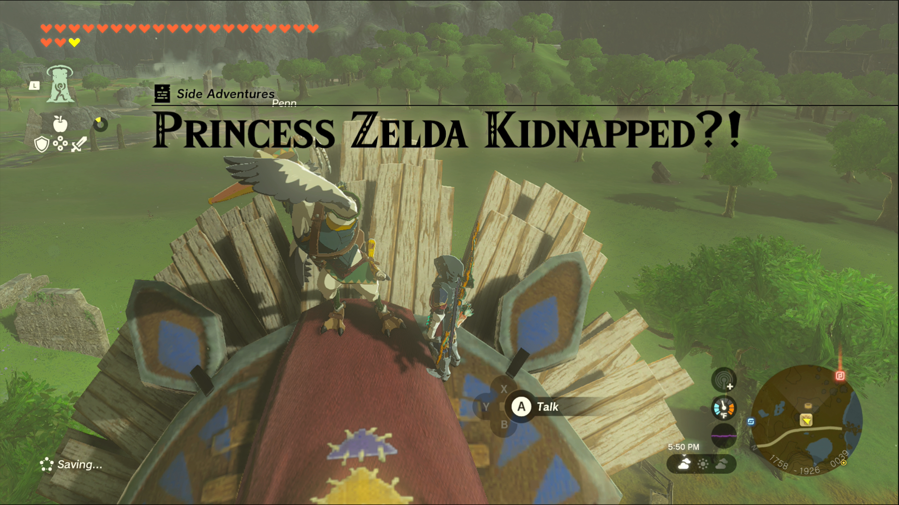
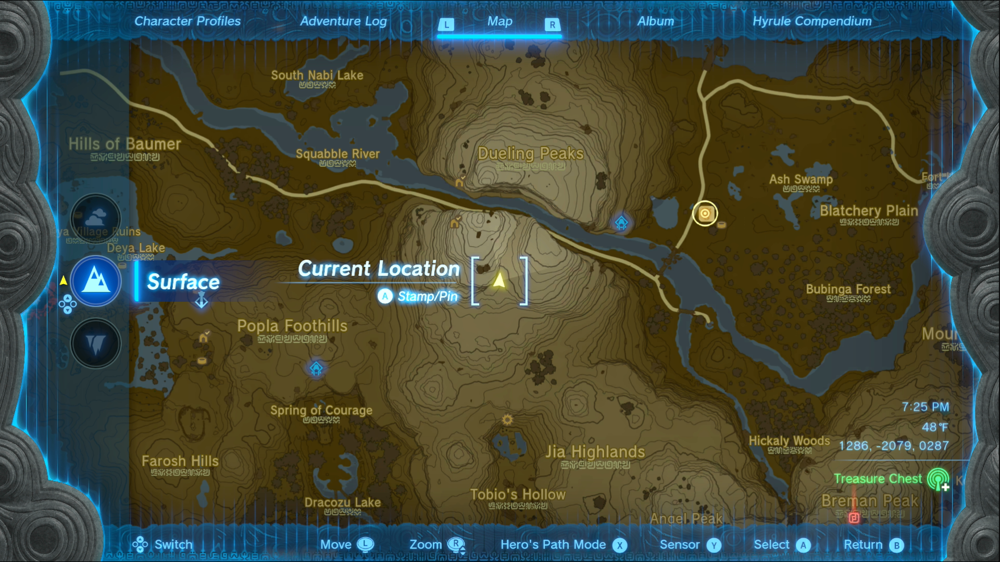
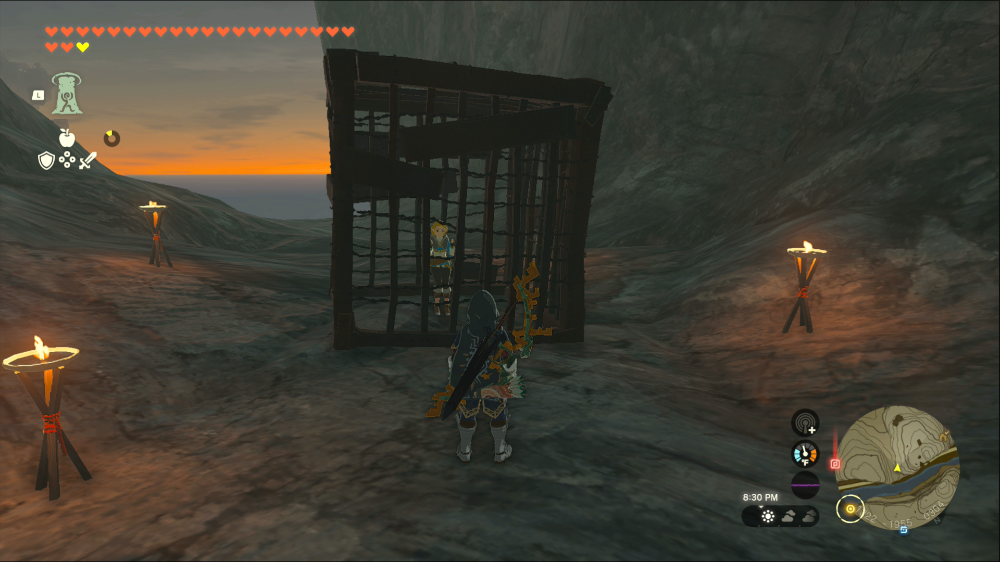

Princess Zelda Kidnapped?! is a Side Adventure in The Legend of Zelda: Tears of the Kingdom in which you investigate a mysterious report regarding Zelda. Side Adventures are usually longer side quests that often tell a story. 

  * **Quest Giver:** Penn
  * **Prerequisites** : Begin the Potential Princess Sighting! questline at the Lucky Clover Gazette
  * **Reward:** Rupees

To start the Side Adventure “Princess Zelda Kidnapped?!” you first need to accept the Side Adventure “Potential Princess Sightings!” at the Lucky Clover Gazette, located just outside of Rito Village in the Hebra Region. Then head to the Dueling Peaks Stable, located on the south side of West Necluda, east of the Dueling Peaks, and speak to Penn. You can find him on the roof of the stable (ascend makes it easier to get up to him) looking for a clue to Zelda’s whereabouts, due to a Yiga ransom note claiming they’d kidnapped the princess. 

Penn notes that Zelda can be found on the “carved-out heart of the towering twins” which naturally points to Dueling Peaks. Looking at the map (if you have it uncovered for this region) the south peak has a canyon running through the middle of it, so make the climb until you see torches marking the way. Follow them until you see a cage occupied by none other than Princess Zelda. 

Lift it off of her and she’ll immediately reveal herself to be a Yiga assassin in disguise. Defeat the assassin and their allies, if you’re having trouble try using your bow to hit one of them in the head so they’re knocked back off the mountain. Otherwise, setting them on fire or freezing/shocking them can stun them long enough to follow up with a stronger weapon attack. 

Once they’re all defeated, Penn will appear to discuss his attempts at following up on the kidnapping. He’ll give you a reward and head off, marking the end of the quest. 

_This reward depends on how far along you are in the Potential Princess Sightings! Side Adventure._

Princess Zelda Kidnapped?!

## List of Potential Princess Sighting Side Adventures

Looking for other Potential Princess Sightings to undertake? You can take on the following adventures in any order you choose, which are located at nearly every main Stable in Hyrule. Click on a link below to learn more about it, and how to solve the quest. 

Side Adventure Name  
Starting Settlement / Region

Serenade to a Great Fairy  
Woodland Stable, Eldin Canyon

The Beckoning Woman  
Outskirt Stable, Central Hyrule

Gourmets Gone Missing  
Riverside Stable, Central Hyrule

The Beast and the Princess  
New Serenne Stable, Hyrule Ridge

Zelda's Golden Horse  
Snowfield Stable, Tabantha Tundra

White Goats Gone Missing  
Tabantha Bridge Stable, Hyrule Ridge

For Our Princess!  
Foothill Stable, Eldin

The All-Clucking Cucco  
South Akkala Stable, Akkala

The Missing Farm Tools  
Wetlands Stable, West Necluda

Princess Zelda Kidnapped?!  
Dueling Peaks Stable, West Necluda

An Eerie Voice  
Highland Stable, Faron

The Blocked Well  
Gerudo Canyon Stable, Gerudo

See the complete List of Side Quests and Side Adventures

### Up Next: An Eerie Voice

Previous

The Missing Farm Tools

Next

An Eerie Voice

### Top Guide Sections

  * Walkthrough
  * Zelda: Tears of The Kingdom Switch 2 Edition Guide
  * Zelda Notes Voice Memories
  * List of Side Quests and Side Adventures

### Was this guide helpful?

Leave feedback

### In This Guide

The Legend of Zelda: Tears of the KingdomNintendo EPD

Initial Release: May 12, 2023

Learn more

Go to comments