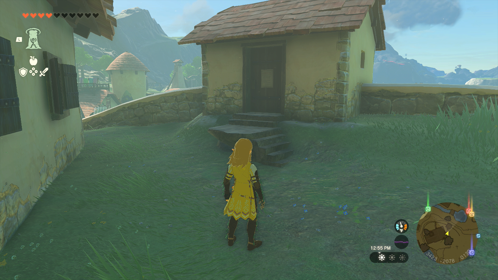
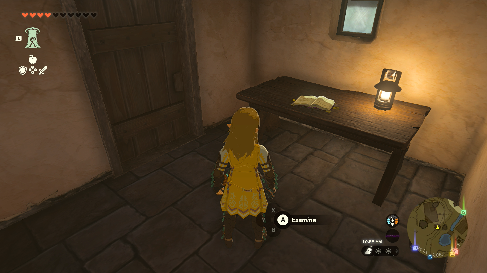
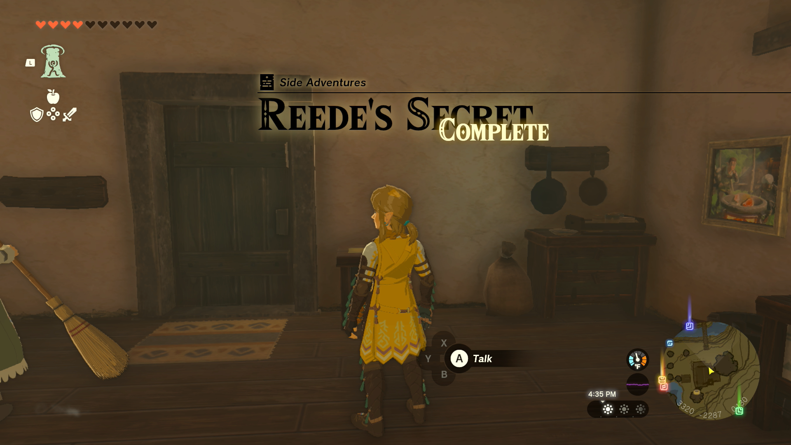

Reede’s Secret is a Side Adventure in The Legend of Zelda: Tears of the Kingdom in which you help the mayor’s wife figure out what secrets her husband is keeping. Side Adventures are mini quests that tell a story. 

## Reede’s Secret

To start the Side Adventure “Reede’s Secret” you first need to accept the quest, "Team Cece or Team Reede?" Once you've done that you need to speak to Reede's wife, Clavia. She can be seen wandering around the town, worrying about Reede. She reveals that Reede is up to something and would like you to figure out what he’s doing in his shed. The only problem is that the shed is locked. She said Reede will definitely not be in the shed at noon, so that's the best time to go snooping. 

To get into his shed, you'll need to visit the nearby well, Hateno Village North Well, and follow the path inside until you're directly beneath the shed. The minimap will help you line up the proper ascension point, but you can also cancel the ascent if you're off by a little. Once you're in the shed you can read Reede's Diary to help Clavia get to the bottom of this. 

Report back to her and relay what you found. If you have trouble finding her, selecting Reede’s Secret as your active quest will mark Clavia on your map. Once you’ve revealed the details and learned some interesting information, you’re rewarded with 10 Hylian Tomatoes. This is one of the quests required to unlock the final quest of the Hateno questline, "The Mayoral Election." 

Reede's Secret

See the complete List of Side Quests and Side Adventures

### Up Next: Cece's Secret

Previous

A New Signature Food

Next

Cece's Secret

### Top Guide Sections

  * Walkthrough
  * Zelda: Tears of The Kingdom Switch 2 Edition Guide
  * Zelda Notes Voice Memories
  * List of Side Quests and Side Adventures

### Was this guide helpful?

Leave feedback

### In This Guide

The Legend of Zelda: Tears of the KingdomNintendo EPD

Initial Release: May 12, 2023

Learn more

Go to comments