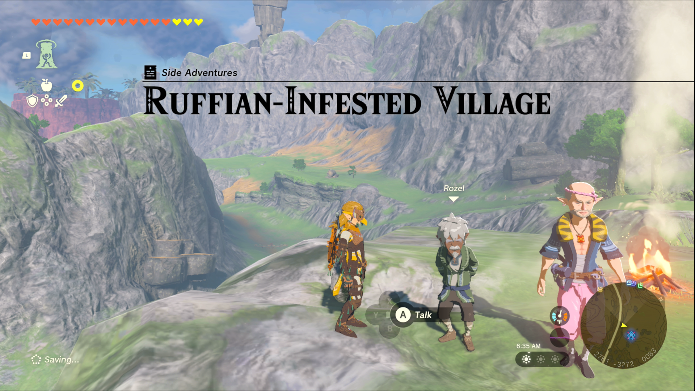
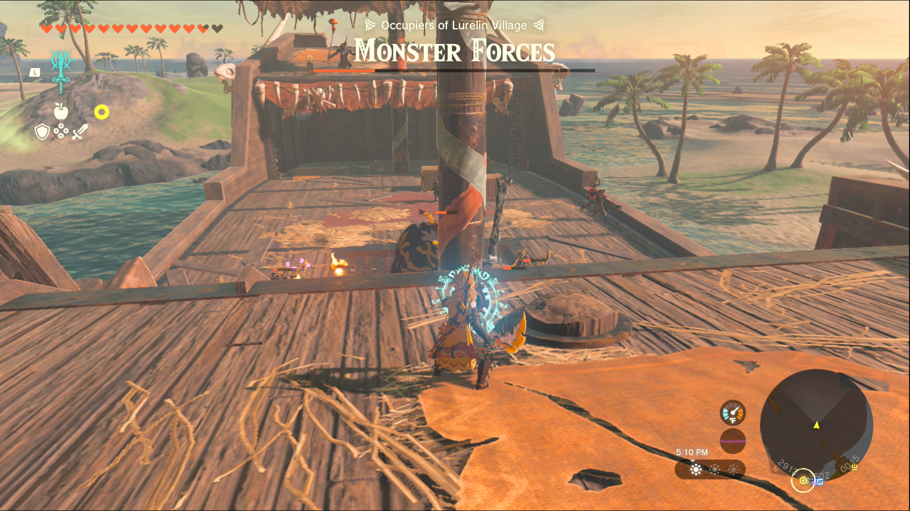
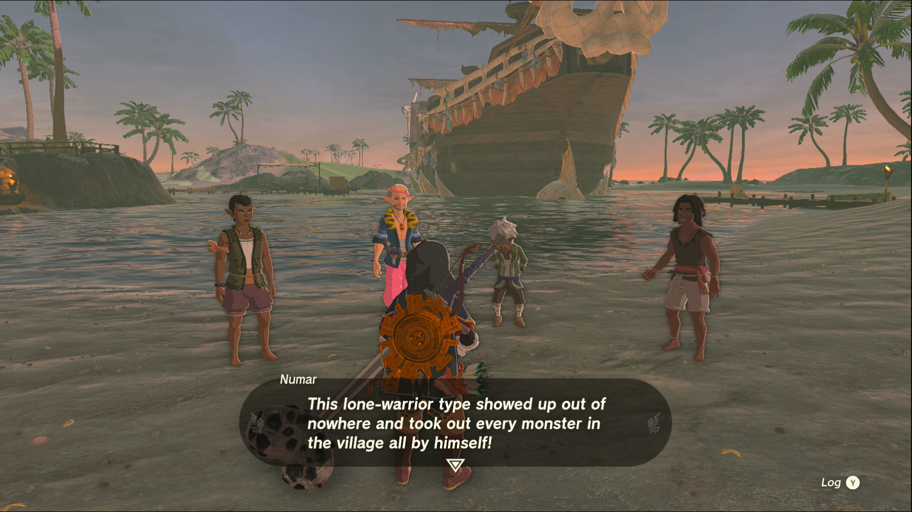

Ruffian-Infested Village (Occupiers of Lurelin Village) is a Side Adventure in The Legend of Zelda: Tears of the Kingdom  in which you liberate Lurelin Village from the monster pirates that have taken control. Side Adventures are usually longer side quests that often tell a story. 

## Ruffian-Infested Village

To start the Side Adventure “Ruffian-Infested Village” you need to speak to Rozel, the head of the village, northwest of Lurelin Village. 

He and Bolson are right next to Sifimum Shrine so it’s easier to spot them. He’ll explain how monsters came into the village and scared everyone off. Bolson offers to help him rebuild the village, but first they need the monsters cleared out. 

You need to defeat all the monsters in the village to complete the quest; they’re spread out on the beach and the ship in the bay, but there’s a ‘health bar’ at the top of the screen to help you keep track of how many are left. These enemies can be deceptively powerful, so take your time to clear them out and use your best weapons and arrows. 

Note that you can decide the time and means to defeat the ruffian occupiers yourself -- so if you don't feel powerful enough yet, come back. However, you can also use your "Build" power to assemble some offensive machinery. Homing drones with cannons can be a nice shortcut to clearing an entire area or ship. 

Where is the Last Pirate Ruffian in Lurelin Village? 

Don't worry -- it's not just you! Many people have problems finding the last Bokoblin pirate in Lurelin. There's a hint to his location: smoke rising from the ground. The last monster is likely the one hiding in the well on the north side of the village, so if there’s just a sliver of health on the bar, you probably just need to jump in to finish the job. 

As soon as the last monster is defeated, a couple of the villagers will return immediately. After some words, your quest is complete! This unlocks a side quest with Bolson, “Lurelin Village Restoration Project” which allows you to rebuild the ruined village and bring back some of the villagers that fled. 

Also, make sure to complete the related quest Village Attacked by Pirates to cash in an easy reward. 

Ruffian-Infested Village

See the complete List of Side Quests and Side Adventures

### Up Next: Lurelin Village Restoration Project

Previous

The Mayoral Election

Next

Lurelin Village Restoration Project

### Top Guide Sections

  * Walkthrough
  * Zelda: Tears of The Kingdom Switch 2 Edition Guide
  * Zelda Notes Voice Memories
  * List of Side Quests and Side Adventures

### Was this guide helpful?

Leave feedback

### In This Guide

The Legend of Zelda: Tears of the KingdomNintendo EPD

Initial Release: May 12, 2023

Learn more

Go to comments