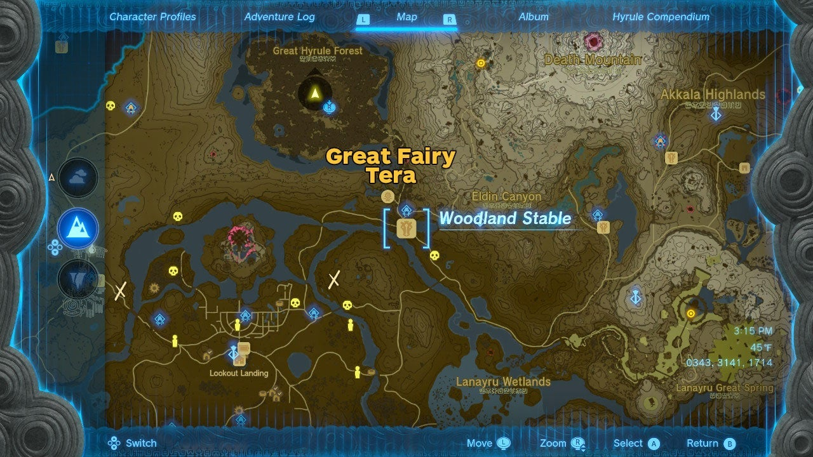
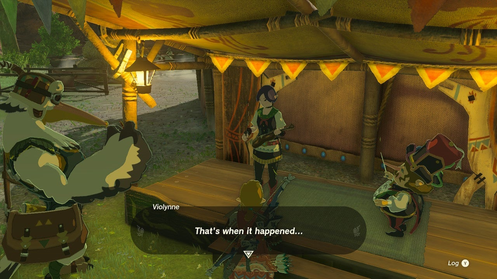
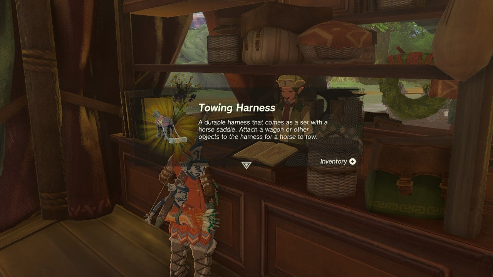
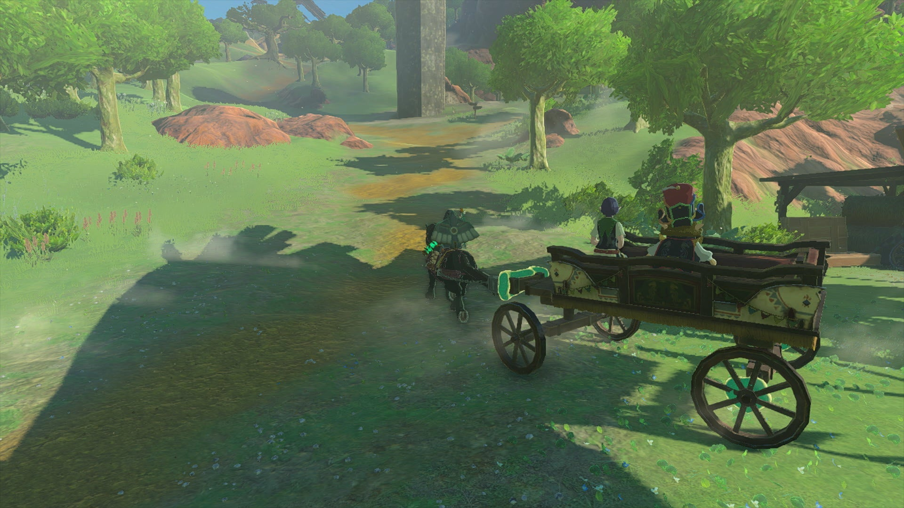
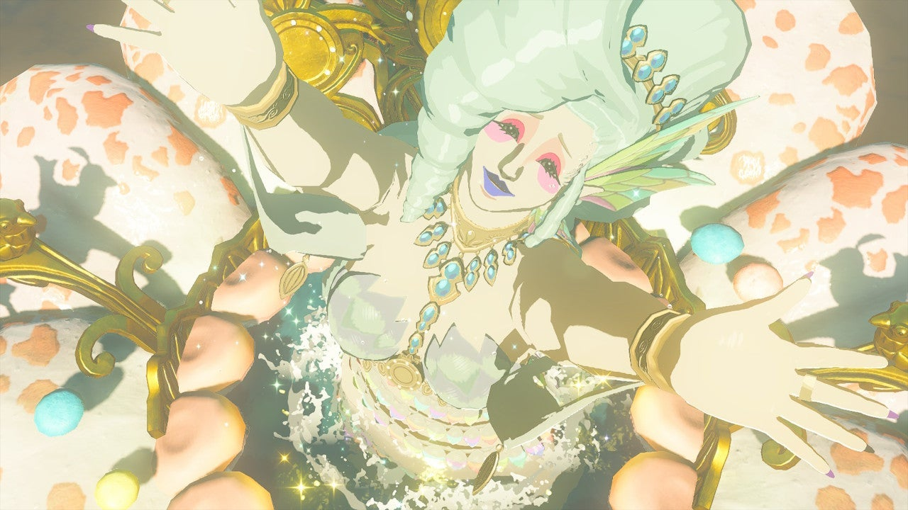
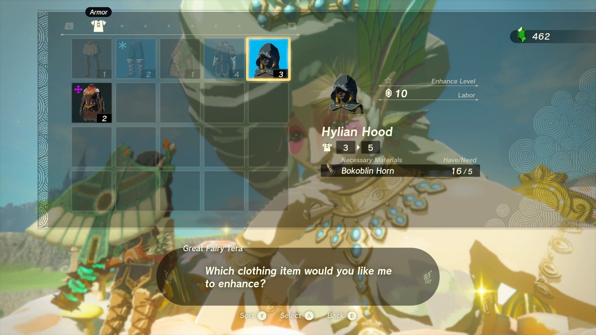

Serenade to a Great Fairy is one of the many Side Adventures Quests in The Legend of Zelda: Tears of the Kingdom. This adventure can only be undertaken once you have become a reporter for the Lucky Glover Gazette, and will have you coax a Great Fairy from her fountain above the Woodland Stable in the Eldin and Great Forest regions. Completing this Side Adventure will unlock a Great Fairy Fountain that you can use to upgrade Link's armor. 

  * **Side Adventure Location:** Woodland Stable, Eldin Canyon Region
  * **Prerequisites:** Start the Potential Princess Sightings questline at the Lucky Clover Gazette below Rito Village
  * **Rewards:** 100 Rupees, Great Fairy Fountain

## How to Tow the Carriage to the Great Fairy

After you've been deputized as a reporter for the Lucky Clover Gazette over in the Tabantha Region, you can find Penn talking to the leader of a musical troupe at the Woodland Stable, located just across the large river northeast of Hyrule Castle. 

Mastro will claim someone looking like Zelda startled their horse, causing it to run off and their carriage to break, rendering them unable to make the journey to the nearby Great Fairy. While in Breath of the Wild, Great Fairies could be coaxed out of their flower buds with a one-time payment, this time around they'll only come out for the sound of specific music. Since the fairy may have also seen Zelda, Penn will leave it to you to find a way to get the fairy out. 

Repairing the carriage (affectionately referred to as Breezer) is a two-fold job. The first part is easy enough, you'll need to add in new wheels, and a stack of four of them can be found right next to you at a construction supply site. 

Next, you'll need to find a way to tow them up to the Great Fairy, which requires a Key Item. This can only be gained by accumulating Pony Points at any of the Stables, and you'll gain more by visiting them, registering new horses, or spending the night. As long as you've visited at least one stable and registered a horse, you should have 3 points - enough to unlock the Tow Harness. 

Speak to the Stablemaster when taking a horse out and ask to customize it, and you'll be able to equip the Tow Harness to your chosen horse (except Epona, as she doesn't do towing). 

With the carriage repaired with four wheels, tell Mastro you're ready to take him to the Great Fairy, and he and his violinist will jump in. Since you can't Ultrahand your horse, carefully Ultrahand the carriage over to your horse, then glue the front of the carriage to the Tow Harness. 

Now you can ride your horse (Carefully!) up the hill and look for the flower bud to the northwest, at the edge of the Training Ground Ruins. So long as you aren't riding wildly, the carriage shouldn't tip over -- but if you're too wild in your movements, you may fail and have to try again. 

Once you reach the top, Mastro will automatically get out and play a song for the Great Fairy Tera, who will be overjoyed to hear the sounds of a violin and show herself. Penn will arrive to take her statement, and Mastro will award you with a Silver Rupee worth 100! 

Unlocking a Great Fairy Fountain means you can now visit this location at any time to offer up materials and a small donation of rupees to upgrade your armor's defensive capabilities. Each armor set requires different materials -- and the more fairies you find, the higher you can improve them. Improving a full set to at least level 2 may also unlock a special set bonus when they are all worn together! 

Serenade to a Great Fairy

After they leave, Great Fairy Tera will ask you to spread the word and help her sisters emerge from their own flower buds, which can be found near stables across Hyrule, and will each start their own quest, plus another to find the musician they seek: 

  * Great Fairy Mjia, north of Snowfield Stable
    * Requires The Missing Horn Player
  * Great Fairy Cotera, southeast of the Dueling Peaks Stable
    * Requires the Missing Drummer
  * Great Fairy Kaysa, north of Outskirt Stable
    * Requires the Missing Flutist

You can check out our full guide on unlocking the Great Fairy Fountains here, or check the individual quest pages above. 

## List of Potential Princess Sighting Side Adventures

Looking for other Potential Princess Sightings to undertake? You can take on the following adventures in any order you choose, which are located at nearly every main Stable in Hyrule. Click on a link below to learn more about it, and how to solve the quest. 

Side Adventure Name  
Starting Settlement / Region

Serenade to a Great Fairy  
Woodland Stable, Eldin Canyon

The Beckoning Woman  
Outskirt Stable, Central Hyrule

Gourmets Gone Missing  
Riverside Stable, Central Hyrule

The Beast and the Princess  
New Serenne Stable, Hyrule Ridge

Zelda's Golden Horse  
Snowfield Stable, Tabantha Tundra

White Goats Gone Missing  
Tabantha Bridge Stable, Hyrule Ridge

For Our Princess!  
Foothill Stable, Eldin

The All-Clucking Cucco  
South Akkala Stable, Akkala

The Missing Farm Tools  
Wetlands Stable, West Necluda

Princess Zelda Kidnapped?!  
Dueling Peaks Stable, West Necluda

An Eerie Voice  
Highland Stable, Faron

The Blocked Well  
Gerudo Canyon Stable, Gerudo

See the complete List of Side Quests and Side Adventures

### Up Next: Serenade to Kaysa

Previous

The Hornist's Dramatic Escape

Next

Serenade to Kaysa

### Top Guide Sections

  * Walkthrough
  * Zelda: Tears of The Kingdom Switch 2 Edition Guide
  * Zelda Notes Voice Memories
  * List of Side Quests and Side Adventures

### Was this guide helpful?

Leave feedback

Go to comments