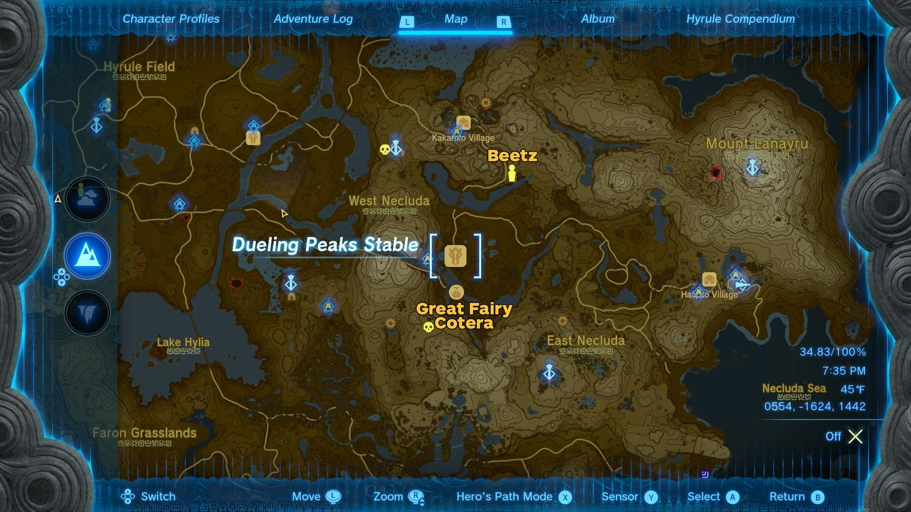
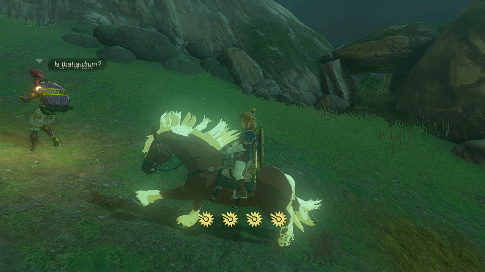
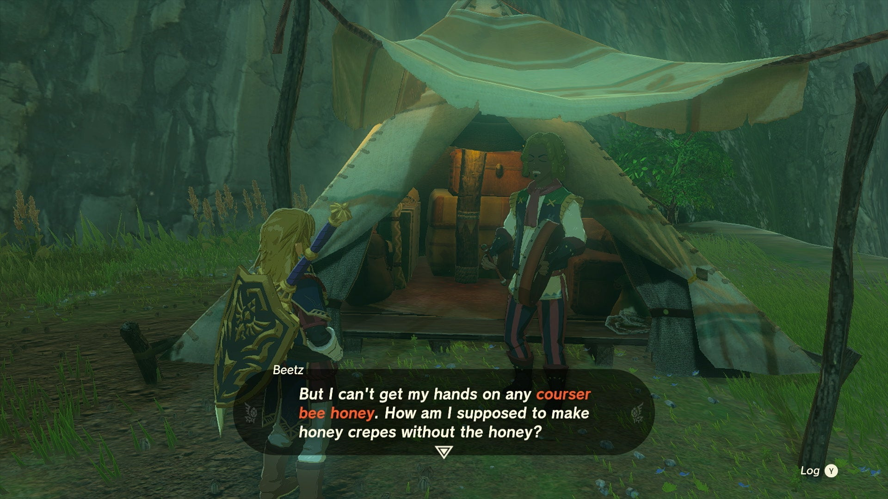
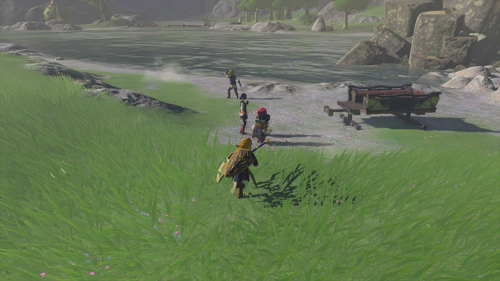
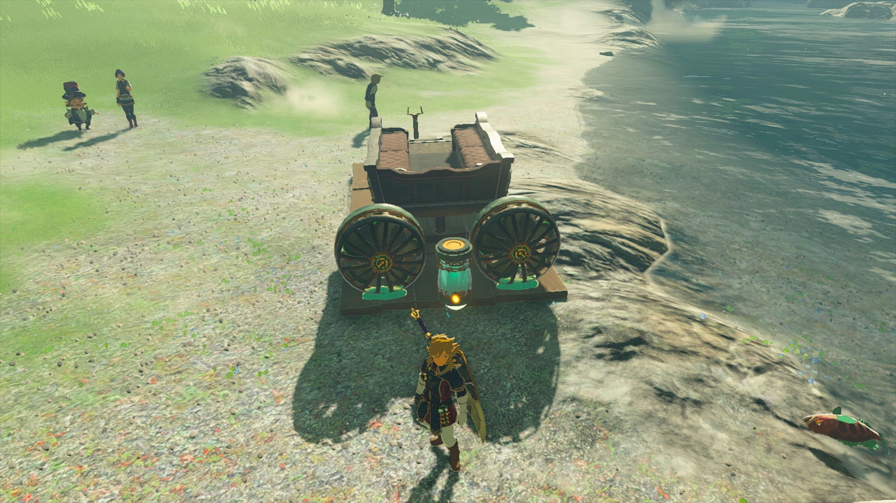
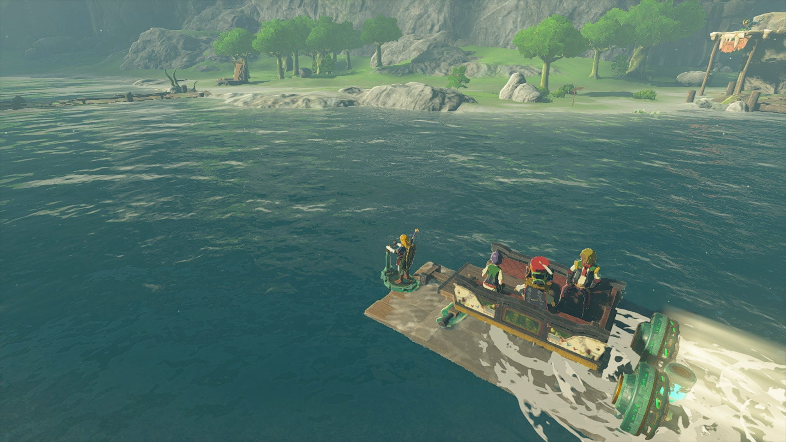

Serenade to Cotera is one of the many Side Adventures Quests in The Legend of Zelda: Tears of the Kingdom. This adventure can only be undertaken once you have become a reporter for the Lucky Glover Gazette, and have coaxed the Great Fairy, Tera, from her fountain above the Woodland Stable in the Eldin and Great Forest regions. 

Cotera is one of three other Great Fairies who can be awoken in any order, and lives near the Dueling Peaks Stable in the West Necluda region, but requires a drummer. Completing this Side Adventure will unlock another Great Fairy Fountain that you can use to upgrade Link's armor to a higher armount. 

  * **Side Adventure Location:** Dueling Peaks Stable, West Necluda Region
  * **Prerequisites:** Start the Potential Princess Sightings questline at the Lucky Clover Gazette below Rito Village, Complete Serenade to a Great Fairy
  * **Rewards:** 100 Rupees, Great Fairy Fountain

## How to Awaken the Great Fairy Cotera

For the Great Fairy Cotera by the Dueling Peaks Stable, you’ll find her across the river from the stable. Trying to speak to her early will only result in her refusal, as she requests the sound of drums. 

However, when speaking to Mastro at the stable, you'll learn that the troupe's drummer, Beetz, is nowhere to be found, though some have reported the sound of drums near Kakariko Village to the north. Note that undertaking this quest from Mastro will prevent him from appearing at any other stable until you finish this one. 

Sure enough, if you head up the winding path to Kakariko Village, you can spot a Gerudo traveler who will mention hearing drums. Close by, there is a somewhat hidden alcove off to the right as the road curves into a canyon towards Kakariko Village (Where Hestu’s Maracas were in Breath of the Wild). 

Beetz can be found in a tent on the other side of the rock alcove, but he won't leave just yet. He requires 3 Courser Bee Honey before he’ll return to the stable — which you hopefully still have for rescuing the horn player). If you don't have them, there are a few places to check close by: 

  * Search the woods behind the Great Fairy Cotera by a Moblin Camp
  * Check the valley behind Kakariko Village near a large chasm entrance.

When you give him the honey, he'll reward you with 100 Rupees for your effort, and head back to join the troupe, but your mission isn't over just yet. Return to Mastro and speak with him, and he'll note the busted bridge makes them unable to reach the Great Fairy. 

Follow them to the riverside where they have placed their carriage to start looking for alternatives. Luckily, the devices you need are all nearby. 

At this point, you need to use your Ultrahand magic to ford the musical troupe cart across the river. Start by placing the carriage upside-down and placing a large wooden platform to the bottom so it will float better. 

Next, place two fans behind the carriage, and put a steering stick at the front by the towing harness area, then right the carriage and place it in the water. This should allow it to float as you drive it across the river and hit the shoreline. 

With Beetz laying down the beat, the troupe will play once more, coaxing Great Fairy Cotera out of hiding, and Mastro will award you with another 100 Rupees. 

Serenade to Cotera

After they leave, Great Fairy Cotera will ask you to spread the word to her remaining sisters if you haven't already, which can be found near stables across Hyrule, and will each start their own quest, plus another to find the musician they seek: 

  * Great Fairy Mjia, north of Snowfield Stable
    * Requires The Missing Horn Player
  * Great Fairy Kaysa, north of Outskirt Stable
    * Requires the Missing Flutist

You can check out our full guide on unlocking the Great Fairy Fountains here, or check the individual quest pages above.

See the complete List of Side Quests and Side Adventures

### Up Next: Serenade to Mija

Previous

Serenade to Kaysa

Next

Serenade to Mija

### Top Guide Sections

  * Walkthrough
  * Zelda: Tears of The Kingdom Switch 2 Edition Guide
  * Zelda Notes Voice Memories
  * List of Side Quests and Side Adventures

### Was this guide helpful?

Leave feedback

### In This Guide

The Legend of Zelda: Tears of the KingdomNintendo EPD

Initial Release: May 12, 2023

Learn more

Go to comments