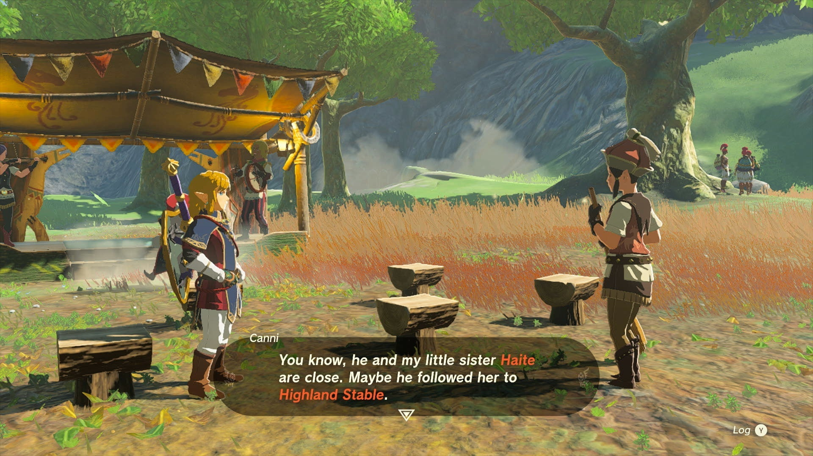
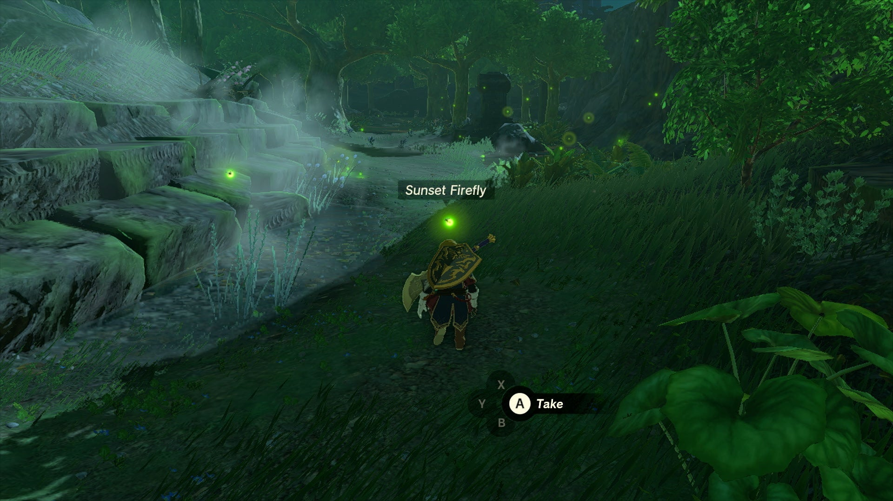
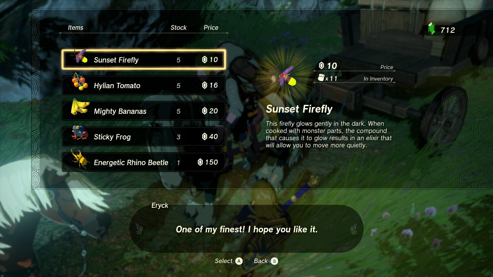
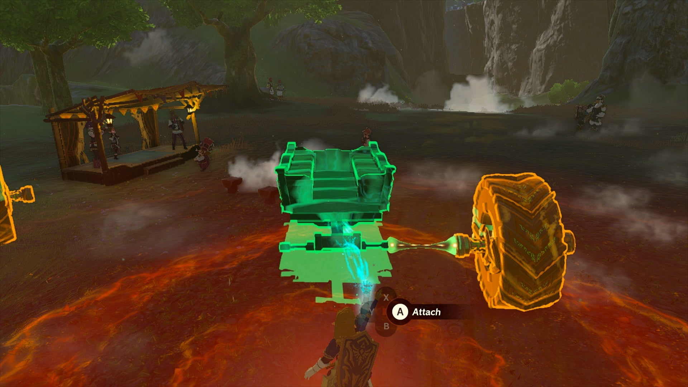
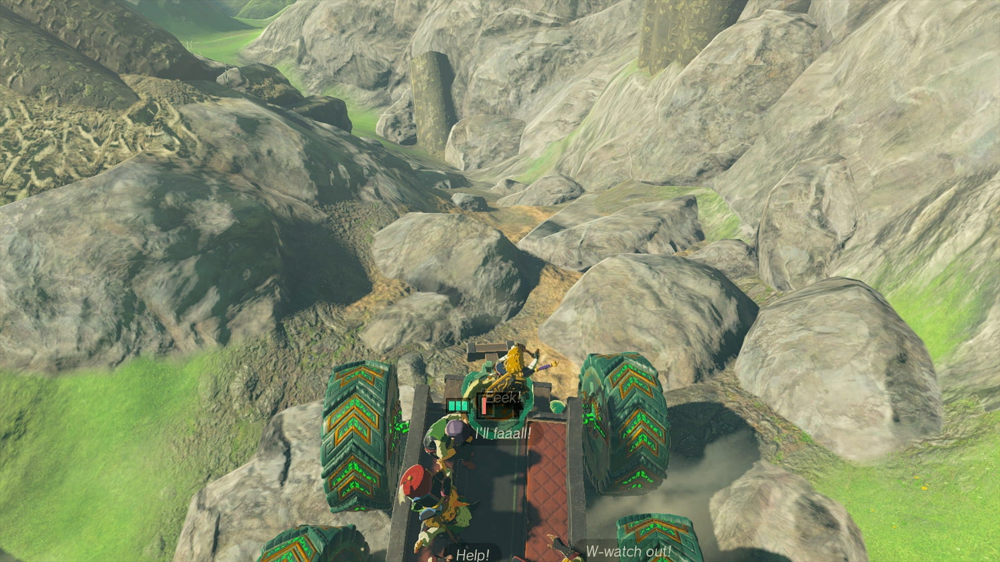

Seranade to Kaysa is one of the many Side Adventures Quests in The Legend of Zelda: Tears of the Kingdom. This adventure can only be undertaken once you have become a reporter for the Lucky Glover Gazette, and have coaxed the Great Fairy, Tera, from her fountain above the Woodland Stable in the Eldin and Great Forest regions. 

Kaysa is one of three other Great Fairies who can be awoken in any order, and lives near the Outskirt Stable in the Central Hyrule region, but requires a flutist player. Completing this Side Adventure will unlock another Great Fairy Fountain that you can use to upgrade Link's armor to a higher armount. 

  * **Side Adventure Location:** Outskirt Stable, South Central Hyrule region
  * **Prerequisites:** Start the Potential Princess Sightings questline at the Lucky Clover Gazette below Rito Village, Complete Serenade to a Great Fairy
  * **Rewards:** 100 Rupees, Great Fairy Fountain

## How to Awaken the Great Fairy Kaysa

The Great Fairy Kaysa is on a sloping mountain north of the Outskirt Stable near the border of the Gerudo Canyon and Great Plateau, and will only come out if she hears a flute playing. 

However, when speaking to Mastro at the stable, you'll learn that the troupe's flutist, Pyper, has run off without a trace, though one of the stablehands will mention that he may have followed their younger sister to another stable in the Faron region to the southeast. Note that undertaking this quest from Mastro will prevent him from appearing at any other stable until you finish this one. 

By following the trail to the Highland Stable south of Lake Hylia (it's better to avoid the bridge for the giant Gleeok guarding it), you can find a girl named Haite who is mad at Pyper, and he vanished into a nearby tree. 

He's actually just outside the stable, up high in a tree, and is trying to find a way to make the girl happy again. In order for him to rejoin the group, he wants 10 Sunset Fireflies to make things right, which you'll need to collect in the forests nearby. 

When nightfall arrives, you can find tons of fireflies in the Pagos, Faron, and Finra Woods north of the stables and plain -- though you may have to contend with wandering Bokobolins or Stalbokoblins. When the area is clear, crouch down and sneak up to collect them. 

If catching them is proving too time-consuming and you have cash to spare, look around the road leading from the stable towards Lake Hylia and you may spot the traveling merchant Eryck, who sells 5 fireflies for only 10 rupees a-piece. 

Return to Pyper with the Fireflies, and he'll ask you to bring Haite over to the tree the following night (she'll sit in the middle of the stable). Once the scene is over, he'll be good to return back to the troupe. 

When he returns to the musical troupe back up north, you’ll need to find a way to offroad their cart up the hill, and luckily, a large zonai device with huge wheels is leaning against a stone slab not far away. 

Take the wheels off the slab and put them on Breezer, and find a steering stick on the other side to also place at the front, and take the thing for a spin up the bumpy road! 

With Pyper playing his flute, the troupe will play once more, coaxing Great Fairy Mija out of hiding, and Mastro will award you with another 100 Rupees. 

Serenade to Kaysa

After they leave, Great Fairy Kaysa will ask you to spread the word to her remaining sisters if you haven't already, which can be found near stables across Hyrule, and will each start their own quest, plus another to find the musician they seek: 

  * Great Fairy Mjia, north of Snowfield Stable
    * Requires The Missing Horn Player
  * Great Fairy Cotera, southeast of the Dueling Peaks Stable
    * Requires the Missing Drummer

You can check out our full guide on unlocking the Great Fairy Fountains here, or check the individual quest pages above.

See the complete List of Side Quests and Side Adventures

### Up Next: Serenade to Cotera

Previous

Serenade to a Great Fairy

Next

Serenade to Cotera

### Top Guide Sections

  * Walkthrough
  * Zelda: Tears of The Kingdom Switch 2 Edition Guide
  * Zelda Notes Voice Memories
  * List of Side Quests and Side Adventures

### Was this guide helpful?

Leave feedback

### In This Guide

The Legend of Zelda: Tears of the KingdomNintendo EPD

Initial Release: May 12, 2023

Learn more

Go to comments