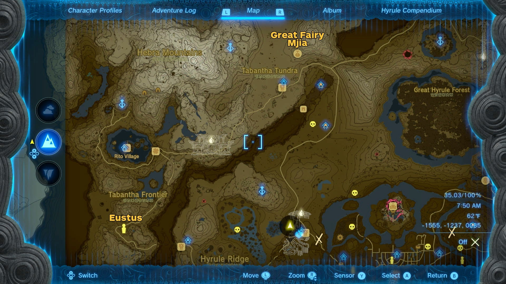
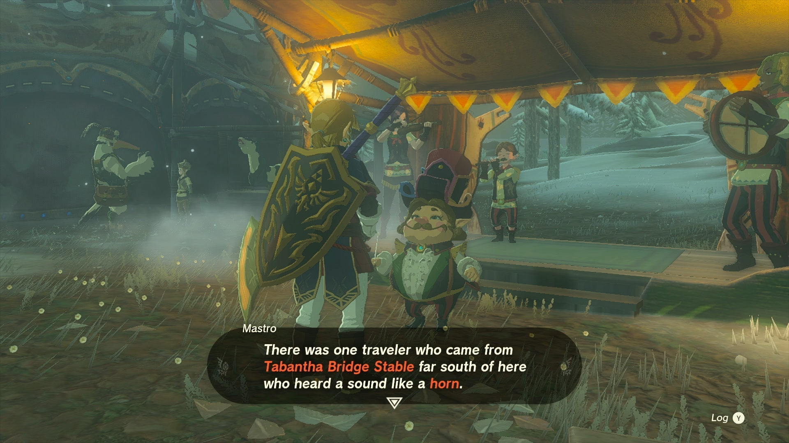
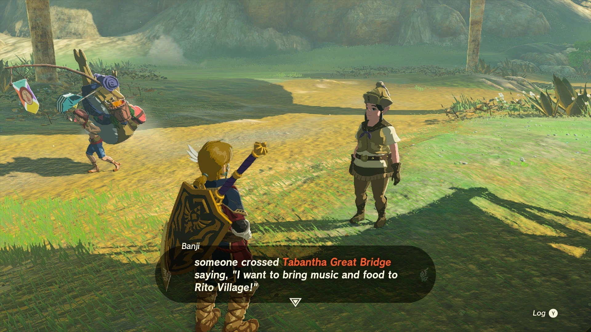
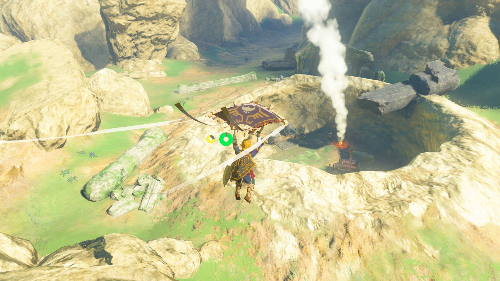
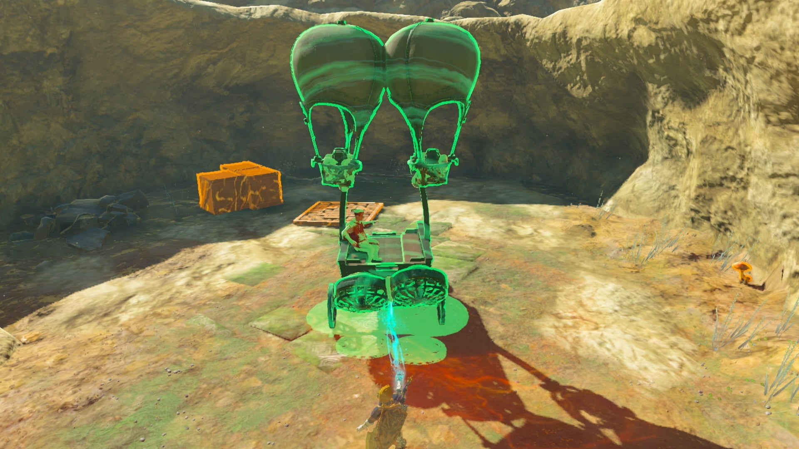
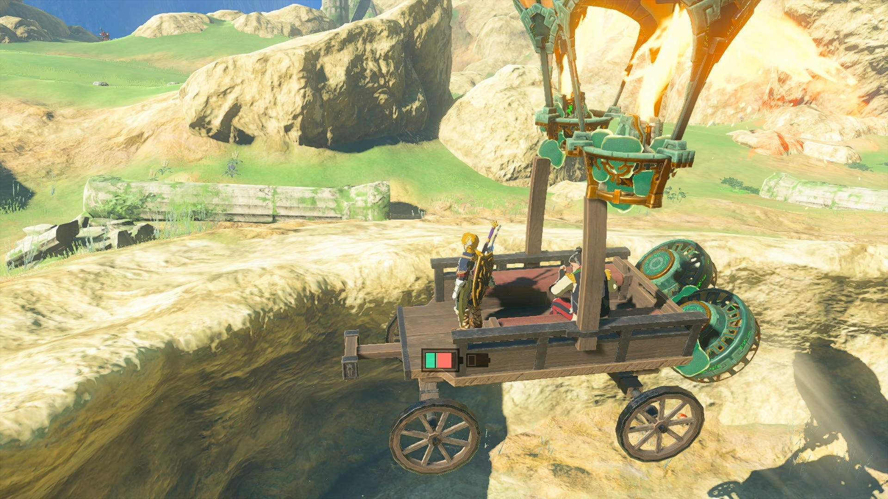
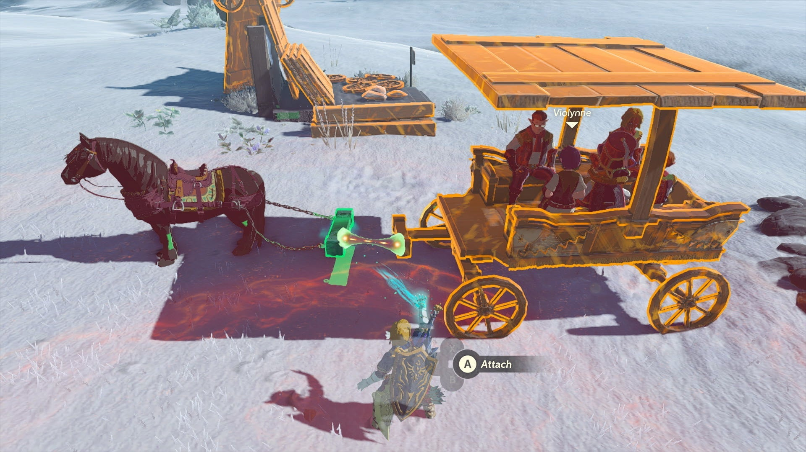

Serenade to Mija is one of the many Side Adventures Quests in The Legend of Zelda: Tears of the Kingdom. This adventure can only be undertaken once you have become a reporter for the Lucky Glover Gazette, and have coaxed the Great Fairy, Tera, from her fountain above the Woodland Stable in the Eldin and Great Forest regions. 

Mija is one of three other Great Fairies who can be awoken in any order, and lives near the Snowfield Stable in the Tabantha Tundra region, but requires a hornist player. Completing this Side Adventure will unlock another Great Fairy Fountain that you can use to upgrade Link's armor to a higher armount. 

  * **Side Adventure Location:** Snowfield Stable, Tabantha Tundra Region
  * **Prerequisites:** Start the Potential Princess Sightings questline at the Lucky Clover Gazette below Rito Village, Complete Serenade to a Great Fairy
  * **Rewards:** 100 Rupees, Great Fairy Fountain

## How to Awaken the Great Fairy Mija

The Great Fairy Mija is on a sloping mountain north of the Snowfield Stable and to the far northwest of the Woodland Stable where the first Great Fairy is, and requests the sound of a horn. 

However, when speaking to Mastro at the stable, you'll learn that the troupe's hornist, Eustus, mysteriously vanished, and was last seen near the Tabantha Bridge Stable. Note that undertaking this quest from Mastro will prevent him from appearing at any other stable until you finish this one. 

If you follow the lead and visit the stable, one of the stablehands will mention that the hornist was going to bring supplies to Rito Village in his wagon, but was warned of the treacherous path and the large holes that had recently opened up. 

Sure enough, you'll find Eustus trapped in a large hole along the road west of the Tabantha Great Bridge and stable. Look for the smoke signal coming from a large crater as you follow the road north and north east from the great bridge. 

Talking to Eustus, he'll request aid in freeing himself from this predicament, starting The Hornist's Dramatic Escape. 

Luckily, all the tools you need to help him escape are located in the pit alongside his broken wagon -- though you're free to get creative if you have other devices on hand. 

A simple method to airlift his wagon out: Either put a flat roof over his wagon and place a balloon above, or stick two balloons to each post and fit them with Flame Emitters. Since you also need him to move forward as well as upward, place two Fans at an angle at the back of the wagon, then tell him to get in. Place the wagon at the far side to give it a head start to get some lift, and you should be able to make it out in one piece. 

Eustus will gladly rejoin the troupe, rewarding you with some courser bee honey — be sure to hang onto these if you haven't awoken the Great Fairy Cotera! 

Once back at the Snowfield Stable, Mastro will be happy to make the trip to Great Fairy Mija with Eustus in tow - only you’ll need to give their carriage a roof, which can easily be done by placing a wooden plank over the two support beams. 

Bring out your horse again with a Towing Harness, and carefully attach it, then make the straightforward trip across the tundra to Mija (and watch out for marauding bokoblins on horseback). If they get close enough to give you trouble, swivel around and fire off arrows with Keese Eyes so you don't need to aim. 

With Eustus leading on his horn, the troupe will play once more, coaxing Great Fairy Mija out of hiding, and Mastro will award you with another 100 Rupees. 

Serenade to Mija

After they leave, Great Fairy Mija will ask you to spread the word to her remaining sisters if you haven't already, which can be found near stables across Hyrule, and will each start their own quest, plus another to find the musician they seek: 

  * Great Fairy Cotera, southeast of the Dueling Peaks Stable
    * Requires the Missing Drummer
  * Great Fairy Kaysa, north of Outskirt Stable
    * Requires the Missing Flutist

You can check out our full guide on unlocking the Great Fairy Fountains here, or check the individual quest pages above.

See the complete List of Side Quests and Side Adventures

### Up Next: Bring Peace to Hyrule Field!

Previous

Serenade to Cotera

Next

Bring Peace to Hyrule Field!

### Top Guide Sections

  * Walkthrough
  * Zelda: Tears of The Kingdom Switch 2 Edition Guide
  * Zelda Notes Voice Memories
  * List of Side Quests and Side Adventures

### Was this guide helpful?

Leave feedback

Go to comments