Team Cece or Team Reede? is a Side Adventure in The Legend of Zelda: Tears of the Kingdom in which you resolve a feud that’s dividing Hateno Village. Side Adventures are short quests that tell a story. In Team Cece or Team Reede, you'll need to find Reede's supporters and bribe them with Hylian Shrooms. 

## Team Cece or Team Reede?

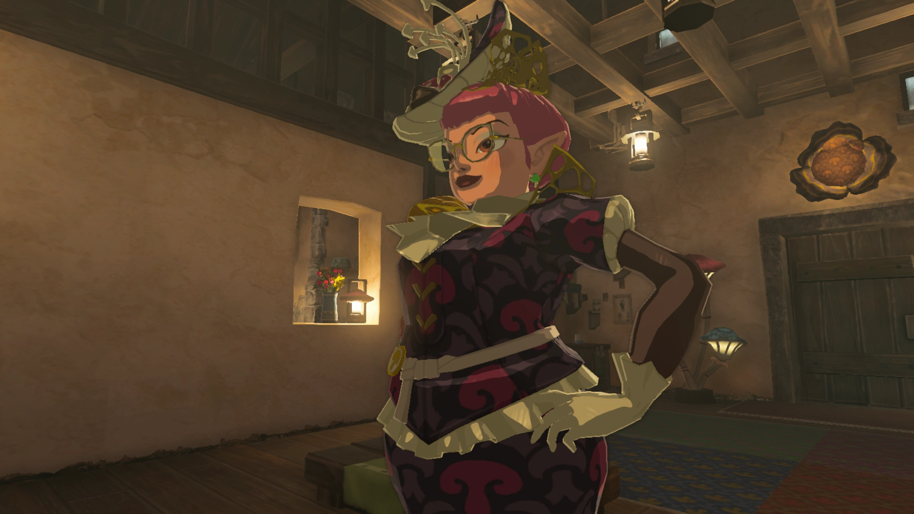

To start the Side Adventure “Team Cece or Team Reede?" you need to speak to the people gathered outside of Ventest Clothing. This results in granting you access to the boutique for an exhibition, but speaking to Cece starts a conversation that brings her apparent feud with Mayor Reede to a head. 

Now you’re tasked with helping to resolve the election, and Cece is quick to recruit you to her team. Starting this Side Adventure allows you to also start another bunch of Side Adventures vital to the election. You can accept “**Cece’s Secret**” from Sophie, who should be standing right outside the shop, and “**Reede’s Secret**” from his wife Clavia, who is wandering around the village. Meanwhile, Reede could use your help in the quest “**A New Signature Food**.” 

To help Cece, you’ll need to distribute the Hylian Shrooms she gives you to the villagers that support Reede. You can ignore children, Hateno Lab researchers and traveling vendors, but other than that there are 8 villagers that need a mushroom. 

## Reede's Supporter Locations

If you need help locating Reede’s voters, ask Cece and she’ll give you some hints for the remaining villagers, but we've listed the villagers below in addition to some screenshots. 

  1. **Uma** is the older woman tending to **the school’s farm**. She can also be found on the path to the Hateno Ancient Tech Lab. 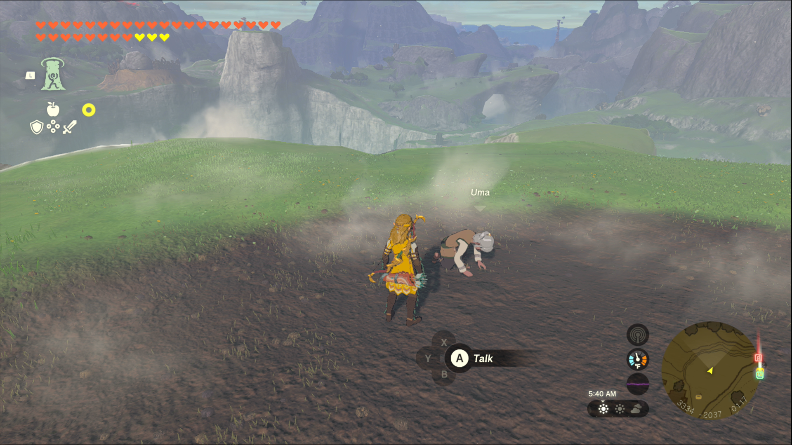 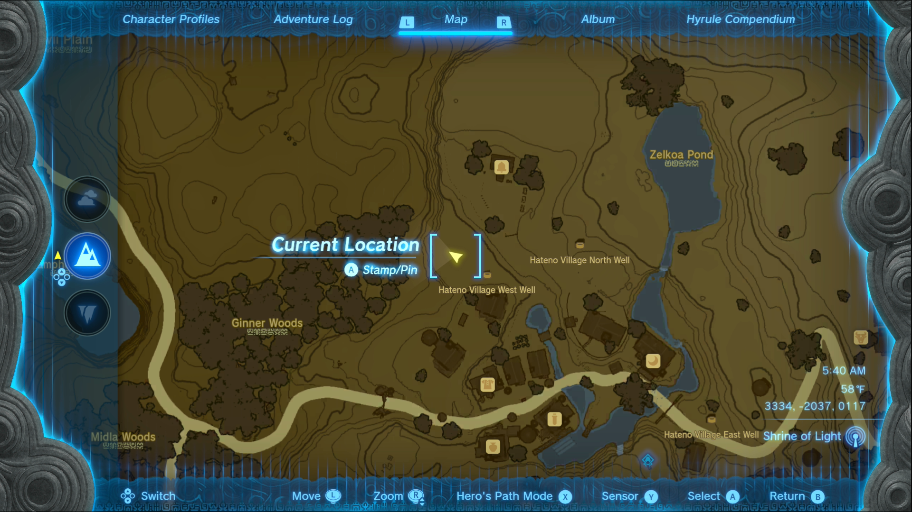
  2. **Worten** is usually hanging **around the inn, either behind the counter or in the common area**.****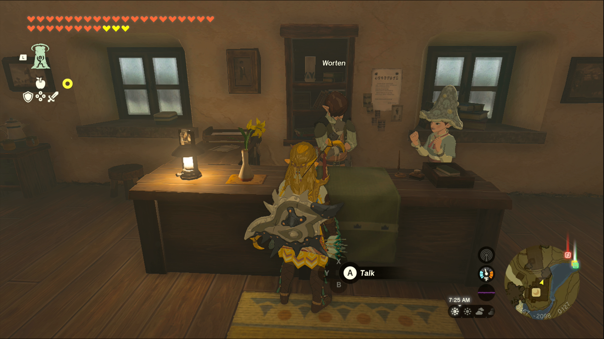 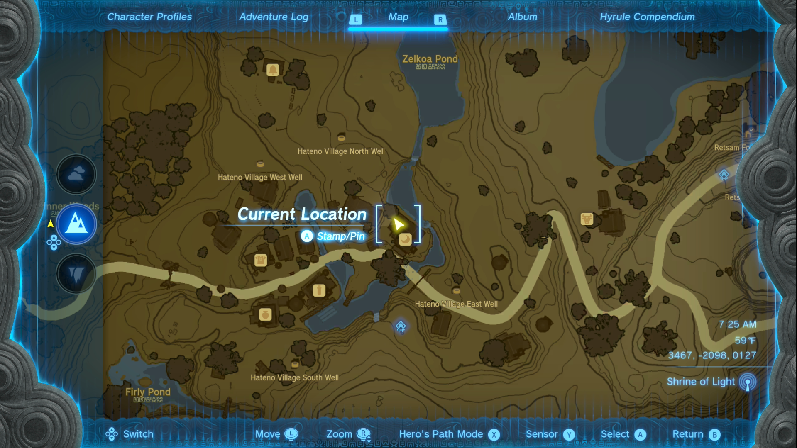
  3. **Dantz at the Hateno Pasture** can receive a mushroom. 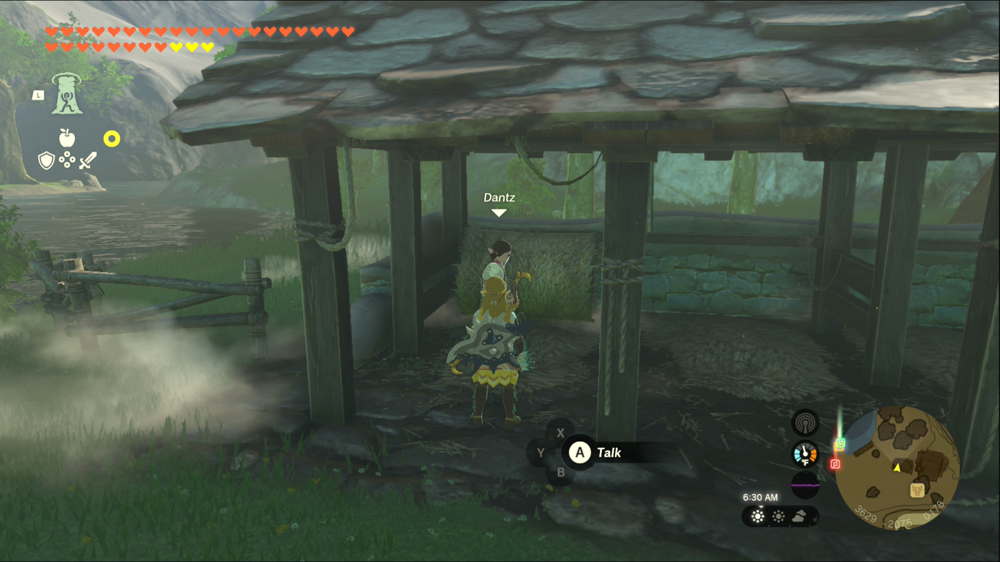 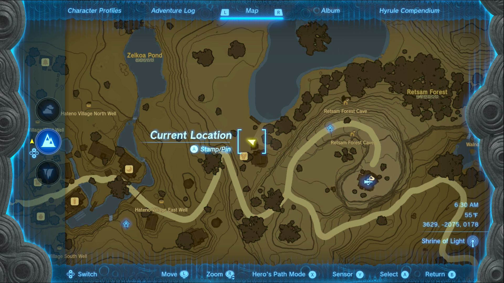
  4. **Koyin at the Hateno Pasture** can also receive a mushroom. She'll be inside the house if you completed the Side Quest A Letter to Koyin.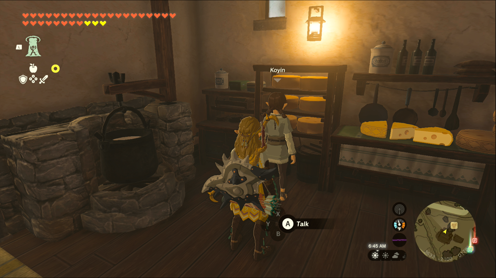 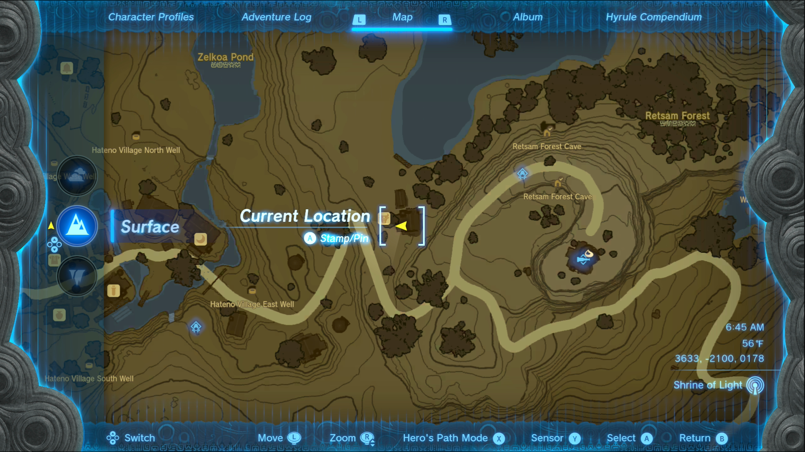
  5. **Tamana** is the woman who acts as the **gatekeeper at night.** 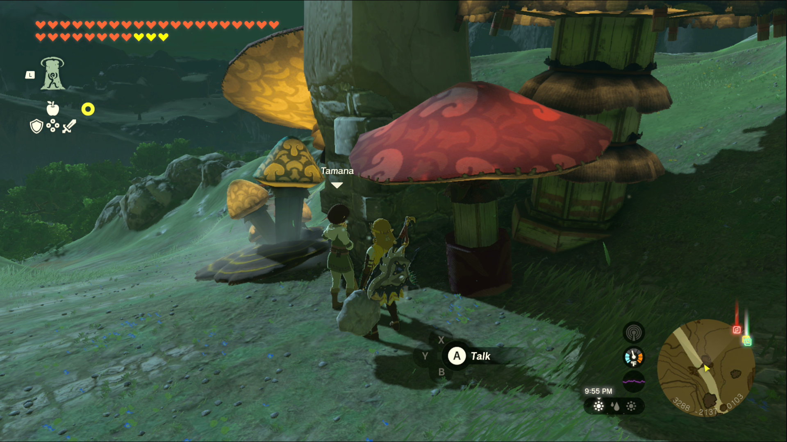 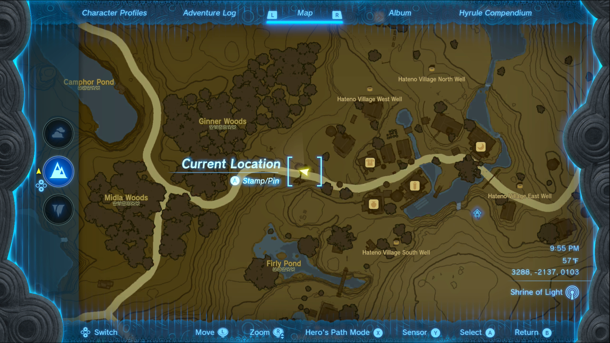
  6. **Medda** (the tomato farmer) will be **in his home on the hill on the south side of the village**. He’s only there at night but he won’t stop working during the day to accept a mushroom. 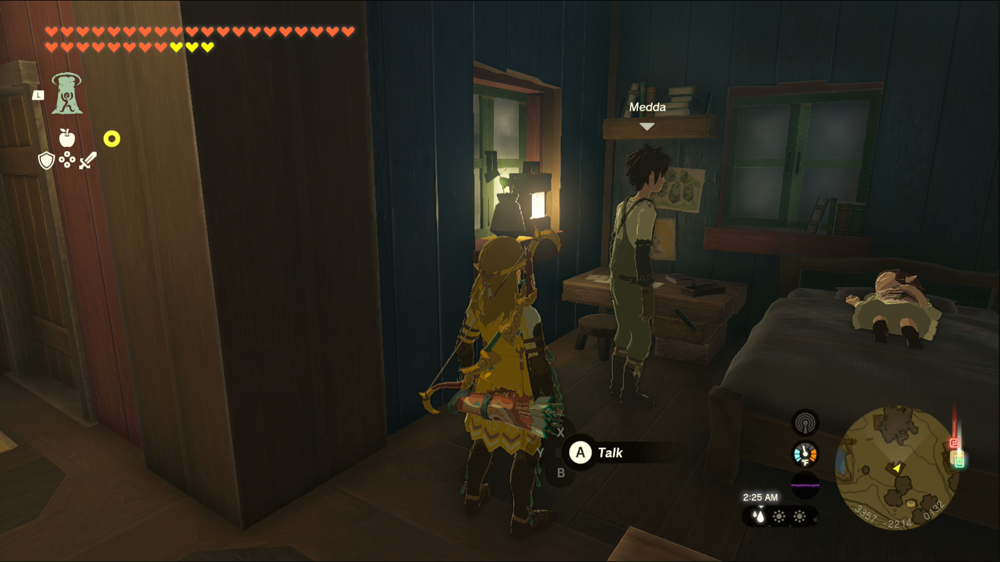 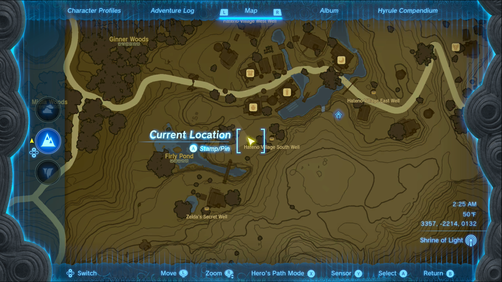
  7. **Leop** can be found**wandering up and down the path leading to the Market square** in the daytime.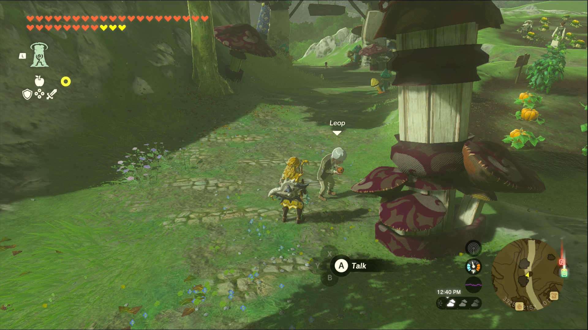 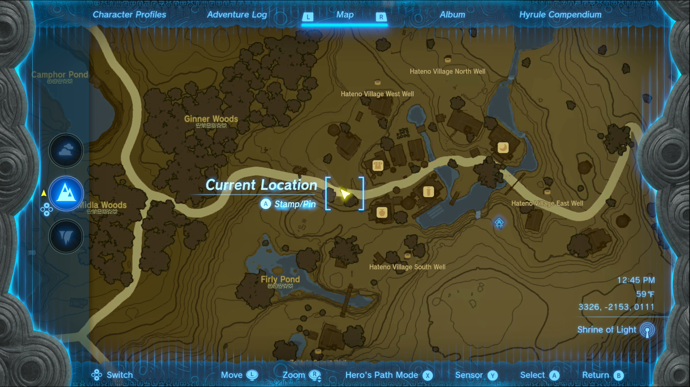
  8. **Tokk** **spends his day walking up to the Hateno Ancient Tech Lab**.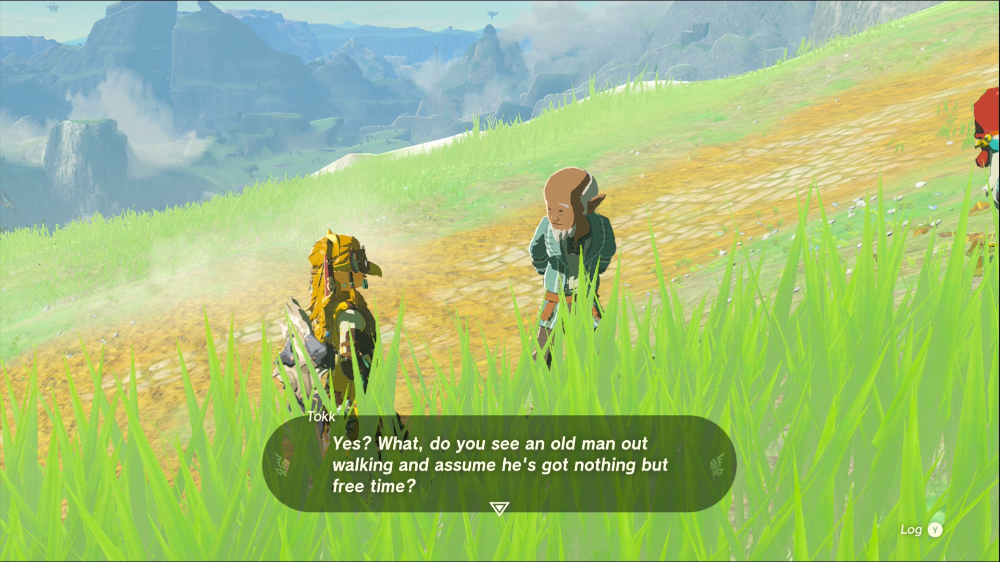 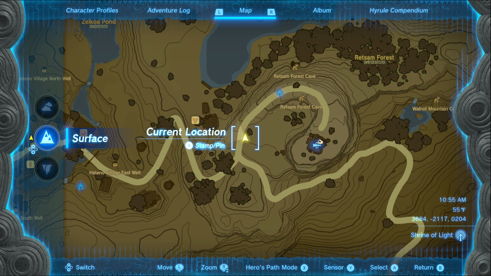

Once you’ve given all of Reede’s supporters the mushrooms, check back in with Cece, where she’ll give you a **Big Hearty Truffle** as a reward. If you’ve done all the other quests, you’ll start another automatically, “**The Mayoral Election**.” 

Team Cece or Team Reede?

See the complete List of Side Quests and Side Adventures

### Up Next: The Mayoral Election

Previous

Cece's Secret

Next

The Mayoral Election

### Top Guide Sections

  * Walkthrough
  * Zelda: Tears of The Kingdom Switch 2 Edition Guide
  * Zelda Notes Voice Memories
  * List of Side Quests and Side Adventures

### Was this guide helpful?

Leave feedback

### In This Guide

The Legend of Zelda: Tears of the KingdomNintendo EPD

Initial Release: May 12, 2023

Learn more

Go to comments