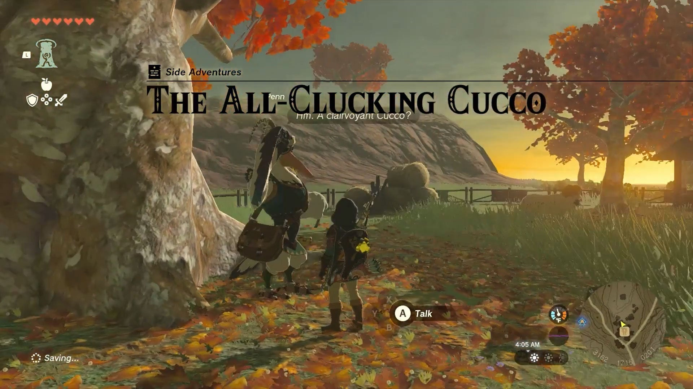
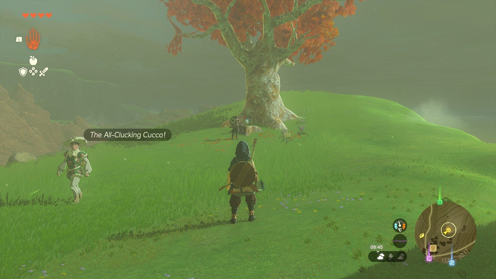
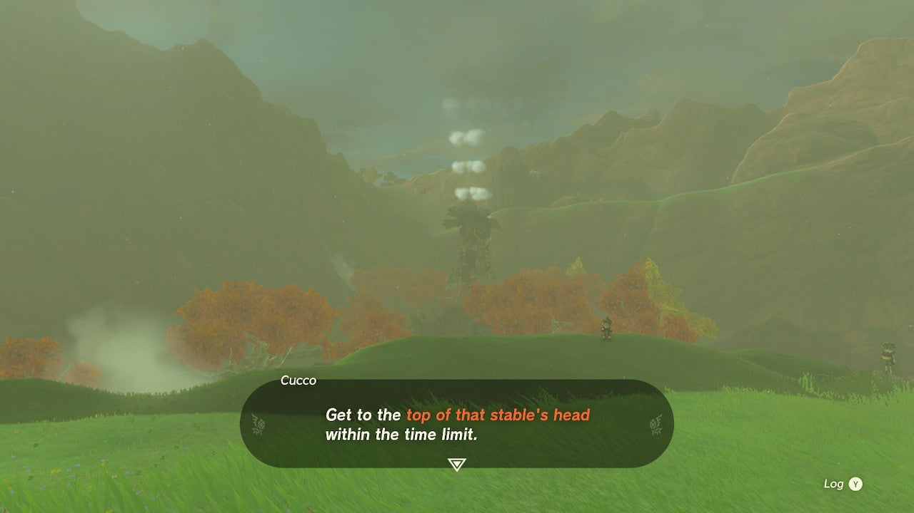
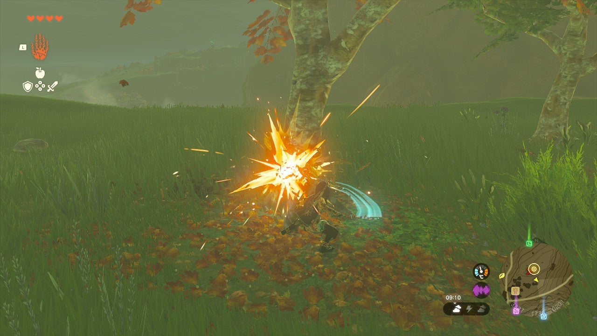
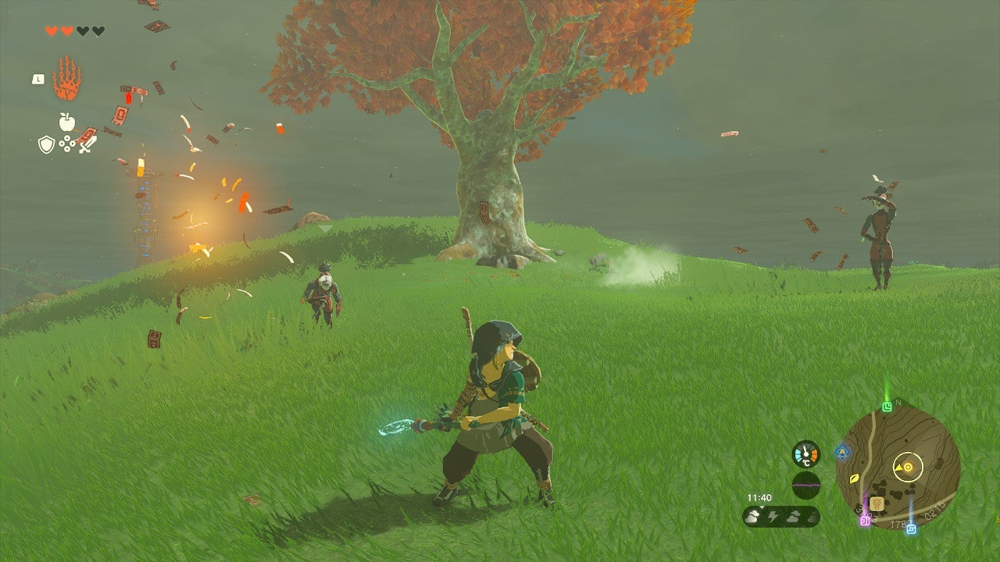

In your quest to find Zelda, you and your Lucky Clover Gazette colleague Penn come across a prophetic cucco. This side adventure, called The All-Clucking Cucco, takes place in the Akkala region. 

As this Tears of the Kingdom quest involves three tricky trials, here's how to complete **The All-Clucking Cucco**. 

  * **Quest Giver:** Penn
  * **Prerequisites** : Begin the Potential Princess Sighting! questline at the Lucky Clover Gazette
  * **Reward:** Rupees

The All-Clucking Cucco side adventure is part of the **Potential Princess Sightings** questline. After starting the Potential Princess Sightings quest at the Lucky Glover Gazette (in the Hebra Mountains), you can travel to the South Akkala stable to speak to **Penn** (coordinates 3163, 1713, 0201), which will trigger the All-Clucking Cucco quest. 

  
The cucco is a bit further northeast, on top of the grassy hill. Speak to him and he'll give you a trial: **reach the top of the South Akkala Stable** within the time limit. You can use any means to get there, but simply running and climbing should suffice. 

As part of the second trial, you need to **collect three logs** and bring them back to the cucco. Chop down the nearby trees (use an axe if you have one) and use the Ultrahand ability to take the logs uphill. To save time, glue the three logs together (still using Ultrahand) and bring them back in one go. 

Finally, be prepared to **fight three ninjas from the Yiga Clan**. You may use the large tree to avoid getting overwhelmed (climb it, then shoot arrows at the ninjas). 

Finish the fight to complete The All-Clucking Cucco side adventure. Penn will give you a reward in the form of **rupees** , but the exact amount depends on your progress in the Potential Princess Sightings questline. 

The All-Clucking Cucco

## List of Potential Princess Sighting Side Adventures

Looking for other Potential Princess Sightings to undertake? You can take on the following adventures in any order you choose, which are located at nearly every main Stable in Hyrule. Click on a link below to learn more about it, and how to solve the quest. 

Side Adventure Name  
Starting Settlement / Region

Serenade to a Great Fairy  
Woodland Stable, Eldin Canyon

The Beckoning Woman  
Outskirt Stable, Central Hyrule

Gourmets Gone Missing  
Riverside Stable, Central Hyrule

The Beast and the Princess  
New Serenne Stable, Hyrule Ridge

Zelda's Golden Horse  
Snowfield Stable, Tabantha Tundra

White Goats Gone Missing  
Tabantha Bridge Stable, Hyrule Ridge

For Our Princess!  
Foothill Stable, Eldin

The All-Clucking Cucco  
South Akkala Stable, Akkala

The Missing Farm Tools  
Wetlands Stable, West Necluda

Princess Zelda Kidnapped?!  
Dueling Peaks Stable, West Necluda

An Eerie Voice  
Highland Stable, Faron

The Blocked Well  
Gerudo Canyon Stable, Gerudo

See the complete List of Side Quests and Side Adventures

### Up Next: The Missing Farm Tools

Previous

For Our Princess!

Next

The Missing Farm Tools

### Top Guide Sections

  * Walkthrough
  * Zelda: Tears of The Kingdom Switch 2 Edition Guide
  * Zelda Notes Voice Memories
  * List of Side Quests and Side Adventures

### Was this guide helpful?

Leave feedback

Go to comments