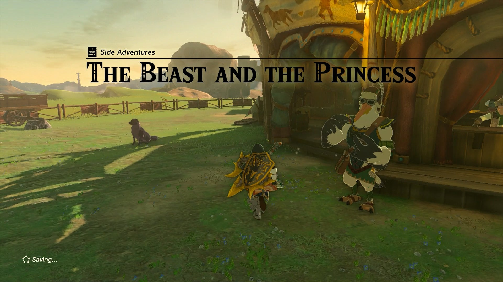
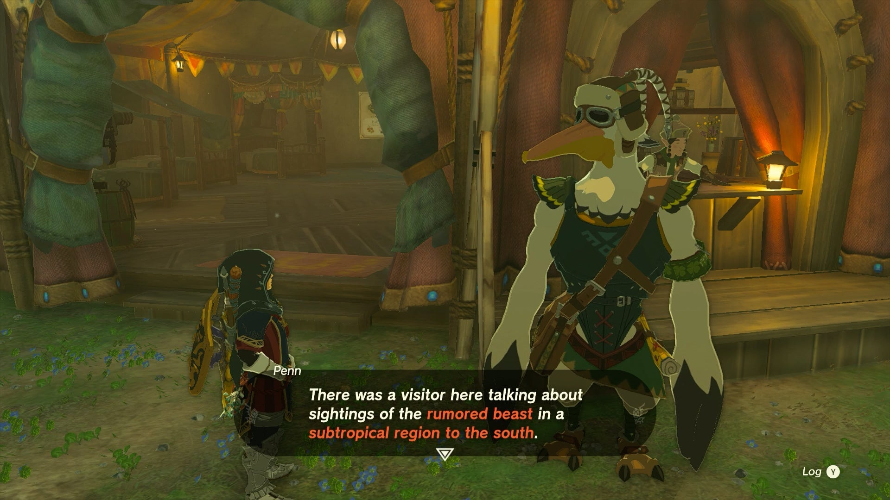
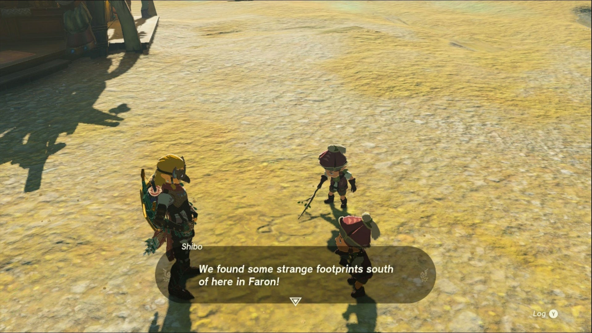
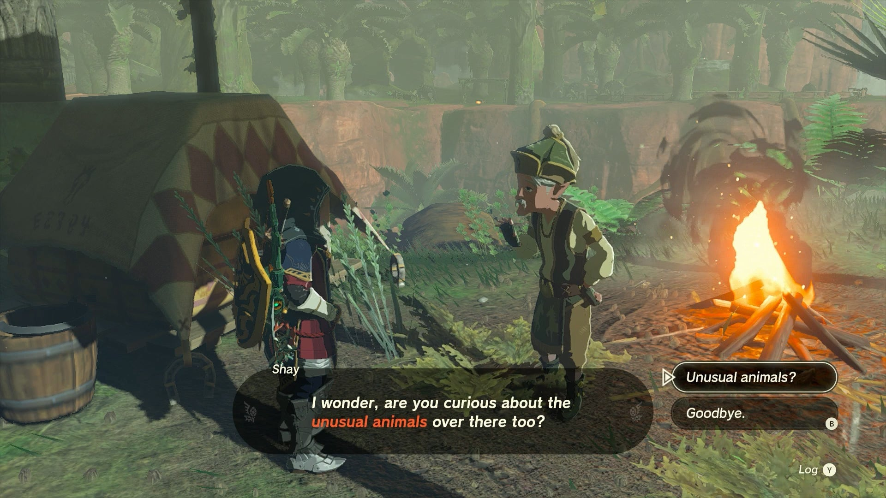
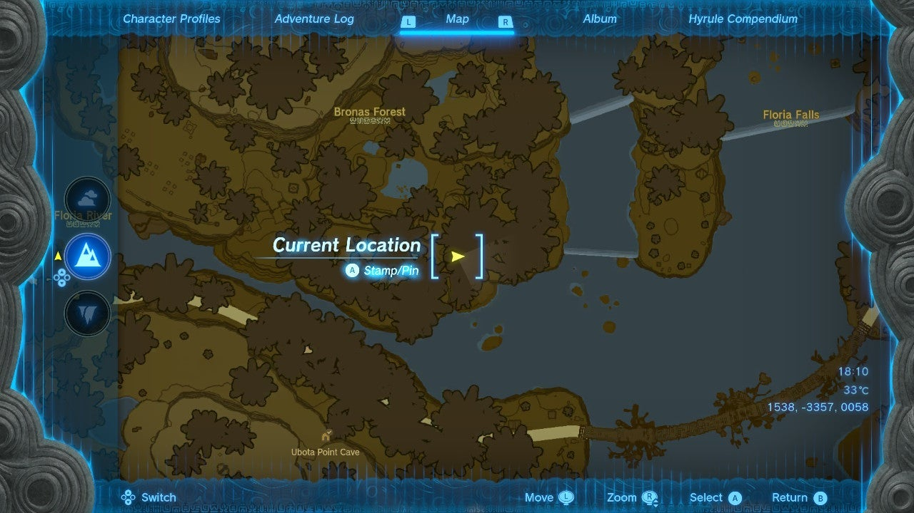
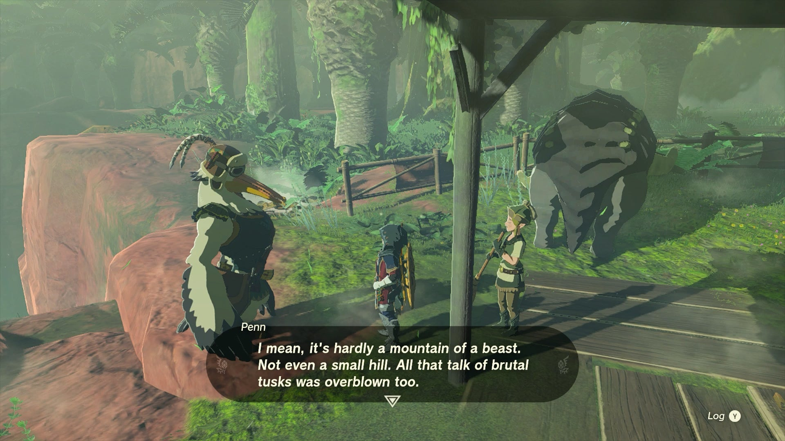
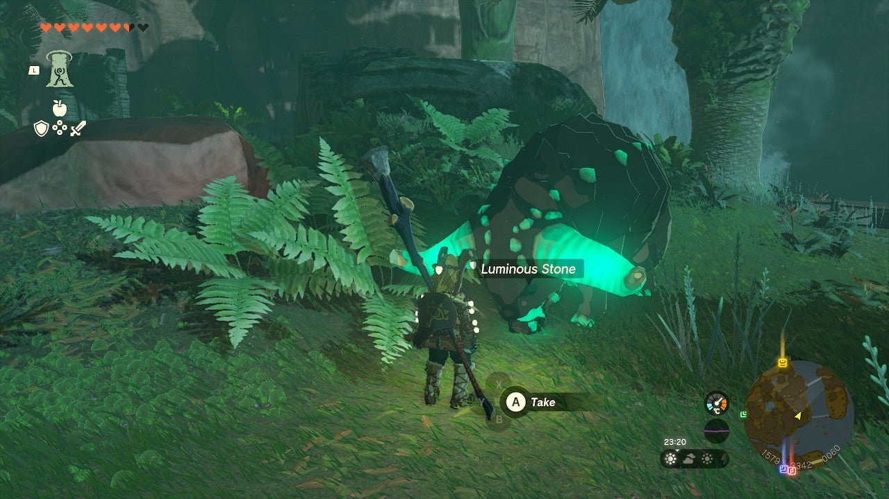

**The Beast and the Princess** is a Side Adventure associated with the **Potential Princess Sightings** line of quests. These quests begin at every stable across Hyrule and are part of your investigative journalism work for the **Lucky Clover Gazette**. 

In this Tears of the Kingdom guide, we will walk you through the **Beast and the Princess** Side Adventure so you can get one step closer to finding this mysterious Princess Zelda figure that people have been reporting all across Hyrule. 

  * Quest Giver: Penn
  * Prerequisites: Begin the Potential Princess Sighting! questline at the Lucky Clover Gazette
  * Reward: Rupees

While this quest ends at Lakeside Stable in the Faron region, it begins at the **New Serenne Stable** in Hyrule Ridge, so head over there and speak to **Penn**. 

Penn has heard some disturbing rumors of Princess Zelda commanding vicious and scary beasts that many of the different stables seem to be trading rumors of, but their exact location seems to be unknown. As you travel to different stables, you'll likely see these rumors yourself: 

  * The Tabantha and South Akkala Stables have hand drawn depictions of the strange beasts
  * The Foothill and Wetland Stables have drawings of the footprints left by the beast

Finally, if you travel to the Dueling Peaks Stable, you can talk to the pair of boys outside drawing footprints in the dirt to hear about how the first saw the footprint in the Faron region to the south - and that will be your major clue. 

Travel to the Lakeside Stable in the far southern Faron region, by following the road south of Lake Hylia (avoiding the Gleeok) and into the jungle until you reach Lake Floria. Just outside the stable is an old man named Shay who will draw your attention to a beast sanctuary across the gorge. 

Paraglide across the narrow gap to find the mysterious beasts in question: they are Dondons, and a caretaker named Cima has been watching over them ever since Princess Zelda left them in her care. Apparently Zelda once rode one around the sanctuary, which is how the rumor got started! The exact coordinates of the field are 1538, -3357, 0058. 

After meeting the mysterious and adorable Dondon, Penn will appear to verify these mysterious beasts for himself. Once he is satisfied with his news story, he'll rush off to write up his next article for the Lucky Clover Gazette -- but not before giving you your **wages in Rupees** as a reward, though. 

_This reward depends on how far along you are in the Potential Princess Sightings! Side Adventure._

The Beast and the Princess

Note that if you interact with the nearby jewels and ore, you'll find out that the Dondon apparently eat Luminous Stones that you can drop for them, and will later... "deposit" random ore on the ground for you! 

## List of Potential Princess Sighting Side Adventures

Looking for other Potential Princess Sightings to undertake? You can take on the following adventures in any order you choose, which are located at nearly every main Stable in Hyrule. Click on a link below to learn more about it, and how to solve the quest. 

Side Adventure Name  
Starting Settlement / Region

Serenade to a Great Fairy  
Woodland Stable, Eldin Canyon

The Beckoning Woman  
Outskirt Stable, Central Hyrule

Gourmets Gone Missing  
Riverside Stable, Central Hyrule

The Beast and the Princess  
New Serenne Stable, Hyrule Ridge

Zelda's Golden Horse  
Snowfield Stable, Tabantha Tundra

White Goats Gone Missing  
Tabantha Bridge Stable, Hyrule Ridge

For Our Princess!  
Foothill Stable, Eldin

The All-Clucking Cucco  
South Akkala Stable, Akkala

The Missing Farm Tools  
Wetlands Stable, West Necluda

Princess Zelda Kidnapped?!  
Dueling Peaks Stable, West Necluda

An Eerie Voice  
Highland Stable, Faron

The Blocked Well  
Gerudo Canyon Stable, Gerudo

See the complete List of Side Quests and Side Adventures

### Up Next: Zelda's Golden Horse

Previous

Gourmets Gone Missing

Next

Zelda's Golden Horse

### Top Guide Sections

  * Walkthrough
  * Zelda: Tears of The Kingdom Switch 2 Edition Guide
  * Zelda Notes Voice Memories
  * List of Side Quests and Side Adventures

### Was this guide helpful?

Leave feedback

Go to comments