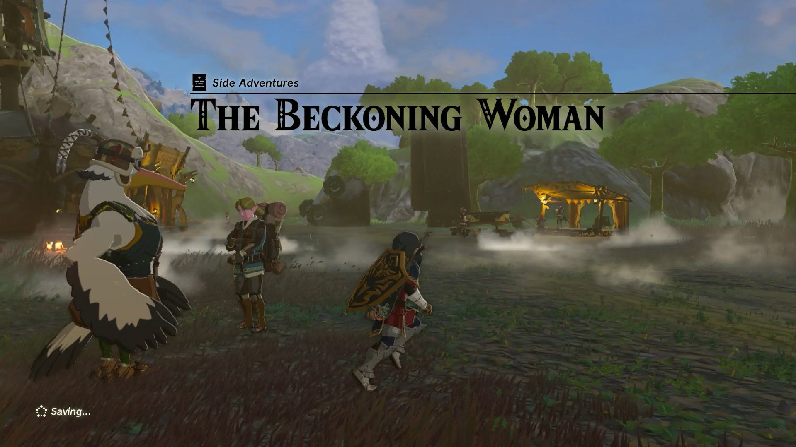
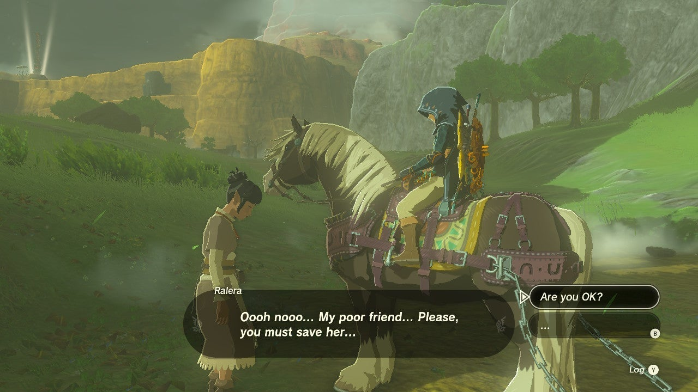
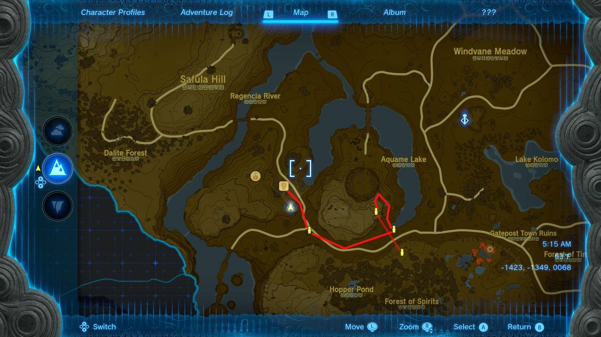
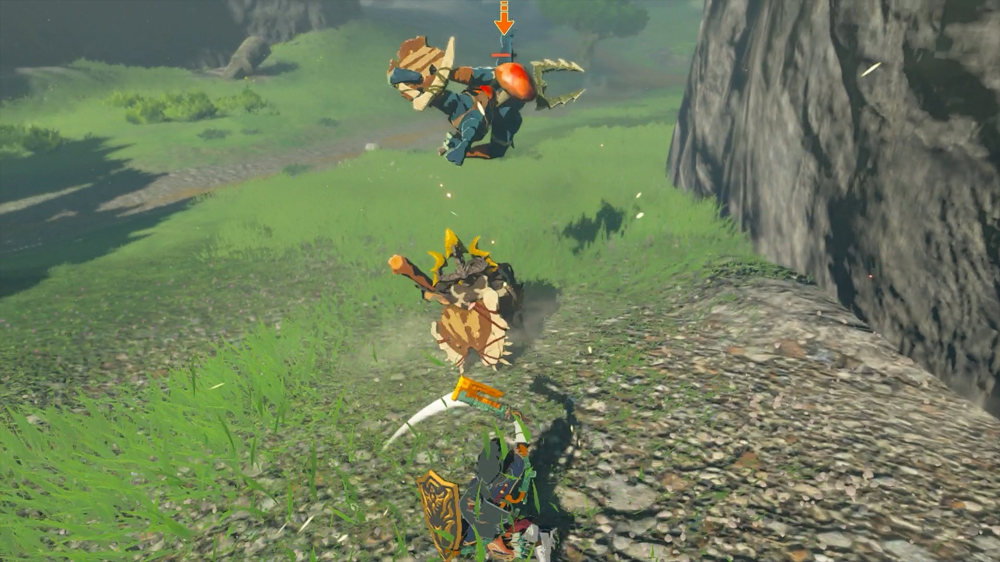
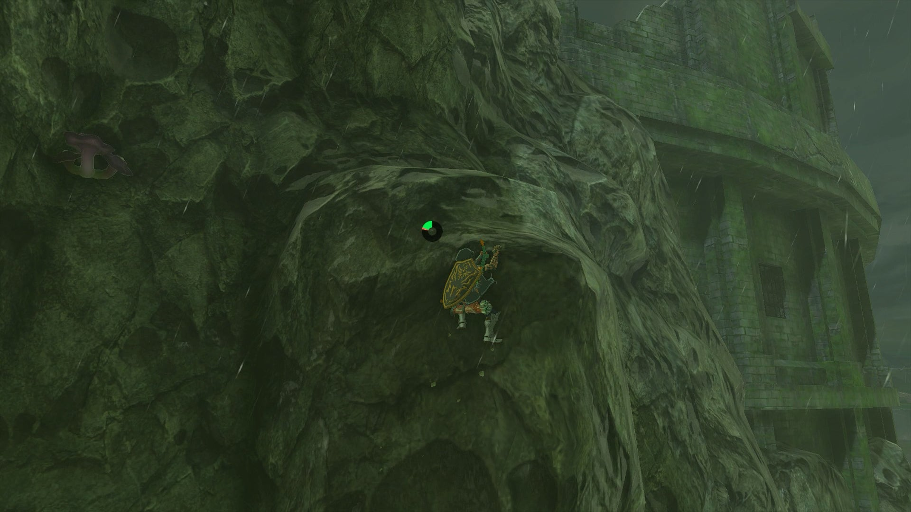
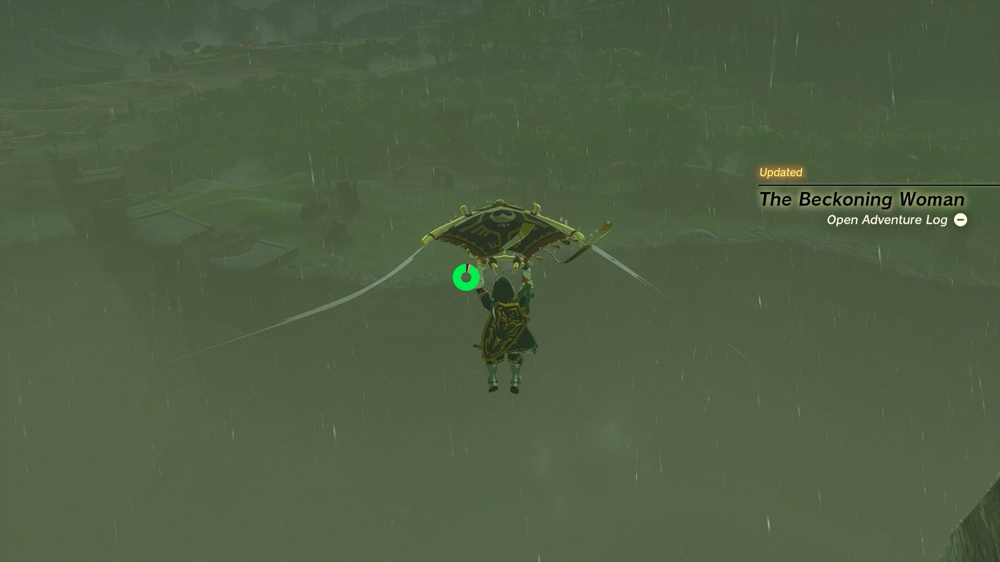
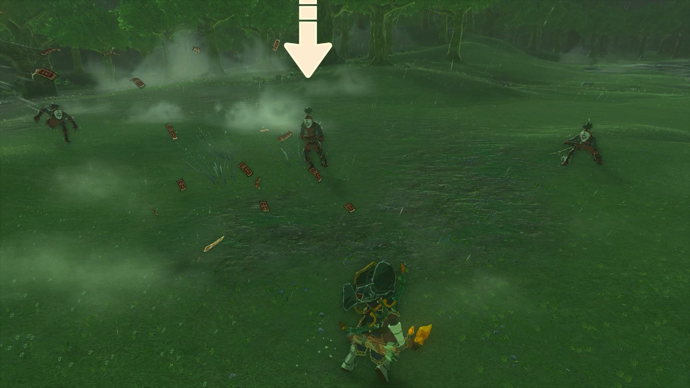
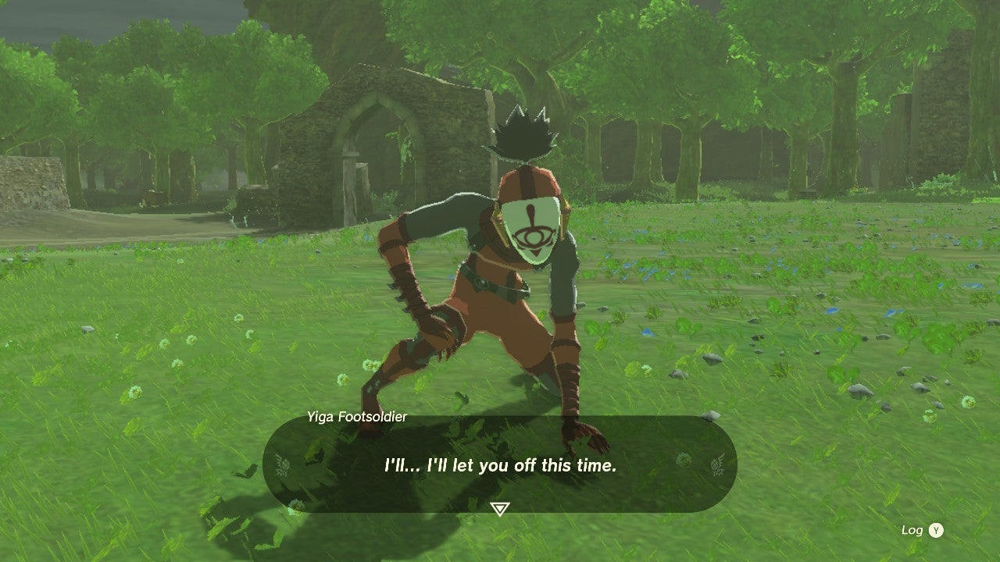

**The Beckoning Woman** is one of the Side Adventures associated with the **Potential Princess Sightings** quest line. This collection of quests takes place at every stable and is part of your investigative work as a journalist for the Lucky Clover Gazette. 

In this Tears of the Kingdom guide, we will walk you through the entire Beckoning Woman Side Adventure so you can get one step closer to discovering the mysteries behind the potential sightings of Princess Zelda around Hyrule. 

  * **Quest Giver:** Penn
  * **Prerequisites:** Begin the Potential Princess Sighting! questline at the Lucky Clover Gazette
  * **Reward:** Rupees

To trigger The Beckoning Woman Side Adventure, head to **Outskirt Stable** in the southwestern corner of Hyrule Field, to the west of the large coliseum on the road south towards the Gerudo Canyon. You can find Penn investigating rumors of a strange woman asking blonde-haired strangers for help rescuing her friend. 

The woman in question is hanging out under a tree at the fork just South of the stable. The exact coordinates are -1354, -1444, 0017. Meet up with the mysterious woman and agree to follow her to her friend who urgently requires your help. However, she'll frequently race ahead and make you find her at new spots, as if she's testing your abilities... 

At first, she'll ask you to head east through a large canyon pass, and ask that you not alert monsters when you reach her. 

While it is possible to crouch and stealth through the side of the canyon, the number of circling Aerocuda can make it hard, so you may find it easier to engage the multiple Bokoblin wandering nearby and defeat them before you reach the woman at the far edge above the Aquame Lake. 

When next you meet her, she'll disappear again and ask you to follow her up to the clifftops above you. If it's raining, this might be a challenging climb, so you may be better off sticking to the lower hills to the right and climbing up the easier terrain at the back of coliseum (just don't fall into the Gleeok's lair!). 

When you meet her at the top of the cliff, she'll point over to the Great Plateau in the distance and tell you that its the spot her friend is at, and to hurry across. You can easily use your Paraglider from this distance to get to the top of the plateau and head to the clearing where she waits. 

There, she will reveal her true identity. The strange woman is actually three **Yiga Clan members** in disguise who were trying to lure Link to his death. Defeat the three Yiga Clan members in a heated battle and complete **The Beckoning Woman** Side Adventure. Once you wipe out the pesky Yiga Footsoldiers, Penn will arrive and reward you with your **wage in Rupees** for your troubles. 

_This reward depends on how far along you are in the Potential Princess Sightings! Side Adventure._

The Beckoning Woman

## List of Potential Princess Sighting Side Adventures

Looking for other Potential Princess Sightings to undertake? You can take on the following adventures in any order you choose, which are located at nearly every main Stable in Hyrule. Click on a link below to learn more about it, and how to solve the quest. 

Side Adventure Name  
Starting Settlement / Region

Serenade to a Great Fairy  
Woodland Stable, Eldin Canyon

The Beckoning Woman  
Outskirt Stable, Central Hyrule

Gourmets Gone Missing  
Riverside Stable, Central Hyrule

The Beast and the Princess  
New Serenne Stable, Hyrule Ridge

Zelda's Golden Horse  
Snowfield Stable, Tabantha Tundra

White Goats Gone Missing  
Tabantha Bridge Stable, Hyrule Ridge

For Our Princess!  
Foothill Stable, Eldin

The All-Clucking Cucco  
South Akkala Stable, Akkala

The Missing Farm Tools  
Wetlands Stable, West Necluda

Princess Zelda Kidnapped?!  
Dueling Peaks Stable, West Necluda

An Eerie Voice  
Highland Stable, Faron

The Blocked Well  
Gerudo Canyon Stable, Gerudo

See the complete List of Side Quests and Side Adventures

### Up Next: Gourmets Gone Missing

Previous

Potential Princess Sightings!

Next

Gourmets Gone Missing

### Top Guide Sections

  * Walkthrough
  * Zelda: Tears of The Kingdom Switch 2 Edition Guide
  * Zelda Notes Voice Memories
  * List of Side Quests and Side Adventures

### Was this guide helpful?

Leave feedback

Go to comments