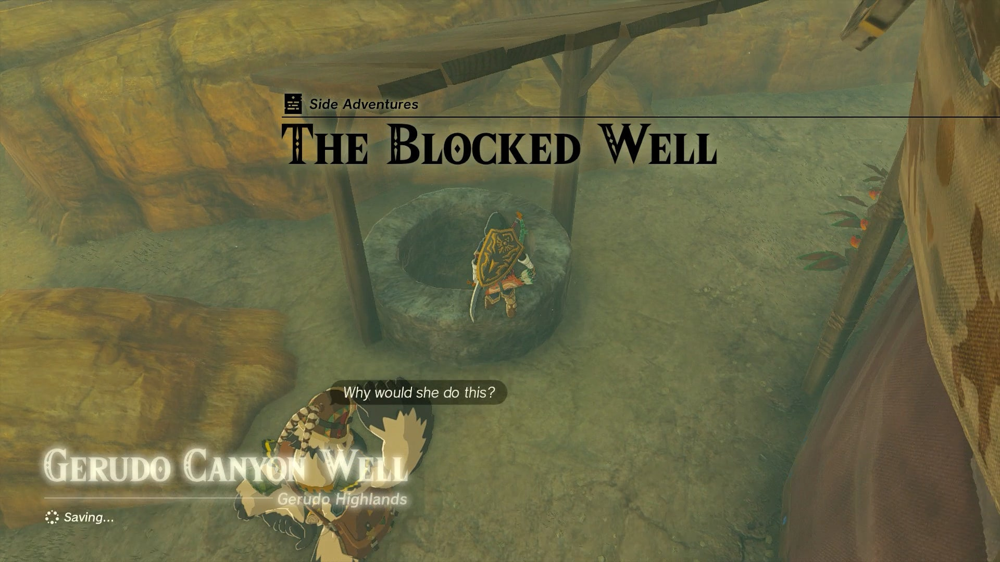
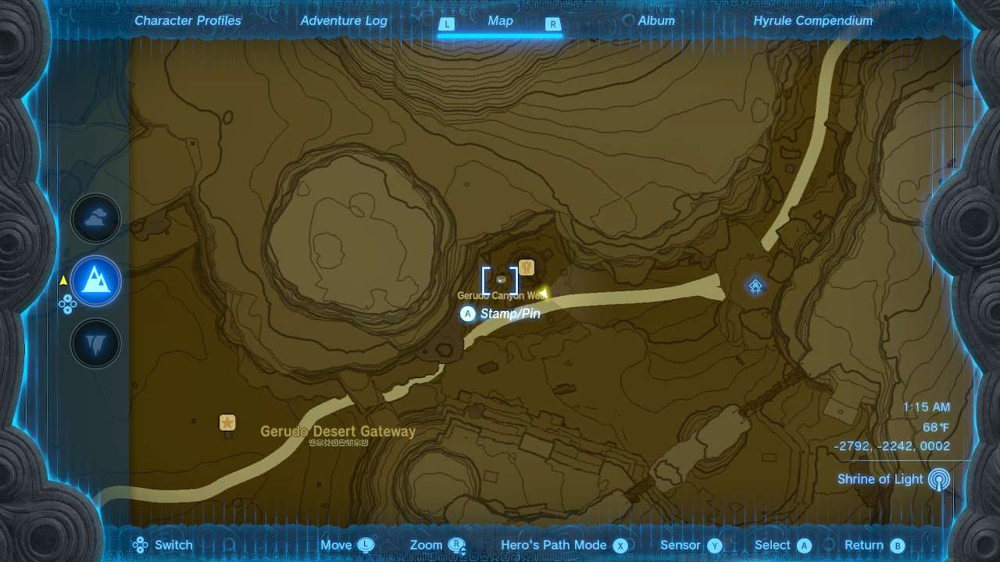
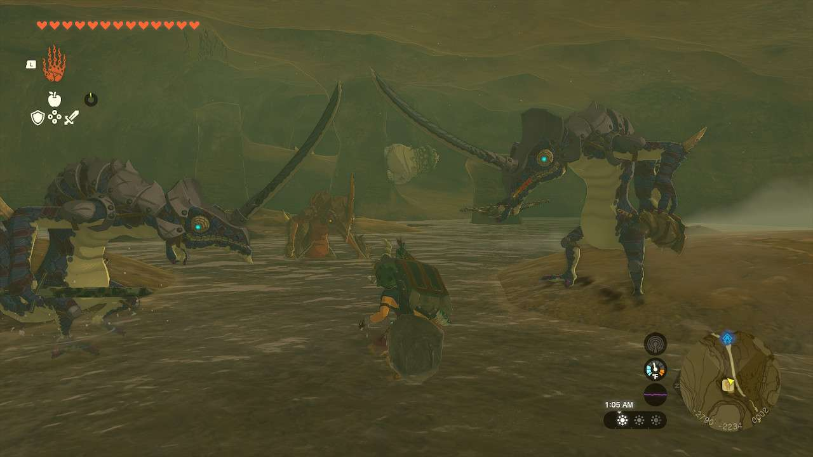
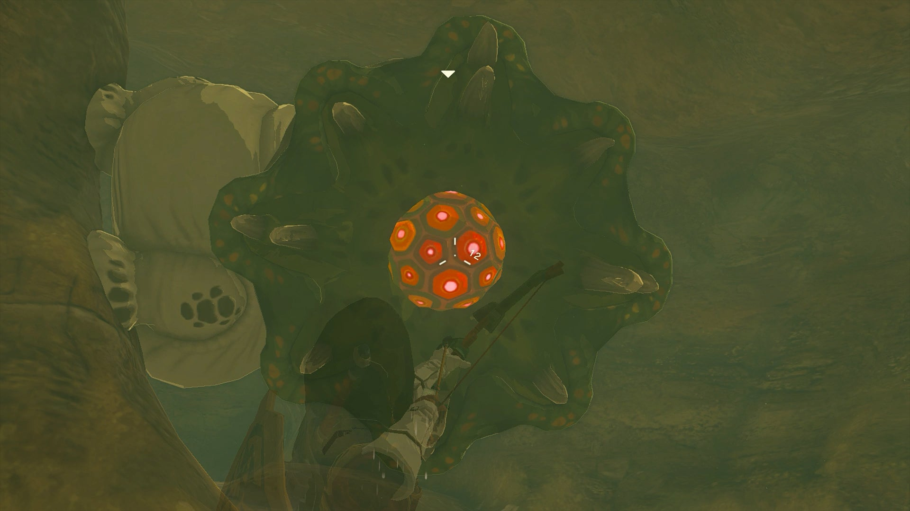
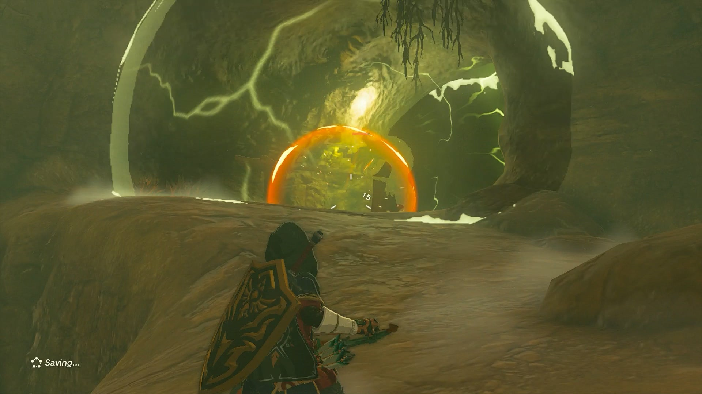
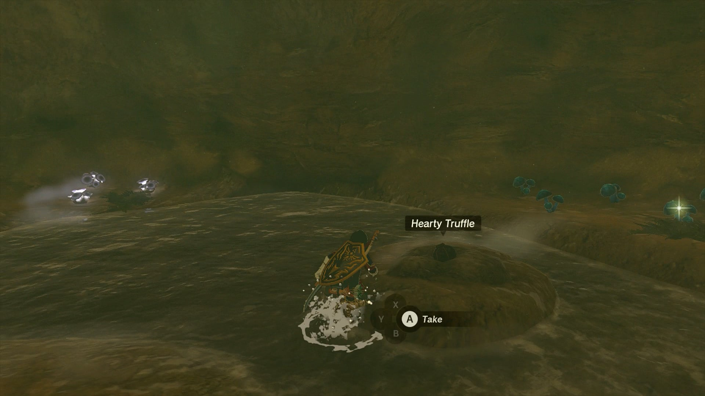

**The Blocked Well** is one of the many Side Adventures to complete in The Legend of Zelda: Tears of the Kingdom. In this guide, we will teach you everything you need to know to complete The Blocked Well, including where to find it and what you will get as a reward. It is connected to the Potential Princess Sightings! overarching Side Adventure. 

  * **Side Quest Location** : Gerudo Canyon Stable, Gerudo Canyon
  * **Prerequisites** : Begin Potential Princess Sightings!
  * **Rewards** : Rupees

You can begin this quest at the nearly abandoned Gerudo Canyon Stable, at the far side of the canyon that will require you to navigate the scorching daytime heat or bitter nighttime cold, so be sure to dress appropriately or eat the right food before making the trek. 

The stable itself is closed up for business, and while the owner inside has a quest, your main priority right now is to seek out Penn standing just outside the stable by a well that feeds the stable. 

Since Penn can't fit inside, he'll want you to uncover the mystery of why Zelda reportedly closed off the well so that no one could use it. 

Heading down into the well finds you in front of a wall of destructible rocks, which you need to clear. Be ready for a fight on the other side, however, as you’ll be greeted by two Blue Lizalfos and one Black Lizalfos! 

Depending on how early in your adventure you take on this quest, these enemies might be very powerful compared to your maximum hearts, armor, and weapons, so plan accordingly. Be sure to use elemental arrows to stun or disarm them before taking the group out. 

Just beyond the trio you'll also find a Like Like on a rocky column, but as long as you approach carefully, you can snipe its weak spot that emerges before it attacks, then finish it off. 

Lastly, the path up the back of the well hides a camouflaged Electric Lizalfos lying in wait. This guy can be an extreme pain due to the constant electric field his horn gives off that can force you to drop your weapons, and continually damage you. Snipe his horn to momentarily block its ability, then quickly finish him off before he can regain his shocking abilities. 

Once you fight your way through this horde, Penn will signal that he’s seen all of it and realizes the well was closed to protect people. You'll be rewarded with Rupees depending on how many cases you've investigated. 

_This reward depends on how far along you are in the Potential Princess Sightings! Side Adventure._

The Blocked Well

<meta />__

Be sure to go back and check the back of the well past where the Electric Lizalfos was, as you can find a mushroom farm here, with a Hearty Truffle, and a group of Chillshrooms, Stamella Shrooms, and Brightcaps!

##  List of Potential Princess Sighting Side Adventures

Looking for other Potential Princess Sightings to undertake? You can take on the following adventures in any order you choose, which are located at nearly every main Stable in Hyrule. Click on a link below to learn more about it, and how to solve the quest. 

Side Adventure Name  
Starting Settlement / Region

Serenade to a Great Fairy  
Woodland Stable, Eldin Canyon

The Beckoning Woman  
Outskirt Stable, Central Hyrule

Gourmets Gone Missing  
Riverside Stable, Central Hyrule

The Beast and the Princess  
New Serenne Stable, Hyrule Ridge

Zelda's Golden Horse  
Snowfield Stable, Tabantha Tundra

White Goats Gone Missing  
Tabantha Bridge Stable, Hyrule Ridge

For Our Princess!  
Foothill Stable, Eldin

The All-Clucking Cucco  
South Akkala Stable, Akkala

The Missing Farm Tools  
Wetlands Stable, West Necluda

Princess Zelda Kidnapped?!  
Dueling Peaks Stable, West Necluda

An Eerie Voice  
Highland Stable, Faron

The Blocked Well  
Gerudo Canyon Stable, Gerudo

See the complete List of Side Quests and Side Adventures

### Up Next: The Flute Player's Plan

Previous

An Eerie Voice

Next

The Flute Player's Plan

### Top Guide Sections

  * Walkthrough
  * Zelda: Tears of The Kingdom Switch 2 Edition Guide
  * Zelda Notes Voice Memories
  * List of Side Quests and Side Adventures

### Was this guide helpful?

Leave feedback

Go to comments