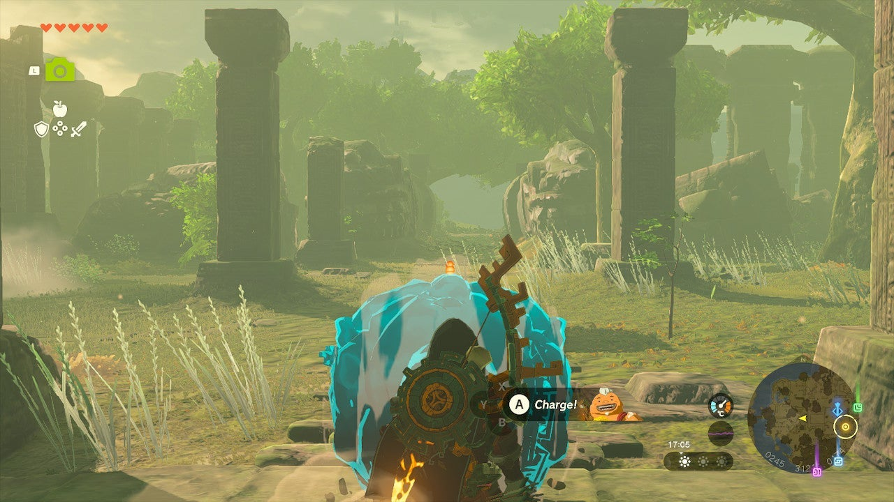

As part of the Investigate the Thyphlo Ruins side adventure, The Corridor Between Two Dragons requires the use of a Sage's power. To begin this quest, you need to have completed the Yunobo of Goron City regional questline. 

Here's how to find the treasure in **The Corridor Between Two Dragons**. These two dragons are stone statues, not to be confused with the four actual dragons circling the skies of Hyrule. 

## The Corridor Between Two Dragons Walkthrough

To start The Corridor Between Two Dragons, read the second monolith next to Kazul's tent. It says: "Display the power of the Sage of Fire to blaze through the space between two dragons, from head to tail". This means that you'll need **Yunobo's Charge ability**. 

Go to the **western part** of the Thyphlo Ruins, where you'll find a path leading back to the wooden bridge (the only bridge that connects the Thyphlo Ruins to the mainland). Stand at the beginning of this path, facing the bridge, with the large stone statue directly behind you. The coordinates are 0246, 3121, 0174. 

Use Yunobo's Charge in the direction of the bridge, and the stone building with the treasure chest will appear. The chest contains **three Rubies**. Collect the reward to complete The Corridor Between Two Dragons. 

The Corridor between Two Dragons

See the complete List of Side Quests and Side Adventures

### Up Next: The Six Dragons

Previous

The Owl Protected by Dragons

Next

The Six Dragons

### Top Guide Sections

  * Walkthrough
  * Zelda: Tears of The Kingdom Switch 2 Edition Guide
  * Zelda Notes Voice Memories
  * List of Side Quests and Side Adventures

### Was this guide helpful?

Leave feedback

Go to comments