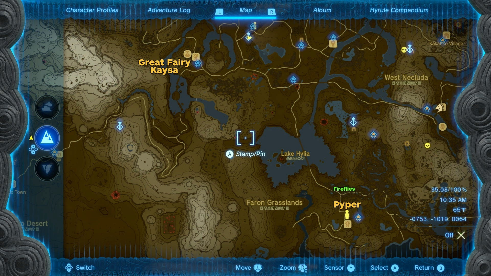
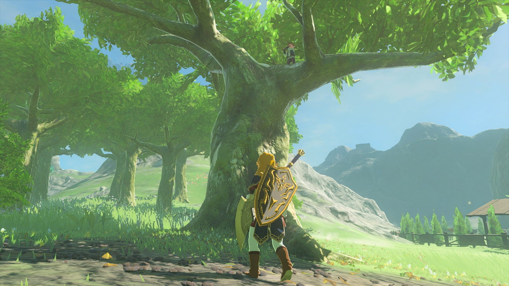
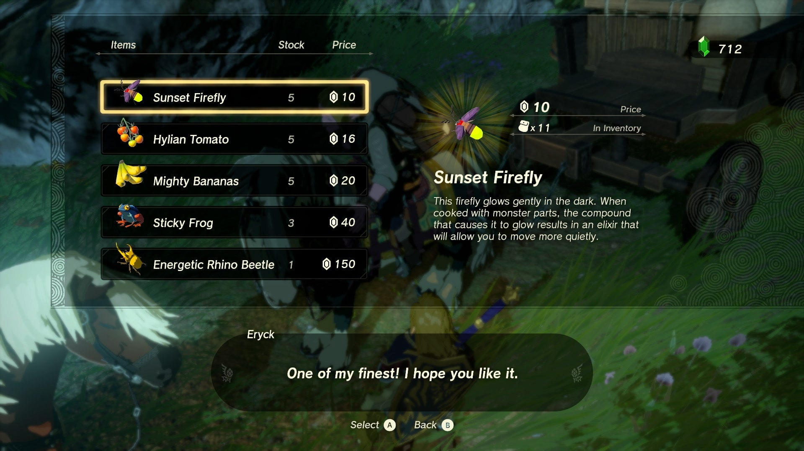

**The Flute Player's Plan** is one of the many Side Adventures Quests in The Legend of Zelda: Tears of the Kingdom. This adventure can only be undertaken at any time, but is required to complete one of the Great Fairy Quests - Serenade to Kaysa over at the Outskirt Stable. 

This quest involves helping the missing flutist, Pyper, with making a girl feel better by creating a glowing tree, and can be found far to the south past Lake Hylia at the Highland Stable in Faron. 

  * **Side Adventure Location:** Highland Stable, West Faron
  * **Prerequisites:** None
  * **Rewards:** 100 Rupees

## How to Find and Help Pyper

This quest can be found by accident when exploring, but is most easily found when undertaking the quest to coax the Great Fairy Kaysa from her fountain, located in the southwest at the Outskirt Stable. 

However, when speaking to Mastro at the stable, you'll learn that the troupe's flutist, Pyper, has run off without a trace, though one of the stablehands will mention that he may have followed their younger sister to another stable in the Faron region to the southeast. Note that undertaking this quest from Mastro will prevent him from appearing at any other stable until you finish this one. 

By following the trail to the Highland Stable south of Lake Hylia (it's better to avoid the bridge for the giant Gleeok guarding it), you can find a girl named Haite who is mad at Pyper, and he vanished into a nearby tree. 

He's actually just outside the stable, up high in a tree, and is trying to find a way to make the girl happy again. In order for him to rejoin the group, he wants 10 Sunset Fireflies to make things right, which you'll need to collect in the forests nearby. 

When nightfall arrives, you can find tons of fireflies in the Pagos, Faron, and Finra Woods north of the stables and plain -- though you may have to contend with wandering Bokobolins or Stalbokoblins. When the area is clear, crouch down and sneak up to collect them. 

If catching them is proving too time-consuming and you have cash to spare, look around the road leading from the stable towards Lake Hylia and you may spot the traveling merchant Eryck, who sells 5 fireflies for only 10 rupees a-piece. 

Return to Pyper with the Fireflies, and he'll ask you to bring Haite over to the tree the following night (she'll sit in the middle of the stable). Once the scene is over, he'll be good to return back to the troupe. 

The Flute Player's Plan

See the complete List of Side Quests and Side Adventures

### Up Next: Honey, Bee Mine

Previous

The Blocked Well

Next

Honey, Bee Mine

### Top Guide Sections

  * Walkthrough
  * Zelda: Tears of The Kingdom Switch 2 Edition Guide
  * Zelda Notes Voice Memories
  * List of Side Quests and Side Adventures

### Was this guide helpful?

Leave feedback

Go to comments