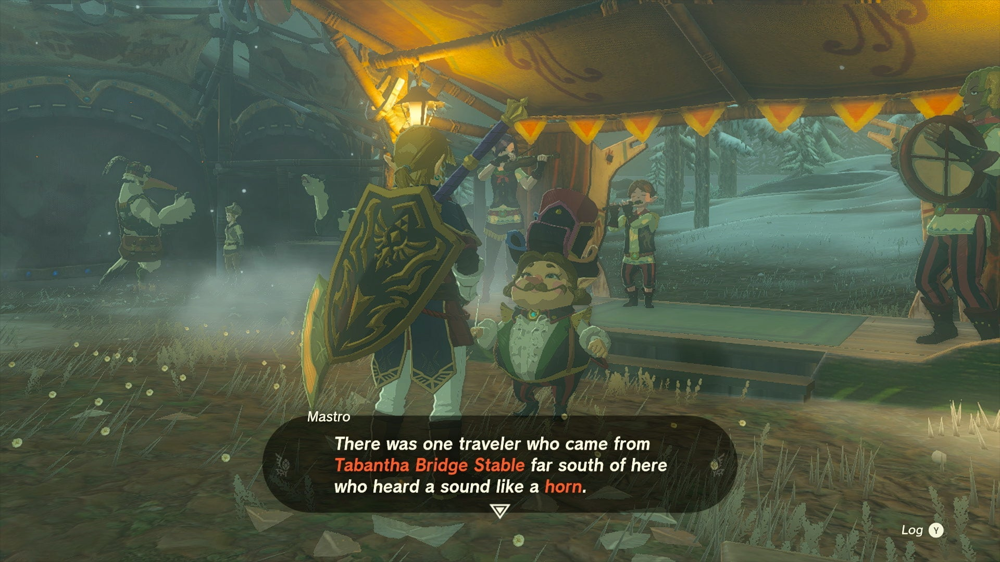
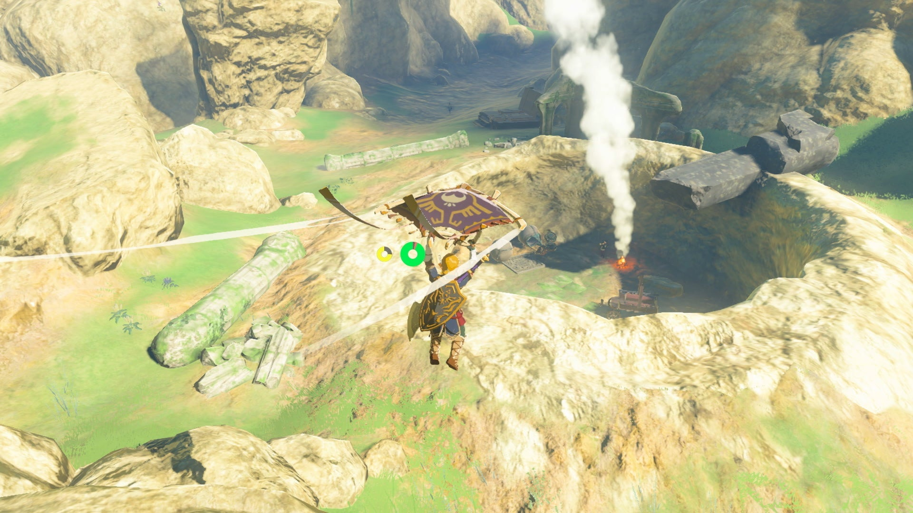
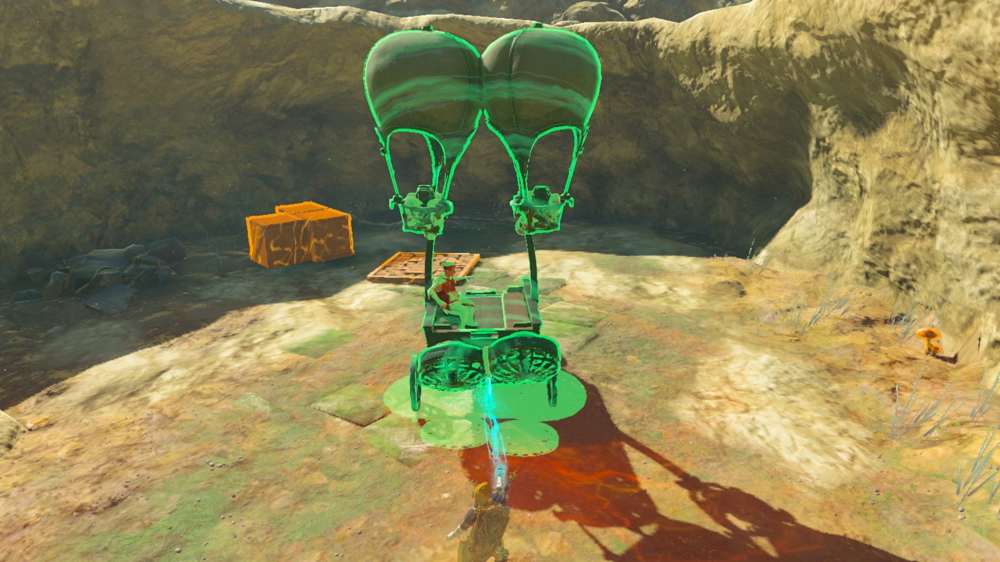
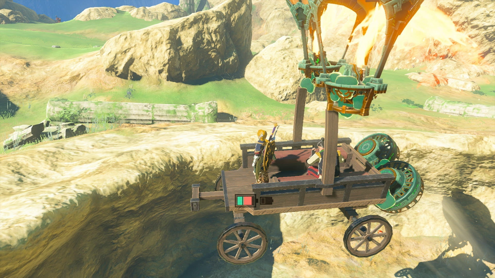

The Hornist's Dramatic Escape is one of the many Side Adventures Quests in The Legend of Zelda: Tears of the Kingdom. This adventure can only be undertaken at any time, but is required to complete one of the Great Fairy Quests - Serenade to Mija up at Snowfield Stable. 

This quest involves finding a missing horn player Eustus who has fallen in a pit on the road to Rito Village in the Tabantha Region and building him an escape route for his wagon. 

  * **Side Adventure Location:** Tabantha Frontier
  * **Prerequisites:** None
  * **Rewards:** 3 Courser Bee Honey

## How to Help Eustus Escape

This quest can be found by accident when exploring, but is most easily found when undertaking the quest to coax the Great Fairy Mija from her fountain, located in the north at Snowfield Stable. 

However, when speaking to Mastro at the stable, you'll learn that the troupe's hornist, Eustus, mysteriously vanished, and was last seen near the Tabantha Bridge Stable. Note that undertaking this quest from Mastro will prevent him from appearing at any other stable until you finish this one. 

If you follow the lead and visit the stable, one of the stablehands will mention that the hornist was going to bring supplies to Rito Village in his wagon, but was warned of the treacherous path and the large holes that had recently opened up. 

Sure enough, you'll find Eustus trapped in a large hole along the road west of the Tabantha Great Bridge and stable. Look for the smoke signal coming from a large crater as you follow the road north and north east from the great bridge. 

Talking to Eustus, he'll request aid in freeing himself from this predicament, starting **The Hornist's Dramatic Escape**. 

Luckily, all the tools you need to help him escape are located in the pit alongside his broken wagon -- though you're free to get creative if you have other devices on hand. 

A simple method to airlift his wagon out: Either put a flat roof over his wagon and place a balloon above, or stick two balloons to each post and fit them with Flame Emitters. Since you also need him to move forward as well as upward, place two Fans at an angle at the back of the wagon, then tell him to get in. Place the wagon at the far side to give it a head start to get some lift, and you should be able to make it out in one piece. 

Eustus will gladly rejoin the troupe, rewarding you with some courser bee honey — be sure to hang onto these if you haven't awoken the Great Fairy Cotera! You'll now be able to find Eustus at the stable with the rest of the musical troupe, and use his horn to awaken Great Fairy Mija. 

The Hornist's Dramatic Escape

See the complete List of Side Quests and Side Adventures

### Up Next: Serenade to a Great Fairy

Previous

Honey, Bee Mine

Next

Serenade to a Great Fairy

### Top Guide Sections

  * Walkthrough
  * Zelda: Tears of The Kingdom Switch 2 Edition Guide
  * Zelda Notes Voice Memories
  * List of Side Quests and Side Adventures

### Was this guide helpful?

Leave feedback

Go to comments