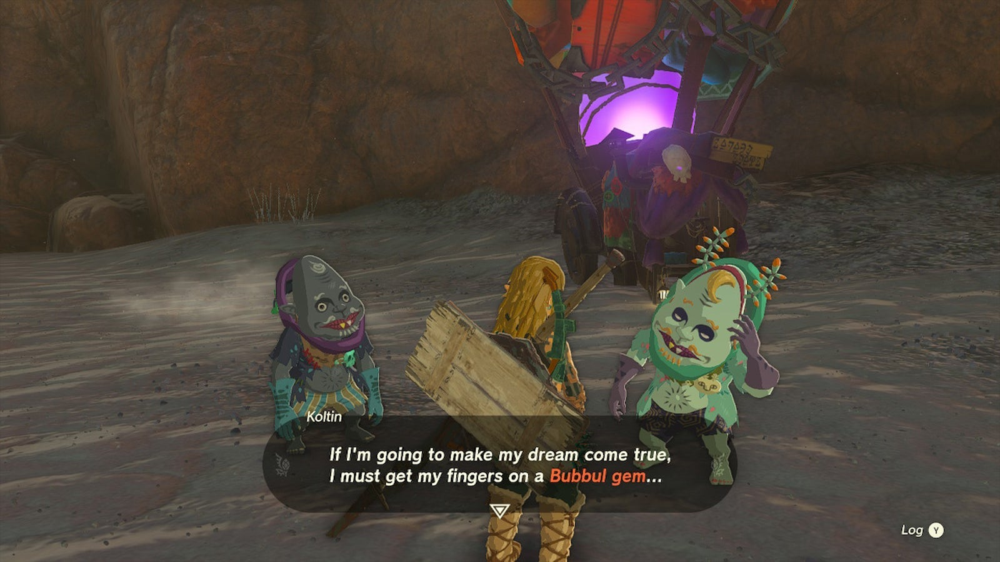

Tears of the Kingdom's **The Hunt for Bubbul Gems!** side adventure is the first step to unlocking a unique shop where you can trade Bubbul Gems for special items. It takes place in the Eldin region. 

## The Hunt for Bubbul Gems Walkthrough

To start **The Hunt for Bubbul Gems!** , go to the beach just **north of Pico Pond in Eldin** , close to the Woodland Stable (coordinates 1216, 1208, 0020). You'll find a large, colorful merchant cart and an NPC called Kilton. Speak to Kilton to start this side adventure. 

After the first part of the dialogue ends, speak to Koltin, Kilton's brother. He'll tell you that he needs a **Bubbul Gem** which, if you happen to carry one, you may give immediately. If you don't have a Bubbul Gem yet, you need to find a Bubbulfrog inside one of Hyrule's caves and defeat it. There's one such cave right where you're standing - just look at the wall in the north and you should see it. 

Once Koltin has his Bubbul Gem, he'll give you a **Bokoblin Mask** as a quest reward. This also unlocks the next side adventure, The Search for Koltin. You'll have to complete this side adventure too if you want to unlock the Bubbul Gem shop. 

The Hunt for Bubbul Gems!

See the complete List of Side Quests and Side Adventures

### Up Next: The Search for Koltin

Previous

Hestu's Concerns

Next

The Search for Koltin

### Top Guide Sections

  * Walkthrough
  * Zelda: Tears of The Kingdom Switch 2 Edition Guide
  * Zelda Notes Voice Memories
  * List of Side Quests and Side Adventures

### Was this guide helpful?

Leave feedback

Go to comments