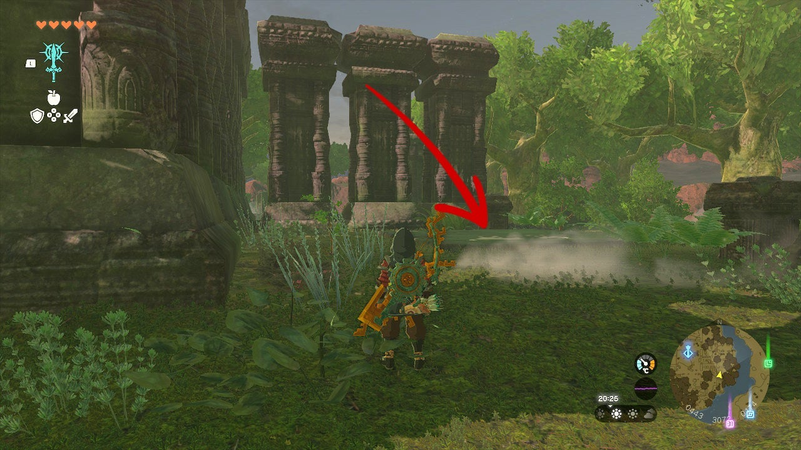

The Long Dragon quest is part of the Investigate the Thyphlo Ruins side adventure in the Great Hyrule Forest. Beware that you need to have completed the full Riju of Gerudo Town main questline in order to start The Long Dragon. 

If you meet that requirement, here's how to complete **The Long Dragon** side adventure in The Legend of Zelda: Tears of the Kingdom. 

## The Long Dragon Walkthrough

To start The Long Dragon quest, read the fourth monolith next to Kazul's camp in the Thyphlo Ruins. The instructions will tell you to "display the power of the Sage of Lightning at the end of the long dragon that protects the mountain of death". 

The right spot is in the **southeastern part** of the Thyphlo Ruins, close to the water. Starting from Kazul's camp, go directly east, passing a bunch of ruins, until you see the stone square on the ground at coordinates 0450, 3083, 0175. 

Use Riju's ability to cast a large electrical field, and hit the stone slab with an arrow. This will spawn a stone building with a treasure chest. Collect the treasure, **three pieces of Topaz** , to complete The Long Dragon side adventure. 

The Long Dragon

See the complete List of Side Quests and Side Adventures

### Up Next: Legend of the Great Sky Island

Previous

The Six Dragons

Next

Legend of the Great Sky Island

### Top Guide Sections

  * Walkthrough
  * Zelda: Tears of The Kingdom Switch 2 Edition Guide
  * Zelda Notes Voice Memories
  * List of Side Quests and Side Adventures

### Was this guide helpful?

Leave feedback

Go to comments